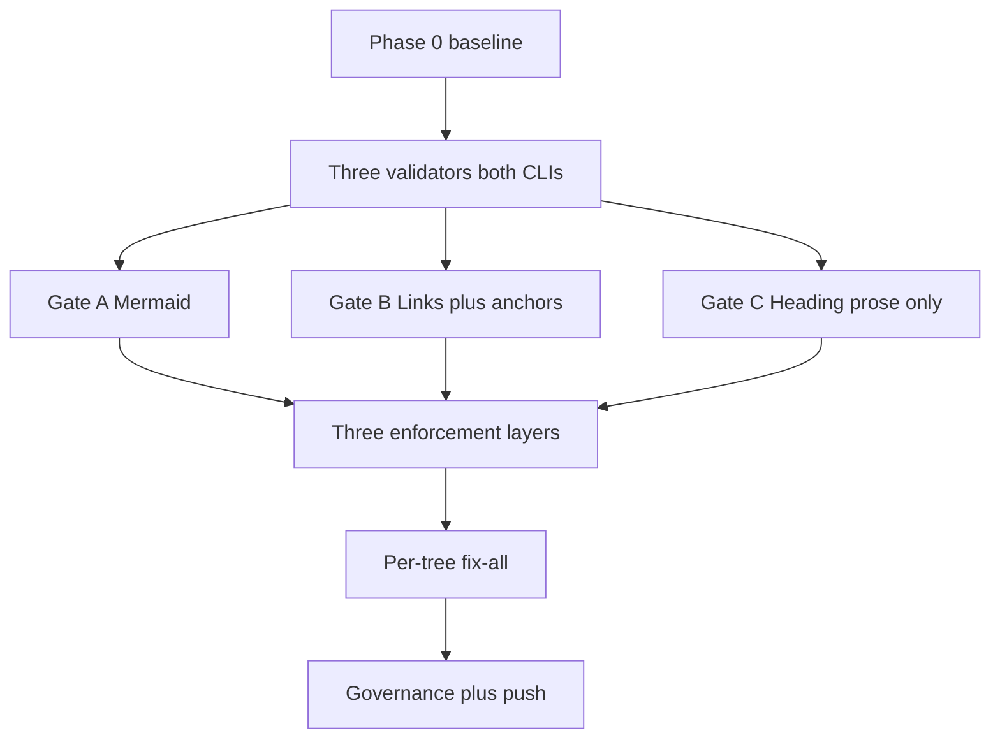

# Markdown Gate Coverage Expansion

> **Plan type**: Multi-file (five canonical documents). This README is the navigation hub.
> **Status**: In progress (authoring complete; execution pending — do NOT execute from this doc).
> **Provenance**: Adapted from the completed ose-public plan
> `plans/done/2026-06-06__markdown-gate-coverage-expansion/` via the plan-establishment workflow,
> re-grounded against this codebase. The end state matches the upstream plan's end state as it
> applies here.

## Context

This repository runs two structural markdown validators, implemented twice — once in
`apps/rhino-cli-rust/` (canonical, wired into hooks and CI) and once in `apps/rhino-cli-go/`
(permanent parity twin; byte-identical output enforced by the `parity` CI job). A third validator
exists upstream but **does not exist here at all**. This plan unifies the validators into a single,
coherent **markdown gate** with consistent enforcement layers, building the missing validator from
scratch in BOTH CLIs. [Repo-grounded]

- **Gate A — Mermaid** (`docs validate-mermaid`, exists in both CLIs): the diagram quality gate.
  Wired into the `validate:mermaid` Nx target of both projects and triggered from
  `.husky/pre-push` when a push touches any `*.md` file. [Repo-grounded —
  `apps/rhino-cli-rust/project.json:153`, `apps/rhino-cli-go/project.json:116`,
  `.husky/pre-push:22-24`] Its default scan covers four hardcoded dirs (`docs/`,
  `repo-governance/`, `.claude/`, `plans/`) plus root `*.md`. [Repo-grounded —
  `apps/rhino-cli-rust/src/commands/docs.rs:291-308`,
  `apps/rhino-cli-go/cmd/docs_validate_mermaid.go:205-227`] This plan expands the scan repo-wide
  minus exclusions, adds a repeatable `--exclude`, and **moves local enforcement from pre-push to
  pre-commit staged-only**. Blocking semantics are kept; the validator's checks themselves are
  unchanged (no inline-exemption or color-palette features are ported — see Out of scope).
- **Gate B — Relative-link checker** (`docs validate-links`, exists in both CLIs): verifies every
  `[text](target)` link resolves to an existing file. Today it scans only three trees
  (`repo-governance/`, `docs/`, `.claude/`) plus root `*.md`, hard-skips `.claude/skills/`, has no
  `--exclude` CLI flag despite `ScanOptions.skip_paths` plumbing existing, and **never validates
  `#fragment` anchors** — both implementations strip the fragment before resolving and discard
  pure-anchor links before validation. [Repo-grounded —
  `apps/rhino-cli-rust/src/internal/docs/scanner.rs:105,167-174`,
  `apps/rhino-cli-rust/src/internal/docs/validator.rs:16,79`,
  `apps/rhino-cli-go/internal/docs/links_scanner.go:78,121-126`,
  `apps/rhino-cli-go/internal/docs/links_validator.go:13,47`] This plan widens its scope to the
  whole repo (minus exclusions), adds a repeatable `--exclude` flag, and adds internal-anchor
  validation with a GitHub-correct slug algorithm.
- **Gate C — Heading-hierarchy** (`docs validate-heading-hierarchy`): **does not exist in this
  repository** — no command, no internal module, no hook, no Nx target, no CI. [Repo-grounded —
  `grep -ri heading` across both CLIs matches only an incidental string in
  `vendor_audit.rs`/`governance_vendor_audit.go`] This plan builds it from scratch in BOTH CLIs:
  three finding kinds (`missing-h1`, `duplicate-h1`, `skipped-level`), a fence-aware heading
  parser, a prose-allowlist default-deny scope, and a repeatable `--exclude` flag.

### The non-breaking constraint for heading-hierarchy (CRITICAL)

`markdownlint` already disables **MD025** (multiple H1) and **MD001** (heading increment)
globally. [Repo-grounded — `.markdownlint-cli2.jsonc:61,69`] The reason is empirical: agent and
skill prompt artifacts legitimately use `#` as a section marker, not a document title, so they
carry zero or many H1s. The repo contains many such files — `.claude/agents/`, `.claude/skills/`
(`SKILL.md`), and `.opencode/agents/` are full of them. Re-enabling heading rules repo-wide would
break all of them.

This plan re-enables heading-hierarchy checking **only for generic prose** via the rhino CLIs,
which (unlike markdownlint) can path-scope a rule. Heading-hierarchy therefore uses a
**prose-allowlist, default-deny** scope: it runs ONLY on `docs/`, `repo-governance/`, `plans/`
(minus `plans/done/`), root-level `*.md`, `specs/`, `apps/*/README.md`, `libs/*/README.md`,
`apps/*/docs/**`, and `libs/*/docs/**`. Everything else — `.claude/**`, `.opencode/**`,
`.amazonq/**`, deep `apps/`/`libs/` internals, `plans/done/`, and noise dirs — is hard-excluded.
The allowlist is enforced inside the validator's file selection, so even a pre-commit staged-only
run that stages a `.claude/agents/*.md` or `SKILL.md` file can NEVER trip a heading finding.

### Why unify enforcement now

Today Gate A fires at pre-push (broad `*.md` trigger but late feedback), Gate B fires at
pre-commit (staged-only, via `rhino-cli-rust git pre-commit` step 7) AND in a PR-only CI workflow
(`.github/workflows/pr-validate-links.yml`), and Gate C exists nowhere. [Repo-grounded] No
workflow in `.github/workflows/` triggers on `push` to `main` — all 24 existing workflows are
`pull_request`-only or reusable — so a direct trunk push (the repo's default flow) currently
receives **zero** markdown CI coverage. [Repo-grounded — inspection of `.github/workflows/`] This
plan standardizes all three gates onto **three layers**: pre-commit staged-only (Layer 1,
blocking, `--no-verify` is the WIP escape), PR CI (Layer 2, full-scan, blocking), and
push-to-`main` CI (Layer 3, full-scan, blocking), with Layers 2 and 3 consolidated into a single
new `.github/workflows/validate-markdown.yml` — **this repository's first push-to-`main`
workflow**.

### Dual-CLI parity (binding constraint)

Every behavior change in this plan lands in BOTH `apps/rhino-cli-rust/` and `apps/rhino-cli-go/`
in the same commits, per Rule 1 of the
[Rhino CLI Dual-Implementation Parity Convention](../../../repo-governance/conventions/structure/rhino-cli-dual-implementation-parity.md).
Byte-identical output is enforced by the shadow-diff harness
(`apps/rhino-cli-rust/scripts/shadow-diff.sh`) and the permanent `parity` job in
`.github/workflows/pr-quality-gate.yml` (lines ~242-257). [Repo-grounded] CI invokes the Rust
implementation via Nx targets; Go correctness is guaranteed by the parity job, not by running Go
in the markdown workflow.

## Scope

### In scope

- **Gate A — Mermaid** (both CLIs): expand the default scan from four hardcoded dirs to
  **repo-wide minus exclusions**; add a repeatable `--exclude <path>` flag; **move local
  enforcement from pre-push to pre-commit staged-only** (remove the mermaid trigger at
  `.husky/pre-push:22-24`); keep blocking semantics. Mermaid checks are per-file (no cross-file
  dependency), so staged-only loses nothing.
- **Gate B — Relative-link checker** (both CLIs):
  1. Add a repeatable `--exclude <path>` CLI flag, threaded into `ScanOptions.skip_paths`
     (appended to the existing `.opencode/skill/` baked-in skip); call sites pass the named
     exclusion (`plans/done`) explicitly.
  2. Expand the full-scan scope from three dirs to the **whole repo**, minus exclusions and minus
     a noise-skip set baked into the walker; keep the existing `.claude/skills/` hard-skip.
  3. Add **internal-anchor validation**: when a link has a `#fragment`, open the target file,
     parse its ATX headings fence-aware, GitHub-slugify them (GFM-correct algorithm — see the
     Research Note), and emit a `broken-anchor` finding when the fragment is absent. Remove the
     pure-anchor extraction skip (links whose URL is only a `#fragment`) so same-file anchors
     are validated too.
- **Gate C — Heading-hierarchy** (both CLIs, greenfield): build
  `docs validate-heading-hierarchy` with three finding kinds (`missing-h1`, `duplicate-h1`,
  `skipped-level`), a fence-aware heading parser shared with the Gate B anchor validator, the
  **prose-allowlist default-deny** scope above enforced inside file selection, and a repeatable
  `--exclude` flag; wire it into pre-commit staged-only + CI full-scan, blocking.
- **Enforcement layers** (all three gates): Layer 1 = pre-commit staged-only steps inside the
  `git pre-commit` suite of both CLIs (mirroring the existing `step7_validate_links` /
  `step7ValidateLinks`); Layer 2 = PR CI; Layer 3 = push-to-`main` CI — Layers 2 and 3
  consolidated into the NEW `.github/workflows/validate-markdown.yml`
  (`pull_request: branches [main]` + `push: branches [main]`), invoking the Rust Nx targets.
  **Delete `.github/workflows/pr-validate-links.yml`** (migrated).
- **Nx targets**: add `validate:links` and `validate:heading-hierarchy` to BOTH `project.json`
  files, mirroring the existing `validate:mermaid` entries; update `validate:mermaid` commands
  and inputs for the repo-wide scope.
- **Per-tree fix-all** of any violations the expanded gates surface (mermaid findings, broken
  links, broken anchors, prose heading violations), each tree gated.
- **BDD spec updates** (`specs/apps/rhino/`, lockstep with code): extend
  `behavior/cli/gherkin/docs/docs-validate-links.feature` (`--exclude`, repo-wide scan,
  `broken-anchor`), create `behavior/cli/gherkin/docs/docs-validate-heading-hierarchy.feature`
  (new), extend `behavior/cli/gherkin/docs/docs-validate-mermaid.feature` (`--exclude`, repo-wide
  scan), extend `behavior/cli/gherkin/git/git-pre-commit.feature` (staged mermaid + heading
  steps), and create `specs/apps/rhino/components/cli/component-cli.md` (new — command/flag
  inventory). Required, not optional: the `spec-coverage` Nx gate in both projects maps `.feature`
  scenarios to step definitions, so new behavior without matching scenarios/steps fails the gate.
- **Governance propagation**: update related governance docs (`diagrams.md`, `quality.md`,
  `linking.md`, `repository-validation.md`) and propagate **via `repo-rules-maker`** (broad
  sweep), re-sync secondary bindings (`npm run generate:bindings`), then validate with the
  **`repo-rules-quality-gate`** (strict, double-zero).

### Out of scope (deferred)

- Porting the upstream mermaid feature set this repo's validator lacks (inline `%%` exemptions,
  color-palette checks, structural/correctness flowchart checks beyond the existing label/width
  rules). The mermaid validator's checks stay as-is; only scope and enforcement change.
  [Judgment call]
- Mermaid **rendering** verification (static analysis only).
- Cross-file link-graph analysis beyond existence + anchor presence.
- External-URL liveness checking (only relative links are validated).
- Changing markdownlint's global MD025/MD001 config (stays disabled; the rhino CLIs do the
  path-scoped prose enforcement).

## Approach Summary

Gate A keeps its existing checks, goes repo-wide with `--exclude`, and moves to pre-commit. Gate B
gains `--exclude`, a repo-wide scan minus exclusions, and `#fragment` anchor validation via a
GFM-correct slug helper and a shared fence-aware heading parser. Gate C is built from scratch and
wired under a prose-allowlist default-deny scope so agent/skill artifacts can never trip it. All
three gates run at pre-commit (staged-only), PR CI, and push CI — the latter two consolidated into
one `validate-markdown.yml`. Every change lands in both CLIs with shadow-diff byte parity.
Existing violations are cleaned per tree (gated), and governance docs are propagated last.

## Scope Matrix

| Gate                           | Scope                                                                                                                 | Excludes                                                            |
| ------------------------------ | --------------------------------------------------------------------------------------------------------------------- | ------------------------------------------------------------------- |
| Mermaid                        | repo-wide                                                                                                             | `plans/done/` (via `--exclude`) + noise dirs                        |
| Link (+ anchors)               | repo-wide                                                                                                             | `plans/done/` (via `--exclude`) + noise dirs + skill-dir hard-skips |
| Heading-hierarchy (PROSE rule) | allowlist: `docs/`, `repo-governance/`, `plans/`(−`done/`), root `*.md`, `specs/`, app/lib READMEs + `docs/` subtrees | everything else (default-deny)                                      |

**The named exclusion** (link + mermaid; heading-hierarchy default-deny already excludes it):

- `plans/done/` — frozen archive; completed plans are historical artifacts, not maintained prose.

Unlike the upstream repo, this repo has no specialized web-content trees with their own link
CLIs, so `plans/done/` is the only named exclusion. The noise-skip set (build artifacts, vendored
deps, worktrees) is baked into the walkers — see
[tech-docs.md Scope Matrix](./tech-docs.md#scope-matrix) for the authoritative list.

## Document Map

| Document                       | Purpose                                                           |
| ------------------------------ | ----------------------------------------------------------------- |
| [brd.md](./brd.md)             | WHY — business rationale, impact, risks                           |
| [prd.md](./prd.md)             | WHAT — personas, user stories, Gherkin acceptance criteria, scope |
| [tech-docs.md](./tech-docs.md) | HOW — architecture, design decisions, scope matrix, file impact   |
| [delivery.md](./delivery.md)   | DO — phased, gated, executor-tagged checklist                     |

## Research Note

Web research **was performed** for the GitHub anchor-slug algorithm (unlike the upstream plan,
which skipped it and shipped a simplified algorithm). Key findings, all carried into
[tech-docs.md](./tech-docs.md) DD-5 (accessed 2026-06-06):

- **GitHub's algorithm** (html-pipeline TOC filter; `github-slugger` v2.0.0 is the reference
  implementation): lowercase → strip every character NOT matching `[\p{L}\p{N}_\- ]` (Unicode
  letters, Unicode digits, underscore, hyphen, and space are KEPT) → spaces→hyphens with **no
  collapsing** (`a  b` → `a--b`) → duplicate slugs get `-1`, `-2`, … suffixes in document order.
  [Web-cited — `github.com/Flet/github-slugger` (issue #56 confirms the regex is `[^\w -]`
  Unicode-aware); `gist.github.com/asabaylus/3071099`; GitHub Community Discussion #21546 (no
  formal spec exists; GitHub staff point to html-pipeline)]
- The upstream plan's simplified "strip non-alphanumeric except hyphen" is **wrong** for
  underscores (kept by GitHub) and Unicode (kept by GitHub). One conflicting source
  (`vscode-markdown` issue #537) claims underscores are stripped — flagged
  **[Needs Verification]**; the delivery plan unit-tests underscore/Unicode/backtick/multi-space
  fixtures and notes the live-render caveat.
- Inline markup in headings (backticks, links): markup is stripped, text is kept. Emoji are
  stripped.
- No maintained Go library reproduces `github-slugger`, and the closest Rust crate is pre-1.0 —
  so a hand-rolled helper in each CLI is the right call (Go:
  `regexp.MustCompile` over `[^\p{L}\p{N}_\- ]`; Rust: the `regex` crate with the same class),
  with a stateful duplicate-counter map. [Judgment call grounded in the research above]
- markdownlint's MD051 validates SAME-FILE fragments only and has algorithm-fidelity bugs (colon
  false positives — markdownlint issue #1959), so it is not a substitute for cross-file anchor
  validation; a custom validator is required. [Web-cited — accessed 2026-06-06]
- Fragment matching is **case-sensitive**: the validator requires the exact lowercase slug
  (matching MD051's default behavior).

## Dogfooding Note

This plan lives under `plans/`, which all three expanded gates cover (Gate C via the
`plans/`-minus-`done/` allowlist). Every diagram in these five documents is authored to pass the
mermaid gate; every relative link and `#fragment` anchor is authored to resolve; every prose doc
here uses exactly one H1 with non-skipping heading nesting. The plan validates itself in the
`plans/` fix-all phase (Phase 8).
