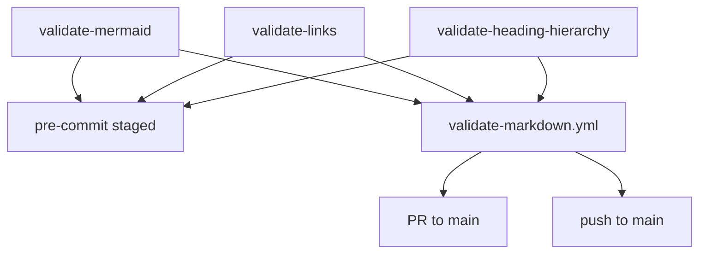
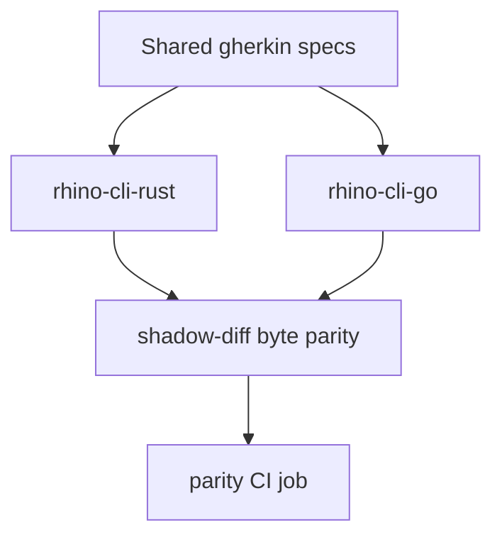

# Technical Documentation — Markdown Gate Coverage Expansion

## Architecture

Three validators, implemented twice (Rust canonical + Go parity twin), plus their wiring. The
enforcement layers are unified across all three gates; only the Rust binary is wired into hooks
and CI, while Go correctness is guaranteed by the byte-parity harness.



- **Layer 1 — `.husky/pre-commit`** (local, staged-only, blocking): the hook runs
  `cargo run --release --quiet --manifest-path apps/rhino-cli-rust/Cargo.toml -- git pre-commit`,
  whose `step7_validate_links` already runs the link checker staged-only. [Repo-grounded —
  `.husky/pre-commit:3`, `apps/rhino-cli-rust/src/internal/git/runner.rs:405-426`] This plan adds
  staged-only mermaid and heading-hierarchy steps alongside it in BOTH runners (`runner.rs` and
  `apps/rhino-cli-go/internal/git/runner.go`); `--no-verify` is the WIP escape.
- **Layer 2 — PR CI** and **Layer 3 — push CI** (full scan, blocking): consolidated into a single
  NEW `.github/workflows/validate-markdown.yml` triggered on `pull_request: branches [main]` +
  `push: branches [main]`, invoking the three Rust Nx targets.



## Component Inventory (grounded)

### Gate A — Mermaid (exists in both CLIs)

- Rust: CLI handler `run_validate_mermaid` + `ValidateMermaidArgs` in
  `apps/rhino-cli-rust/src/commands/docs.rs:127-215` (positional paths, `--staged-only`,
  `--changed-only`, threshold flags; NO `--exclude`); default scan `collect_md_default_dirs`
  (`docs.rs:291-308`) covers `["docs", "repo-governance", ".claude", "plans"]` + root `*.md`;
  `walk_md_files` (`docs.rs:312-333`) skips only `.next`, `node_modules`, `.git`; core modules in
  `apps/rhino-cli-rust/src/internal/mermaid/` (extractor, graph, parser, reporter, types,
  validator + mod). [Repo-grounded]
- Go: `apps/rhino-cli-go/cmd/docs_validate_mermaid.go` with the same default-dir set
  (`collectMDDefaultDirs`, lines 206-227) and `skipDirs` (lines 229-234); core in
  `apps/rhino-cli-go/internal/mermaid/`. [Repo-grounded]
- Nx targets `validate:mermaid` exist in both projects:
  `apps/rhino-cli-rust/project.json:153-165`, `apps/rhino-cli-go/project.json:116-128`.
  [Repo-grounded]
- Pre-push trigger: `.husky/pre-push:22-24` runs `npx nx run rhino-cli-rust:validate:mermaid`
  when any changed file matches `\.md$`. [Repo-grounded] **This trigger is removed by this
  plan.**

### Gate B — Relative-link checker (exists in both CLIs)

- Rust core: `apps/rhino-cli-rust/src/internal/docs/`. [Repo-grounded]
  - `types.rs:36-48` — `ScanOptions { repo_root, staged_only, skip_paths, verbose, quiet }`;
    `skip_paths` + `filter_skip_paths` (`scanner.rs:32-61`, prefix match) EXIST and work, but the
    command hardcodes `skip_paths: vec![".opencode/skill/"]` (`commands/docs.rs:67`).
  - `scanner.rs:102-135` — `get_all_markdown_files` scans only
    `["repo-governance", "docs", ".claude"]` + root `*.md`.
  - `scanner.rs:167-174` — `extract_links` discards links starting with `#` (pure anchors never
    reach validation).
  - `validator.rs:14-26` — `resolve_link` strips `#fragment` before resolving (line 16); a pure
    anchor returns the source file (lines 19-21). **Anchors are never validated.**
  - `validator.rs:79` — `validate_file` hard-skips any path containing `.claude/skills/`.
- Go core: `apps/rhino-cli-go/internal/docs/` mirrors all of the above — `links_scanner.go:77`
  (same three dirs via `fileutil.WalkMarkdownDirs`, which appends root `*.md` —
  `internal/fileutil/fileutil.go:11-45`), `links_scanner.go:121-126` (pure-anchor skip),
  `links_validator.go:13` (fragment strip), `links_validator.go:47` (`.claude/skills/`
  hard-skip). [Repo-grounded]
- CLI commands: `apps/rhino-cli-rust/src/commands/docs.rs:47-52` (`ValidateLinksArgs` — only
  `--staged-only` today) and `apps/rhino-cli-go/cmd/docs_validate_links.go` (only
  `--staged-only`). [Repo-grounded]

### Gate C — Heading-hierarchy (does NOT exist)

- No command, module, hook, Nx target, or CI reference in either CLI. [Repo-grounded —
  `grep -ri heading` across `apps/rhino-cli-rust/src` and `apps/rhino-cli-go` matches only an
  incidental string in the vendor-audit modules]
- Built from scratch by this plan: Rust `apps/rhino-cli-rust/src/internal/docs/heading_hierarchy.rs`
  (_New file_) + registration in `commands/docs.rs` and `cli.rs` (`DocsCommands` enum at
  `cli.rs:168-175`, dispatch at `cli.rs:238-243`); Go
  `apps/rhino-cli-go/internal/docs/heading_hierarchy.go` (_New file_) +
  `apps/rhino-cli-go/cmd/docs_validate_heading_hierarchy.go` (_New file_).

### Shared infrastructure

- Pre-commit suites: Rust `apps/rhino-cli-rust/src/internal/git/runner.rs` — `run()` at lines
  118-150 executes steps 1, 2, 3, 4, 5, 5b, 7, 8 (there is no step 6 — the gap is where the new
  staged steps slot in); `step7_validate_links` (lines 405-426) uses
  `skip_paths: vec![".opencode/skill/", ".claude/worktrees/"]` (lines 410-413). Go
  `apps/rhino-cli-go/internal/git/runner.go` mirrors it (`step7ValidateLinks` at lines ~328-343,
  `SkipPaths` at line 333). [Repo-grounded] Only the Rust binary is invoked by
  `.husky/pre-commit`; the Go runner must receive the same new steps for parity.
- `markdownlint` config disables MD025 + MD001. [Repo-grounded — `.markdownlint-cli2.jsonc:61,69`]
- Existing CI: `.github/workflows/pr-validate-links.yml` runs the Rust `docs validate-links` on
  `pull_request` (`types: [opened, synchronize, reopened]`, **no `branches:` restriction**) via
  `actions/checkout@v6` → `./.github/actions/setup-node` → `./.github/actions/setup-rust`.
  [Repo-grounded] The replacement `validate-markdown.yml` is scoped to `branches: [main]`, which
  is consistent with Trunk Based Development (all PRs target `main`); PRs targeting other
  branches are not expected and would lose link coverage — acceptable under TBD policy.
  [Judgment call] `pr-quality-gate.yml` is the affected-language matrix and is unchanged except
  that its permanent `parity` job (lines ~242-257) automatically covers the new validator
  surface: it runs
  `bash apps/rhino-cli-rust/scripts/shadow-diff.sh test-coverage spec-coverage docs agents repo-governance workflows git contracts java env doctor`.
  [Repo-grounded]
- **No push-to-`main` workflow exists today** — all 24 workflows under `.github/workflows/` are
  `pull_request`-triggered or reusable. [Repo-grounded — inspection]
- Shadow-diff harness: `apps/rhino-cli-rust/scripts/shadow-diff.sh`; its `docs` corpus currently
  diffs `docs validate-links|validate-mermaid` only and must be extended for the new command and
  flags. [Repo-grounded — script help text]
- Spec coverage: both projects gate on the shared gherkin dir
  `specs/apps/rhino/behavior/cli/gherkin/` with `--shared-steps` scanning `apps/rhino-cli-go`
  (`apps/rhino-cli-rust/project.json:102-111`, `apps/rhino-cli-go/project.json:70-74`). Rust
  integration tests use cucumber-rs (`apps/rhino-cli-rust/tests/docs.rs`); Go uses godog
  (`apps/rhino-cli-go/cmd/*.integration_test.go`). [Repo-grounded]
- Quality gates: Rust `test:quick` = `cargo llvm-cov` with a 90% line gate
  (`apps/rhino-cli-rust/project.json:80`; `commands/docs.rs` and `internal/git/runner.rs` are
  coverage-exempt — validator logic must live in coverage-gated `internal/docs/` modules); Rust
  `lint` = `cargo fmt --check` + clippy (`project.json:62`). Go `test:quick` = `go test` +
  `test-coverage validate ... 90` (`apps/rhino-cli-go/project.json:16`); Go `lint` =
  `golangci-lint` (`project.json:63`). [Repo-grounded]
- Worktree skip relevance: root `worktrees/` and `.claude/worktrees/` are gitignored worktree
  locations (`.gitignore:159,163`); a repo-wide walk MUST skip them or every file would be
  scanned twice. [Repo-grounded]

## Scope Matrix

| Gate                           | Scope                                                                                                                                                         | Excludes                                                              |
| ------------------------------ | ------------------------------------------------------------------------------------------------------------------------------------------------------------- | --------------------------------------------------------------------- |
| Mermaid                        | repo-wide                                                                                                                                                     | named exclusion (via `--exclude`) + noise dirs                        |
| Link (+ anchors)               | repo-wide                                                                                                                                                     | named exclusion (via `--exclude`) + noise dirs + skill-dir hard-skips |
| Heading-hierarchy (PROSE rule) | allowlist: `docs/`, `repo-governance/`, `plans/`(−`done/`), root `*.md`, `specs/`, `apps/*/README.md`, `libs/*/README.md`, `apps/*/docs/**`, `libs/*/docs/**` | everything else (default-deny)                                        |

- **Named exclusion** (link + mermaid; heading default-deny already excludes it): `plans/done/`
  (frozen archive). Passed explicitly via `--exclude plans/done` at every call site (Nx targets,
  CI, pre-commit) so the exclusion stays visible and testable.
- **Noise-skip set** (baked into the repo-wide walkers, name-based directory match) — the
  **standardized cross-repo noise-skip set**, identical across the three aligned repos
  (ose-public / ose-infra / ose-primer) per the 2026-06-06 alignment: `node_modules`, `dist`,
  `target`, `.next`, `coverage`, `generated-reports`, `local-temp`, `archived`, `apps-labs`,
  `worktrees`, `.terraform`, `generated-contracts`, `.nx`, plus `.git`. The `worktrees` entry
  covers both `worktrees/` and `.claude/worktrees/` by directory name. Gitignored vendored
  trees (e.g. Elixir `apps/*/deps/`, which holds vendored `.md` files in local checkouts
  [Repo-grounded]) are deliberately NOT in the standardized set: they never reach CI checkouts
  (gitignored), and if a local full scan surfaces findings under such a tree, exclude it at the
  call site via `--exclude` rather than widening the baked-in set. [Judgment call — the
  standardized set stays byte-identical across the three repos]
- **Skill-dir hard-skips** (link gate, unchanged): `.claude/skills/` inside `validate_file`
  (`validator.rs:79` / `links_validator.go:47`) and the `.opencode/skill/` baked-in
  `skip_paths` entry (`commands/docs.rs:67`).

## Design Decisions

### DD-1 — Mermaid: pre-push → pre-commit staged-only (both CLIs)

Remove the mermaid block from `.husky/pre-push` (lines 22-24: the
`if echo "$CHANGED" | grep -qE '\.md$'` block running
`npx nx run rhino-cli-rust:validate:mermaid`). Add a staged-only mermaid step to the
`git pre-commit` suite in BOTH runners (`runner.rs` / `runner.go`), alongside the existing link
step. Mermaid checks are per-file (no cross-file dependency), so a staged-only scan loses nothing
relative to the old pre-push behavior. The full-repo mermaid scan still runs in CI (Layers 2/3).

- **Option A (chosen)**: staged-only mermaid step inside both Rust and Go pre-commit suites,
  mirroring the existing link step. Keeps all pre-commit logic in one tested place per CLI.
  [Judgment call]
- **Option B (rejected)**: keep mermaid in a shell hook block at pre-commit. Rejected — splits
  pre-commit logic across shell + CLI, harder to test, breaks Go parity.

### DD-2 — `--exclude` flag on all three validators (both CLIs)

Add a repeatable `--exclude <path>` arg (Rust: clap `#[arg(long = "exclude")] pub exclude:
Vec<String>`; Go: cobra `StringArrayVar`) to `validate-links`, `validate-mermaid`, and the new
`validate-heading-hierarchy`:

- **Links**: append the values to `ScanOptions.skip_paths` AFTER the baked-in
  `.opencode/skill/` entry (`commands/docs.rs:67` — do NOT replace it). Go mirrors in
  `docs_validate_links.go`. `filter_skip_paths`/`filterSkipPaths` already apply prefix matching.
- **Mermaid**: apply the same prefix filter to the collected file list (the mermaid path
  currently has no skip-path filter at all — add one sharing the prefix semantics).
- **Heading**: subtract excluded prefixes AFTER the allowlist (allowlist first, then excludes).
- Call sites pass the named exclusion explicitly:
  `--exclude plans/done` (Nx targets, CI workflow, pre-commit steps). Mermaid call sites
  additionally pin `--max-depth=4` — the standardized gate invocation across all three aligned
  repos (see DD-10).

### DD-3 — Repo-wide scan minus noise dirs (links + mermaid, both CLIs)

Change the full-scan file collection from hardcoded dir lists to a whole-repo walk that skips the
noise-skip set by directory name:

- Rust links: replace the three-dir loop in `scanner.rs:102-135` with a `walkdir::WalkDir` over
  `repo_root` using a `filter_entry` that drops noise dirs (the same pattern `walk_md_files`
  already uses in `commands/docs.rs:312-333`, with the expanded dir set).
- Rust mermaid: change `collect_md_default_dirs` (`commands/docs.rs:291-308`) from the four-dir
  set to the same repo-wide walk; expand `walk_md_files`'s skip set from
  `.next/node_modules/.git` to the full standardized cross-repo noise-skip set.
- Go links: replace `getAllMarkdownFiles` (`links_scanner.go:77`) and Go mermaid
  `collectMDDefaultDirs` (`docs_validate_mermaid.go:206-227`) the same way; expand `skipDirs`
  (`docs_validate_mermaid.go:229-234`) to the full standardized set. Factor a shared walker in
  `internal/fileutil` where natural.
- The named exclusion is NOT baked into the walkers — it arrives via `--exclude` (DD-2) so it
  stays visible at call sites. The `worktrees` name-based skip is non-negotiable: without it a
  repo-wide walk would re-scan entire repo copies under `worktrees/`. [Repo-grounded —
  `.gitignore:159,163`]
- Walker parity between the two CLIs is verified by the shadow-diff `docs` corpus (byte-identical
  file counts and findings) — no new dedicated scan-set parity test. Note: today the link
  scanners and mermaid walkers use different dir sets per gate but identical sets across CLIs;
  the repo-wide walk supersedes all of them.

### DD-4 — Link checker: internal-anchor validation (`broken-anchor`, both CLIs)

When a parsed link has a `#fragment`, validate the fragment against the target file's headings:

1. **Prerequisite — remove the pure-anchor extraction skip**: `scanner.rs:167-174` (Rust) and
   `links_scanner.go:121-126` (Go) currently discard any URL starting with `#` before it reaches
   validation. Remove `#` from that skip condition so pure-anchor links (URL starting with
   `#`) are extracted;
   external URLs and `mailto:` keep short-circuiting. Without this change, same-file anchor links
   are never validated.
2. Capture the fragment BEFORE `resolve_link`/`ResolveLink` strips it (`validator.rs:16` /
   `links_validator.go:13`); file resolution is unchanged. A pure anchor already resolves to the
   source file (`validator.rs:19-21`), so same-file anchors validate against the source file's
   own headings.
3. If the target file exists, parse its ATX headings with the **shared fence-aware parser**
   (DD-6), GFM-slugify each title (DD-5), and build the slug set with collision suffixes.
4. If the fragment is absent from the set (case-sensitive exact match), emit a `BrokenLink` with
   `category = "broken-anchor"` (new category; the existing `BrokenLink` struct at
   `types.rs:6-18` / `links_types.go` is reused — anchors ride the same reporting path).
5. **Skip rules preserved**: `should_skip_link`/`ShouldSkipLink` placeholder/example patterns
   still short-circuit before anchor checking.

### DD-5 — GFM-correct slug helper (hand-rolled in each CLI)

Implements GitHub's real algorithm per the web research in
[README.md Research Note](./README.md#research-note) (accessed 2026-06-06):

1. Strip inline markup (backticks, link syntax) keeping text; lowercase.
2. Remove every character NOT matching `[\p{L}\p{N}_\- ]` — Unicode letters and digits,
   underscore, hyphen, and space are KEPT (emoji and punctuation stripped).
3. Replace each space with a hyphen — **no collapsing** (`a  b` → `a--b`).
4. Deduplicate with `-1`, `-2`, … suffixes in document order (stateful counter map per file).

- Rust: helper in the shared headings module using the `regex` crate (already a dependency)
  with the class `[^\p{L}\p{N}_\- ]`. Go: `regexp.MustCompile` with the same class (Go `regexp`
  supports `\p{L}`/`\p{N}` natively).
- No third-party slugger: no maintained Go library reproduces `github-slugger`, and the closest
  Rust crate is pre-1.0. [Web-cited — see Research Note]
- **Verified behavior**: `github-slugger` v2 was executed directly on 2026-06-06 —
  `slug('foo_bar baz')` → `foo_bar-baz` (underscores KEPT); `slug('a  b')` → `a--b` (no space
  collapsing); Unicode letters/digits kept. [Verified 2026-06-06 — executed github-slugger v2
  directly] The conflicting `vscode-markdown` issue #537 claim (underscores stripped) is wrong.
  ose-public's implementation was corrected to this algorithm during the cross-repo alignment
  (it previously stripped underscores). Underscore, Unicode, backtick, and multi-space fixtures
  remain REQUIRED unit tests in BOTH CLIs.
- Fragment comparison is case-sensitive (slugs are lowercase; a mixed-case fragment is a
  finding) — matching markdownlint MD051's default.

### DD-6 — Shared fence-aware heading parser (greenfield, both CLIs)

Both the anchor validator (DD-4) and the heading-hierarchy validator (DD-7) need the same
ATX-heading parse that ignores headings inside fenced code blocks (the fence-toggle idiom already
used by `extract_links` at `scanner.rs:149-158` / `links_scanner.go:98-107`). Build ONE parser
per CLI, consumed by both features:

- Rust: `pub(crate) fn collect_atx_headings(content: &str) -> Vec<(usize, usize, String)>`
  returning `(line, level, title)`, in a new `apps/rhino-cli-rust/src/internal/docs/headings.rs`
  (_New file_), registered in `internal/docs/mod.rs`.
- Go: `func CollectATXHeadings(content string) []Heading` in a new
  `apps/rhino-cli-go/internal/docs/headings.go` (_New file_).
- Handles: `#`–`######` ATX headings, fence open/close (``` and ~~~), trailing-hash stripping,
  leading-whitespace tolerance per CommonMark (up to three spaces).

### DD-7 — Heading-hierarchy validator: prose-allowlist default-deny (greenfield, both CLIs)

Three finding kinds: `missing-h1` (zero H1), `duplicate-h1` (more than one H1), `skipped-level`
(heading level increases by more than one). The validator must run ONLY on prose trees and never
on prompt/skill artifacts. Implement the allowlist **inside the validator's file selection**, not
merely via CLI args, so a pre-commit staged-only run that stages a `.claude/agents/*.md` or
`SKILL.md` file cannot trip a finding.

- **Allowlist predicate** `is_prose_allowlisted(repo_rel_path) -> bool`, true ONLY for:
  - `docs/**`, `repo-governance/**`, `specs/**`
  - `plans/**` EXCEPT `plans/done/**`
  - root-level `*.md` (no `/` in the repo-relative path)
  - `apps/<name>/README.md`, `libs/<name>/README.md`
  - `apps/<name>/docs/**`, `libs/<name>/docs/**`
- **Default-deny**: everything else is skipped — in particular `.claude/**`, `.opencode/**`,
  `.amazonq/**`, deep `apps/`/`libs/` internals, `plans/done/`, and the noise-skip set.
- The predicate is applied to every candidate file in the full-scan walk AND to each staged file
  in the pre-commit path (DD-8) — both CLIs.
- `--exclude` (DD-2) subtracts on top of the allowlist.
- Output and exit semantics mirror `validate-links` (text/json/markdown via the global `-o`
  flag; non-zero exit on findings) so the reporting path is consistent and shadow-diffable.

- **Option A (chosen)**: allowlist predicate inside file selection. Robust against any caller
  (CLI default, positional override, staged-only). [Judgment call]
- **Option B (rejected)**: rely on passing allowlist paths as CLI args. Rejected — a staged-only
  pre-commit run passes individual staged files, so an agent file could slip through.

### DD-8 — Pre-commit suite: add mermaid + heading steps (both runners)

Extend `run()` in `apps/rhino-cli-rust/src/internal/git/runner.rs:118-150` and its Go mirror in
`apps/rhino-cli-go/internal/git/runner.go` with two new staged-only steps, slotted into the
existing step-6 gap (named `step6m_validate_mermaid` / `step6h_validate_heading_hierarchy`, Go
`step6mValidateMermaid` / `step6hValidateHeadingHierarchy`):

- **Mermaid step**: collect staged `*.md`, drop noise-dir + `plans/done` paths, run the mermaid
  validator over them, block on findings.
- **Heading step**: collect staged `*.md`, keep only `is_prose_allowlisted` survivors, run the
  heading validator, block on findings.
- **Link step extension**: `step7_validate_links` currently sets
  `skip_paths: vec![".opencode/skill/", ".claude/worktrees/"]` (`runner.rs:410-413`;
  `runner.go:333`). ADD `"plans/done"` to the vec — do NOT drop the existing entries (omitting
  `.claude/worktrees/` would make the link checker scan worktree copies and emit spurious
  findings).
- Both new steps use the same staged-file mechanism the link step already uses, with injected
  `Deps` so they are unit-testable like the existing steps.

### DD-9 — Consolidated CI workflow (first push-to-`main` workflow)

Create `.github/workflows/validate-markdown.yml` (_New file_) mirroring the structure of
`pr-validate-links.yml` (`actions/checkout@v6`, `./.github/actions/setup-node`,
`./.github/actions/setup-rust`, `permissions: contents: read`, `ubuntu-latest`) with:

```yaml
on:
  pull_request:
    branches: [main]
  push:
    branches: [main]
```

The job runs the three Rust Nx targets sequentially (each named, so a failure identifies its
gate): `npx nx run rhino-cli-rust:validate:mermaid`, `npx nx run rhino-cli-rust:validate:links`,
`npx nx run rhino-cli-rust:validate:heading-hierarchy`. Then **delete `pr-validate-links.yml`**
(its link check now lives in the consolidated workflow). This is the repository's FIRST
push-triggered workflow — the delivery plan includes a behavioral acceptance step observing it go
RED on a deliberately broken markdown change, then GREEN. Go is NOT run in this workflow; its
correctness is covered by the `parity` job in `pr-quality-gate.yml` (DD-12).

### DD-10 — Nx targets in BOTH project.json files

Add `validate:links` and `validate:heading-hierarchy` to both projects, mirroring the existing
`validate:mermaid` entries (bare `command` + `cache: true` + `inputs`):

- Rust (`apps/rhino-cli-rust/project.json`, after the `validate:mermaid` entry at lines 153-165):
  - `validate:links` →
    `cargo run --release -q --manifest-path apps/rhino-cli-rust/Cargo.toml -- docs validate-links --exclude plans/done`
  - `validate:heading-hierarchy` →
    `cargo run --release -q --manifest-path apps/rhino-cli-rust/Cargo.toml -- docs validate-heading-hierarchy`
  - inputs: `{projectRoot}/src/**/*.rs` + `{workspaceRoot}/**/*.md`; `outputs: []`.
- Go (`apps/rhino-cli-go/project.json`, after `validate:mermaid` at lines 116-128):
  - `validate:links` →
    `CGO_ENABLED=0 go run -C apps/rhino-cli-go main.go docs validate-links --exclude plans/done`
  - `validate:heading-hierarchy` →
    `CGO_ENABLED=0 go run -C apps/rhino-cli-go main.go docs validate-heading-hierarchy`
  - inputs: `{projectRoot}/**/*.go` + `{workspaceRoot}/**/*.md`; `outputs: []`.
- Update BOTH `validate:mermaid` commands to run
  `docs validate-mermaid --max-depth=4 --exclude plans/done` and widen their `inputs` to
  `{workspaceRoot}/**/*.md` (the current input list enumerates the old four dirs).
  `--max-depth=4` is standardized across all three aligned repos' gate invocations — it demotes
  wide+deep diagrams from error to warning identically everywhere. [Repo-grounded — both CLIs
  already expose `--max-depth` (`commands/docs.rs:145`, `docs_validate_mermaid.go:71`); the
  current Nx commands pass no flags]
- CI and hooks invoke the Rust targets only (canonical); the Go targets exist for symmetry and
  local parity checks.

### DD-11 — BDD spec parity (`specs/apps/rhino/`, lockstep)

Both projects enforce `spec-coverage` (pre-push + CI): every gherkin step must have a matching
step definition in the canonical Go test suite, and Rust runs the same features via cucumber-rs.
New validator behavior therefore lands WITH matching spec scenarios and step definitions in the
same phase (specs first, per Rule 2 of the parity convention):

- Link work (Phase 1) extends
  `specs/apps/rhino/behavior/cli/gherkin/docs/docs-validate-links.feature` (`--exclude`,
  repo-wide, `broken-anchor`, valid-anchor, same-file anchor) and creates
  `specs/apps/rhino/components/cli/component-cli.md` (_New file_ — the current
  `components/cli/README.md` is an explicit placeholder stub for it [Repo-grounded]).
- Heading work (Phase 2) creates
  `specs/apps/rhino/behavior/cli/gherkin/docs/docs-validate-heading-hierarchy.feature`
  (_New file_: prose allowlist, agent/skill exemption, `plans/done` exclusion, `--exclude`) and
  extends `component-cli.md`.
- Mermaid work (Phase 3) extends `docs-validate-mermaid.feature` (`--exclude`, repo-wide scan)
  and `component-cli.md`.
- Pre-commit work (Phase 4) extends
  `specs/apps/rhino/behavior/cli/gherkin/git/git-pre-commit.feature` (staged mermaid + heading
  steps, link-step exclusion).
- All scenarios obey the keyword-cardinality norm (max one `Given`/`When`/`Then`; extras use
  `And`/`But`).

### DD-12 — Dual-CLI parity discipline

Per Rule 1 of the
[parity convention](../../../repo-governance/conventions/structure/rhino-cli-dual-implementation-parity.md),
every behavior change lands in both implementations in the same thematic commit. Verification:

- Extend the `docs` corpus of `apps/rhino-cli-rust/scripts/shadow-diff.sh` with invocations
  covering the new command and flags (`validate-links --exclude`, anchor fixtures,
  `validate-heading-hierarchy`, `validate-mermaid --exclude`, pipe-label and cyclic diagram
  fixtures) as each lands.
- Every implementation phase gate runs `bash apps/rhino-cli-rust/scripts/shadow-diff.sh docs`
  and requires byte-identical output.
- The permanent `parity` CI job (`pr-quality-gate.yml:242-257`) needs no edit — it already runs
  the `docs` corpus and fires on Rust/Go/markdown changes. [Repo-grounded]

### DD-13 — Governance propagation via `repo-rules-maker` + quality gate

The convention `.md` updates are not hand-edited in isolation. The governance phase runs the
broad propagation **through `repo-rules-maker`** so every related surface (conventions,
check-inventory, indexes, agent/skill text) is swept consistently, then
`npm run generate:bindings` re-syncs the secondary bindings. The final phase validates with
`repo-rules-quality-gate` (strict) to a **double-zero** (zero checker findings AND zero fixer
changes on a clean re-run) before push. [Repo-grounded —
`repo-governance/workflows/repo/repo-rules-quality-gate.md`]

### DD-14 — Gate A parser fixes: pipe-labeled edges + cycle ranking (both CLIs)

Two upstream parser bugs were found and fixed in ose-public's mermaid validator during the
2026-06-06 cross-repo alignment. This repo's two validators (Rust + Go, byte-parity) share the
same lineage and MUST adopt identical fixes, in the same commits, with shadow-diff byte parity:

1. **Pipe-labeled edges**: `A -->|text| B` (standard Mermaid) previously failed target-node
   extraction — the `|text|` segment broke edge splitting, so the edge was dropped and nodes
   were mis-ranked. Fix: strip `|label|` segments following arrows before edge splitting, in
   the parsers of BOTH CLIs (`apps/rhino-cli-rust/src/internal/mermaid/` and
   `apps/rhino-cli-go/internal/mermaid/`).
2. **Cyclic diagrams**: a cycle previously produced an empty Kahn queue, so every node got
   rank 0 and the bogus span equaled the node count. Fix: detect back edges via iterative DFS
   in node-declaration order, remove them, then run Kahn longest-path ranking on the remaining
   DAG.

Each fix needs unit tests in BOTH CLIs (a pipe-labeled edge parses as an edge with its target
node extracted; `A-->B-->C-->A` ranks as a chain — span 1, depth 3) plus gherkin scenarios
(DD-11), and byte-identical output via the shadow-diff `docs` corpus (DD-12).

## Validator Behavior Matrix (after this plan)

| Validator                    | Scope                                         | New behavior                                                                                                                                                        |
| ---------------------------- | --------------------------------------------- | ------------------------------------------------------------------------------------------------------------------------------------------------------------------- |
| `validate-mermaid`           | repo-wide − `plans/done` − noise dirs         | `--exclude` flag; pinned `--max-depth=4` at call sites; pipe-label + cycle parser fixes (DD-14); repo-wide walk; enforcement moved to pre-commit + CI (no pre-push) |
| `validate-links`             | repo-wide − `plans/done` − noise − skill dirs | `--exclude` flag; repo-wide walk; `broken-anchor` anchor validation                                                                                                 |
| `validate-heading-hierarchy` | prose allowlist (default-deny)                | NEW command in both CLIs; allowlist in file selection; `--exclude` flag                                                                                             |

## File Impact

| File                                                                                 | Change                                                                                                  | Executor                |
| ------------------------------------------------------------------------------------ | ------------------------------------------------------------------------------------------------------- | ----------------------- |
| `.husky/pre-push`                                                                    | Remove the mermaid trigger block (lines 22-24) (DD-1)                                                   | `swe-rust-dev`          |
| `apps/rhino-cli-rust/src/commands/docs.rs`                                           | `--exclude` on links + mermaid; repo-wide mermaid walk; register heading command (DD-2/3/7)             | `swe-rust-dev`          |
| `apps/rhino-cli-rust/src/cli.rs`                                                     | Add `ValidateHeadingHierarchy` to `DocsCommands` + dispatch (DD-7)                                      | `swe-rust-dev`          |
| `apps/rhino-cli-rust/src/internal/docs/scanner.rs`                                   | Repo-wide walk minus noise dirs; remove pure-anchor extraction skip (DD-3/4)                            | `swe-rust-dev`          |
| `apps/rhino-cli-rust/src/internal/docs/validator.rs`                                 | Capture fragment; `broken-anchor` validation (DD-4)                                                     | `swe-rust-dev`          |
| `apps/rhino-cli-rust/src/internal/docs/headings.rs`                                  | _New file_ — shared fence-aware parser + GFM slug helper (DD-5/6)                                       | `swe-rust-dev`          |
| `apps/rhino-cli-rust/src/internal/docs/heading_hierarchy.rs`                         | _New file_ — Gate C engine + allowlist predicate (DD-7)                                                 | `swe-rust-dev`          |
| `apps/rhino-cli-rust/src/internal/docs/mod.rs`                                       | Register the new modules                                                                                | `swe-rust-dev`          |
| `apps/rhino-cli-rust/src/internal/mermaid/` (parser/graph)                           | Strip `\|label\|` after arrows before edge splitting; DFS back-edge removal + Kahn ranking (DD-14)      | `swe-rust-dev`          |
| `apps/rhino-cli-rust/src/internal/git/runner.rs`                                     | Staged mermaid + heading steps; extend link `skip_paths` with `plans/done` (DD-8)                       | `swe-rust-dev`          |
| `apps/rhino-cli-go/cmd/docs_validate_links.go`                                       | `--exclude` flag (DD-2)                                                                                 | `swe-golang-dev`        |
| `apps/rhino-cli-go/cmd/docs_validate_mermaid.go`                                     | `--exclude` flag; repo-wide walk; expanded `skipDirs` (DD-2/3)                                          | `swe-golang-dev`        |
| `apps/rhino-cli-go/cmd/docs_validate_heading_hierarchy.go`                           | _New file_ — cobra command (DD-7)                                                                       | `swe-golang-dev`        |
| `apps/rhino-cli-go/internal/docs/links_scanner.go`                                   | Repo-wide walk; remove pure-anchor skip (DD-3/4)                                                        | `swe-golang-dev`        |
| `apps/rhino-cli-go/internal/docs/links_validator.go`                                 | Capture fragment; `broken-anchor` validation (DD-4)                                                     | `swe-golang-dev`        |
| `apps/rhino-cli-go/internal/docs/headings.go`                                        | _New file_ — shared fence-aware parser + GFM slug helper (DD-5/6)                                       | `swe-golang-dev`        |
| `apps/rhino-cli-go/internal/docs/heading_hierarchy.go`                               | _New file_ — Gate C engine + allowlist predicate (DD-7)                                                 | `swe-golang-dev`        |
| `apps/rhino-cli-go/internal/git/runner.go`                                           | Staged mermaid + heading steps; extend link `SkipPaths` with `plans/done` (DD-8)                        | `swe-golang-dev`        |
| `apps/rhino-cli-go/internal/mermaid/` (parser/graph)                                 | Same pipe-label + cycle parser fixes, byte-parity with Rust (DD-14)                                     | `swe-golang-dev`        |
| `apps/rhino-cli-rust/project.json` + `apps/rhino-cli-go/project.json`                | Add `validate:links` + `validate:heading-hierarchy`; update `validate:mermaid` command + inputs (DD-10) | `swe-rust-dev`          |
| `apps/rhino-cli-rust/scripts/shadow-diff.sh`                                         | Extend the `docs` corpus for the new command and flags (DD-12)                                          | `swe-rust-dev`          |
| `.github/workflows/validate-markdown.yml`                                            | _New file_ — dual `pull_request`/`push` to `main`; runs all three Rust gates (DD-9)                     | `swe-rust-dev`          |
| `.github/workflows/pr-validate-links.yml`                                            | **DELETE** — migrated into `validate-markdown.yml` (DD-9)                                               | `swe-rust-dev`          |
| `specs/apps/rhino/behavior/cli/gherkin/docs/docs-validate-links.feature`             | Add scenarios: `--exclude`, repo-wide scan, anchors (DD-11)                                             | `swe-rust-dev`          |
| `specs/apps/rhino/behavior/cli/gherkin/docs/docs-validate-heading-hierarchy.feature` | _New file_ — prose allowlist, exemptions, `--exclude` (DD-11)                                           | `swe-rust-dev`          |
| `specs/apps/rhino/behavior/cli/gherkin/docs/docs-validate-mermaid.feature`           | Add scenarios: `--exclude`, repo-wide scan, pipe-label + cycle parser fixes (DD-11/14)                  | `swe-rust-dev`          |
| `specs/apps/rhino/behavior/cli/gherkin/git/git-pre-commit.feature`                   | Add scenarios: staged mermaid + heading steps; link-step exclusion (DD-11)                              | `swe-rust-dev`          |
| `specs/apps/rhino/components/cli/component-cli.md`                                   | _New file_ — command/flag inventory incl. the `--exclude` flags + heading command (DD-11)               | `specs-maker`           |
| `repo-governance/conventions/formatting/diagrams.md`                                 | Mermaid enforcement: pre-commit + CI, repo-wide, no pre-push                                            | `repo-rules-maker`      |
| `repo-governance/conventions/writing/quality.md`                                     | Single-H1 / non-skipping nesting now machine-enforced for prose via the rhino CLIs                      | `repo-rules-maker`      |
| `repo-governance/conventions/formatting/linking.md`                                  | `#fragment` anchor validation (`broken-anchor`) now enforced                                            | `repo-rules-maker`      |
| `repo-governance/development/quality/repository-validation.md`                       | List the three markdown gates + the consolidated workflow                                               | `repo-rules-maker`      |
| Markdown across covered trees                                                        | Per-tree fix-all (mermaid findings, broken links/anchors, prose headings)                               | per-tree (see delivery) |

## Dependencies

- Existing toolchains: Rust (`cargo`, `walkdir`, `regex`, clap, cucumber-rs 0.22.1), Go (cobra,
  godog v0.15.1, stdlib `regexp` with Unicode classes), Nx. [Repo-grounded — `Cargo.toml`,
  `go.mod`]
- CI composite actions `./.github/actions/setup-node`, `./.github/actions/setup-rust`
  (and `setup-golang`, used only by the existing parity job). [Repo-grounded]
- No new external crates or Go modules anticipated; slugging and anchor checking use the existing
  `regex` crate and Go `regexp`. [Judgment call — confirm during GREEN; any new dependency must
  pass `cargo deny` / `go mod tidy` review]

## Testing Strategy

TDD throughout (Red → Green → Refactor), specs-first per parity Rule 2. Each Gherkin scenario in
[prd.md](./prd.md) maps to a test level, duplicated across both CLIs:

| Acceptance criterion                                          | Test level                                                   |
| ------------------------------------------------------------- | ------------------------------------------------------------ |
| `--exclude` skips named trees / prefix semantics              | Unit (both CLIs' scanner/command tests)                      |
| Repo-wide scan minus the standardized noise-skip set          | Unit (temp-dir fixtures; both CLIs)                          |
| `broken-anchor` flagged / valid anchor passes                 | Unit (both CLIs)                                             |
| GFM slug: collisions, underscore, Unicode, multi-space        | Unit (slug helper fixtures; both CLIs)                       |
| Same-file anchor validation                                   | Unit (both CLIs)                                             |
| Heading prose allowlist runs / agent+skill files exempt       | Unit (both CLIs)                                             |
| `plans/done` + deep app internals excluded from heading rules | Unit (both CLIs)                                             |
| specs/ + app READMEs inside heading scope                     | Unit (both CLIs)                                             |
| Staged skill file never trips heading rules at pre-commit     | Unit (both runners' injected-Deps tests)                     |
| Byte parity across implementations                            | `shadow-diff.sh docs` (every implementation phase gate)      |
| Pre-push has no mermaid trigger                               | Inspection                                                   |
| Pre-commit runs all three gates staged-only                   | Unit (runner steps) + manual scratch commit                  |
| Consolidated workflow triggers + runs all three gates         | CI observation (RED→GREEN behavioral step) + YAML inspection |
| Legacy link workflow migrated                                 | Inspection (`pr-validate-links.yml` deleted)                 |
| Pipe-labeled edge (`A -->\|text\| B`) parses as an edge       | Unit (both CLIs' mermaid parser tests)                       |
| Cyclic `A-->B-->C-->A` ranks as a chain (span 1, depth 3)     | Unit (both CLIs' mermaid graph tests)                        |
| Spec scenarios map to step definitions                        | `spec-coverage` Nx target (both projects)                    |
| Per-tree zero findings                                        | Integration (run gates per tree)                             |
| This plan passes its own gates                                | Integration (run gates on `plans/`)                          |

Coverage-gate placement: Rust validator logic lives in `internal/docs/` (coverage-gated at 90%
lines by `test:quick`); `commands/docs.rs` and `internal/git/runner.rs` are coverage-exempt thin
adapters whose branch logic is covered by injected-Deps unit tests and cucumber integration
tests. Go code is gated at 90% by `test-coverage validate`. [Repo-grounded — both `project.json`
`test:quick` definitions]

All preexisting unit tests in both CLIs MUST remain green at every phase gate.

## Rollback

Each phase is independently revertable via `git revert` of its thematic commit(s). The link
`--exclude` + scope + anchor changes are one self-contained dual-CLI commit; the heading
validator is another; the mermaid scope change + parser fixes are another; the pre-commit/pre-push enforcement
move is another; the CI consolidation is another. Reverting the CI consolidation restores
`pr-validate-links.yml`; reverting the enforcement move restores the pre-push mermaid trigger.
Because every commit changes both CLIs together, any revert also reverts both together — parity
is preserved through rollback.
