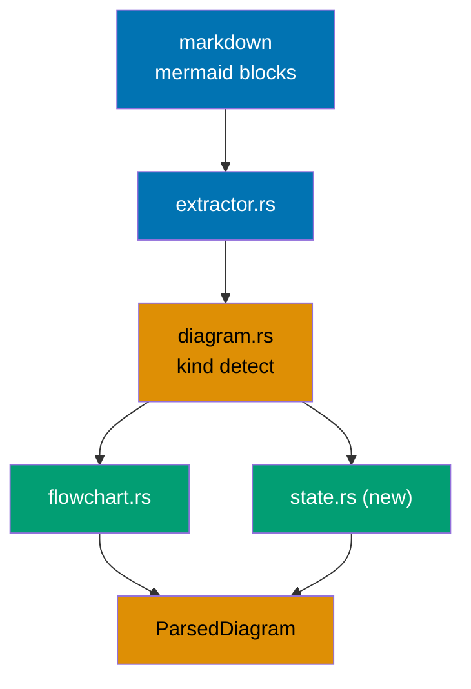
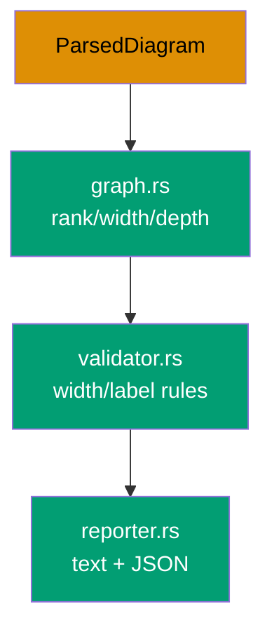
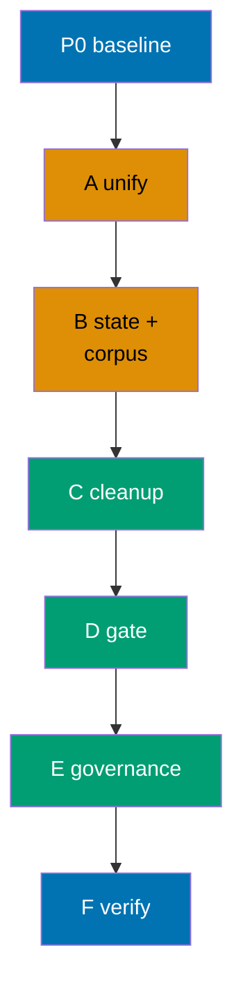

# Mermaid State Diagram Validation (ose-primer)

> Sibling implementation of the `mermaid-state-diagram-validation` objective.
> ose-public is the upstream-of-record for rhino-cli scaffolding; this ose-primer plan mirrors the
> ose-public reference parser semantics and is locked to it by a shared golden test corpus.

**Delivery mode**: worktree-to-`main` direct push (recorded deviation). ose-primer normally
receives scaffolding via a propagation PR from ose-public, but this objective is delivered
directly to `origin main` for all three sibling repos per the run's goal directive. The
propagation-maker / adoption-maker sync loop is NOT used here. The key sequencing decisions (D-TYPE,
D-ARCH, D-LABEL, D-MAP, D-STEREO, D-CLEAN, D-GOV, D-PUSH, parity contract, ose-primer re-shape
burden) are captured in [tech-docs.md §Design Decisions](./tech-docs.md#design-decisions) and
throughout the plan documents.

## Context

The `rhino-cli docs validate-mermaid` command enforces two render-width rules on Mermaid diagrams:
a width rule (`≤4 nodes` on any single rank) and a label rule (`≤30` characters per
` `-separated segment). Today these rules apply **only to flowchart/graph diagrams**. State
diagrams (`stateDiagram-v2` and legacy `stateDiagram`) are never parsed — the flowchart header
regex in `apps/rhino-cli/src/internal/mermaid/parser.rs` matches only `flowchart`/`graph`
headers, so every non-flowchart block parses to zero nodes and all checks are silently skipped.
[Repo-grounded: `apps/rhino-cli/src/internal/mermaid/parser.rs:12-15`]

The triggering defect: an 11-state `stateDiagram-v2 direction LR` chain renders far too wide for a
mobile viewport, yet the validator passes it. State diagrams have become an unguarded escape hatch
from the width discipline every flowchart must obey.

This plan closes that gap in ose-primer **and** re-shapes the validator onto a fresh, kind-agnostic
module design (identical across the three sibling repos) so they cannot diverge again.

## Scope

In scope:

- Re-shape ose-primer's current modular split
  (`apps/rhino-cli/src/internal/mermaid/{types,parser,validator,reporter,graph,extractor,mod}.rs`)
  [Repo-grounded] into the fresh unified module design where both diagram parsers emit the same
  `ParsedDiagram` (split `parser.rs` into `flowchart.rs` + `state.rs` + `diagram.rs`; make
  `graph.rs` / `validator.rs` / `reporter.rs` diagram-kind-agnostic).
- Add a `state.rs` front-end parser for `stateDiagram-v2` and `stateDiagram` (v1).
- Apply the existing width rule and a label rule (state display labels **and** transition-edge
  labels) to state diagrams.
- Land the **same** shared golden test corpus committed to all three repos (identical fixtures +
  expected violation JSON).
- Clean up every violating state diagram repo-wide, including `plans/done/` and otherwise
  gate-excluded paths (per D-CLEAN).
- Propagate the new rule into governance
  (`repo-governance/conventions/formatting/diagrams.md`) and re-sync platform bindings.

Out of scope:

- `sequenceDiagram`, `classDiagram`, `erDiagram`, `gitGraph` validation — deferred to a future plan.
- Any change to the `validate:mermaid` Nx target, CLI command, pre-commit, or CI wiring beyond
  state diagrams ceasing to be skipped.
- Changing the gate's scan-exclusion list.

Affected project: `rhino-cli` (`apps/rhino-cli/`).

## Approach Summary

The unifying principle: **both parsers emit the same `ParsedDiagram`**, so the rank/width/label
validation core becomes diagram-kind-agnostic. State support then falls out as a second front-end
feeding the same core. ose-primer already has a modular split; this plan re-shapes it (it does NOT
keep the current file boundaries) so the layout matches the reference exactly.

Delivery is phased and clean-then-gate. See [delivery.md](./delivery.md) for the executable
checklist.

## Documents

- [brd.md](./brd.md) — business rationale (WHY)
- [prd.md](./prd.md) — product requirements and Gherkin acceptance criteria (WHAT)
- [tech-docs.md](./tech-docs.md) — architecture and design decisions (HOW)
- [delivery.md](./delivery.md) — phased TDD delivery checklist (DO)

## Sibling Plans

This plan is one of three in a multi-repo parity run. The sibling repos are independent (not
subdirectories of this repo):

- **ose-public** (reference, authored first) —
  `plans/in-progress/mermaid-state-diagram-validation/README.md` in the
  [`ose-public`](https://github.com/wahidyankf/ose-public) repository
  (local path `/Users/wkf/ose-projects/ose-public/plans/in-progress/mermaid-state-diagram-validation/README.md`).
  Refactor burden: monolith → fresh modular design + state support.
- **ose-infra** —
  `plans/in-progress/mermaid-state-diagram-validation/README.md` in the
  `ose-infra` repository
  (local path `/Users/wkf/ose-projects/ose-infra/plans/in-progress/mermaid-state-diagram-validation/README.md`).
  Refactor burden: monolith (version-behind) → fresh modular design + state support.

Parity is locked by a shared golden test corpus (identical fixtures + expected violation JSON in
all three repos) and an identical module design. ose-public is the reference; this ose-primer plan
mirrors its parser semantics — the committed corpus must produce byte-identical violation JSON
here.
