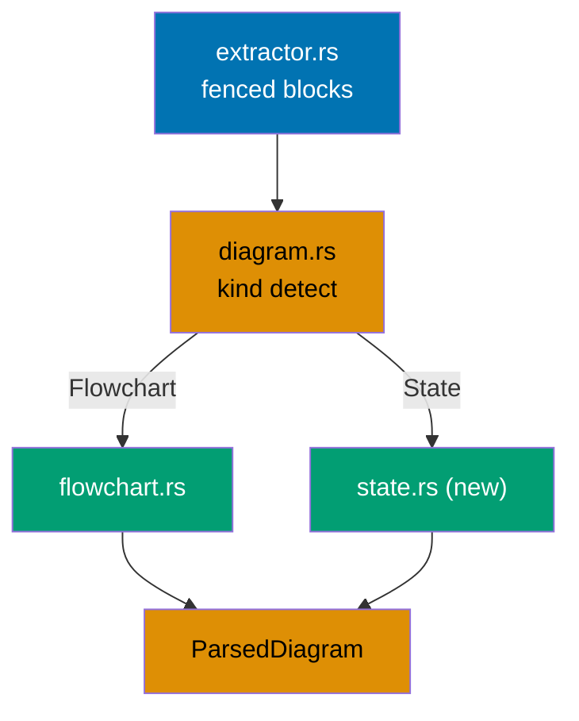
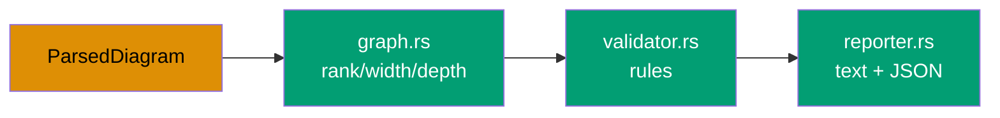
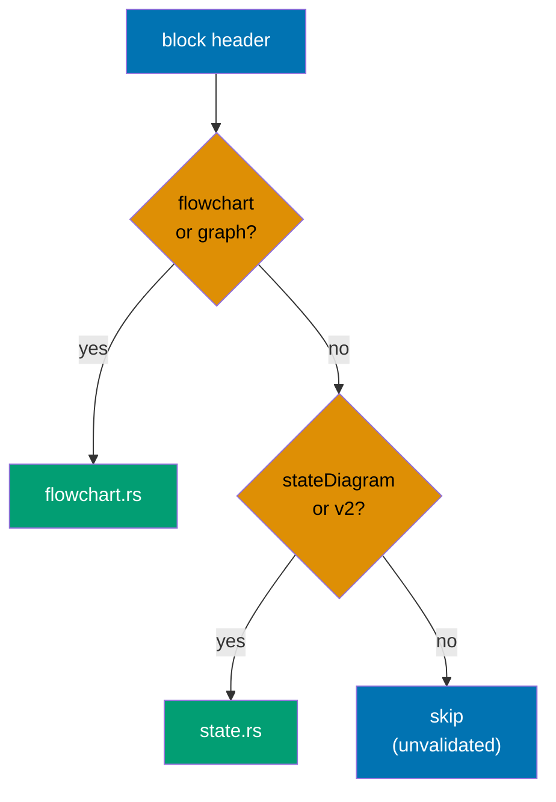
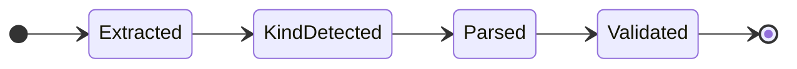

# Tech Docs — Mermaid State Diagram Validation (ose-primer)

> Architecture, design decisions, and file-impact. HOW it gets built.

## Current State (ose-primer)

ose-primer already has a **modular** validator at
`apps/rhino-cli/src/internal/mermaid/` [Repo-grounded]:

| File           | Lines | Role today                                                                                           |
| -------------- | ----- | ---------------------------------------------------------------------------------------------------- |
| `mod.rs`       | 12    | module re-exports                                                                                    |
| `types.rs`     | 147   | `Direction`, `Node`, `Edge`, `Subgraph`, `ParsedDiagram`, `Violation`, `Warning`, `ValidationResult` |
| `parser.rs`    | 594   | flowchart/graph parsing → `ParsedDiagram` (the only kind parsed)                                     |
| `graph.rs`     | 260   | rank/width/depth computation                                                                         |
| `validator.rs` | 251   | rule application (width, label, multiple, subgraph density)                                          |
| `reporter.rs`  | 411   | text + JSON output                                                                                   |
| `extractor.rs` | 82    | pull fenced ` ```mermaid ` blocks from markdown                                                      |

[Repo-grounded: `wc -l apps/rhino-cli/src/internal/mermaid/*.rs`.]

Today only `flowchart`/`graph` headers match (`FLOWCHART_HEADER_RE` in `parser.rs:12-15`); state
diagrams parse to zero nodes and are silently skipped. Tests are inline `#[cfg(test)] mod tests`
blocks inside `parser.rs`, `graph.rs`, `validator.rs`, `reporter.rs`, `extractor.rs`. The
`test:unit` target runs `cargo test --lib`. [Repo-grounded: `apps/rhino-cli/project.json:72-78`.]

The CLI command `docs validate-mermaid` lives in
`apps/rhino-cli/src/commands/docs.rs` and pipes `extractor::extract_blocks` →
`mermaid_validator::validate_blocks`. [Repo-grounded: `apps/rhino-cli/src/commands/docs.rs:165-231`.]

## Target Design (fresh unified module — identical in all 3 repos)

The current modular split is **re-shaped** (not kept) to the fresh layout below. The unifying
principle: both diagram parsers emit the SAME `ParsedDiagram`, so the rank/width/label core is
diagram-kind-agnostic.

````text
internal/mermaid/
  mod.rs         # public API re-exports: extract_blocks, validate_blocks, report
  types.rs       # Direction, Node, Edge, Subgraph, ParsedDiagram, Violation, Warning,
                 #   ViolationKind, WarningKind, ValidateOptions, DiagramKind
  extractor.rs   # pull ```mermaid fenced blocks out of markdown (unchanged behavior)
  diagram.rs     # NEW: DiagramKind { Flowchart, State } detection from header; dispatch
  flowchart.rs   # flowchart/graph front-end parser → ParsedDiagram (existing parser.rs logic, moved)
  state.rs       # NEW: state front-end parser → ParsedDiagram (stateDiagram-v2 + stateDiagram)
  graph.rs       # rank/width/depth computation over ParsedDiagram (shared core, kind-agnostic)
  validator.rs   # rule application over ParsedDiagram (width, label, multiple, subgraph density)
  reporter.rs    # human-readable + JSON output (unchanged behavior)
````

ose-primer-specific re-shape work (the delta from its current files):

- Rename/split `parser.rs` → `flowchart.rs` (flowchart logic) + new `diagram.rs` (kind detect +
  dispatch). The flowchart parsing logic moves verbatim into `flowchart.rs`.
- Add new `state.rs` (state front-end).
- Make `graph.rs`, `validator.rs`, `reporter.rs` consume `ParsedDiagram` agnostically (they already
  operate on `ParsedDiagram`; confirm no `Direction::Td` / flowchart-only assumption leaks into the
  shared path).
- Extend `types.rs`: add `DiagramKind`; ensure `ValidateOptions` is shared.

## Component Interaction





## Parser Dispatch Decision Branch



## State Parser Mapping (D-MAP / D-STEREO / D-LABEL)

`state.rs` maps the pinned grammar to `ParsedDiagram`:

| Grammar form                                                         | Maps to                                | Notes                                                |
| -------------------------------------------------------------------- | -------------------------------------- | ---------------------------------------------------- |
| bare `id`                                                            | `Node { id, label: id }`               |                                                      |
| `id : desc`                                                          | `Node { id, label: desc }`             | colon display label; checked ≤30                     |
| `state "desc" as id`                                                 | `Node { id, label: desc }`             | quoted display label; checked ≤30                    |
| `[*]`                                                                | `Node` (pseudostate)                   | counts toward rank width; start vs end by arrow side |
| `state X <<choice>>` / `<<fork>>` / `<<join>>` (and `[[…]]` aliases) | `Node`                                 | counts toward rank width (D-STEREO)                  |
| `state X { … }`                                                      | `Subgraph` (recursed)                  | subgraph-density warning applies inside              |
| `A --> B : lbl`                                                      | `Edge { from, to }` + transition label | `: lbl` text checked ≤30 (D-LABEL)                   |
| `note left of X: …` / `note … end note`                              | skipped                                | free text, exempt from label rule                    |
| `%%…` / `#…`                                                         | skipped                                | comments                                             |
| `--` (inside composite body)                                         | skipped                                | concurrent-region separator, not a transition/node   |

Grammar facts pinned for the parser (confirmed via web-research-maker on 2026-06-12 against the
official Mermaid state-diagram docs, [mermaid.js.org/syntax/stateDiagram.html](https://mermaid.js.org/syntax/stateDiagram.html),
cross-checked against the authoritative JISON grammar
[`stateDiagram.jison`](https://github.com/mermaid-js/mermaid/blob/develop/packages/mermaid/src/diagrams/state/parser/stateDiagram.jison)):

- Headers: `stateDiagram-v2` and `stateDiagram` (v1) — same AST surface; both in scope.
- `direction` values: `TB | BT | LR | RL` only — `TD` is NOT valid in state diagrams. `LR`/`RL`
  swap width/depth axes exactly as flowchart `LR` does.
- Arrows: only `-->` (optionally followed by a `: label` suffix). Match `-->` BEFORE the `--`
  concurrency separator.

## State Lifecycle of a Parsed Block



> The diagram above is itself a state diagram with ≤4 nodes/rank and short labels, so it passes the
> very validator this plan builds.

## Design Decisions

- **D-ARCH (fresh unified design).** Re-shape rather than bolt state parsing onto the existing
  `parser.rs`. Rationale: a kind-agnostic core is the only way to guarantee state and flowchart
  diagrams obey identical rules and to make future diagram kinds cheap. The cost is a behavior-
  preserving refactor (Phase A) gated by the unchanged flowchart suite.
- **D-LABEL (label scope stricter than flowchart).** State diagrams check BOTH state display labels
  AND transition-edge labels; flowcharts check node labels only. Rationale: transition labels are
  rendered text that contributes to render width in state diagrams.
- **D-MAP / D-STEREO (pseudostates and stereotypes count).** `[*]` and `<<choice/fork/join>>` are
  real rendered nodes, so they count toward the rank width — consistent with how flowchart nodes
  count.
- **D-CLEAN (clean repo-wide).** Cleanup reaches `plans/done/` and gate-excluded paths even though
  the gate's own scan exclusions are unchanged. Rationale: maximum hygiene; the excluded paths still
  render in GitHub.
- **Behavior-preserving Phase A.** Flowchart output stays byte-for-byte identical; the existing
  flowchart tests are the gate.

## File Impact

- `apps/rhino-cli/src/internal/mermaid/mod.rs` — update re-exports for new modules.
- `apps/rhino-cli/src/internal/mermaid/types.rs` — add `DiagramKind`; confirm shared
  `ValidateOptions`.
- `apps/rhino-cli/src/internal/mermaid/parser.rs` — split: flowchart logic moves to new
  `flowchart.rs`; file is removed once empty.
- `apps/rhino-cli/src/internal/mermaid/flowchart.rs` — _New file_ (flowchart front-end, moved logic).
- `apps/rhino-cli/src/internal/mermaid/diagram.rs` — _New file_ (kind detect + dispatch).
- `apps/rhino-cli/src/internal/mermaid/state.rs` — _New file_ (state front-end).
- `apps/rhino-cli/src/internal/mermaid/graph.rs` — confirm kind-agnostic; no change to math.
- `apps/rhino-cli/src/internal/mermaid/validator.rs` — extend label check to transition labels for
  state diagrams.
- `apps/rhino-cli/src/internal/mermaid/reporter.rs` — unchanged behavior.
- `apps/rhino-cli/src/internal/mermaid/` (test fixtures) — _New_ shared golden corpus directory and
  fixtures.
- `repo-governance/conventions/formatting/diagrams.md` — document the state-diagram rule (Phase E).
- Markdown files containing `stateDiagram` — cleanup (Phase C). Run
  `grep -rln stateDiagram --include='*.md' | grep -v node_modules | wc -l` at Phase C start for the
  live count. [Repo-grounded: command verified live; inline count omitted to prevent drift.]

## Testing Strategy

- **Unit (TDD, inline `mod tests`)**: each Gherkin scenario in `prd.md` maps to a first failing
  unit test in `state.rs`, `diagram.rs`, or `validator.rs`. Run via `nx run rhino-cli:test:unit`
  (`cargo test --lib`).
- **Golden corpus**: a committed set of `.md` fixtures + expected violation JSON, identical across
  the three repos, asserted by a corpus test. This is the parity lock.
- **Coverage**: `nx run rhino-cli:test:quick` enforces ≥90% library line coverage
  [Repo-grounded: `--fail-under-lines 90` in `project.json:83`]; new modules must keep it green.
- **Manual validator run**: `nx run rhino-cli:validate:mermaid` over the repo after cleanup.

| Acceptance criterion (prd.md)               | Test level                           |
| ------------------------------------------- | ------------------------------------ |
| Over-wide LR state chain → width_exceeded   | unit + golden corpus                 |
| `[*]` counts as node                        | unit + golden corpus                 |
| Stereotype counts as node                   | unit + golden corpus                 |
| Over-long state label → label_too_long      | unit + golden corpus                 |
| Over-long transition label → label_too_long | unit + golden corpus                 |
| Composite = subgraph                        | unit + golden corpus                 |
| Notes/comments/`--` not misparsed           | unit + golden corpus                 |
| Flowchart behavior unchanged                | existing flowchart unit suite        |
| Cross-repo parity                           | golden corpus (shared expected JSON) |

## Dependencies

- `regex` crate (already used by `parser.rs`). No new external crates expected.
- No change to `validate:mermaid` Nx target, CLI flags, pre-commit, or CI.

## Rollback

Phase A and Phase B are isolated commits. If state support regresses, revert the Phase B commits;
the Phase A re-shape leaves flowchart behavior byte-identical, so it can stand alone. Phase C
cleanup commits are independent of the validator change and can be reverted separately.
