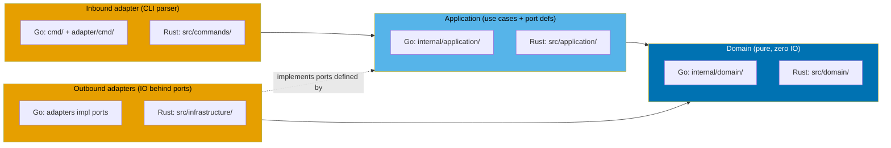

# Technical Documentation — rhino-cli Hexagonal Migration

## Architecture: Hybrid Kernel + Per-Feature Vertical Slices

Each layer holds a shared kernel subpackage plus one subpackage per feature.



### Layer directories (verified present)

| Layer         | Go                                                                     | Rust                                         |
| ------------- | ---------------------------------------------------------------------- | -------------------------------------------- |
| Domain        | `internal/domain/` (exists) [Repo-grounded]                            | `src/domain/` (exists) [Repo-grounded]       |
| Application   | `internal/application/` (exists) [Repo-grounded]                       | `src/application/` (exists per inventory)    |
| Outbound      | adapters under `internal/adapter/` [Repo-grounded]                     | `src/infrastructure/` (exists per inventory) |
| Inbound (CLI) | `cmd/` (exists) + `internal/adapter/command/` (exists) [Repo-grounded] | `src/commands/` (exists) [Repo-grounded]     |

The Go `internal/domain/`, `internal/application/`, and `internal/adapter/`
directories already exist [Repo-grounded — `ls -d apps/rhino-cli-go/internal/*/`].
The Rust `src/domain/`, `src/application/`, `src/infrastructure/` directories
exist per the supplied inventory (`.gitkeep` placeholders) [Repo-grounded for the
inventory; verify the exact placeholder files in Phase 0].

## Shared-Kernel Rule (2+ consumers)

A type or util enters the shared kernel ONLY if used by 2+ features; a
single-consumer item stays feature-local. The result is **asymmetric and
accepted**:

| Language | Shared kernel       | Rationale                                                                                        |
| -------- | ------------------- | ------------------------------------------------------------------------------------------------ |
| Go       | `{mermaid}`         | `mermaid` imported by `docs` and `git` [Repo-grounded — `runner.go` imports `internal/mermaid`]. |
| Rust     | `{mermaid, cliout}` | `mermaid` by docs+git; `cliout` by doctor, envbackup, mermaid (inventory).                       |

Single-consumer, stays feature-local: `fileutil` (Go, docs-only), `naming` (Go
unused / Rust agents-only).

## Port Mechanism

### Go — named interfaces, consumer-owned

The application layer defines small interfaces ("accept interfaces, return
structs"); adapters implement them; `main()`/`cmd` wires concrete adapters. This
formalizes the existing `git` `Deps` struct of function fields
[Repo-grounded — `apps/rhino-cli-go/internal/git/runner.go` lines 27–56] into
named multi-method interfaces.

```go
// internal/application/git/ports.go (illustrative)
type StagedFileProvider interface {
    StagedFiles(gitRoot string) ([]string, error)
}
type ToolProber interface {
    Run(name string, args ...string) error
}
```

### Rust — trait objects (`Box<dyn Trait>`)

Mirrors the existing Rust `git` `Deps<'a>` which already uses `Box<dyn Fn...>`
and `Box<dyn Write>` [Repo-grounded — `apps/rhino-cli-rust/src/internal/git/runner.rs`
lines 48–76]. Wiring is done once at `main()`/`cli::run()`. Do NOT use
generics/monomorphization for injection (keeps Go/Rust structurally parallel and
avoids the lifetime/verbosity trap).

```rust
// src/application/git/ports.rs (illustrative)
pub trait StagedFileProvider { fn staged_files(&self, git_root: &Path) -> Result<Vec<String>>; }
pub trait ToolProber { fn run(&self, name: &str, args: &[&str], cwd: &Path) -> io::Result<ExitStatus>; }
```

> If any port needs `async fn`, note that `async fn` in traits (Rust 1.75) cannot
> be used with `dyn` without the `async-trait` crate (heap alloc) [Web-cited —
>
> > see Research Basis]. No current `git` seam is async; flag per feature if one
> > arises.

## Port Naming Rule (domain role, not technology)

Name ports for the **domain role** they play, never the technology:

| Good (domain role)   | Bad (technology)  |
| -------------------- | ----------------- |
| `StagedFileProvider` | `FileSystem`      |
| `ToolProber`         | `CommandExecutor` |
| `CoverageReader`     | `FileReader`      |

This rule is codified in the convention doc in the final phase.

## Design Decision: Maximal Port Depth (accepted trade-off)

**Decision (final, user-chosen)**: EVERY IO boundary becomes a named port —
filesystem read/write, process/exec spawn, network — including single-function
seams. The domain layer is pure (zero IO imports).

**Trade-off, recorded honestly**: research consensus is that named ports belong
on multi-method cross-boundary collaborators, while single-function seams (a
one-off file read, `time.Now`) are fine as plain function parameters; a minority
view calls CLI hex "overkill" for trivial scripts [Web-cited — Research Basis].
The maximal approach therefore accepts some single-implementation ports and extra
boilerplate in exchange for **uniform domain purity and a single, predictable
seam pattern across all 13 features and both languages**. The over-engineering
risk is real and documented; the maintainer chose uniformity over leanness
deliberately. This trade-off is one line in the convention doc, not an argument
against the decision.

## Enforcement (language tooling only)

- **Go**: `internal/` compiler wall prevents external import; `go vet ./...`
  (the `typecheck` target) [Repo-grounded — `rhino-cli-go` `typecheck` runs
  `go vet ./...`].
- **Rust**: module privacy (`pub`/non-`pub`) + `cargo clippy -- -D warnings`
  (part of the `lint` target) [Repo-grounded — `rhino-cli-rust` `lint`].

No new architecture/import-direction lint is added.

## Behavior-Preserving Migration Recipe (per feature, both languages)

Feathers' characterization-test (golden master) discipline + strangler-fig,
seam-by-seam, tests green after each step [Web-cited — Research Basis]:

1. Confirm `shadow-diff.sh` GREEN (golden corpus captured at Phase 0).
2. Extract the pure core into `domain/<feature>/` (move pure functions; strip IO).
3. Define inbound port (use-case entry) + outbound ports in `application/<feature>/`.
4. Implement outbound adapters (Go: under `internal/adapter` / feature adapter;
   Rust: `src/infrastructure/<feature>/`).
5. Wire the entry point (`cmd`/`commands`) to the application use case.
6. Re-run `shadow-diff.sh` GREEN; run unit + integration + coverage; update the
   Rust coverage-ignore allowlist if any listed file moved.

Migrate most-business-logic-rich first; the `git` pilot proves the recipe.

## Phase-Ordering Constraint

`mermaid` (shared kernel) is imported by `docs` and `git` [Repo-grounded —
`runner.go` import]. The `git` pilot already consumes mermaid validators via
`Deps`. Therefore migrate the shared kernel(s) (`mermaid`; Rust `cliout`) early,
before or together with `docs`. IO-heavy features (envbackup, doctor,
testcoverage, git) get their own phases given port volume; lighter features are
grouped. The exact grouping is proposed in `delivery.md` for user confirmation.

## File-Impact Summary

| Path                                                                | Change                                                                                       |
| ------------------------------------------------------------------- | -------------------------------------------------------------------------------------------- |
| `apps/rhino-cli-go/internal/{domain,application,adapter}/`          | Populated with per-feature + shared subpackages [Repo-grounded — dirs exist]                 |
| `apps/rhino-cli-rust/src/{domain,application,infrastructure}/`      | Populated with per-feature + shared modules                                                  |
| `apps/rhino-cli-go/internal/<feature>/`                             | Logic relocated into layers; thin shims removed                                              |
| `apps/rhino-cli-rust/src/internal/<feature>/`                       | Same                                                                                         |
| `apps/rhino-cli-rust/project.json`                                  | `test:quick` `--ignore-filename-regex` allowlist updated per phase [Repo-grounded — line 83] |
| `repo-governance/development/pattern/hexagonal-architecture-cli.md` | Final-phase content update [Repo-grounded — file exists]                                     |

## Quality Gates (Nx targets — all verified present)

Both apps [Repo-grounded — both `project.json` files]: `build`, `test:unit`,
`test:quick` (coverage ≥90%), `test:integration`, `lint`, `typecheck`,
`spec-coverage`, `validate:cross-vendor-parity`, plus other `validate:*`.
Behavior gate: `apps/rhino-cli-rust/scripts/shadow-diff.sh` [Repo-grounded].

## Testing Strategy

- **Unit** — domain logic tested directly with fakes substituted for ports
  (`*_test.go` next to source; Rust inline `#[cfg(test)]`). Maps to the
  domain-purity Gherkin scenarios.
- **Integration** — `cmd/*.integration_test.go` (build tag `integration`) [Repo-grounded]
  and Rust `tests/*.rs` cucumber files. Maps to inbound-adapter scenarios.
- **Golden master** — `shadow-diff.sh` cross-binary byte diff. Maps to the
  behavior-preservation scenarios.
- **TDD shape** — for any new port/adapter code, write the failing fake-backed
  unit test first (RED), implement (GREEN), refactor; delivery.md expresses code
  items as RED/GREEN/REFACTOR.

## Research Basis (cited)

- CLI-as-inbound-adapter is canonical: Cockburn ports-and-adapters (2005);
  corroborated by Herberto Graça (herbertograca.com) and AWS Prescriptive
  Guidance [Web-cited, accessed 2026-06-09].
- Over-engineering is the dominant documented risk for hex-on-CLI; ports belong
  on multi-method collaborators; minority "overkill" view (skoredin.pro) applies
  to trivial scripts only [Web-cited, accessed 2026-06-09].
- Go idiom: small consumer-owned interfaces ("accept interfaces, return structs";
  "the bigger the interface, the weaker the abstraction" — Rob Pike); manual DI at
  `main()` (Three Dots Labs; Go Proverbs) [Web-cited, accessed 2026-06-09].
- Rust idiom: traits as ports; `Box<dyn>` appropriate for a fixed adapter graph
  wired once; generics-everywhere is a lifetime/verbosity trap (howtocodeit.com;
  tuttlem.github.io; HN 41518698); `async fn` in traits needs `async-trait` for
  `dyn` [Web-cited, accessed 2026-06-09].
- Port-naming anti-pattern: name for the concept, not the implementation (Rust
  Users Forum; pitfalls catalogs) [Web-cited, accessed 2026-06-09].
- Behavior-preserving refactor: Feathers' characterization tests + strangler-fig
  (understandlegacycode.com; ro-che.info golden tests) [Web-cited, accessed
  2026-06-09].

> All external claims above were supplied as pre-verified research with the task.
> Re-verify via `web-research-maker` before execution if any becomes load-bearing
> for an implementation decision.

## Rollback

Each phase is a natural pause with a green git state. Rollback = `git revert` the
phase's commits; shadow-diff + the test suites confirm restoration. No data
migrations or irreversible steps are involved.
