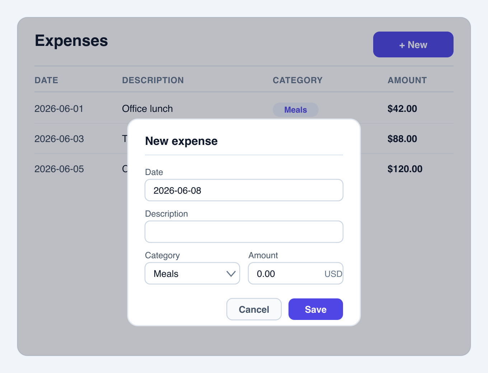
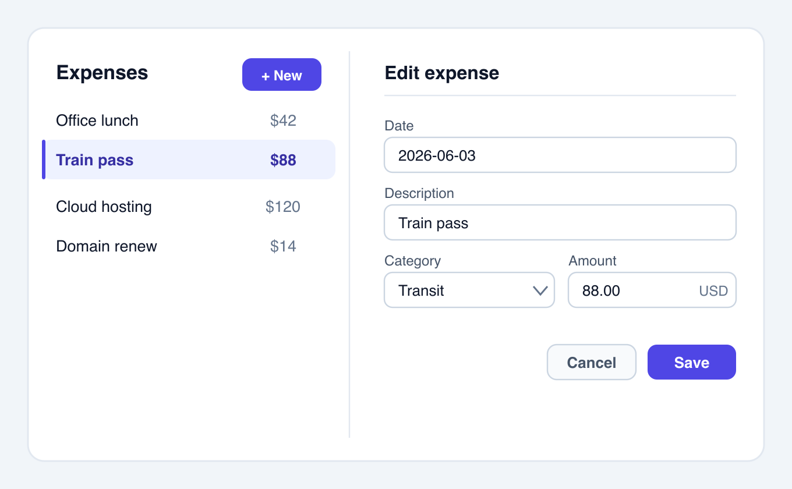

# Assets — Worked Example of the Design Funnel

These files walk the full **diverge → narrow → select → justify** funnel for one screen — a CRUD
**entity list + create/edit form** (an expense tracker, the kind `apps/crud-fe-dart-flutterweb` and
its sibling `crud-fe-*` apps ship) — so the process and both mockup tiers can be seen end-to-end. All
artefacts reuse the shared `libs/ts-ui` kit (table, dialog, inputs, select, buttons) and its
`libs/ts-ui-tokens` palette (indigo primary, slate neutrals), per the grounding rule (R5).

| File                                                                                   | Funnel stage         | Tier   | Renders: VSCode / GitHub |
| -------------------------------------------------------------------------------------- | -------------------- | ------ | ------------------------ |
| [example-low-fi-wireframe.md](./example-low-fi-wireframe.md)                           | 1. Diverge           | Low-fi | Yes / Yes                |
| [example-hi-fi-option-a-table-modal.png](./example-hi-fi-option-a-table-modal.png)     | 2. Narrow (finalist) | Hi-fi  | Yes / Yes                |
| [example-hi-fi-option-b-master-detail.png](./example-hi-fi-option-b-master-detail.png) | 2. Narrow (finalist) | Hi-fi  | Yes / Yes                |

## Stage 1 — Diverge (low-fi)

Three genuinely different layouts, named Option A / B / C, in
[example-low-fi-wireframe.md](./example-low-fi-wireframe.md): **A — Table list + modal form**,
**B — Master-detail**, **C — Card grid + full-page form**. Cheap ASCII, so divergence is painless
and diffable.

## Stage 2 — Narrow (hi-fi shortlist)

The two strongest low-fi options are promoted to high fidelity. Option C (Card grid + full-page form)
is dropped here.

### Finalist 1 — Option A (Table list + modal form)



### Finalist 2 — Option B (Master-detail)



## Stage 3 — Selection

**Selected: Option A — Table list + modal form.**

## Stage 4 — Rationale (decision record)

| Option                          | Outcome           | Why                                                                                                                                                                                                                                                 |
| ------------------------------- | ----------------- | --------------------------------------------------------------------------------------------------------------------------------------------------------------------------------------------------------------------------------------------------- |
| **A — Table list + modal form** | **Chosen**        | Simplest shape for a template demo; the table scales as records grow; the modal keeps the list in context while editing; reuses the `ts-ui` `Table` + `Dialog`; portable across every `crud-fe-*` framework (Next.js, TanStack Start, Flutter Web). |
| B — Master-detail               | Runner-up         | Comfortable on wide screens, but the two-pane layout is heavier, the panes compete for width, and it stacks awkwardly on mobile — no advantage over A for the core list + edit task.                                                                |
| C — Card grid + full-page form  | Dropped (Stage 2) | Full-page navigation to edit loses the list context and adds routing the other two avoid; weaker for scanning many records — the primary job of this screen.                                                                                        |

## How the hi-fi artefacts were produced

- The real plan workflow uses **Excalidraw `.excalidraw.png`** (the PNG carries an editable scene;
  edit it with the `pomdtr.excalidraw-editor` VSCode extension).
- These examples are instead **hand-authored SVGs** rasterised to PNG with `rsvg-convert -z 2`, so
  the source is fully diffable and reproducible from text. A hand-authored SVG uses system fonts, so —
  unlike `.excalidraw.svg` — it renders correctly on GitHub without the custom-font CSP fallback.
  Either route satisfies the hi-fi tier; pick Excalidraw for a drawing canvas, hand-SVG for a
  text-diffable vector source.
- Regenerate a PNG after editing its SVG:

  ```bash
  rsvg-convert -z 2 example-hi-fi-option-a-table-modal.svg -o example-hi-fi-option-a-table-modal.png
  rsvg-convert -z 2 example-hi-fi-option-b-master-detail.svg -o example-hi-fi-option-b-master-detail.png
  ```
