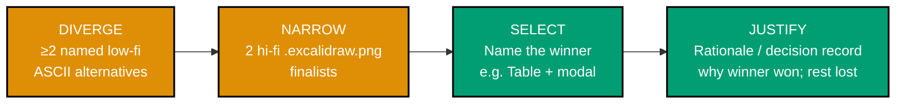

# PRD — Plan-Doc UI Mockup Convention

## Overview

Define WHAT the convention says and HOW an author represents draft UI in a plan. The supporting
research and citations live in [tech-docs.md](./tech-docs.md). The full design funnel mechanics and
tier descriptions are documented in detail in [tech-docs.md §Design funnel](./tech-docs.md) and
[tech-docs.md §The two required tiers](./tech-docs.md); this document summarises the rules and
states the requirements.

## Design process — the funnel

A UI-bearing plan follows a **diverge → narrow → select → justify** process — entered once goals are
clear (BRD/PRD) and the existing UI is surveyed (R5). See
[tech-docs.md §Design funnel](./tech-docs.md) for the full mechanics. The summary:



Every stage is visible in the plan: the low-fi alternatives, the hi-fi shortlist, the **named**
selection, and a short **rationale** (a decision record). Nothing is silently discarded.

## Core rule — both tiers, separated

Within the funnel, each screen is represented at **two** fidelities, in **separate, labelled
sections**:

- **Low-fidelity mockup (required)** — ASCII / Unicode wireframe in a fenced code block.
- **High-fidelity version (required)** — Excalidraw `.excalidraw.png` referenced via
  `` (plain `.png` screenshot as fallback once design is final).

The two tiers per screen:

- Low-Fidelity Wireframe → ASCII / Unicode in a fenced code block (REQUIRED)
- High-Fidelity Mockup → Excalidraw `.excalidraw.png` via `` (REQUIRED; plain `.png`
  screenshot = fallback when final)

**Never use in plan docs:** inline HTML+CSS, MDX, Mermaid-as-wireframe, or `.excalidraw.svg`
(see the ruled-out table in [tech-docs.md](./tech-docs.md) for the per-option reason).

## Personas

- **Plan author (human wearing the "UI designer" hat)** — writes plan docs for UI-bearing plans;
  needs the funnel rules to know what artefacts to produce per screen.
- **`plan-maker` agent** — creates plan docs; must enforce the design funnel on UI-bearing plans
  and emit delivery steps for the required artefacts.
- **`plan-checker` agent** — validates plans; must flag missing funnel artefacts at HIGH criticality.
- **`plan-fixer` agent** — remedies plan gaps; must scaffold missing funnel sections.
- **`web-research-maker` agent** — supplies prior-art research for Stage 0 of the funnel's diverge
  step.
- **Sibling-repo consumers (ose-public, ose-infra)** — adopt the convention via parallel plans in
  their own repos, grounding references in their own UI libs (`libs/ts-ui`, `libs/ts-ui-tokens`).

## User Stories

- As a **plan author**, I want a documented, unambiguous convention for embedding draft UI in plan
  `.md` files, so that mockups render identically in VSCode and GitHub without me having to guess
  which format works.
- As a **plan author**, I want a staged design funnel (diverge → narrow → select → justify), so
  that I explore real alternatives before committing to a design, and the rationale survives review.
- As a **plan reviewer** (on GitHub PRs and in VSCode), I want to see identical mockups in both
  surfaces plus the alternatives considered and the rationale for the chosen design, so that I can
  give meaningful feedback.
- As a **`plan-maker` agent**, I want clear rules about what funnel artefacts to require on a
  UI-bearing plan, so that I can emit the correct delivery steps automatically.
- As a **`plan-checker` agent**, I want a formal UI-design-funnel completeness check, so that I can
  flag missing artefacts at HIGH criticality and prevent incomplete designs from passing quality
  gates.
- As a **sibling-repo consumer** (ose-public, ose-infra maintainer), I want a parallel
  `plan-doc-ui-mockup-convention` plan in my own repo, so that the convention is adopted with the
  correct local grounding references rather than inheriting a foreign repo's paths.

## Product Scope

### In Scope

- The convention text itself: the both-tiers rule, rendering-support matrix, ruled-out table,
  grounding rule (R5), design funnel (R6: diverge → narrow → select → justify), and prior-art
  recommendation (R7) — each with a copy-paste example — authored as a section under
  `repo-governance/conventions/formatting/diagrams.md`.
- Enforcement wiring across the plan-maker → plan-checker → plan-fixer chain and the
  `plan-quality-gate` workflow, so a UI-bearing plan cannot pass quality gates without the funnel
  artefacts.
- A self-contained worked example in `assets/` demonstrating the full CRUD entity list + create/edit
  form funnel (≥2 named low-fi ASCII alternatives, 2 hi-fi `.excalidraw.png` finalists, named
  selection, rationale).
- Cross-repo parallel-plan adoption in ose-public and ose-infra, each grounded in their own UI lib.

### Out of Scope

- Production app UI changes — this plan ships a convention and example assets, not app/lib screens.
- A new standalone markdown lint rule or bespoke CI gate — enforcement reuses the existing
  `plan-checker` / `plan-quality-gate` chain; no new lint binary or CI job is introduced.
- A custom wireframe tool or build pipeline — ASCII and `.excalidraw.png` require no tooling beyond
  the Excalidraw VSCode extension (optional for editing).

See [README.md §Scope](./README.md) for the plan-level scope boundary.

## Requirements

### R1 — Convention document

A convention section/document MUST:

- State the **both-tiers rule**: every screen in a UI-bearing plan gets a **low-fidelity wireframe**
  (ASCII/Unicode in a fenced code block) AND a **high-fidelity version** (`.excalidraw.png`), in
  separate labelled subsections — each with a copy-paste example.
- Define the role of each tier (low-fi = structure/flow/diffable; hi-fi = spacing/color/hierarchy).
- Include the rendering-support matrix (VSCode built-in / VSCode + extension / GitHub.com / diffable
  / lint-safe) for every candidate.
- Include a **ruled-out** table (inline HTML+CSS, MDX, Mermaid-as-wireframe, `.excalidraw.svg`) with
  a one-line reason each.
- State the hard fact that **GitHub strips `style=`, `class`, `id`, `<style>`, `<script>`**, so
  inline-CSS mockups do not render on GitHub.
- State that `.excalidraw.png` is required over `.excalidraw.svg` for GitHub-visible mockups
  (Excalidraw custom fonts are blocked by GitHub's CSP on SVG).
- Note the tooling: Excalidraw VSCode extension (`pomdtr.excalidraw-editor`) is needed to **edit**
  but not to **view** `.excalidraw.png`; ASCII needs nothing.
- State the **grounding rule** (R5): before drafting either tier, the author surveys existing UI in
  the related app(s) and lib(s) so mockups reuse the real design system.

### R2 — Enforcement across the plan maker / checker / fixer / workflows

The design rules (both-tiers R1, grounding R5, funnel R6, prior-art R7) are not advisory prose — they
are **enforced** by the same maker → checker → fixer chain that already governs plans, so a UI-bearing
plan cannot pass quality gates without them. A plan is "UI-bearing" when it adds/changes user-facing
screens or components under `apps/` or `libs/` (e.g. `libs/ts-ui`).

- **`plan-creating-project-plans` skill** — documents the design-funnel rule as part of plan content
  for UI-bearing plans, and the grilling gates ask the design-funnel questions (which alternatives,
  what prior art, which selection + why) using the standard multiple-choice options.
- **`plan-maker`** — when a plan is UI-bearing, MUST require the funnel artefacts (≥2 named low-fi
  alternatives, 2 hi-fi finalists, a named selection, a rationale, the R5 grounding note, and R7
  prior-art citations) and MUST emit delivery steps that produce them, exactly as it already emits
  specs/Gherkin steps for feature changes.
- **`plan-checker`** — gains a **UI-design-funnel completeness** validation step (sibling to its
  specs/Gherkin Step 5j): for a UI-bearing plan it FLAGS, at HIGH criticality, any missing funnel
  artefact — no alternatives, no hi-fi finalists, an unnamed selection, a missing rationale, or a
  missing grounding/prior-art note. Pure-refactor / no-UI plans are exempt.
- **`plan-fixer`** — remediates the flagged gaps by scaffolding the missing funnel sections
  (alternatives stubs, selection/rationale skeleton) for the author to fill, re-validating before
  applying.
- **`plan-quality-gate`** (and the plan-establishment/execution workflows that compose it) — list the
  new checker step in their validation scope so the gate fails on a UI-bearing plan that skips the
  funnel.

This mirrors the existing **Specs & Gherkin completeness (both paths)** binding: just as app/lib code
never lands without companion Gherkin enforced by `swe-code-checker` + `plan-checker`, a UI-bearing
plan never passes without its design funnel enforced by `plan-checker` + `plan-fixer`.

### R3 — Worked example

- This plan's own `assets/` MUST carry the **full funnel** for a **CRUD entity list + create/edit
  form** screen as the self-contained reference exemplar: prior-art-informed **≥2 named low-fi ASCII
  alternatives** → **2 hi-fi `.excalidraw.png` finalists** → a **named selection** → a **rationale**,
  all reusing the surveyed design system (R5) and rendering correctly in both VSCode and GitHub.
- The exemplar lives entirely inside this plan (`assets/`), since ose-primer has no separate sibling
  UI plan to host it — the funnel is demonstrated end-to-end here rather than injected into another
  plan's `prd.md`.

### R4 — Cross-repo adoption

- The convention MUST be adopted across **all three sibling repos** (ose-public, ose-infra, ose-primer)
  via **parallel `plan-doc-ui-mockup-convention` plans** — same convention text, rendering-matrix,
  ruled-out table, funnel, and enforcement in each, differing only in grounding references (each
  repo's own UI lib: ose-public `libs/web-ui`; ose-infra and ose-primer `libs/ts-ui` +
  `libs/ts-ui-tokens`) and the worked-example exemplar.
- ose-primer self-adopts via its own plan, pushed directly to its `origin main` (an explicit owner
  decision overriding the usual ose-primer PR-only rule).
- Parallel plans exist and pass strict `plan-quality-gate` in all three repos.

### R5 — Ground mockups in existing UI

- Before drafting **either** tier, the author MUST read the existing UI / design of the **related
  app(s) and lib(s)**:
  - the shared `libs/ts-ui` component kit (component inventory + its Storybook) and its
    `libs/ts-ui-tokens` design tokens;
  - the target app's existing pages, layout, theme, and locale/i18n shell (e.g.
    `apps/crud-fe-dart-flutterweb` for the CRUD list + form example);
  - any existing sibling tool/page the new screen should match.
- Mockups MUST reuse components, spacing, color, and patterns that **already exist** in the design
  system rather than inventing them; the `swe-developing-frontend-ui` skill / `ts-ui` kit is the
  reference for tokens and component inventory.
- Any **net-new** component the mockup introduces MUST be called out explicitly (as the CRUD list +
  form example does for the modal `Dialog` primitive), so the gap is visible before build.

### R6 — Design funnel (diverge → narrow → select → justify)

The convention MUST require, and `plan-maker` MUST enforce, the staged design process for each
UI-bearing screen. See [tech-docs.md §Design funnel](./tech-docs.md) for the full stage descriptions.

- **Diverge (low-fi)** — present **≥ 2 (aim for 3) genuinely different** named low-fidelity ASCII
  alternatives (Option A / B / C), not cosmetic variants.
- **Narrow (hi-fi)** — carry the **2 strongest** forward as high-fidelity `.excalidraw.png` mockups;
  give a one-line reason for each low-fi alternative dropped at this gate.
- **Select** — **name** the chosen design explicitly (e.g. "Selected: Option A — Table list + modal form").
  More than one may be selected when the screen legitimately needs variants.
- **Justify** — include a short **rationale / decision record** in the plan: why the chosen design
  won and why each runner-up lost (a small table is enough).

The funnel artefacts live in the plan (`prd.md` plus the plan's `assets/`); no alternative is
silently discarded.

### R7 — Prior-art research (web-research-maker)

- When crafting designs (low-fi **and** hi-fi), the author SHOULD consult **prior art** — how
  comparable tools/screens are designed in the wild — via the `web-research-maker` agent, so the
  divergent alternatives are informed rather than invented from a blank page.
- This complements the **internal** grounding rule (R5, the repo's own design system) with an
  **external** pattern survey; cited findings inform the Stage 1 alternatives and the rationale.
- The convention MUST mention this as a recommended input to the funnel's diverge stage.

### R8 — Propagate the rule via repo-rules-maker

- The convention MUST be authored/extended and propagated **through `repo-rules-maker`**, which
  sweeps every in-repo rule surface (the convention doc + its index/README, the
  `repo-rules-checker` register, and any governance-architecture index that enumerates conventions)
  and then re-syncs platform bindings — not by hand-editing only the obvious file.
- `repo-rules-checker` MUST report no governance contradictions/inconsistencies after the sweep.

### R9 — Validate plan integration via plan-quality-gate

- This plan MUST pass the [`plan-quality-gate`](../../../repo-governance/workflows/plan/plan-quality-gate.md)
  workflow (strict mode) — `plan-checker` → `plan-fixer` iterating to two consecutive zero-finding
  validations — confirming the plan is complete, hallucination-free, and **integrated with current
  rules** (its Step 5g harness-neutrality scan fires because the plan touches rules/`repo-governance/`).

## Acceptance Criteria

```gherkin
Scenario: Convention document renders correctly on GitHub
  Given the convention document contains an ASCII wireframe example in a fenced code block
  When a reader opens the file on GitHub.com rendered view
  Then the wireframe renders as a monospace block with correct spacing
  And the rendering-support matrix table renders correctly
  And the ruled-out table renders correctly

Scenario: Convention document renders correctly in VSCode
  Given the convention document contains an ASCII wireframe example and a rendering-support matrix
  When a reader opens the file in the VSCode built-in Markdown preview
  Then the content renders identically to the GitHub.com view

Scenario: Ruled-out table names all excluded options with reasons
  Given the convention document includes a ruled-out table
  When the table is inspected
  Then it names inline HTML+CSS, MDX, Mermaid-as-wireframe, and .excalidraw.svg
  And each entry has a one-line reason for exclusion

Scenario: Convention states the both-tiers rule as mandatory
  Given the convention document is authored
  When the both-tiers rule section is read
  Then it states that low-fidelity wireframe and high-fidelity version are both required
  And it states they must be in separate labelled subsections for UI-bearing plans

Scenario: Lint and link validation pass on all changed files
  Given all new and edited Markdown files are staged
  When npm run lint:md and link validation are run
  Then both exit 0 with no errors reported

Scenario: This plan's assets show the full funnel for a CRUD list + form screen
  Given the full funnel has been authored for the CRUD entity list + create/edit form screen
  When plans/in-progress/plan-doc-ui-mockup-convention/assets/ is inspected
  Then it contains at least two named low-fi ASCII alternatives
  And it contains at least two hi-fi finalist images
  And it contains a named selection e.g. Selected: Option A — Table list + modal form
  And it contains a rationale decision record
  And all elements render correctly in VSCode preview and on GitHub.com

Scenario: plan-maker requires funnel artefacts and emits delivery steps for them
  Given plan-maker is invoked for a UI-bearing plan
  When the plan is created or updated
  Then plan-maker requires the funnel artefacts in its grilling questions
  And plan-maker emits delivery steps that produce the low-fi alternatives and hi-fi finalists

Scenario: plan-checker flags a UI-bearing plan missing funnel artefacts
  Given a UI-bearing test plan stub is missing the design funnel artefacts
  When plan-checker runs its UI-design-funnel completeness step on the plan
  Then plan-checker emits a HIGH finding for each missing funnel artefact
  And pure-refactor and no-UI plans are not flagged

Scenario: Convention propagated via repo-rules-maker across all in-repo surfaces
  Given the convention has been authored by repo-rules-maker
  When repo-rules-checker is run
  Then it reports no governance contradictions or inconsistencies
  And the convention index, repo-rules-checker register, and bindings are all updated

Scenario: Parallel plans exist and pass quality gates in all three sibling repos
  Given parallel plan-doc-ui-mockup-convention plans have been created in ose-public and ose-infra
  When plan-quality-gate strict is run on each parallel plan
  Then each plan reaches two consecutive zero-finding validations
  And the ose-primer plan is pushed directly to ose-primer origin main

Scenario: This plan passes plan-quality-gate strict mode
  Given this plan has been self-validated via plan-quality-gate
  When plan-quality-gate strict is run with scope plans/in-progress/plan-doc-ui-mockup-convention/
  Then it reaches two consecutive zero-finding validations
```

## Product Risks

| Risk                                                                        | Likelihood | Mitigation                                                                                                                        |
| --------------------------------------------------------------------------- | ---------- | --------------------------------------------------------------------------------------------------------------------------------- |
| Convention adoption friction — authors ignore the funnel steps              | Medium     | Enforcement via `plan-maker` grilling and `plan-checker` HIGH findings makes the path of least resistance the correct one         |
| Incorrect "UI-bearing" classification — checker flags non-UI plans          | Low        | "UI-bearing" scope mirrors specs/Gherkin binding: only plans touching `apps/` or `libs/` screens/components; pure-refactor exempt |
| Enforcement false positives on non-UI plans over-blocking delivery          | Low        | Exempt condition is explicit and mirrors the already-tested specs/Gherkin exemption pattern                                       |
| Funnel over-engineering for small plans with a single obvious design        | Low        | R6 requires ≥2 alternatives but plan author can note "only one viable layout" with rationale; fixer scaffolds stubs, not full art |
| Parallel plan grounding drift — ose-infra/ose-primer use wrong UI lib paths | Medium     | Each parallel plan's delivery Phase 2 explicitly names `libs/ts-ui` + `libs/ts-ui-tokens`; plan-checker validates paths           |
| ose-primer direct-push override causes rework if policy changes             | Low        | Documented as explicit owner decision in R4 and delivery Phase 5; policy override is intentional and scoped                       |

## Open Questions (resolved)

- _Inline HTML+CSS on GitHub?_ — No, sanitizer strips it. Resolved: ruled out.
- _Mermaid for wireframes?_ — No wireframe type exists; repo validator caps layout. Resolved: ruled
  out.
- _`.svg` vs `.png` for Excalidraw on GitHub?_ — `.png` (SVG font CSP fallback). Resolved.
- _New convention doc vs extend `diagrams.md`?_ — Decision deferred to tech-docs; default is to add a
  section under the existing formatting/diagrams convention to avoid convention sprawl.
- _Propagation to ose-primer via PR or direct push?_ — Direct push to ose-primer origin main (explicit
  owner decision). ose-public and ose-infra self-adopt via parallel plans. Resolved.
