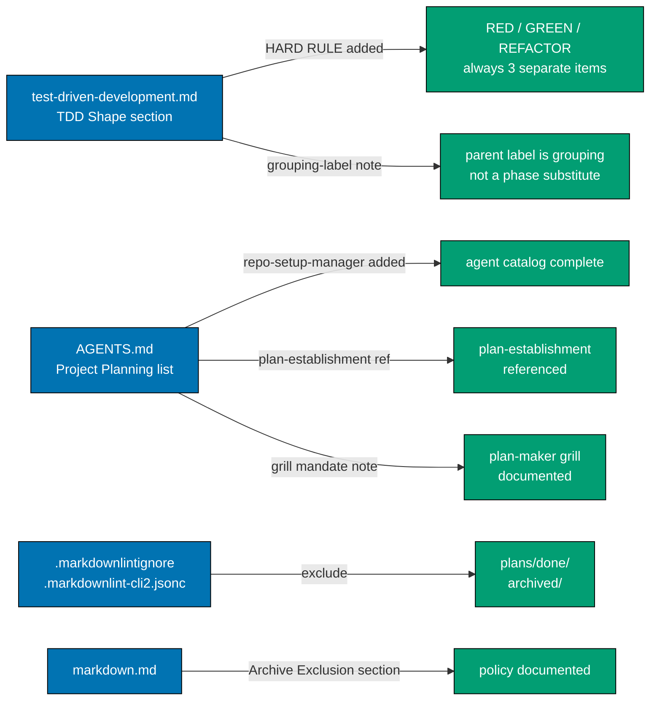

# Technical Documentation — Planning System Overhaul

## Architecture

All changes are text edits to existing governance Markdown files and two config files.
No code, no tests, no migrations, no new agent files.



## Files to Change

| File                                                              | Change type | Description                                                   |
| ----------------------------------------------------------------- | ----------- | ------------------------------------------------------------- |
| `repo-governance/development/workflow/test-driven-development.md` | Edit        | Add HARD RULE paragraph + grouping-label note                 |
| `AGENTS.md`                                                       | Edit        | Add repo-setup-manager, plan-establishment ref, grill mandate |
| `.markdownlintignore`                                             | Edit        | Add `plans/done/` and `archived/` entries                     |
| `.markdownlint-cli2.jsonc`                                        | Edit        | Add `"plans/done/**"` and `"archived/**"` to ignores          |
| `repo-governance/development/quality/markdown.md`                 | Edit        | Add Archive Exclusion section                                 |

## Exact Changes

### `test-driven-development.md` — HARD RULE paragraph

**Location**: In the "TDD Shape for Delivery Checklists" section, after the three-substep
template code block (the block ending with the REFACTOR substep line), insert:

```markdown
**HARD RULE: Never combine RED, GREEN, and REFACTOR into a single checkbox.** Each of the
three phases must be its own `- [ ]` item in the delivery checklist. Collapsing multiple
phases (e.g., `- [ ] Implement X with TDD`, `- [ ] Red-Green-Refactor feature Y`) is
forbidden. Each sub-bullet in a mini-TDD nested group counts as its own independent
checkbox — the parent label bullet must not be the only tracked item. `plan-checker` flags
combined items as HIGH findings.
```

### `test-driven-development.md` — grouping-label note

**Location**: In the "Applying TDD to Plans → Plan Creation (plan-maker)" subsection, after
the nested mini-TDD example block (the block showing `- [ ] TDD cycle: [feature name]`),
insert:

```markdown
Note: each nested sub-bullet (`- [ ] Red:`, `- [ ] Green:`, `- [ ] Refactor:`) is its own
independent checkbox tracked by the plan-execution workflow. The parent label
(`- [ ] TDD cycle:`) is a grouping label only — if included, it must not substitute for
the three phase items.
```

### `AGENTS.md` — Project Planning agent category

**Location**: Item 3 in the "Agent Organization" numbered list, currently:

```markdown
3. **Project Planning**: `plan-maker`, `plan-checker`, `plan-execution-checker`, `plan-fixer` (plan execution itself is orchestrated directly by the calling context via the [plan-execution workflow](./repo-governance/workflows/plan/plan-execution.md); no dedicated executor subagent)
```

**Replace with**:

```markdown
3. **Project Planning**: `plan-maker` (mandates grilling before and after plan creation;
   delivery checklists must begin with Phase 0), `plan-checker`, `plan-execution-checker`,
   `plan-fixer`, `repo-setup-manager` (executes Phase 0 environment setup and baseline in
   every plan) — plan execution is orchestrated directly by the calling context via the
   [plan-execution workflow](./repo-governance/workflows/plan/plan-execution.md) and the
   [plan-establishment workflow](./repo-governance/workflows/plan/plan-establishment-execution.md);
   no dedicated executor subagent
```

### `.markdownlintignore` — archive entries

**Location**: Append to the end of the file:

```text
# Archived content — internal links may be stale; do not validate
plans/done/
archived/
```

### `.markdownlint-cli2.jsonc` — archive ignores

**Location**: In the `ignores` array, after the last existing entry (`.idea/**`), add:

```jsonc
    // Archived content — internal links may be stale; do not validate
    "plans/done/**",
    "archived/**",
```

### `markdown.md` — Archive Exclusion section

**Location**: Append a new top-level section at the end of the file:

```markdown
## Archive Exclusion

The following directories are excluded from markdown linting because they contain frozen
historical content whose internal links may legitimately rot over time:

- `plans/done/` — completed plan archives; links to in-progress worktrees and old paths
  are expected to be stale after archival
- `archived/` — any other archived directories added in the future

**Rationale**: Lint failures from frozen content are noise. They block the quality gate
on files that are not being actively maintained and cannot be fixed without distorting the
historical record. Validated separately when content is first archived.

**Config**: Both `.markdownlintignore` and `.markdownlint-cli2.jsonc` carry matching
exclusion entries. Both files must be updated because they serve different invocation
paths of the same tool (see DD-3 in this plan's tech-docs for full rationale).
```

## Design Decisions

### DD-1: AGENTS.md format — inline note vs. separate subsection

**Decision**: Keep the change inline in the numbered list item rather than adding a
subsection.

**Rationale**: The list format is intentional for scannability. A subsection would break
the catalog's visual structure. The note is short enough to fit inline.

### DD-2: No `npm run generate:bindings` needed

**Decision**: Do not run `npm run generate:bindings` for this plan.

**Rationale**: `AGENTS.md` is a governance documentation file, not an agent definition
file. `generate:bindings` syncs `.claude/agents/*.md` to `.opencode/agents/`. No agent
`.md` files are changed in this plan; therefore no sync is needed.

### DD-3: Both markdownlint config files need archive exclusion

**Decision**: Update both `.markdownlintignore` and `.markdownlint-cli2.jsonc`.

**Rationale**: The two files serve different invocation paths of the same tool. Both must
be updated for the exclusion to take effect regardless of which invocation path is used
(`npm run lint:md` reads the JSONC config; direct `markdownlint-cli2` reads the ignore
file). Adopted from ose-public DD-10.

## Dependencies

For this plan to execute correctly, the following must be true at the time of execution:

- `repo-governance/development/workflow/test-driven-development.md` must contain a section
  titled "TDD Shape for Delivery Checklists" with the three-substep template code block, and
  a subsection titled "Plan Creation (plan-maker)" with the mini-TDD nested example. Both are
  verified in Step 1.1. [Repo-grounded]
- `AGENTS.md` must contain item 3 ("Project Planning") in the "Agent Organization" numbered
  list with the exact text targeted by the replacement in `tech-docs.md §AGENTS.md`. Verified
  in Step 2.1. [Repo-grounded]
- `.markdownlint-cli2.jsonc` must have an `ignores` array containing `.idea/**` as the last
  entry before the insertion point. Verified in Step 3.2 before appending. [Repo-grounded]
- `markdownlint-cli2 ^0.21.0` is installed (confirmed in `package.json`). [Repo-grounded]

## Risks

| Risk                                                                                               | Mitigation                                                                                              |
| -------------------------------------------------------------------------------------------------- | ------------------------------------------------------------------------------------------------------- |
| Section heading in `test-driven-development.md` was renamed between audit and execution            | Step 1.1 confirms the heading exists before editing; grep in Step 1.2 confirms the insertion            |
| AGENTS.md item 3 text was changed between audit and execution, making the replacement non-matching | Step 2.1 reads the file first and locates item 3 before replacing; grep in Step 2.1 confirms the result |
| `.markdownlint-cli2.jsonc` JSONC syntax error from misplaced comma or comment                      | Step 3.4 runs `npm run lint:md` immediately, which fails fast if the JSONC is malformed                 |
| Archive exclusions hide lint errors in newly created `plans/done/` content                         | The exclusion is intentional; content is validated by lint when it is first written, before archival    |

## Rollback

All changes are text edits to Markdown and config files — no migrations, no schema changes,
no binary files. To revert, `git revert` the relevant thematic commits in reverse order:

1. Revert plan files commit: `git revert <hash-of-"docs(plans): track...">`
2. Revert archive exclusions commit: `git revert <hash-of-"docs(governance): exclude plans/done...">`
3. Revert AGENTS.md commit: `git revert <hash-of-"docs(governance): update AGENTS.md...">`
4. Revert TDD HARD RULE commit: `git revert <hash-of-"docs(governance): add TDD RED/GREEN/REFACTOR...">`

Each `git revert` creates a new commit that undoes the targeted commit. If multiple commits
need to be reverted in a single operation: `git revert --no-commit <hash1> <hash2> ... && git commit -m "revert: undo planning-system-overhaul changes"`.
