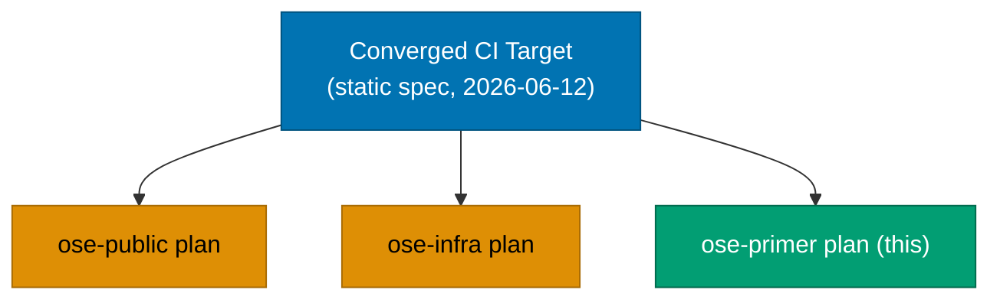
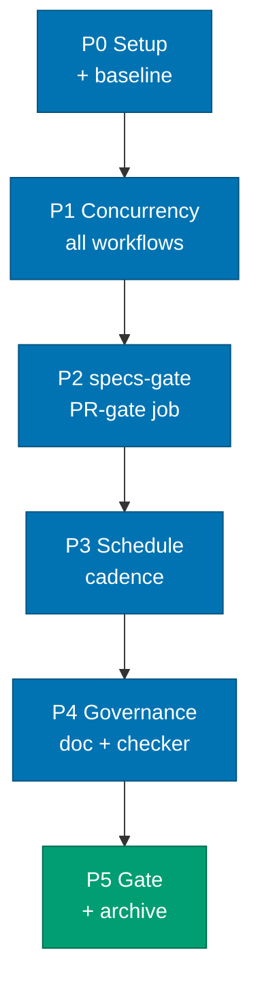

# Standardize CI Parity (ose-primer sibling)

## Status

**In progress — authored 2026-06-12. Execution not started.**

## Overview

This plan brings **ose-primer's GitHub Actions CI** to the shared **Converged CI Target** of the
three-repo `standardize-ci-parity` sibling set (`ose-public`, `ose-infra`, `ose-primer`). The
Converged CI Target is a **static specification** — the best-of-breed union across the three
pipelines as of 2026-06-12 — embedded verbatim in each sibling's
[tech-docs.md](./tech-docs.md#converged-ci-target-shared-across-the-three-repo-sibling-set). There is
**no single anchor repo**: each repo leads on some dimensions and trails on others.

ose-primer is the **most converged** of the three. It already ships current action majors
(`actions/checkout@v6` everywhere), `nx affected` across all non-TS PR-gate jobs, the
`validate:gherkin-keyword-cardinality` Nx target, the reusable-workflow pattern, the tool-named lint
jobs (`shellcheck`, `hadolint`, `actionlint` — primer is the **canonical reference** for that
naming), the `naming` job, and a uniform `ubuntu-latest` runner. Its remaining gaps are small:

1. **Concurrency** — no workflow declares a `concurrency` block (0 of 23 today). _The main work._
2. **`specs-gate` job** — `specs/` exists but `pr-quality-gate.yml` has no specs-gate job.
3. **Scheduled cadence** — the 15 `test-crud-*` workflows must be confirmed or aligned to the
   twice-daily WIB cadence.
4. **Governance** — align `ci-conventions.md` to the Converged CI Target and add a
   `## CI Parity Checklist`; evaluate `ci-checker`; re-sync bindings only if `ci-checker.md` changes.

## Dependency Position

### Parallel-Safe Execution

**This plan depends on NO sibling plan.** The Converged CI Target it converges to is a **static
specification** (recorded verbatim in [tech-docs.md](./tech-docs.md)), not an artifact produced by
another plan finishing. There is no anchor repo and no cross-plan ordering. **All three sibling plans
are safe to execute in parallel** — each repo converges its own CI independently. This plan can start,
run to its Definition of Done, and archive without waiting on `ose-public` or `ose-infra`.

ose-primer normally receives upstream content from `ose-public` via propagation PRs
(`repo-ose-primer-propagation-maker`). **This plan is an exception**: it executes **directly in
ose-primer** against the shared static target, not as a downstream copy of a sibling's work.

## Sibling Plans

| Repo                  | Plan path                                  | Role                                                              |
| --------------------- | ------------------------------------------ | ----------------------------------------------------------------- |
| `ose-public`          | `plans/in-progress/standardize-ci-parity/` | Sibling (TS+Go+F#/.NET+Rust; `ubuntu-latest`)                     |
| `ose-infra` (private) | `plans/in-progress/standardize-ci-parity/` | Sibling (TS+Go+Rust+Elixir; self-hosted runner; IaC + coralpolyp) |
| `ose-primer` (this)   | `plans/in-progress/standardize-ci-parity/` | Sibling (full polyglot template; `ubuntu-latest`)                 |

Sibling plan URLs (public repos): `ose-public`
(<https://github.com/wahidyankf/ose-public/tree/main/plans/in-progress/standardize-ci-parity>),
`ose-primer`
(<https://github.com/wahidyankf/ose-primer/tree/main/plans/in-progress/standardize-ci-parity>).
`ose-infra` is private.

## Approach

The convergence work, in order:

1. **Concurrency** — add the canonical block to ALL 23 workflows (none today). The main work.
2. **`specs-gate` job** — add it to `pr-quality-gate.yml` and wire into the `quality-gate`
   aggregator, mirroring how ose-public wires its specs-gate.
3. **Scheduled cadence** — confirm or align the 15 `test-crud-*` schedules to the twice-daily WIB
   cadence (`0 23 * * *` + `0 11 * * *`).
4. **Governance** — align `ci-conventions.md` to the Converged CI Target, add a `## CI Parity
Checklist`, evaluate `ci-checker`, and re-sync bindings if `ci-checker.md` changes.

## Already at Target (confirm only — no action)

Primer already meets these Converged CI Target dimensions; the plan confirms and records them:

- `actions/checkout@v6` everywhere (33 references) — done.
- `nx affected` on all non-TS PR-gate jobs (`nx run-many` count is 0) — done.
- `validate:gherkin-keyword-cardinality` Nx target present in `apps/rhino-cli/project.json` — done.
- Reusable-workflow pattern adopted (7 `_reusable-*.yml`) — done.
- Tool-named lint jobs (`shellcheck`, `hadolint`, `actionlint`) — done; **primer is the canonical
  reference** for this naming.
- `naming` job present — done.
- `ubuntu-latest` runner everywhere — done (same as ose-public; no deviation).

## Accepted Deviations

Recorded in full in [tech-docs.md §Deviation Matrix](./tech-docs.md#deviation-matrix). Headline items:

- **Full polyglot language matrix** — primer is the polyglot template, so its detection matrix spans
  TS, Go, JVM, .NET, Python, Rust, Elixir, Clojure, and Dart (the richest of the three). Recorded,
  not converged.
- **Runner target** — `ubuntu-latest`, identical to ose-public (no deviation between primer and
  public; the deviation is ose-infra's self-hosted runner).

## Git Workflow

ose-primer is **Trunk Based Development** (default branch `main`). This plan executes in a
**worktree at `worktrees/standardize-ci-parity/`** (primer's gitignored worktree path per
[Worktree Path Convention](../../../repo-governance/conventions/structure/worktree-path.md)),
mirroring ose-public's approach. Work merges to `main` via **fast-forward / direct push — no PR**
(Trunk Based Development; primer is a public template but the maintainer pushes parity-plan work
directly). See [delivery.md §Worktree](./delivery.md#worktree).

## Documents

- [brd.md](./brd.md) — business rationale (WHY)
- [prd.md](./prd.md) — product requirements + Gherkin acceptance criteria (WHAT)
- [tech-docs.md](./tech-docs.md) — Converged CI Target + Deviation Matrix (verbatim), current-state,
  design decisions (HOW)
- [delivery.md](./delivery.md) — phased execution checklist (DO)
  </content>
  </invoke>
