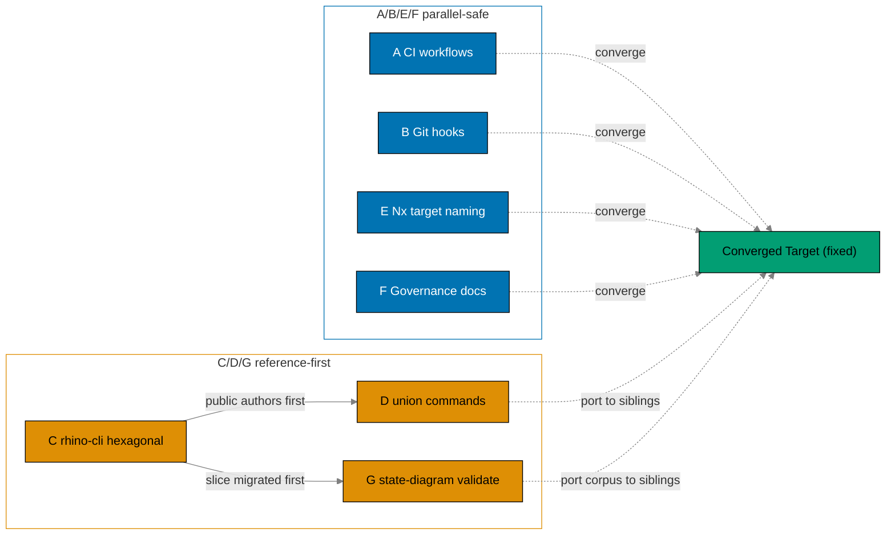
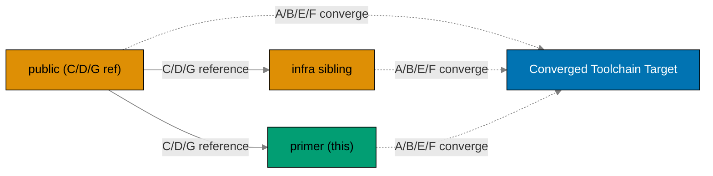

# Standardize Repo Toolchain Parity (ose-primer)

> **Status**: In progress — authored 2026-06-11 as `standardize-ci-parity`; rescoped and renamed
> `standardize-repo-toolchain-parity` 2026-06-12. Execution not started.

## Context

`ose-primer` is the public **polyglot demo template** in the Open Sharia Enterprise family. It and
its two sibling repos — the upstream `ose-public` and the private `ose-infra` — share a **repository
toolchain** (GitHub Actions CI, git hooks, the `rhino-cli` management CLI, and the governing docs)
that has **drifted apart**. The three toolchains differ in CI concurrency, validator-job coverage,
hook lifecycles, the rhino-cli architecture, the rhino-cli command surface, and Nx target naming.
The drift is not a deliberate design — it is the accumulated residue of three repos evolving
independently. As the polyglot template, ose-primer is **already the most converged sibling** on
several CI dimensions, so its remaining gaps are narrower than the upstream's.

This plan is **one of three sibling plans** (same slug, `standardize-repo-toolchain-parity`, in each
of `ose-public`, `ose-infra`, `ose-primer`) that bring the **entire toolchain** to a single shared
**Converged Toolchain Target**. The target is a **fixed, static specification** — best-of-breed union
across the three toolchains as of 2026-06-12. **Two** standalone plans have been **folded into this
set**: the primer-only `migrate-rhino-cli-to-hexagonal` plan (its hexagonal-architecture design is
salvaged into this plan's rhino-cli workstream) and the three-repo
`mermaid-state-diagram-validation` plan (its state-diagram parsing + golden corpus design becomes
workstream G, riding the migrated Mermaid hexagonal slice); both standalone plans are deleted from
`ose-primer` as part of the fold.

The work is organized into **seven workstreams (A–G)**:

| Workstream                           | Scope                                                                                                                                                                                                                       | Anchor model                                      |
| ------------------------------------ | --------------------------------------------------------------------------------------------------------------------------------------------------------------------------------------------------------------------------- | ------------------------------------------------- |
| A — CI workflows                     | concurrency on all workflows, `specs-gate` job, workflow file/`name:`/job-id naming, scheduler-cadence align; confirm-only on action majors, `nx affected`, tool-named lint jobs, gherkin target, full gate on push-to-main | No single anchor (parallel-safe)                  |
| B — Git hooks                        | canonical commit-msg / pre-commit / pre-push lifecycle                                                                                                                                                                      | No single anchor (parallel-safe)                  |
| C — rhino-cli architecture           | flat/placeholder layout → hexagonal (domain/application/infrastructure/commands)                                                                                                                                            | **`ose-public` is the reference** (siblings port) |
| D — rhino-cli command surface        | union superset (primer adds `Specs` + `Ddd`)                                                                                                                                                                                | **`ose-public` is the reference** for the port    |
| E — Nx target naming                 | `{domain}:{work}` rename + `spec-coverage`→`specs:coverage`                                                                                                                                                                 | No single anchor (parallel-safe)                  |
| F — Governance docs                  | converged conventions + repo-rules quality gate                                                                                                                                                                             | No single anchor (parallel-safe)                  |
| G — Mermaid state-diagram validation | `state.rs` front-end + width/label rules + shared golden corpus + repo-wide cleanup                                                                                                                                         | **`ose-public` is the reference** (depends on C)  |

There is **no single anchor repo** for A/B/E/F — each repo leads on some dimensions and trails on
others, and the genuine per-repo deviations (runner choice, language matrix, self-hosted Docker, the
infra-only IaC surface) are **recorded in a deviation matrix**
([tech-docs.md § Deviation Matrix](./tech-docs.md#deviation-matrix)) rather than silently tolerated.
For **C/D/G the convergence is reference-first**: `ose-public` migrates/authors first, then `ose-infra`
and `ose-primer` port the identical crate structure, command surface, and state-diagram golden corpus.
**G depends on C** — the Mermaid feature is migrated into its hexagonal slice (workstream C, Phase 7)
before state-diagram support is added to it (workstream G, Phase 8).

The diagram below maps the seven workstreams to their anchor model — A/B/E/F converge independently to
the fixed target (parallel-safe), while C/D/G are serialized reference-first (public authors, siblings
port; G follows C):

ose-primer is **already at target** on several A/B dimensions — `actions/checkout@v6`, reusable
workflows, `nx affected` on every per-language PR-gate job, the tool-named lint jobs
(`shellcheck`/`hadolint`/`actionlint` — primer was the reference for this scheme), the gherkin
keyword-cardinality target + CI wiring, and the `naming` job — so those are _confirm-only_. Its real
A gaps are concurrency, the `specs-gate` job, and the push-to-main full gate. The full per-repo
convergence status is in
[tech-docs.md § Convergence status per repo](./tech-docs.md#convergence-status-per-repo-baseline-2026-06-12).

### Parallel-Safe Execution

The Converged Toolchain Target is a **fixed spec, not a moving target produced by another plan**, so
workstreams **A, B, E, F are parallel-safe** across all three sibling plans — each runs in its own
repo, closing only its own gaps, with no inter-sibling-plan ordering.

**The exception is C/D/G (reference-first)**: `ose-public` authors the hexagonal migration (C), its
union-command additions (D), and the state-diagram parser + golden corpus (G) **first**; `ose-infra`
and `ose-primer` port from `ose-public`. So each sibling plan's C/D/G phases depend on `ose-public`'s
C/D/G being done; everything else (A/B/E/F) runs independently and in parallel. **G depends on C**
within every repo — the Mermaid feature is migrated into its hexagonal slice (Phase 7) before
state-diagram support is added (Phase 8). For `ose-primer`, the C/D/G phases **port from `ose-public`'s
reference** (the hexagonal crate structure, the union command surface, and the state-diagram golden
corpus); everything else (A/B/E/F) runs independently and in parallel.

For `ose-primer` there is **no intra-repo prerequisite plan and no downstream-consumer plan** — it is
the polyglot template, not a deployment target. The C/D/G dependency on `ose-public`'s reference is the
only cross-repo ordering relationship.

### What this plan changes in ose-primer

1. **CI (A)** — add the **canonical concurrency block to every workflow** (primer's main A gap —
   currently zero workflows declare one); add a **`specs-gate` CI job** (primer has the `naming` job but
   no `specs-gate`); add the **full quality gate on `push` to `main`** (today `pull_request`-only);
   bring workflow file/`name:`/job-id naming onto the canonical BLOCK 1-A scheme (the `Quality gate`
   required-check name is kept; any required-check rename is paired with a `[HUMAN]` branch-protection
   update); keep the per-language `test-crud-*` app schedulers **weekly** (a recorded portfolio cadence;
   ose-primer runs no governance sweep). **Confirm-only** in primer: `actions/checkout@v6`, reusable
   workflows, `nx affected` on every per-language job, the tool-named lint jobs, and the gherkin
   keyword-cardinality target + CI wiring are already at target. ose-primer **builds no container
   images** — it is a demo/showcase template and carries **no image-publishing workflow** (a recorded
   deviation).
2. **Hooks (B)** — converge `commit-msg`/`pre-commit`/`pre-push` to the canonical BLOCK 1-B lifecycle
   and the renamed targets.
3. **rhino-cli architecture (C — PORT from `ose-public`)** — migrate primer's placeholder hexagonal
   layout (still carrying `src/internal/`) to the full hexagonal
   `domain`/`application`/`infrastructure`/`commands` layout, behavior-frozen by a golden-master CLI
   suite. `ose-public` authors the reference in full; ose-primer ports the identical crate structure.
4. **rhino-cli commands (D — PORT from `ose-public`)** — add the missing `Specs` and `Ddd`
   subcommands so the CLI surface is the union superset (ose-primer already carries `Java` +
   `Contracts`; `SpecCoverage` folds into the new `Specs` group).
5. **Target naming (E)** — rename every governance/validation/lint/check target to `{domain}:{work}`
   and `spec-coverage`→`specs:coverage` repo-wide, updating every caller (hooks, workflows,
   `package.json`).
6. **Governance (F)** — update all related docs, run `repo-rules-maker`, then run the
   `repo-rules-quality-gate` workflow until clean (a hard gate before done).
7. **Mermaid state-diagram validation (G — REFERENCE)** — add the `state.rs` front-end to the
   migrated Mermaid hexagonal slice so `stateDiagram-v2`/`stateDiagram` (v1) obey the width (≤4
   nodes/rank) and label (≤30 chars, state AND transition labels) rules; land the shared golden
   corpus; aggressively clean up every violating state diagram repo-wide (incl. `plans/done/`).
   `ose-public` authors the corpus; ose-primer mirrors it byte-identical. Depends on the Phase 7
   Mermaid slice.

## Dependency Position

For workstreams **A/B/E/F** this plan has **no inter-sibling-plan ordering**. For **C/D/G** this plan
**depends on `ose-public`'s reference** — `ose-public` migrates/authors first, then ose-primer ports
the identical crate structure, union command surface, and state-diagram golden corpus. ose-primer has
**no intra-repo prerequisite plan and no downstream-consumer plan**. Two formerly-standalone plans are
now **folded in** and deleted from `ose-primer`: `migrate-rhino-cli-to-hexagonal` (its hexagonal design
is salvaged into workstream C) and `mermaid-state-diagram-validation` (its state-diagram parser +
golden corpus become workstream G, riding the migrated Mermaid slice).

### Reference dependency — `ose-public` C/D/G must land first

For workstreams **C/D/G** ose-primer ports from `ose-public`'s reference implementation (the hexagonal
crate structure, the union command surface, and the state-diagram golden corpus). `ose-public`'s C/D/G
phases must be complete before ose-primer's C/D/G phases run. Workstreams **A/B/E/F** carry no such
dependency — they converge independently to the fixed target and are parallel-safe with both siblings.

A/B/E/F converge **independently** to the fixed target (dashed arrows); C/D/G flow **from `ose-public`
to ose-primer** (solid reference arrow), reflecting the reference-first model.

## Scope

### In Scope (ose-primer delivery)

- **A — CI**: canonical concurrency on every workflow (primer's main A gap); add the `specs-gate` CI
  job; add the full quality gate on `push` to `main`; workflow file/`name:`/job-id naming onto the
  BLOCK 1-A scheme; keep the `test-crud-*` app schedulers weekly. Confirm-only: `nx affected`,
  tool-named lint jobs, gherkin target + CI wiring.
- **B — Hooks**: converge `commit-msg`/`pre-commit`/`pre-push` to BLOCK 1-B canonical.
- **C — rhino-cli architecture (PORT)**: full hexagonal migration from primer's placeholder layout,
  golden-master-frozen, mirroring `ose-public`'s reference crate structure.
- **D — rhino-cli commands (PORT)**: add `Specs` + `Ddd` (primer already has `Java` + `Contracts`);
  fold `SpecCoverage` into `Specs`.
- **E — Target naming**: `{domain}:{work}` rename (incl. `env:validate`→`env:validation`) +
  `spec-coverage`→`specs:coverage` repo-wide + all callers.
- **F — Governance**: **create** `cross-language-lint-strictness.md` (missing in primer); update all
  other BLOCK 6 docs; `repo-rules-maker`; `repo-rules-quality-gate` until clean.
- **G — Mermaid state-diagram validation (PORT)**: `state.rs` front-end on the migrated Mermaid
  slice; width + label rules for state diagrams; mirror `ose-public`'s golden corpus byte-identical;
  aggressive repo-wide cleanup (incl. `plans/done/`); `diagrams.md` +
  `markdown.md`/`repository-validation.md` doc updates.

### Out of Scope

- **Converging the runner target** — ose-primer stays `ubuntu-latest`. Recorded deviation.
- **Adding an image-publishing workflow** — ose-primer is a demo template and ships no deployable
  images; the absence of a publish workflow is a recorded deviation, not a gap.
- **The siblings' own changes** — each sibling plan closes its own gaps in its own repo (ose-public's
  Go-strip + `nx affected` convergence + lint-job rename + gherkin target add; ose-infra's `@v4`→current
  bumps, reusable-workflow extraction, `infra-lint` split). ose-primer **ports** `ose-public`'s C/D/G
  reference (crate structure, command surface, state-diagram golden corpus) in its own repo.
- **New toolchain capabilities** beyond parity (new test levels, deploy targets, Nx Cloud changes).

### Affected Areas (ose-primer)

- `.github/workflows/pr-quality-gate.yml`, `validate-markdown.yml`, `validate-env.yml`,
  `test-crud-*.yml`
- `.husky/commit-msg`, `.husky/pre-commit`, `.husky/pre-push`
- `apps/rhino-cli/src/{domain,application,infrastructure,commands}/` and `apps/rhino-cli/project.json`
- `apps/rhino-cli/src/domain/mermaid/state.rs` (new) + `apps/rhino-cli/tests/` (state golden corpus)
- every app/lib `project.json` (`spec-coverage`→`specs:coverage`); `package.json` callers
- new `repo-governance/development/quality/cross-language-lint-strictness.md` (created in Phase 11)
- all governance docs in [tech-docs.md § File Impact](./tech-docs.md#file-impact) (incl.
  `diagrams.md`, `markdown.md`/`repository-validation.md` for the state-diagram rule)
- repo-wide `*.md` violating state diagrams (incl. `plans/done/`, gate-excluded paths) — D-CLEAN
- `.claude/agents/ci-checker.md`, `repo-rules-*` (if warranted)

## Sibling Plans

This plan is one of **three** sibling plans applying the same toolchain standardization across the
Open Sharia Enterprise repository family. A/B/E/F converge **independently** to the same fixed
**Converged Toolchain Target**
([tech-docs.md § Converged Toolchain Target](./tech-docs.md#converged-toolchain-target-shared-across-the-three-repo-sibling-set));
C/D/G are **reference-first** (ose-public leads). Per-repo deviations are recorded in
[tech-docs.md § Deviation Matrix](./tech-docs.md#deviation-matrix). Same slug in each repo:

| Repo                | Plan path                                                       | Role in this set                                                                                    |
| ------------------- | --------------------------------------------------------------- | --------------------------------------------------------------------------------------------------- |
| `ose-public`        | `plans/in-progress/standardize-repo-toolchain-parity/README.md` | A/B/E/F sibling + **C/D/G reference** (TS + Rust + F#/.NET, **no Go**; `ubuntu-latest`)             |
| `ose-infra`         | `plans/in-progress/standardize-repo-toolchain-parity/README.md` | Sibling; **ports C/D/G from public** (TS + Go + Rust; self-hosted `ose-infra-runner`; IaC)          |
| `ose-primer` (this) | `plans/in-progress/standardize-repo-toolchain-parity/README.md` | Sibling; **ports C/D/G from public** (full polyglot template; `ubuntu-latest`; reference lint jobs) |

Two formerly-standalone plans are **folded into this set** and deleted from `ose-primer`: the primer-only
`migrate-rhino-cli-to-hexagonal` plan (its hexagonal design is salvaged into workstream C —
[tech-docs.md § Hexagonal Architecture Design](./tech-docs.md#hexagonal-architecture-design-rhino-cli--reference-migration))
and the three-repo `mermaid-state-diagram-validation` plan (its state-diagram parser + golden corpus
design becomes workstream G —
[tech-docs.md § Mermaid State-Diagram Validation Design](./tech-docs.md#mermaid-state-diagram-validation-design-workstream-g)).

## Plan Navigation

| Document                       | Contents                                                                                               |
| ------------------------------ | ------------------------------------------------------------------------------------------------------ |
| [README.md](./README.md)       | Context, seven workstreams, parallel-safe + reference-first execution, dependency position, navigation |
| [brd.md](./brd.md)             | Business goal, rationale, affected roles, per-workstream success metrics, risks                        |
| [prd.md](./prd.md)             | Personas, user stories, Gherkin acceptance criteria per workstream, product scope                      |
| [tech-docs.md](./tech-docs.md) | Converged target, deviation matrix, target-rename map, hexagonal design, design decisions, file impact |
| [delivery.md](./delivery.md)   | Phased delivery checklist (Phases 0–12) with `[AI]`/`[HUMAN]` markers and gates                        |

## Delivery Phases at a Glance

| Phase | Title                                                                                                      | Workstream    | Mode |
| ----- | ---------------------------------------------------------------------------------------------------------- | ------------- | ---- |
| 0     | Setup + baseline + **golden-master CLI capture** (_repo-setup-manager_)                                    | —             | AI   |
| 1     | CI — workflow file/`name:`/job-id naming (BLOCK 1-A); confirm `nx affected`                                | A             | AI   |
| 2     | CI — canonical concurrency on all ~23 workflows (primer's main A gap)                                      | A             | AI   |
| 3     | CI — confirm tool-named lint jobs `shellcheck`/`hadolint`/`actionlint` (already at target)                 | A             | AI   |
| 4     | CI — add `specs-gate` job; confirm gherkin keyword-cardinality target + CI wiring                          | A             | AI   |
| 5     | CI — add full quality gate on push-to-main; `test-crud-*` schedulers stay weekly                           | A             | AI   |
| 6     | Git hooks — converge to BLOCK 1-B canonical                                                                | B             | AI   |
| 7     | **rhino-cli hexagonal migration (PORT)** — sub-phased, golden-frozen; Mermaid slice migrated here          | C (+ G slice) | AI   |
| 8     | **Mermaid state-diagram validation (PORT)** — `state.rs` + mirrored corpus + D-CLEAN cleanup               | G             | AI   |
| 9     | **rhino-cli command surface** — 9a rationalize · 9b verb-first rename (BLOCK 11) · 9c add `Specs`+`Ddd`    | D             | AI   |
| 10    | Target rename `{domain}:{work}` (incl. `env:validate`→`env:validation`) + `spec-coverage`→`specs:coverage` | E             | AI   |
| 11    | Governance docs (**create** cross-lint doc) → `repo-rules-maker` → repo-rules quality gate (hard gate)     | F             | AI   |
| 12    | Final quality gate + push + CI verify + archival                                                           | —             | AI   |

**Phase 0 ownership.** Across **all three sibling plans** (`ose-public`, `ose-infra`, `ose-primer`),
Phase 0 (Environment Setup, Baseline, and Golden-Master Capture) is owned by the
**`repo-setup-manager`** agent — it installs dependencies, runs `npm run doctor -- --fix`, records the
baseline, resolves preexisting failures, and captures the golden-master CLI corpus before any plan work
begins. (ose-primer has no upstream prerequisite plan to verify.)

Each phase ends with a `### Phase N Gate` (must-pass checks before the next phase) and a **Pause
Safety** note describing the stable resumable state. The diagram below shows the Phase 0–12 flow with
the gate between each phase and the hard governance gate at Phase 11:

## Git Workflow

All work on `main` (Trunk Based Development) inside the declared worktree (see
[delivery.md § Worktree](./delivery.md#worktree)) — **worktree-to-main**, direct push to
`origin main`, **no PR**. Commits land per phase checkpoint, committed thematically (Conventional
Commits) and pushed at each phase gate. See
[Trunk Based Development Convention](../../../repo-governance/development/workflow/trunk-based-development.md).
