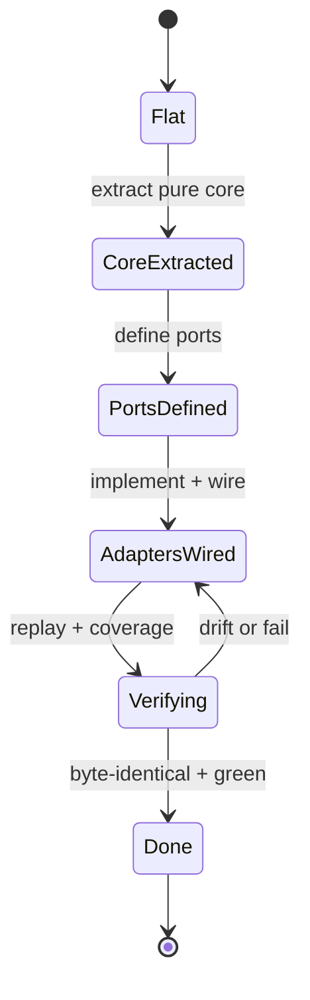

# Delivery — Standardize Repo Toolchain Parity (ose-primer)

> **Legend** — `[AI]`: an agent performs the step (the default; unmarked steps are `[AI]`).
> `[HUMAN]`: only a human can do it (physical action, out-of-band approval, real-secret or
> privileged-credential handling). `[AI+HUMAN]`: agent prepares, human approves or finishes.
>
> **Phase Gate** — every phase ends with a `### Phase N Gate` (must-pass verification) plus a
> `> **Pause Safety**:` note (the safe-to-stop state and the single command to resume). A phase
> is not complete until its gate is green; do not start phase N+1 while any gate check fails.

This checklist delivers **only ose-primer's** convergence. Workstreams **A (CI), B (hooks),
E (target rename), F (governance docs)** are **parallel-safe** with the sibling plans (`ose-public`,
`ose-infra`): the [Converged Toolchain Target](./tech-docs.md#converged-toolchain-target-shared-across-the-three-repo-sibling-set)
is a fixed static spec, so no sibling plan must finish first. Workstreams **C (rhino-cli hexagonal
arch, Phase 7), D (union commands, Phase 9), and G (Mermaid state-diagram validation, Phase 8) PORT
from `ose-public`'s REFERENCE**: `ose-public` authors them first; ose-primer ports the identical crate
structure, command surface, and golden corpus — so ose-primer's C/D/G phases depend on `ose-public`'s
reference landing first. **G depends on C** — the Mermaid feature is migrated into its hexagonal slice
in Phase 7, then state-diagram support is added to that slice in Phase 8. Each step is `[AI]` unless
genuinely human-only.

> **Sync-convention note**: ose-primer is the downstream template normally synced via PR (the ose-primer
> Sync Convention). Authoring/committing this plan **directly to `main` is a recorded, invoker-approved
> deviation** from the PR-only loop. See
> [tech-docs.md § Deviation Matrix](./tech-docs.md#deviation-matrix).

## Worktree

Worktree path: `worktrees/standardize-repo-toolchain-parity/`

Optional manual pre-provisioning (run from repo root):

```bash
claude --worktree standardize-repo-toolchain-parity
```

The plan-execution Step 0 gate enters this worktree by default: it auto-provisions from the latest
`origin/main` when missing, syncs with `origin/main` before implementing, and prompts before
deleting the worktree after the plan is archived and pushed.

See [Worktree Path Convention](../../../repo-governance/conventions/structure/worktree-path.md) and
[Plans Organization Convention § Worktree Specification](../../../repo-governance/conventions/structure/plans.md#worktree-specification).

## Phase 0: Environment Setup, Baseline, and Golden-Master Capture

> _Executor: repo-setup-manager_

This phase converges the toolchain, records the baseline, and **captures the golden-master CLI corpus**
that behavior-freezes the rhino-cli migration (Phases 7–8). ose-primer has **no upstream prerequisite
plan** to verify.

- [ ] [AI] Install dependencies in the root worktree: `npm install`
      — acceptance: exits 0, `node_modules/` synchronized.
- [ ] [AI] Converge the full polyglot toolchain: `npm run doctor -- --fix`
      — acceptance: exits 0 with no unresolved drift.
- [ ] [AI] Record the affected baseline: `npx nx affected -t typecheck lint test:quick spec-coverage`
      — acceptance: pass/fail count recorded; every preexisting failure documented.
      (Note: target is still `spec-coverage` until Phase 10 renames it to `specs:coverage`.)
- [ ] [AI] Resolve all preexisting failures before proceeding (root-cause orientation)
      — acceptance: no preexisting failures remain unresolved.
- [ ] [AI] **Golden-master capture**: enumerate every `rhino-cli` subcommand
      (`cargo run --release --manifest-path apps/rhino-cli/Cargo.toml -- --help` then each
      subcommand's `--help`) and record, against a fixed input fixture set, the stdout/stderr/exit
      code of each invocation into a versioned corpus under
      `apps/rhino-cli/tests/golden-master/` (or the repo's existing test-fixtures location)
      — acceptance: a re-run of the capture produces a byte-identical corpus (deterministic);
      the corpus covers every subcommand listed by `--help`.
- [ ] [AI] Add a golden-master harness test that replays the corpus and diffs byte-for-byte
      — acceptance: `npx nx run rhino-cli:test:unit` (or the golden-master test target) is GREEN on
      the unmodified tree.

### Phase 0 Gate

> All checks below must pass before starting Phase 1.

- [ ] [AI] `npm install` exited 0 and `npm run doctor -- --fix` reports no unresolved drift.
- [ ] [AI] Baseline recorded and every preexisting failure resolved (zero unresolved).
- [ ] [AI] Golden-master corpus captured, deterministic on re-capture, and the replay harness is
      GREEN.

> **Pause Safety**: only the local toolchain was verified, the baseline recorded, and the
> golden-master corpus captured — no toolchain changes exist yet. Safe to stop indefinitely. To
> resume: re-run the baseline command and the golden-master replay harness; confirm all still clean.

## Phase 1: CI — Workflow File/`name:`/Job-ID Naming (BLOCK 1-A) + Confirm `nx affected`

Two concerns land in this phase: (1) **confirm** ose-primer's per-language jobs already run
`nx affected` (they do — no conversion needed); and (2) bring workflow **file names**, `name:` fields,
and **job ids** onto the canonical [BLOCK 1-A naming scheme](./tech-docs.md#a--ci-workflows) (see also
[§ D14](./tech-docs.md#d14--canonical-workflow--actions-name-scheme)).

**No Go-strip and no `run-many`→`affected` conversion** in ose-primer — it is the polyglot template,
**keeps Go**, and its PR gate **already runs `nx affected`** for every per-language job (see
[tech-docs.md § D1](./tech-docs.md#d1--nx-affected-for-all-per-language-pr-gate-jobs-confirm-only)).
ose-primer's real A gaps land in Phase 2 (concurrency) and Phase 4 (`specs-gate`).

This phase applies the **affected-first PR-gate principle**: the PR gate runs `nx affected` for
**everything that is affected-computable** (per-language typecheck/lint/test/coverage and project-scoped
validators); a check runs whole-repository **only** where correctness requires repo-wide scope, and each
such exception is justified in the CI/toolchain Parity Checklist (Phase 11). See
[tech-docs.md § D13](./tech-docs.md#d13--affected-first-pr-gate-whole-repo-only-by-exception) for the
scope table. Any safely-affected check still run whole-repo is moved onto `nx affected` here.

_Suggested executor: `ci-fixer`_

- [ ] [AI] **Confirm `nx affected` (no conversion)**: assert every per-language job already uses
      `nx affected` and none uses `nx run-many`:
      `rtk proxy grep -nE "nx (affected|run-many)" .github/workflows/pr-quality-gate.yml`
      — acceptance: every per-language job line shows `nx affected -t typecheck lint test:quick spec-coverage --projects='tag:lang:*'`;
      no per-language job uses `run-many`. (Go's `tag:lang:golang` job is **retained**.)
- [ ] [AI] **REFACTOR**: confirm each affected job retains its inline
      `NX_BASE`/`NX_HEAD` env block (`rtk proxy grep -n "NX_BASE\|NX_HEAD" .github/workflows/pr-quality-gate.yml`)
      — acceptance: every per-language affected job retains its SHA env block (if absent, the affected
      base is otherwise resolved — record the mechanism).
- [ ] [AI] **GREEN — affected-first sweep**: audit `pr-quality-gate.yml` (and the per-file lint jobs)
      for any check run whole-repo that is **safely affected/changed-file computable** — the per-file
      linters/validators (`shellcheck`/`hadolint`/`actionlint`, `mermaid`, `heading-hierarchy`) should
      be scoped to changed/affected files where computable; move any such check onto `nx affected` (or
      changed-file scoping). Leave the documented whole-repo exceptions (`links`, `specs:*` structural,
      `naming:*`, governance/parity, `gherkin`, `env`) whole-repo, per
      [tech-docs.md § D13](./tech-docs.md#d13--affected-first-pr-gate-whole-repo-only-by-exception)
      — acceptance: each remaining whole-repo check matches a justified row in the D13 scope table; no
      safely-affected check is left running whole-repo.
- [ ] [AI] **GREEN — workflow file / `name:` / job-id naming (BLOCK 1-A scheme)**: audit every
      `.github/workflows/*.yml` against the canonical scheme — **file** = kebab-case
      `<verb>-<noun>[-<qualifier>].yml`, **`name:`** = Title Case matching the file, **job ids** =
      kebab-case (`rtk grep -nE '^name:|^  [a-zA-Z0-9_-]+:' .github/workflows/*.yml`); `git mv` any
      non-conforming file name and update its `name:` field + any kebab-case-violating job id. The
      PR-gate aggregate job **keeps the branch-protection-required name `Quality gate`** (do NOT rename
      it — see the `[HUMAN]` step below)
      — acceptance: every workflow file is kebab-case `<verb>-<noun>`, every `name:` is Title Case
      matching the file, every job id is kebab-case, and `Quality gate` is unchanged.
  - _Suggested executor: `ci-fixer`_
- [ ] [AI] **GREEN — update workflow cross-references after any `git mv`**: if a workflow file was
      renamed, update every reference to its old filename (reusable-workflow `uses:` paths, badge URLs
      in READMEs, branch-protection notes in docs) —
      `rtk grep -rn '<old-workflow-filename>' .github docs repo-governance AGENTS.md`
      — acceptance: no reference to a renamed workflow's old filename remains.
- [ ] [HUMAN] **Branch-protection sync (only if a required-check job was renamed)**: if — and only if
      — any branch-protection **required-check** job (e.g. the `Quality gate` aggregate) was renamed in
      the step above, a human MUST update the required-check list in GitHub repo settings (Settings →
      Branches → `main` → required status checks) to the new job name; GitHub keys required checks by
      job name, so a renamed-but-green job silently stops satisfying the gate. The standing decision is
      to **keep `Quality gate` unchanged**, so this step is normally a no-op
      — handoff: the agent reports whether any required-check job name changed; the human confirms
      "branch-protection required checks updated to <new name>" (or "no required-check rename — no
      action") — observable resume signal: the human's confirmation message; the agent then re-checks
      that a test PR's `Quality gate` check still reports.

> **Note**: `[HUMAN]` because editing GitHub branch-protection settings is an out-of-band,
> privileged-authority action an agent cannot perform. It is normally a no-op (the required-check job
> is intentionally not renamed).

- [ ] [AI] Lint: `actionlint .github/workflows/pr-quality-gate.yml` if available, else
      `npx prettier --check .github/workflows/pr-quality-gate.yml` — acceptance: exits 0.

### Phase 1 Gate

> All checks below must pass before starting Phase 2.

- [ ] [AI] Every per-language job in `pr-quality-gate.yml` uses `nx affected` (Go's `tag:lang:golang`
      job retained) and none uses `nx run-many` except the single-project governance gate — expected:
      confirmed, no conversion needed.
- [ ] [AI] Every workflow file name is kebab-case `<verb>-<noun>`, every `name:` Title Case, every job
      id kebab-case; `Quality gate` aggregate name unchanged — expected: BLOCK 1-A scheme satisfied.
- [ ] [AI] Workflow lints clean — expected: exits 0.
- [ ] [AI] Commit thematically:
      `rtk git commit -m "ci(workflows): normalize workflow file/name/job-id naming"`.

> **Pause Safety**: `pr-quality-gate.yml` is self-consistent (per-language jobs confirmed on
> `nx affected`, workflow names canonical), all workflows lint clean, and the changes are committed.
> Safe to stop. To resume: re-run the affected-confirm and naming grep checks and confirm the commit.

## Phase 2: CI — Canonical Concurrency Across All Workflows

Add the canonical concurrency block (see
[tech-docs.md § D3](./tech-docs.md#d3--canonical-concurrency-pattern)) to **every** workflow — the PR
gate, validator workflows, the reusable `_reusable-*.yml` workflows, and the ~15 scheduled
`test-crud-*` per-language workflows. **No ose-primer workflow declares a concurrency group today**
(its main A gap — ~23 workflows, zero concurrency) [Repo-grounded —
`grep -l "concurrency:" .github/workflows/*.yml` → 0].

_Suggested executor: `ci-fixer`_

The canonical block (insert at top level, after `on:` / `permissions:`):

```yaml
concurrency:
  group: ${{ github.workflow }}-${{ github.event_name == 'pull_request' && github.event.pull_request.number || github.ref }}
  cancel-in-progress: ${{ github.event_name == 'pull_request' }}
```

- [ ] [AI] **RED**: assert no concurrency block exists across the targeted workflows:
      `grep -rL "concurrency:" .github/workflows/*.yml`
      — acceptance: every workflow file is listed (none has a concurrency block).
- [ ] [AI] **GREEN**: add the canonical block to `.github/workflows/pr-quality-gate.yml`
      — acceptance: `grep -A2 "concurrency:" pr-quality-gate.yml` shows the group + cancel lines.
- [ ] [AI] **GREEN**: add the block to `validate-markdown.yml` and `validate-env.yml`
      — acceptance: block present in both.
- [ ] [AI] **GREEN**: add the block to each `_reusable-*.yml` workflow and each scheduled
      `test-crud-*.yml` workflow (the ~15 per-language `test-crud-be-*`/`test-crud-fe-*`/`test-crud-fs-*`
      files)
      — acceptance: each declares the block; for these `schedule`+`push` workflows the group is keyed
      by `github.ref` and cancel-in-progress stays effectively off (PR-only).
- [ ] [AI] **REFACTOR**: confirm consistent placement (after `permissions:`, before `jobs:`)
      — acceptance: visual/grep consistency across all edited files.
- [ ] [AI] Lint all edited workflows — acceptance: exits 0.

### Phase 2 Gate

> All checks below must pass before starting Phase 3.

- [ ] [AI] `grep -l "concurrency:" .github/workflows/*.yml | wc -l` — expected: ~23 (every workflow).
- [ ] [AI] `grep -A2 "concurrency:" .github/workflows/pr-quality-gate.yml` shows
      `cancel-in-progress: ${{ github.event_name == 'pull_request' }}` — expected: exact canonical line.
- [ ] [AI] Workflows lint clean — expected: exits 0.
- [ ] [AI] Commit thematically: `rtk git commit -m "ci(workflows): add canonical concurrency groups"`.

> **Pause Safety**: every targeted workflow declares the canonical concurrency block, lints clean,
> and the change is committed. Safe to stop. To resume: re-run the count and confirm the commit.

## Phase 3: CI — Confirm Tool-Named Lint-Gate Jobs (already at target)

ose-primer's lint-gate jobs are **already tool-named** — `shellcheck`, `hadolint`, `actionlint`
(ose-primer was the **reference** for this scheme; see
[tech-docs.md § D6](./tech-docs.md#d6--lint-gate-job-tool-named-scheme-confirm-only)). This phase is
**confirm-only** — no rename. (The `cross-language-lint-strictness.md` doc that documents the scheme is
**created** in Phase 11, since it is missing in ose-primer.)

_Suggested executor: `ci-fixer`_

- [ ] [AI] **Confirm tool-named jobs present**:
      `rtk proxy grep -nE '^  (shellcheck|hadolint|actionlint):' .github/workflows/pr-quality-gate.yml`
      — acceptance: the tool-named lint-gate job keys are present (e.g. `shellcheck:`, `hadolint:`); no
      category-named `shell`/`dockerfile`/`actions` lint-gate job keys exist.
- [ ] [AI] **Confirm `quality-gate.needs`** references the tool-named jobs:
      `rtk proxy grep -n "needs:" .github/workflows/pr-quality-gate.yml`
      — acceptance: the aggregate `needs:` list references `shellcheck`/`hadolint`/`actionlint`, not
      category names.
- [ ] [AI] Lint the workflow — acceptance: exits 0.

### Phase 3 Gate

> All checks below must pass before starting Phase 4.

- [ ] [AI] `rtk proxy grep -nE '^  (shellcheck|hadolint|actionlint):' .github/workflows/pr-quality-gate.yml`
      — expected: the tool-named job keys are present (confirm-only, no rename needed).
- [ ] [AI] `quality-gate` `needs:` references the tool-named jobs — expected: confirmed.
- [ ] [AI] Workflow lints clean — expected: exits 0.

> **Pause Safety**: the lint-gate jobs are confirmed tool-named (no change needed in ose-primer); the
> workflow lints clean. Safe to stop. To resume: re-run the confirm grep checks. (No commit if nothing
> changed; if a stray category name was found and fixed, commit
> `rtk git commit -m "ci(pr-gate): normalize lint job names to tool-named scheme"`.)

## Phase 4: CI — Add `specs-gate` Job + Confirm Gherkin Validator

ose-primer's main Phase-4 work is **adding a `specs-gate` CI job** to `pr-quality-gate.yml` — it
carries the `naming` validator job but **no `specs-gate`** (see
[tech-docs.md § D4](./tech-docs.md#d4--specs-gate-ci-job--gherkin-target-confirmrename)). The gherkin
keyword-cardinality validator **already exists and is wired into CI** in ose-primer (source name
`validate:gherkin-keyword-cardinality`), so it is **confirm-only** here and is **renamed** to the
canonical `gherkin:keyword-cardinality-validation` in Phase 10.

_Suggested executor: `ci-fixer`_

- [ ] [AI] **RED — `specs-gate` job absent**:
      `rtk proxy grep -nE '^  specs-gate:' .github/workflows/pr-quality-gate.yml`
      — acceptance: no match (the `naming` job exists but `specs-gate` does not).
- [ ] [AI] Pre-implementation research — confirm the `specs:*` structural target/subcommand surface:
      `cargo run --release --quiet --manifest-path apps/rhino-cli/Cargo.toml -- spec-coverage --help`
      and read how the upstream `ose-public` `specs-gate` job invokes
      `specs:adoption-validation`/`tree-validation`/`counts-validation`/`links-validation`
      — acceptance: the exact target/command surface the job runs is recorded (use the current
      source-side target names; the canonical rename lands in Phase 10).
- [ ] [AI] **GREEN — add the `specs-gate` job**: add a `specs-gate:` job to
      `.github/workflows/pr-quality-gate.yml` running the BDD spec-tree structural checks as a
      single-project governance gate (`nx run-many ... --projects=rhino-cli` over the `specs:*`
      structural targets, mirroring the upstream `ose-public` job), and add `specs-gate` to
      `quality-gate.needs`
      — acceptance: `rtk proxy grep -nE '^  specs-gate:' .github/workflows/pr-quality-gate.yml` matches;
      `quality-gate.needs` lists `specs-gate`.
- [ ] [AI] **GREEN — passes on current tree**: run the specs structural checks locally
      — acceptance: they exit 0. If any surfaces a preexisting violation, fix it at the source
      (root-cause orientation); do NOT disable the check.
- [ ] [AI] **Confirm gherkin validator already wired**:
      `rtk proxy grep -niE 'gherkin' .github/workflows/validate-markdown.yml apps/rhino-cli/project.json`
      — acceptance: the `validate:gherkin-keyword-cardinality` target exists and the markdown validator
      workflow already runs it (confirm-only; canonical rename happens in Phase 10).
- [ ] [AI] Lint the workflow — acceptance: exits 0.

### Phase 4 Gate

> All checks below must pass before starting Phase 5.

- [ ] [AI] `rtk proxy grep -nE '^  specs-gate:' .github/workflows/pr-quality-gate.yml` — expected: the
      job is present and listed in `quality-gate.needs`.
- [ ] [AI] The specs structural checks the job runs exit 0 on the current tree.
- [ ] [AI] The gherkin keyword-cardinality validator is confirmed present + CI-wired (rename deferred to
      Phase 10) — expected: confirmed.
- [ ] [AI] Workflow lints clean — expected: exits 0.
- [ ] [AI] Commit: `rtk git commit -m "ci(pr-gate): add specs-gate job"`.

> **Pause Safety**: the `specs-gate` job is added and green, the gherkin validator is confirmed wired,
> and the change is committed. Safe to stop. To resume: re-run the `specs-gate` presence check and the
> specs structural checks, confirm the commit.

## Phase 5: CI — Full Quality Gate on Push-to-Main + Scheduler Cadence

Add the **full quality gate on `push` to `main`** (today `pr-quality-gate.yml` is `pull_request`-only
in ose-primer [Repo-grounded — `on: pull_request` only]) and keep the per-language `test-crud-*`
schedulers on their **weekly** cadence (see
[tech-docs.md § D10](./tech-docs.md#d10--full-quality-gate-on-push-to-main)).

The push-to-main gate carries the **same affected-first discipline** as the PR gate
([tech-docs.md § D13](./tech-docs.md#d13--affected-first-pr-gate-whole-repo-only-by-exception)):
affected-computable checks run via `nx affected` (base resolved from the prior successful `main` SHA per
D2), and only the justified repo-wide checks run whole-repo.

> **Image-publishing (recorded deviation).** **ose-primer carries NO image-publishing workflow** — it
> is a demo/showcase template that ships no deployable images, so the absence is a recorded
> [Deviation Matrix](./tech-docs.md#deviation-matrix) entry, not a gap this plan must close. **Do not
> add an image-publishing workflow to ose-primer.**
>
> **Scheduler cadence.** ose-primer has **no governance/scheduled validator workflows** today (its
> `validate-*.yml` carry no `schedule:` trigger); its only schedulers are the per-language
> `test-crud-*.yml` app workflows on a **weekly** cadence (`0 10 * * 5`). The weekly app cadence is a
> recorded portfolio deviation and **stays weekly**. The converged 2× WIB cadence applies only to a
> governance sweep, which ose-primer does not run — so there is **no cron change** here beyond keeping
> the weekly app schedulers. [Repo-grounded — `test-crud-*` cron `0 10 * * 5`; no `validate-*` cron]

_Suggested executor: `ci-fixer`_

- [ ] [AI] **RED — push trigger absent**:
      `rtk proxy grep -nA4 "^on:" .github/workflows/pr-quality-gate.yml`
      — acceptance: the `on:` block triggers `pull_request` only (no `push: branches: [main]`).
- [ ] [AI] Decision step — choose the mechanism (per D2/D10): extend `pr-quality-gate.yml`'s `on:`
      to add `push: branches: [main]` (with the affected base computed for push events), OR add a
      thin caller workflow that runs the same gate on push. Record the choice inline in the workflow
      comment — acceptance: the chosen mechanism is documented in the workflow.
- [ ] [AI] **GREEN**: implement the chosen mechanism so the full gate runs on push to `main`
      — acceptance: the gate's `on:` (or the caller) includes `push: branches: [main]`; for push
      events the affected base resolves correctly (e.g. prior `main` SHA or full non-affected run).
- [ ] [AI] **Confirm scheduler cadence**: confirm the `test-crud-*` app schedulers stay **weekly**
      (`0 10 * * 5`) and that ose-primer runs no governance sweep needing 2× WIB
      — acceptance: `rtk proxy grep -n "cron:" .github/workflows/*.yml` shows only the weekly
      `test-crud-*` crons (recorded portfolio deviation); no cron change is made.
- [ ] [AI] **REFACTOR**: ensure the push-gate path does not double-run on PR merge in a wasteful way
      (concurrency group from Phase 2 keys push runs by ref) — acceptance: no redundant concurrent
      push run.
- [ ] [AI] Lint all edited workflows — acceptance: exits 0.

### Phase 5 Gate

> All checks below must pass before starting Phase 6.

- [ ] [AI] `rtk proxy grep -nA4 "^on:" .github/workflows/pr-quality-gate.yml` (or the caller) shows
      `push: branches: [main]` — expected: present.
- [ ] [AI] `test-crud-*` schedulers remain weekly (`0 10 * * 5`) — expected: unchanged (recorded
      deviation); no governance sweep to converge.
- [ ] [AI] Workflows lint clean — expected: exits 0.
- [ ] [AI] Commit: `rtk git commit -m "ci(pr-gate): run full quality gate on push to main"`.

> **Pause Safety**: the full quality gate now runs on push to `main` and the weekly app scheduler
> cadence is confirmed; workflows lint clean and the change is committed. Safe to stop. To resume:
> re-run the `on:` grep and the cron check, confirm the commit.

## Phase 6: Git Hooks — Converge to BLOCK 1-B Canonical

Converge `commit-msg`/`pre-commit`/`pre-push` to the canonical BLOCK 1-B lifecycle (see
[tech-docs.md § B](./tech-docs.md#b--git-hooks-canonical-identical-behavior) and
[§ D11](./tech-docs.md#d11--git-hook-convergence)). This phase introduces the **canonical hook
shape**; the pre-push target list is written to reference the renamed `{domain}:{work}` + `specs:coverage`
targets, which become real in Phase 10. To avoid the hook ever pointing at a non-existent target,
**keep the current target names in the hook here and re-point them in Phase 10** — see the gate note.

_Suggested executor: `ci-fixer`_

- [ ] [AI] **RED**: diff the current hooks against BLOCK 1-B:
      `cat .husky/commit-msg .husky/pre-commit .husky/pre-push`
      — acceptance: record which BLOCK 1-B elements are missing/divergent (build flag, lint-staged
      wiring, conditional validators, ordering).
- [ ] [AI] **GREEN — commit-msg**: ensure `commit-msg` is exactly
      `npx --no -- commitlint --edit "$1"` — acceptance: matches BLOCK 1-B.
- [ ] [AI] **GREEN — pre-commit**: ensure the order is
      `git-identity-check.sh` → `check-no-env-staged.sh` → canonical staged-file lint
      (`shellcheck`/`hadolint`/`actionlint` on staged files, graceful skip if absent) →
      `rhino-cli git pre-commit` built with `--release`
      — acceptance: pre-commit matches BLOCK 1-B order and uses the `--release` build.
- [ ] [AI] **GREEN — pre-push**: ensure pre-push runs `nx affected -t` with the BLOCK 1-B target set
      followed by `markdown:lint` → `env:validation` → the changed-path-gated conditionals
      (`naming:*-validation`, `governance:vendor-audit-validation`, `cross-vendor:parity-validation`,
      `harness:bindings-validation`, `shell`/`dockerfile`/`actions` lint). **Keep the
      currently-existing target names** (e.g. `spec-coverage`, `validate:specs-*`, `validate:env`)
      so the hook stays runnable; Phase 10 re-points them to the canonical names
      — acceptance: pre-push matches the BLOCK 1-B lifecycle shape; every target it references
      currently exists.
- [ ] [AI] **REFACTOR**: run a no-op commit + dry-run push in the worktree to confirm the hooks
      execute end-to-end without referencing a missing target
      — acceptance: hooks run clean on a trivial change.
- [ ] [AI] Lint the hook shell scripts: `shellcheck .husky/*` if available
      — acceptance: exits 0 (warning threshold).

### Phase 6 Gate

> All checks below must pass before starting Phase 7.

- [ ] [AI] `commit-msg`/`pre-commit`/`pre-push` match the BLOCK 1-B lifecycle shape.
- [ ] [AI] Every target the hooks reference **currently exists** (no forward reference to a
      not-yet-renamed target) — expected: a dry-run push runs clean. **NOTE for Phase 10**: the
      target-name re-point in the hooks happens in Phase 10, atomically with the project.json renames.
- [ ] [AI] `shellcheck .husky/*` clean — expected: exits 0.
- [ ] [AI] Commit: `rtk git commit -m "chore(hooks): converge git hooks to canonical lifecycle"`.

> **Pause Safety**: the hooks match the canonical lifecycle and reference only existing targets;
> hooks run clean. Safe to stop. To resume: re-run a dry-run push and confirm the commit.

## Phase 7: rhino-cli Hexagonal Migration (PORT — sub-phased, golden-frozen)

> **WORKSTREAM C — PORT from `ose-public`.** `ose-public` authors the hexagonal migration in full;
> ose-primer **ports the identical crate structure from `ose-public`'s reference**, draining its
> residual `src/internal/` tree into the hexagonal layers. **`ose-public`'s C reference must land
> first** (reference-first dependency). Behavior is **frozen** — the Phase 0 golden-master corpus must
> stay byte-identical through every sub-phase (see
> [tech-docs.md § Hexagonal Architecture Design](./tech-docs.md#hexagonal-architecture-design-rhino-cli--reference-migration)
> and [§ Golden-master CLI suite](./tech-docs.md#golden-master-cli-suite-rhino-cli-migration)).

_Suggested executor: `swe-rust-dev`_

Each feature moves through the state lifecycle below; a feature is only `Done` once its golden-master
replay is byte-identical and coverage is met (any drift returns it to `Verifying`):



### Phase 7a — Shared kernel (`mermaid`, `cliout`)

> The **Mermaid feature migrates here**, as the shared-kernel slice (workstream G prerequisite). It
> moves **once**, straight into hexagonal layers — there is NO intermediate 8-file flat split (see
> [tech-docs.md § BLOCK 4 Mermaid slice](./tech-docs.md#hexagonal-architecture-design-rhino-cli--reference-migration)).
> Behavior is byte-for-byte preserved: every existing flowchart test stays green and `state.rs` is a
> stub at this stage (state behavior lands in Phase 8).

- [ ] [AI] **RED**: golden-master replay harness GREEN on the unmodified tree
      — acceptance: corpus diff empty (precondition for any move).
- [ ] [AI] **GREEN**: move the shared-kernel modules (`mermaid`, `cliout`, and any 2+-consumer helper
      currently in `src/internal/`) into `src/domain/<kernel>/` (pure) with the outbound ports they
      need defined in `src/application/` — acceptance: `cargo build` clean; modules compile in the
      new location.
- [ ] [AI] **GREEN — Mermaid slice**: migrate `apps/rhino-cli/src/internal/mermaid/` (primer's mermaid
      lives as a directory: `parser.rs`, `graph.rs`, `validator.rs`, `extractor.rs`, `reporter.rs`,
      `types.rs`, `mod.rs`) straight into
      the hexagonal layers — `domain/mermaid/` holds the kind-agnostic core (`ParsedDiagram`/`Node`/
      `Edge`/`Subgraph` types, the rank/width/depth `graph` computation, the width/label `validator`
      rules) plus the pure front-end parsers (the existing `flowchart` parser; a `state.rs` **stub**
      that returns an empty `ParsedDiagram` for now); `application/mermaid/` holds the validate use
      case + an extractor **port**; `infrastructure/mermaid/` holds the markdown-extractor adapter +
      the text/JSON `reporter` adapter; `commands/` keeps the `docs validate-mermaid` inbound adapter.
      Run `npx nx run rhino-cli:test:unit`
      — acceptance: `cargo build` clean; every existing flowchart test stays green; the `state.rs`
      stub compiles but adds no behavior.
  - _Suggested executor: `swe-rust-dev`_
- [ ] [AI] **REFACTOR**: re-run golden-master replay + `npx nx run rhino-cli:test:unit`
      — acceptance: corpus byte-identical; unit tests GREEN; coverage threshold met (update the
      coverage-ignore allowlist if a file moved).
- [ ] [AI] Commit: `rtk git commit -m "refactor(rhino-cli): extract shared kernel + migrate mermaid slice to hexagonal domain"`.

### Phase 7b — Pilot feature (`git`)

- [ ] [AI] **RED**: golden-master GREEN; identify `git`'s IO boundaries (already injects via `Deps`)
      — acceptance: precondition confirmed.
- [ ] [AI] **GREEN**: extract `git`'s pure core to `domain/git/`, define inbound + outbound ports in
      `application/git/`, implement adapters in `infrastructure/git/`, wire `commands/git_*` to the
      use case — acceptance: `cargo build` clean; the `git` command runs.
- [ ] [AI] **REFACTOR**: golden-master replay + unit/integration/coverage
      — acceptance: corpus byte-identical; tests GREEN; coverage met.
- [ ] [AI] Commit: `rtk git commit -m "refactor(rhino-cli): migrate git feature to hexagonal layout"`.

### Phase 7c — IO-heavy features (envbackup, doctor, testcoverage)

- [ ] [AI] For each of `env_*`, `doctor`, `test_coverage_*`: apply the BLOCK 4 six-step recipe
      (golden-master GREEN → extract pure core → define ports → implement adapters → wire commands →
      re-run golden-master + tests/coverage) — acceptance: after each feature the corpus is
      byte-identical and tests/coverage are GREEN.
- [ ] [AI] Commit each feature (or coherent group) thematically:
      `rtk git commit -m "refactor(rhino-cli): migrate <feature> to hexagonal layout"`.

### Phase 7d — Lighter validators (docs/specs/naming/governance groups)

- [ ] [AI] Group-migrate the remaining lighter validator features (`docs_*`, `specs_*`,
      `*_validate_naming`, `governance_*`) applying the six-step recipe per group
      — acceptance: corpus byte-identical and tests/coverage GREEN after each group.
- [ ] [AI] Commit each group thematically.

### Phase 7 Gate

> All checks below must pass before starting Phase 8.

- [ ] [AI] `ls apps/rhino-cli/src/` shows `domain/`, `application/`, `infrastructure/`, `commands/`
      — expected: the four hexagonal layers present; `src/internal/` emptied/removed (or only
      truly-internal non-domain glue remains, documented).
- [ ] [AI] `ls apps/rhino-cli/src/domain/mermaid/` shows the migrated Mermaid slice including the
      `state.rs` **stub** — expected: the kind-agnostic core + flowchart parser + `state.rs` stub
      present; the residual `src/internal/mermaid/` directory removed.
- [ ] [AI] Golden-master replay harness — expected: corpus byte-identical to the Phase 0 baseline.
- [ ] [AI] `npx nx run rhino-cli:test:unit` and `:lint` (clippy `-D warnings`) — expected: GREEN
      (every existing flowchart test stays green).
- [ ] [AI] Coverage threshold met; coverage-ignore allowlist updated for every moved file.
- [ ] [AI] All sub-phase commits present.

> **Pause Safety**: every committed sub-phase leaves the golden-master corpus byte-identical, so the
> CLI's observable behavior is unchanged at each checkpoint — safe to stop between sub-phases. The
> Mermaid feature is now a hexagonal slice with a `state.rs` stub; no state behavior yet. To resume:
> re-run the golden-master replay and `:test:unit`, confirm the last sub-phase commit.

## Phase 8: Mermaid State-Diagram Validation (PORT — `state.rs` + mirrored corpus + D-CLEAN)

> **WORKSTREAM G — PORT from `ose-public`.** `ose-public` authors the `state.rs` front-end + the shared
> golden corpus; ose-primer **mirrors the identical parser semantics + byte-identical fixtures** from
> `ose-public`'s reference (`ose-public`'s G reference must land first).
> **Depends on Phase 7's Mermaid slice** — state support is a second pure front-end (`state.rs` in
> `domain/mermaid/`) feeding the same kind-agnostic `ParsedDiagram` the flowchart parser emits, so the
> width/label core is unchanged beyond wiring state edges through the width axis (see
> [tech-docs.md § Mermaid State-Diagram Validation Design](./tech-docs.md#mermaid-state-diagram-validation-design-workstream-g)
> and the ported Gherkin scenarios in [prd.md § Workstream G](./prd.md#workstream-g--mermaid-state-diagram-validation-acceptance-criteria)).
> **Target name note**: this phase precedes the Phase 10 rename, so it uses the **current** target
> name `validate:mermaid` (renamed to `mermaid:validation` in Phase 10). No gate wiring changes —
> state diagrams stop being skipped because the kind-detector recognizes their header.

_Suggested executor: `swe-rust-dev`_

### Phase 8a — State header detection + parser

- [ ] [AI] **RED**: add a unit test in `apps/rhino-cli/src/domain/mermaid/diagram.rs` asserting the
      kind detector returns `State` for both `stateDiagram-v2` and `stateDiagram` (v1) headers. Run
      `npx nx run rhino-cli:test:unit`
      — acceptance: test FAILS (the Phase 7 stub still maps state headers to an empty parse / wrong
      kind).
  - _Suggested executor: `swe-rust-dev`_
- [ ] [AI] **GREEN**: implement state-header detection in `domain/mermaid/diagram.rs` for
      `stateDiagram-v2` and `stateDiagram`. Run `npx nx run rhino-cli:test:unit`
      — acceptance: the detection test passes; flowchart detection unchanged.
  - _Suggested executor: `swe-rust-dev`_
- [ ] [AI] **RED**: add a unit test in `apps/rhino-cli/src/domain/mermaid/state.rs` parsing an
      11-state `direction LR` chain and asserting 11 `Node`s with the chain shape. Run
      `npx nx run rhino-cli:test:unit`
      — acceptance: test FAILS (the `state.rs` stub returns an empty `ParsedDiagram`).
  - _Suggested executor: `swe-rust-dev`_
- [ ] [AI] **GREEN**: implement the `state.rs` parser per the
      [tech-docs.md pinned grammar facts](./tech-docs.md#mermaid-state-diagram-validation-design-workstream-g)
      — bare ids, `id : desc`, `state "desc" as id`, `[*]`, stereotype states (`<<choice>>`/
      `<<fork>>`/`<<join>>` and `[[...]]`) as `Node`s; `A --> B : lbl` as `Edge`; composite
      `state X { }` as `Subgraph` (recursed); skip notes/comments/`--`; match `-->` before `--`;
      `direction` accepts `TB|BT|LR|RL` only (reject `TD`). Run `npx nx run rhino-cli:test:unit`
      — acceptance: the 11-node parse test passes.
  - _Suggested executor: `swe-rust-dev`_

### Phase 8b — Width + label rules over the shared core

- [ ] [AI] **RED**: add a unit test asserting the 11-state `direction LR` chain yields a
      `width_exceeded` violation with width 11 through the validate use case. Run
      `npx nx run rhino-cli:test:unit`
      — acceptance: test FAILS (state edges not yet fed to the shared `graph` width core).
  - _Suggested executor: `swe-rust-dev`_
- [ ] [AI] **GREEN**: wire the state `ParsedDiagram` through the shared `domain/mermaid/` width core
      so `LR`/`RL` map to the depth-as-horizontal axis like flowcharts. Run
      `npx nx run rhino-cli:test:unit`
      — acceptance: the `width_exceeded` width-11 test passes.
  - _Suggested executor: `swe-rust-dev`_
- [ ] [AI] **RED**: add unit tests in `domain/mermaid/validator.rs` for label rules — a `>30`-char
      state display label and a `>30`-char transition label (`A --> B : <long>`) each yield
      `label_too_long`; a short colon label yields none. Run `npx nx run rhino-cli:test:unit`
      — acceptance: tests FAIL (transition-label check absent).
  - _Suggested executor: `swe-rust-dev`_
- [ ] [AI] **GREEN**: extend `domain/mermaid/validator.rs` to check both state display labels and
      transition-edge labels against `max_label_len` using the existing `effective_label_len`
      per-segment measure [Repo-grounded: `effective_label_len` at
      `apps/rhino-cli/src/internal/mermaid/validator.rs` — ose-primer's mermaid is already a directory module]. Run
      `npx nx run rhino-cli:test:unit`
      — acceptance: all three label tests pass.
  - _Suggested executor: `swe-rust-dev`_
- [ ] [AI] **RED**: add unit tests for structure-to-width — a rank holding `[*]`, `<<choice>>`,
      `<<fork>>`, `<<join>>` plus one more yields `width_exceeded` (5 nodes); a composite
      `state Outer { Inner1 --> Inner2 }` is recorded as a `Subgraph`. Run
      `npx nx run rhino-cli:test:unit`
      — acceptance: tests FAIL.
  - _Suggested executor: `swe-rust-dev`_
- [ ] [AI] **GREEN**: implement pseudostate/stereotype node-counting and composite-as-subgraph
      recursion in `state.rs`. Run `npx nx run rhino-cli:test:unit`
      — acceptance: both tests pass.
  - _Suggested executor: `swe-rust-dev`_
- [ ] [AI] **RED**: add a unit test asserting a block with a multiline `note right of X ... end note`,
      a `%%` comment, and a `--` separator produces zero violations and zero spurious nodes. Run
      `npx nx run rhino-cli:test:unit`
      — acceptance: test FAILS.
  - _Suggested executor: `swe-rust-dev`_
- [ ] [AI] **GREEN**: implement note/comment/`--` skipping in `state.rs`. Run
      `npx nx run rhino-cli:test:unit`
      — acceptance: the free-text test passes (note text exempt from the label rule).
  - _Suggested executor: `swe-rust-dev`_
- [ ] [AI] **REFACTOR**: deduplicate any shared parsing helpers between the flowchart parser and
      `state.rs` into a small shared util in `domain/mermaid/diagram.rs`; run `cargo fmt`. Run
      `npx nx run rhino-cli:lint && npx nx run rhino-cli:test:unit`
      — acceptance: lint exits 0 (clippy `-D warnings`); all tests pass.
  - _Suggested executor: `swe-rust-dev`_

### Phase 8c — Shared golden corpus (the parity lock)

- [ ] [AI] **RED**: add the corpus test harness under `apps/rhino-cli/tests/` (confirm the exact
      subdir against the existing `tests/**/*.rs` layout — e.g.
      `apps/rhino-cli/tests/mermaid_golden_corpus.rs`) that iterates over fixture `.md` files in a
      `fixtures/state/` subdirectory and asserts actual violation JSON equals expected JSON companion
      files. Run `npx nx run rhino-cli:test:unit`
      — acceptance: test FAILS because the fixture directory is empty or absent.
  - _Suggested executor: `swe-rust-dev`_
- [ ] [AI] **GREEN — mirror `ose-public`'s corpus byte-identical**: copy `ose-public`'s shared golden
      corpus (fixture `.md` files + expected violation JSON) into `apps/rhino-cli/tests/` covering
      over-wide LR chain, compliant narrow chain, long state label, long transition label,
      `[*]`/stereotype counting, composite-as-subgraph, and note/comment/`--` exemption; the corpus
      test asserts each fixture's actual violations equal its expected JSON. Run
      `npx nx run rhino-cli:test:unit`
      — acceptance: the corpus test passes; **the fixture set + expected JSON are byte-identical to
      `ose-public`'s reference corpus** (`diff -r` against the upstream fixtures is empty).
  - _Suggested executor: `swe-rust-dev`_

### Phase 8d — Aggressive repo-wide state-diagram cleanup (D-CLEAN)

> Per D-CLEAN, fix every violating state diagram repo-wide INCLUDING `plans/done/` and otherwise
> gate-excluded paths (maximum hygiene; diagram-only edits).

- [ ] [AI] Enumerate every violating state diagram: run the validator without exclusions —
      `cargo run --release --quiet --manifest-path apps/rhino-cli/Cargo.toml -- docs validate-mermaid`
      and additionally scan `plans/done` and excluded paths explicitly (no `--exclude` flags)
      — acceptance: a complete list of `width_exceeded`/`label_too_long` state-diagram findings is
      produced.
- [ ] [AI] Fix each `width_exceeded` state diagram using the width-fix strategies in
      `repo-governance/conventions/formatting/diagrams.md §Width Violation Fix Strategy Guide`
      (direction flip, sequential chaining, splitting) — edit each offending `.md` file
      — acceptance: re-running the validator on each fixed file reports no `width_exceeded`.
- [ ] [AI] Fix each `label_too_long` state diagram by shortening state/transition labels per
      `§Strategy 4 — Label Shortening` — edit each offending `.md` file
      — acceptance: re-running the validator on each fixed file reports no `label_too_long`.
- [ ] [AI] Verify the gate-scoped scan is clean: `npx nx run rhino-cli:validate:mermaid`
      — acceptance: zero state-diagram violations in gate scope.
- [ ] [AI] Verify the full repo-wide scan (including `plans/done`) is clean:
      `cargo run --release --quiet --manifest-path apps/rhino-cli/Cargo.toml -- docs validate-mermaid`
      — acceptance: zero state-diagram violations anywhere.

### Local Quality Gates (Before Push) — Phase 8

- [ ] [AI] Run affected typecheck: `npx nx affected -t typecheck`.
- [ ] [AI] Run affected linting: `npx nx affected -t lint`.
- [ ] [AI] Run affected quick tests: `npx nx affected -t test:quick`
      — acceptance: rhino-cli library coverage stays `≥90`.
- [ ] [AI] Run affected spec coverage: `npx nx affected -t spec-coverage`
      (target still `spec-coverage` until Phase 10 renames it to `specs:coverage`).
- [ ] [AI] Run `npm run lint:md` — acceptance: exits 0, no markdownlint violations in edited files.
- [ ] [AI] Run `npx nx run rhino-cli:validate:links` — acceptance: exits 0, no broken links introduced
      by the cleanup edits.
- [ ] [AI] Fix ALL failures — including preexisting issues not caused by your changes; re-run to
      confirm zero failures before pushing.

> **Important**: Fix ALL failures found during quality gates, not just those caused by your changes
> (root-cause orientation). Commit preexisting fixes separately with appropriate conventional commit
> messages.

### Commit Guidelines — Phase 8

- [ ] [AI] Commit the state front-end thematically:
      `rtk git commit -m "feat(rhino-cli): validate mermaid state diagrams"`.
- [ ] [AI] Keep the golden corpus in its own commit:
      `rtk git commit -m "test(rhino-cli): add shared state-diagram golden corpus"`.
- [ ] [AI] Keep the D-CLEAN repo-wide cleanup in its own commit (split by domain if it spans many):
      `rtk git commit -m "docs: fix over-wide and over-long mermaid state diagrams"`.

### Phase 8 Gate

> All checks below must pass before starting Phase 9.

- [ ] [AI] `npx nx run rhino-cli:test:unit` — expected: all new state tests + every preexisting
      flowchart test pass.
- [ ] [AI] `npx nx run rhino-cli:test:quick` — expected: coverage `≥90`, exits 0.
- [ ] [AI] `npx nx run rhino-cli:lint` — expected: exits 0 (clippy `-D warnings`).
- [ ] [AI] `npx nx run rhino-cli:validate:mermaid` — expected: exits 0, zero state-diagram violations
      in gate scope.
- [ ] [AI] `cargo run --release --quiet --manifest-path apps/rhino-cli/Cargo.toml -- docs validate-mermaid`
      — expected: zero state-diagram violations repo-wide including `plans/done`.
- [ ] [AI] Golden-master replay — expected: flowchart behavior byte-identical (state support is
      additive; the corpus extends but existing flowchart entries are unchanged).
- [ ] [AI] All Phase 8 commits present.

> **Pause Safety**: the migrated Mermaid slice now parses and validates state diagrams, every state
> diagram repo-wide is compliant, and flowchart behavior is unchanged; the gate wiring is untouched
> (still `validate:mermaid` until Phase 10). Safe to stop. To resume: `npx nx run rhino-cli:test:unit`
> and `npx nx run rhino-cli:validate:mermaid`, confirm the Phase 8 commits.

## Phase 9: rhino-cli Union Commands — Rationalize Surface, Verb-First Rename, then Add `Specs` + `Ddd`

> **WORKSTREAM D — PORT from `ose-public`.** Three parts: **9a** rationalizes the existing surface
> (merge overlaps, delete unused subcommands per the catalogued dispositions, and **fold `SpecCoverage`
> into the new `Specs` group**); **9b** renames every subcommand to the **verb-first git-style** scheme
> (BLOCK 11) and updates all callers + the golden-master corpus; then **9c** ports the **`Specs` and
> `Ddd`** subcommands from `ose-public`'s reference implementation **into the hexagonal layout** (after
> Phase 7), so the CLI surface is the **rationalized + verb-first** union superset (ose-primer already
> carries `Java` + `Contracts`, which are confirm-only). See
> [tech-docs.md § D8](./tech-docs.md#d8--union-command-surface-add-specs--ddd) and
> [§ (a-ter) verb-first rename](./tech-docs.md#a-ter-rhino-cli-verb-first-subcommand-rename-beforeafter).

_Suggested executor: `swe-rust-dev`_

### Phase 9a — Command rationalization pass (keep / merge / delete, before the port)

> Resolve the overlap/deletion shortlist in
> [tech-docs.md § (a-bis)](./tech-docs.md#a-bis-command-surface-rationalization--overlap--deletion-candidates)
> and [§ D8](./tech-docs.md#d8--union-command-surface-add-specs--ddd) BEFORE porting `Specs`/`Ddd`,
> so the union lands against the rationalized surface. Reference-first: ose-public decides the
> dispositions; ose-primer mirrors the consolidated surface. Any surface change (merge that renames a
> subcommand, or a deletion) is a **deliberate golden-master update** — update the frozen corpus entry
> in the same step and note it in the commit.

- [ ] [AI] **`env init`/`backup`/`restore` — KEEP verdict (no longer delete-candidates)**: these
      manage `.env` secret files (create from `.env.example`, back up, restore) and are **KEPT** per
      [tech-docs.md § (a-bis)](./tech-docs.md#a-bis-command-surface-rationalization--overlap--deletion-candidates)
      and [§ D8](./tech-docs.md#d8--union-command-surface-add-specs--ddd). Do **not** remove them
      — record the KEEP rationale ("manage `.env` secret files") in the rationalization notes
      — acceptance: `rhino-cli env --help` still lists `init`/`backup`/`restore`/`validate`; no env
      subcommand removed; golden-master `env` entries unchanged.
- [ ] [AI] **Usage check (residual delete-candidate)**: confirm whether `test-coverage diff` /
      `test-coverage merge` have a live caller (Nx may handle coverage merge natively) —
      `rtk grep -rn 'test-coverage (diff|merge)' .github .husky package.json apps/*/project.json repo-governance docs`
      — acceptance: a written keep/delete verdict for `diff`/`merge` with the grep evidence (this is
      the only remaining evaluate; if no caller, delete the CLI variants + dispatch arms + modules +
      tests and drop their golden-master entries; if a caller exists, record "kept — caller at <path>").
- [ ] [AI] **Fold — `SpecCoverage` → `Specs`**: move the `spec-coverage validate` command into the
      `specs` group as `specs validate coverage` (verb-first form lands in 9b); remove the
      `SpecCoverage` top-level group + its `*Commands` enum + dispatch arm; the per-project Nx target
      `spec-coverage` renames to `specs:coverage` in Phase 10 (callers updated there). Update the
      golden-master entry for the moved command
      — acceptance: `rhino-cli specs --help` lists `coverage`; `rhino-cli spec-coverage` no longer
      exists; behavior of the coverage check is unchanged; golden-master updated for the move.
- [ ] [AI] **Merge — link engine**: make `specs validate-links` and the `links:validation` target
      reuse the `docs validate-links` resolver (one link-resolution core; no duplicated logic)
      — acceptance: behavior unchanged (golden-master + corpus identical); the duplicate logic is gone.
- [ ] [AI] **Merge — filename-convention core**: extract the shared kebab-case filename pass used by
      `docs`/`agents`/`workflows` `validate-naming` into one core in `domain/`; each keeps its
      domain-specific rule (agent mirror parity, workflow frontmatter-name) layered on top
      — acceptance: all three `validate-naming` outputs byte-identical to baseline.
- [ ] [AI] **Merge — binding generation**: collapse `agents sync` (+OpenCode) and `agents emit-bindings`
      (+Amazon Q) into one `agents generate-bindings` with per-harness flags (keep thin aliases only if
      a caller needs them); `npm run generate:bindings` calls the merged command
      — acceptance: `.opencode/` + `.amazonq/` regenerate byte-identically; golden-master updated for
      the surface change.
- [ ] [AI] **Merge — binding parity**: consolidate `agents validate-sync` + `validate-bindings` +
      `validate-claude` (and the `cross-vendor:parity-validation` / `harness:bindings-validation`
      target logic) into one binding-parity validator family with per-harness arms
      — acceptance: each parity check still runs; one shared implementation; outputs unchanged.
- [ ] [AI] **Merge — governance audit sharing**: ensure `repo-governance audit` and the nine granular
      audit subcommands share one rule implementation each (no duplicated rule bodies)
      — acceptance: `audit` envelope == union of the granular outputs; no rule logic duplicated.
- [ ] [AI] **Merge — frontmatter parse**: `docs validate-frontmatter` and
      `repo-governance frontmatter-audit` share one frontmatter parse; the two distinct rules stay
      — acceptance: both validators' outputs unchanged; one parse path.
- [ ] [AI] Commit the rationalization separately:
      `rtk git commit -m "refactor(rhino-cli): rationalize command surface (merge overlaps, drop unused env utils)"`.

### Phase 9b — Verb-first git-style subcommand rename (BLOCK 11)

> Rename every subcommand to the **verb-first git-style** `<group> <verb> [<object>]` scheme per
> [tech-docs.md § (a-ter) BLOCK 11](./tech-docs.md#a-ter-rhino-cli-verb-first-subcommand-rename-beforeafter)
> (e.g. `docs validate-mermaid` → `docs validate mermaid`, `repo-governance vendor-audit` →
> `repo-governance audit vendor`, `agents sync` → `agents sync opencode`, `agents emit-bindings` →
> `agents emit amazonq`, `specs validate-tree` → `specs validate tree`). Top-level groups are
> **unchanged**. `env init`/`backup`/`restore`/`validate` and `git pre-commit` are already verb-first
> (unchanged). This is a **deliberate divergence** from the object-verb `{domain}:{work}` Nx target
> scheme — the CLI optimizes for natural typing, the targets for namespaced grouping. The subcommand
> surface change is a **deliberate golden-master corpus update** (re-capture the renamed invocations).
> Reference-first: ose-public renames; ose-primer mirrors the identical surface. (`Specs`/`Ddd` are
> added in 9c directly in verb-first form, so 9b renames the groups ose-primer already carries.)

- [ ] [AI] **RED**: add/extend a CLI-surface test asserting the **new** verb-first invocations resolve
      (e.g. parse `docs validate mermaid`, `repo-governance audit vendor`, `agents sync opencode`) and
      the old hyphenated forms (`docs validate-mermaid`, `repo-governance vendor-audit`, `agents sync`)
      no longer parse. Run `npx nx run rhino-cli:test:unit`
      — acceptance: test FAILS (the clap command tree still uses the old hyphenated subcommands).
  - _Suggested executor: `swe-rust-dev`_
- [ ] [AI] **GREEN — rename the clap command tree**: in `apps/rhino-cli/src/commands/` (post-Phase-7
      hexagonal layout) rename every `*Commands` enum variant + its clap attributes to the verb-first
      scheme per the BLOCK 11 table — ose-primer's existing groups `docs`, `agents`, `workflows`,
      `repo-governance`, `java`, `contracts`, and the new `specs` group folded from `SpecCoverage` in 9a;
      `git`/`env`/`doctor` unchanged. (`Ddd` is added in 9c directly in verb-first form.) Run
      `npx nx run rhino-cli:test:unit`
      — acceptance: the new-invocation parse test passes; old forms rejected.
  - _Suggested executor: `swe-rust-dev`_
- [ ] [AI] **GREEN — update ALL callers**: re-point every invocation of a renamed subcommand in Nx
      `project.json` target `options.command` strings (`apps/*/project.json`, `libs/*/project.json`),
      `.husky/*` hooks (note: `rhino-cli git pre-commit` is unchanged, but any renamed invocation in a
      hook changes), `package.json` scripts, and docs that show the old command form —
      `rtk grep -rn 'docs validate-|agents sync|agents emit-bindings|vendor-audit|validate-tree|validate-naming|validate-counts|validate-adoption|validate-annotations|java-clean-imports|dart-scaffold' .husky .github package.json apps/*/project.json libs/*/project.json repo-governance docs AGENTS.md`
      then rewrite each hit to the verb-first form
      — acceptance: the grep returns no old-form invocation in any caller (docs prose examples updated too).
- [ ] [AI] **GREEN — update the golden-master corpus**: re-capture the renamed subcommand invocations
      into the golden-master corpus (the surface change is a **deliberate** corpus update, not drift) —
      record the old→new mapping in the commit body
      — acceptance: the corpus replay is GREEN against the renamed surface; every renamed invocation has
      a corpus entry; no **unrenamed** entry silently changed.
  - _Suggested executor: `swe-rust-dev`_
- [ ] [AI] **REFACTOR**: confirm the controlled verb vocabulary (`validate`, `audit`, `detect`, `sync`,
      `emit`, `clean`, `scaffold`, `diff`, `merge`, `init`, `backup`, `restore`, `pre-commit`, `doctor`)
      is the complete set after rename; `cargo fmt`; run `npx nx run rhino-cli:lint && npx nx run rhino-cli:test:unit`
      — acceptance: lint exits 0 (clippy `-D warnings`); all tests pass; no stray verb outside the vocabulary.
  - _Suggested executor: `swe-rust-dev`_
- [ ] [AI] Commit the rename separately:
      `rtk git commit -m "refactor(rhino-cli)!: rename subcommands to verb-first git-style surface"`.

### Phase 9c — Port the union additions (`Specs` + `Ddd`)

> The two new groups land in the **already-renamed verb-first surface** (Phase 9b ran first), so
> `Specs` is added with `specs validate adoption`/`counts`/`tree`/`links` (plus the `coverage` folded
> from `SpecCoverage` in 9a) and `Ddd` as `ddd validate bc` + `ddd validate ul` (per the BLOCK 11
> after-column), not the old hyphenated forms. ose-primer **already carries `Java` + `Contracts`**, so
> those are confirm-only here — only `Specs` + `Ddd` are added.

- [ ] [AI] **RED**: assert the `Specs` and `Ddd` groups are absent:
      `cargo run --release --manifest-path apps/rhino-cli/Cargo.toml -- --help | grep -Eiw 'specs|ddd'`
      — acceptance: no top-level `specs`/`ddd` group match (only the residual `spec-coverage` exists
      pre-fold, which 9a moves into the new `specs` group).
- [ ] [AI] Port-research — read `ose-public`'s `Specs` and `Ddd` reference implementations (cited by
      path; the union-surface spec in BLOCK 1-D) — acceptance: the expected subcommand surface (args,
      output) for `specs validate {adoption,counts,tree,links,coverage}` and `ddd validate {bc,ul}` is
      recorded.
- [ ] [AI] **GREEN — `Specs`**: add the `Specs` subcommand group in the hexagonal layout
      (`domain/specs/` + `application/specs/` ports + `infrastructure/specs/` adapters +
      `commands/specs_*`) with the verb-first surface `specs validate adoption`/`counts`/`tree`/`links`
      and the folded `specs validate coverage`, behavior matching `ose-public`'s reference
      — acceptance: `rhino-cli specs --help` lists `validate` with `adoption`/`counts`/`tree`/`links`/`coverage`.
- [ ] [AI] **GREEN — `Ddd`**: add the `Ddd` subcommand group similarly with the verb-first surface
      `ddd validate bc` + `ddd validate ul`
      — acceptance: `rhino-cli ddd --help` lists `validate` with `bc` and `ul`.
- [ ] [AI] **Confirm `Java`/`Contracts` present (no port needed)**:
      `cargo run --release --manifest-path apps/rhino-cli/Cargo.toml -- --help | grep -Eiw 'java|contracts'`
      — acceptance: both groups are listed (ose-primer already carries them; confirm-only, dormant).
- [ ] [AI] **GREEN — extend golden-master**: capture the new `specs`/`ddd` subcommands into the
      golden-master corpus (additive extension, not a change to existing entries)
      — acceptance: existing corpus entries unchanged; new `specs`/`ddd` entries recorded.
- [ ] [AI] **REFACTOR**: unit tests for the two new groups + clippy `-D warnings`
      — acceptance: `:test:unit` and `:lint` GREEN; coverage met.
- [ ] [AI] Commit: `rtk git commit -m "feat(rhino-cli): add Specs and Ddd subcommands (union surface)"`.

### Phase 9 Gate

> All checks below must pass before starting Phase 10.

- [ ] [AI] **Rationalization (9a) resolved**: a written keep/merge/delete verdict exists for every
      shortlist item; `env init`/`backup`/`restore` recorded **KEPT** (`.env` secret management);
      `test-coverage diff`/`merge` carry a usage-check verdict; merges leave one shared engine with
      unchanged outputs — expected: the rationalization commit is present.
- [ ] [AI] **Verb-first rename (9b) applied**: every subcommand uses the verb-first git-style scheme
      (BLOCK 11); no old hyphenated invocation remains in any caller —
      `rtk grep -rn 'docs validate-|agents sync$|agents emit-bindings|vendor-audit|validate-tree|validate-naming|validate-annotations|java-clean-imports|dart-scaffold' .husky .github package.json apps/*/project.json libs/*/project.json repo-governance docs AGENTS.md`
      returns nothing — expected: the verb-first rename commit is present and the golden-master corpus
      was deliberately re-captured for the renamed surface.
- [ ] [AI] `rhino-cli --help` lists `specs` and `ddd` (the added groups, verb-first surface), confirms
      `java` and `contracts` (already present), and shows the kept (rationalized) subcommand set —
      expected: union groups present (TestCoverage, RepoGovernance, Docs, Agents, Workflows, Specs
      [incl. folded `coverage`], Ddd, Git, Env, Java, Contracts; `SpecCoverage` folded into `Specs`);
      `env` init/backup/restore/validate all present; any deleted subcommand absent.
- [ ] [AI] Golden-master replay — expected: **unrenamed** entries byte-identical; deliberately
      renamed/merged/deleted/added entries match the updated corpus (no accidental drift).
- [ ] [AI] `:test:unit` and `:lint` GREEN; coverage met.
- [ ] [AI] All three sub-phase commits (9a rationalization, 9b verb-first rename, 9c union port) present.

> **Pause Safety**: the command surface is rationalized, renamed verb-first, and the union additions
> are complete in the hexagonal layout; the golden-master corpus matches the deliberately changed
> surface and tests/coverage are GREEN. Safe to stop. To resume: re-run `--help`, the golden-master
> replay, and `:test:unit`; confirm the three sub-phase commits.

## Phase 10: Target Rename `{domain}:{work}` + `spec-coverage`→`specs:coverage` + Callers

Rename every governance/validation/lint/check target per
[tech-docs.md § Nx Target Rename Map](./tech-docs.md#domainwork-nx-target-rename-map) and rename
`spec-coverage`→`specs:coverage` **repo-wide** (every app/lib `project.json`), then update **every
caller** atomically — the pre-push hook (re-pointing the Phase 6 lifecycle to the canonical names),
`pr-quality-gate.yml`, any `package.json` script, and docs. This is the highest-blast-radius phase
(see [tech-docs.md § D9](./tech-docs.md#d9--domainwork-target-naming--spec-coveragespecscoverage)).

_Suggested executor: `ci-fixer`_

- [ ] [AI] **RED — inventory the old names**:
      `grep -rEl '"(validate:[a-z-]+|env:validate|fmt:check|check:msrv|lint:[a-z]+|spec-coverage)"' apps/*/project.json libs/*/project.json`
      and `grep -rn 'spec-coverage\|env:validate' .husky/ .github/workflows/ package.json`
      — acceptance: the full set of files carrying old target names + callers is listed (note
      ose-primer's env validator source name is **`env:validate`**, not `validate:env`).
- [ ] [AI] **GREEN — rename in `apps/rhino-cli/project.json`**: apply the rename map
      (**`env:validate`→`env:validation`** — ose-primer's source name; `validate:specs-tree`→`specs:tree-validation`, …,
      `validate:gherkin-keyword-cardinality`→`gherkin:keyword-cardinality-validation`,
      `fmt:check`→`format:check`, `check:msrv`→`msrv:check`; `deny:check` unchanged)
      — acceptance: `grep -oE '"[a-z-]+:[a-z-]+"' apps/rhino-cli/project.json` shows only canonical
      `{domain}:{work}` names; no `validate:*`/`env:validate`/`fmt:check`/`check:msrv` remain.
- [ ] [AI] **GREEN — `spec-coverage`→`specs:coverage` repo-wide**: rename the target key in **every**
      app/lib `project.json`
      — acceptance: `grep -rn '"spec-coverage"' apps/ libs/` returns nothing; `grep -rn '"specs:coverage"' apps/ libs/`
      lists every project that previously had it.
- [ ] [AI] **GREEN — update callers (atomic with the renames)**:
  - pre-push hook: re-point the Phase 6 lifecycle target list to the canonical names
    (`specs:coverage`, `specs:*-validation`, `env:validation`, `naming:*-validation`,
    `governance:vendor-audit-validation`, `cross-vendor:parity-validation`,
    `harness:bindings-validation`, `markdown:lint`).
  - `pr-quality-gate.yml` (and any other workflow): replace `spec-coverage` in the affected target
    lists with `specs:coverage`; replace `rhino-cli:fmt:check`/`check:msrv` with
    `rhino-cli:format:check`/`msrv:check`.
  - `validate-markdown.yml`: re-point the gherkin step from `validate:gherkin-keyword-cardinality` to
    `gherkin:keyword-cardinality-validation`.
  - `package.json`: replace any script referencing an old target name (incl. `env:validate`).
    — acceptance: `grep -rn 'spec-coverage\|fmt:check\|check:msrv\|env:validate\|validate:specs\|validate:gherkin' .husky/ .github/workflows/ package.json`
    returns nothing.
- [ ] [AI] **REFACTOR — live-run the renamed targets**:
      `npx nx run rhino-cli:env:validation` and a representative `:specs:tree-validation`,
      `:format:check`, and `npx nx affected -t specs:coverage`
      — acceptance: each resolves and runs (no "target not found"); the pre-push dry-run is clean.
- [ ] [AI] Lint all edited workflows + `shellcheck .husky/*` — acceptance: exits 0.

### Phase 10 Gate

> All checks below must pass before starting Phase 11.

- [ ] [AI] `grep -rn '"spec-coverage"' apps/ libs/` — expected: empty.
- [ ] [AI] No old target name remains in any caller
      (`grep -rn 'spec-coverage\|fmt:check\|check:msrv\|env:validate\|validate:specs\|validate:links\|validate:mermaid\|validate:heading-hierarchy\|validate:naming\|validate:cross-vendor\|validate:repo-governance\|validate:gherkin' .husky/ .github/workflows/ package.json apps/*/project.json libs/*/project.json`)
      — expected: empty.
- [ ] [AI] `npx nx run rhino-cli:env:validation` resolves and runs; pre-push dry-run clean.
- [ ] [AI] Workflows + hooks lint clean — expected: exits 0.
- [ ] [AI] Commit thematically (split project.json renames from caller updates if cleaner):
      `rtk git commit -m "refactor(nx): rename governance targets to {domain}:{work} and specs:coverage"`.

> **Pause Safety**: every target uses the canonical name and every caller is re-pointed; the renamed
> targets run and the pre-push dry-run is clean. Safe to stop. To resume: re-run the two grep sweeps
> and a renamed target, confirm the commit.

## Phase 11: Governance Docs → `repo-rules-maker` → Repo-Rules Quality Gate (HARD GATE)

Update **all** related docs (see [tech-docs.md § File Impact](./tech-docs.md#file-impact) and
BLOCK 6), run `repo-rules-maker` to propagate, then run the
[`repo-rules-quality-gate`](../../../repo-governance/workflows/repo/repo-rules-quality-gate.md)
workflow (repo-rules-checker → repo-rules-fixer loop) until it reports **clean**. This is a **hard
gate** — Phase 12 cannot start with the repo-rules gate unsatisfied (see
[tech-docs.md § D5](./tech-docs.md#d5--governance-alignment--citoolchain-parity-checklist) and
[§ D12](./tech-docs.md#d12--final-governance-gate-repo-rules-quality-gate)).

_Suggested executor: `repo-rules-maker`_

> _These are governance-doc + agent-definition edits (non-code) — direct-action + acceptance criteria,
> not RED/GREEN/REFACTOR (per the TDD convention's non-code carve-out)._

- [ ] [AI] **Enumerate every related `.md` first** — grep the repo for every doc that references a
      changed surface so none is missed, then update each in the steps below:
      `grep -rIl -E 'validate:(specs|naming|links|mermaid|heading|cross-vendor|repo-governance|gherkin)|env:validate|spec-coverage|fmt:check|check:msrv|lint:(md|shell|dockerfiles|actions)|rhino-cli (docs|specs|agents|repo-governance|env|spec-coverage)' --include='*.md' . | grep -vE '^\./(plans/done|archived|node_modules)'`
      — acceptance: the printed list is reconciled against the per-doc steps below; every hit is
      either updated or explicitly noted as not-applicable (e.g. historical plan text).
- [ ] [AI] Update `repo-governance/development/infra/ci-conventions.md`: converged standard
      (concurrency on every workflow; `specs-gate` job; full-gate-on-push-to-main; confirm `nx affected`
      per-language + tool-named lint jobs) + a new `## CI/toolchain Parity Checklist` enumerating the A–G invariants and recording the
      deviations. The checklist MUST embed the **affected-first PR-gate principle + scope table**
      (BLOCK 9 / [tech-docs.md § D13](./tech-docs.md#d13--affected-first-pr-gate-whole-repo-only-by-exception)):
      default = `nx affected`; whole-repo only by justified exception, with each whole-repo check named
      and justified — acceptance: the section lists the A–G invariants (including the state-diagram
      validation invariant), the deviations, and the affected-first principle with its scope table
      (every whole-repo check justified).
- [ ] [AI] Update `repo-governance/development/infra/nx-targets.md`: `{domain}:{work}` naming +
      `specs:coverage` — acceptance: the doc describes the canonical scheme.
- [ ] [AI] Confirm/extend `repo-governance/development/pattern/hexagonal-architecture-cli.md` (this
      convention **already exists**): add the rhino-cli reference layout, the shared-kernel (2+
      consumers) rule, the maximal-port-depth trade-off, and the golden-master enforcement note from
      BLOCK 4 — acceptance: the convention covers the BLOCK 4 design and stays linked from the pattern
      index.
- [ ] [AI] Create the `{domain}:{work}` target-naming convention
      (`repo-governance/development/infra/nx-target-naming.md` or equivalent) — acceptance: exists +
      linked from the infra index.
- [ ] [AI] Create the git-hook-lifecycle convention under
      `repo-governance/development/workflow/` (canonical commit-msg/pre-commit/pre-push) — acceptance:
      exists + linked from the workflow index.
- [ ] [AI] **CREATE** `repo-governance/development/quality/cross-language-lint-strictness.md` (this doc
      is **missing in ose-primer**): document the warning-threshold cross-language lint standard
      (shellcheck/hadolint/actionlint + any language strictness) with the "CI job" column using the
      tool-named jobs, mirroring `ose-public`'s reference doc — acceptance: the file exists, is linked
      from the quality index, and uses the tool-named CI jobs.
  - _Suggested executor: `repo-rules-maker`_
- [ ] [AI] **Workstream G** — update `repo-governance/conventions/formatting/diagrams.md` so the
      width/label rules and the `mermaid:validation` enforcement sections enumerate **state diagrams**
      (`stateDiagram-v2` + `stateDiagram` v1): `[*]`/stereotype nodes count toward width; composite
      states are subgraphs; both state display labels and transition-edge labels are checked;
      `direction` is `TB|BT|LR|RL` only — acceptance: the diagram convention lists state diagrams
      alongside flowcharts in both the width/label rule and the enforcement sections.
  - _Suggested executor: `repo-rules-maker`_
- [ ] [AI] **Workstream G** — note state diagrams are now in `mermaid:validation` scope in
      `repo-governance/development/quality/markdown.md` and
      `repo-governance/development/quality/repository-validation.md` [Repo-grounded: both reference
      `validate:mermaid`/`mermaid:validation`] — acceptance: each register/checker that lists the
      Mermaid gate notes state diagrams are now in scope.
  - _Suggested executor: `repo-rules-maker`_
- [ ] [AI] Update `AGENTS.md`: Cross-Language Lint Gates, rhino-cli command surface (union superset
      incl. the added `Specs`/`Ddd`), target naming — acceptance: the three areas reflect the converged
      toolchain (no Go change — ose-primer keeps its full polyglot matrix).
- [ ] [AI] Update `apps/rhino-cli/README.md`: command surface + hexagonal architecture — acceptance:
      both documented.
- [ ] [AI] Update the index READMEs that list the above (governance dev/quality/infra/pattern/workflow
      indexes) — acceptance: each new/changed doc is linked from its index (no orphan).
- [ ] [AI] Evaluate `.claude/agents/ci-checker.md` for parity checks (concurrency present on every
      workflow; `specs-gate` job present; push-to-main gate; canonical target names). Add if they fit
      the deterministic-check shape; otherwise record the skip decision — acceptance: an explicit
      add-or-skip decision is made.
- [ ] [AI] Run the doc validators on the edited files:
      `npx nx run rhino-cli:links:validation && npx nx run rhino-cli:headings:hierarchy-validation && npx nx run rhino-cli:mermaid:validation`
      (canonical names post-Phase-10) — acceptance: all three exit 0.
- [ ] [AI] If any agent definition changed, re-sync bindings: `npm run generate:bindings`
      — acceptance: exits 0; `.opencode/`/`.amazonq/` mirrors regenerated with no parity-guard failure.
- [ ] [AI] **Run `repo-rules-maker`** to propagate the doc changes across all surfaces (registers,
      indexes, checker references) — acceptance: the maker completes and reports the surfaces it
      updated.
- [ ] [AI] **Run the `repo-rules-quality-gate` workflow** (repo-rules-checker → repo-rules-fixer loop)
      and iterate until it reports clean — acceptance: the workflow's terminal report is clean (no
      open CRITICAL/HIGH findings).
- [ ] [AI] Commit thematically (split docs vs agent-definition vs binding-sync commits).

### Phase 11 Gate

> All checks below must pass before starting Phase 12. **This is the hard governance gate.**

- [ ] [AI] All BLOCK 6 docs updated/created and linked from their indexes (no orphan) — expected:
      index link checks pass.
- [ ] [AI] `grep -n "CI/toolchain Parity Checklist" repo-governance/development/infra/ci-conventions.md`
      — expected: the section is present.
- [ ] [AI] `grep -n "stateDiagram" repo-governance/conventions/formatting/diagrams.md` — expected: the
      width/label + enforcement sections enumerate state diagrams (workstream G).
- [ ] [AI] Doc validators (`links:validation`, `headings:hierarchy-validation`, `mermaid:validation`)
      exit 0; bindings in sync if changed.
- [ ] [AI] **`repo-rules-quality-gate` workflow reports clean** — expected: no open CRITICAL/HIGH
      findings. If not clean, STOP — do not proceed to Phase 12.
- [ ] [AI] All governance commits present.

> **Pause Safety**: all related docs are updated, propagated, and the repo-rules quality gate is
> clean; the changes are committed. Safe to stop. To resume: re-run the doc validators and the
> repo-rules quality gate, confirm the commits.

## Phase 12: Final Quality Gate + Push + CI Verify + Archival

### Local Quality Gates (Before Push)

- [ ] [AI] `npx nx affected -t typecheck` — exits 0.
- [ ] [AI] `npx nx affected -t lint` — exits 0.
- [ ] [AI] `npx nx affected -t test:quick` — exits 0.
- [ ] [AI] `npx nx affected -t specs:coverage` — exits 0 (canonical name post-Phase-10).
- [ ] [AI] Full validator set locally (canonical names):
      `npx nx run rhino-cli:gherkin:keyword-cardinality-validation`,
      `:links:validation`, `:mermaid:validation` (now covers state diagrams),
      `:headings:hierarchy-validation`, `:env:validation` — all exit 0.
- [ ] [AI] Golden-master replay harness — corpus byte-identical (existing flowchart entries) + new
      union entries present; the state golden corpus passes — exits 0.
- [ ] [AI] Lint all workflows: `actionlint .github/workflows/*.yml` (or `prettier --check` fallback)
      and `shellcheck .husky/*` — exits 0.

> **Important**: Fix ALL failures found during quality gates, not just those caused by your changes
> (root-cause orientation). Commit preexisting fixes separately with appropriate conventional commit
> messages.

### Commit Guidelines

- [ ] [AI] Commit changes thematically — group related changes into logically cohesive commits.
- [ ] [AI] Follow Conventional Commits format: `<type>(<scope>): <description>`.
- [ ] [AI] Split different domains/concerns (workflows vs hooks vs rhino-cli code vs governance docs
      vs agent definitions) into separate commits.
- [ ] [AI] Preexisting fixes get their own commits, separate from plan work.

### Post-Push CI Verification

- [ ] [AI] Push to `main`: `rtk git push origin HEAD:main` (worktree-to-main, no PR).
- [ ] [AI] Monitor ALL GitHub Actions workflows triggered by the push, polling every 3 minutes via
      `gh run view --json status,conclusion` (do NOT use `gh run watch`).
- [ ] [AI] Verify ALL CI checks pass — confirm the new **`specs-gate` job**, the
      concurrency-equipped workflows, the `gherkin:keyword-cardinality-validation` step, and the
      **push-to-main full gate** all ran and are green.
- [ ] [AI] If any CI check fails, fix immediately and push a follow-up commit; repeat until ALL pass.
- [ ] [AI] Do NOT proceed to archival until CI is fully green.

### Plan Archival

- [ ] [AI] Verify ALL delivery checklist items are ticked and ALL quality gates pass (local + CI).
- [ ] [AI] **Delete the folded standalone plans from ose-primer if present** (their designs are
      salvaged into this plan's workstreams C and G): if the folders exist, `git rm -r
plans/in-progress/mermaid-state-diagram-validation/` and the old superseded
      `plans/in-progress/standardize-ci-parity/` (confirm exact names with `ls plans/in-progress/`
      first) — acceptance: neither folded plan folder remains in `plans/in-progress/` (and the
      `plans/in-progress/README.md` listing is reconciled to reality in the step below).
- [ ] [AI] Rename and move:
      `git mv plans/in-progress/standardize-repo-toolchain-parity/ plans/done/<completion-date>__standardize-repo-toolchain-parity/`
      using the **completion date** (the date of the last file modification in the folder at archival
      time).
- [ ] [AI] Update `plans/in-progress/README.md` — remove this plan's entry **and** the
      `standardize-ci-parity` + `mermaid-state-diagram-validation` entries (folded/superseded).
- [ ] [AI] Update `plans/done/README.md` — add the entry with the completion date.
- [ ] [AI] Update any other READMEs that reference this plan or the folded plans.
- [ ] [AI] Commit the archival:
      `rtk git commit -m "chore(plans): move standardize-repo-toolchain-parity to done"` and push to
      `origin main`.

### Phase 12 Gate

> All checks below must pass to consider the plan complete.

- [ ] [AI] `npx nx affected -t typecheck lint test:quick specs:coverage` — expected: exits 0.
- [ ] [AI] Full validator set + golden-master replay run green locally — expected: all exit 0.
- [ ] [AI] `gh run view --json status,conclusion` on the latest `main` runs — expected: all
      `conclusion: success`; the `specs-gate` job, the gherkin step, and the push-to-main gate all green.
- [ ] [AI] Plan folder moved under `plans/done/<completion-date>__standardize-repo-toolchain-parity/`
      (`ls plans/done/ | grep standardize-repo-toolchain-parity` returns exactly one dated entry) and
      the index READMEs updated — expected: `git status` clean after the archival commit is pushed.

> **Pause Safety**: the standardized toolchain is live on `origin main`, all CI is green, the
> repo-rules gate is clean, and the plan is archived to `done/`. This is the terminal state. To
> resume verification: re-run the affected gate, the golden-master replay, and `gh run view` on the
> latest `main` runs.
