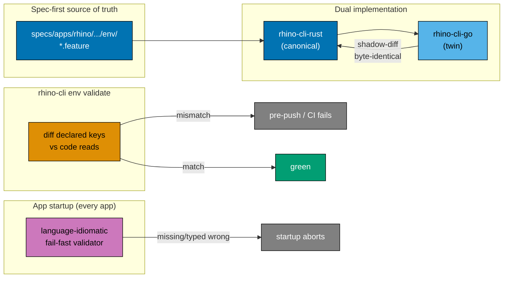

# Standardize Secrets and Environment-Variable Storage (ose-primer)

## Context

`ose-primer` is the MIT-licensed **polyglot template repository and bidirectional sync hub** for the
Open Sharia Enterprise family [Repo-grounded]. It already enforces a strong **"no secrets in
committed files"** rule and uses the `.env.example` committed / `.env*` gitignored pattern (root
`.gitignore` lines 24–31 and 104–111 [Repo-grounded]). That foundation is sound. What is **not**
standardized is everything around it: how environment variables are **named**, whether values are
**validated at startup**, how the `.env.example` files **document** their variables, whether code and
config are **kept in sync**, and whether the secret-backup tooling actually captures _every_ secret
kind in the repo.

The gaps are concrete and verifiable today:

- **No naming standard.** Across the ~15 polyglot apps, app-defined values are read under bare,
  collision-prone names. Every backend reads some mix of `APP_JWT_SECRET` / `JWT_SECRET`,
  `APP_PORT` / `PORT`, and `DATABASE_URL` with soft, silent defaults — for example
  [`apps/crud-be-rust-axum/src/config.rs`](../../../apps/crud-be-rust-axum/src/config.rs) reads
  `APP_JWT_SECRET` and `APP_PORT`, [`apps/crud-be-golang-gin/internal/config/config.go`](../../../apps/crud-be-golang-gin/internal/config/config.go)
  reads `APP_JWT_SECRET` and `PORT`, and
  [`apps/crud-be-ts-effect/src/config.ts`](../../../apps/crud-be-ts-effect/src/config.ts) reads the
  same trio through `Effect.Config.withDefault` [Repo-grounded]. A bare `APP_*` name gives no hint
  which app owns it.
- **Soft defaults hide misconfiguration.** Every backend falls back to a hardcoded default on a
  missing value instead of failing fast — `crud-be-ts-effect`'s `loadConfig` even wraps the whole
  read in `Effect.catchAll(() => Effect.succeed({ … defaults … }))` [Repo-grounded], so a missing
  `DATABASE_URL` silently becomes `sqlite::memory:` rather than an error. This is the same class of
  silent-default bug the sibling `ose-infra` plan was built to kill.
- **`rhino-cli env backup` silently skips non-`.env` secrets.** Both implementations share the same
  two independent misses: the discovery walker skips **every** hidden directory (so the gitignored
  `.secrets/` directory is invisible — `discover.go:41` / `discover.rs:50` [Repo-grounded]) and
  matches only basenames starting with `.env` (so `secrets.json`, `*.pem`/`*.key`/`*.crt`/`*.pfx`,
  and any future `*.tfvars` are skipped — `discover.go:52` / `discover.rs:71` [Repo-grounded]). A
  "back up my secrets" run leaves those behind.
- **Three governance docs, no hub.** The rules live in three separate documents under
  `repo-governance/` ([no-secrets-in-committed-files](../../../repo-governance/development/quality/no-secrets-in-committed-files.md),
  [env-file-access](../../../repo-governance/development/quality/env-file-access.md),
  [reproducible-environments](../../../repo-governance/development/workflow/reproducible-environments.md))
  [Repo-grounded] with no single entry point.

This plan **adopts a per-app naming standard** with language-appropriate **fail-fast startup
validation** across every backend and frontend, **widens `rhino-cli env backup`/`restore`** (via the
spec-first, Rust-canonical → Go-twin dual-implementation flow) to cover every secret kind plus a
`--dry-run`, **adds a `rhino-cli env validate` drift guard**, and **consolidates** the three
governance documents into one hub convention. It converges to the **same end-state output** as the
sibling `ose-infra` and `ose-public` plans, with every primer-specific divergence recorded in
[tech-docs.md §1 (Deviation Matrix)](./tech-docs.md#1-resolved-deviation-matrix-all-14-decisions).

> **No secrets in this plan.** Per the
> [No Secrets in Committed Files](../../../repo-governance/development/quality/no-secrets-in-committed-files.md)
> rule, this plan names variables and describes where their values live — never a real value. Every
> `.env.example` this plan touches carries only obviously-dev placeholders.

## Scope

### In Scope

- **One hub convention** — `repo-governance/development/quality/secrets-and-env-standards.md`
  absorbing the substantive content of the three existing docs (naming, layout, annotation,
  validation, secret-surface census, storage-tier ladder). The three existing docs become short
  **stub redirects** preserving every inbound link.
- **Per-app naming standard** — `SCREAMING_SNAKE_CASE`; a **per-app prefix** derived from the Nx
  project name (`crud-be-rust-axum` → `CRUD_BE_RUST_AXUM_*`) for app-defined values; framework-
  reserved names (`NEXT_PUBLIC_*`, Next.js / framework `PORT`) kept as the framework demands; shared
  service vars (`DATABASE_URL`, `POSTGRES_*`) unprefixed; no environment tier baked into a name.
- **Full per-app prefix rename across all existing app-defined vars** — rename `APP_JWT_SECRET` /
  `JWT_SECRET` / `APP_PORT` to the per-app-prefixed equivalents across every backend's config code,
  its `infra/dev/<app>/.env.example`, and its `infra/dev/<app>/docker-compose*.yml` env blocks, so
  all sources for a given app agree. One delivery sub-phase per language family.
- **Fail-fast startup validation in every app** — a language-idiomatic validator per family
  (validator-per-language table in [tech-docs.md §4](./tech-docs.md#4-startup-validation-per-language)),
  replacing today's soft-default reads with a hard error that names the missing variable.
- **`rhino-cli env backup`/`restore` — every secret kind, with `--dry-run`** — authored spec-first
  (update `specs/apps/rhino/behavior/cli/gherkin/env/` → implement Rust-canonical → implement Go-twin
  → shadow-diff byte-identical), widening the current `.env*`-only filter to an explicit secret
  allowlist (`.env*`, `secrets.json`, `*.pem`/`*.key`/`*.crt`/`*.pfx`, and everything under
  `.secrets/`) and adding a `--dry-run` preview to both subcommands.
- **`rhino-cli env validate` drift guard** — a new subcommand (spec-first, Rust-canonical → Go-twin)
  diffing each app's declared `.env.example` keys against the env vars the code actually reads, wired
  into the pre-push hook and a CI step.
- **`.env.example` annotation format** — each variable carries a required/optional + type + format
  comment block per the new standard.
- **Forward-looking IaC scaffold (gated, not active)** — primer has no IaC today; the hub doc and the
  backup floor ship the `*.tfvars` / generated-inventory patterns **commented** with an "activate when
  IaC is added" note, and `env validate`'s Terraform/Ansible validators ship documented-but-gated. No
  IaC validator runs against primer in this plan.

### Out of Scope

- Migrating `infra/dev/<app>/.env.example` templates to `apps/<app>/` (primer is a **template repo**;
  it deliberately keeps its `infra/dev/<app>/` layout and root `.env.example`, and `env init` keeps
  walking `infra/dev/` — see [tech-docs.md §3](./tech-docs.md#3-layout-decision--no-migration)).
- Adopting any encrypted-at-rest secret store (SOPS/age, Vault, Infisical, Doppler) — Tier 0 stays;
  the upgrade ladder is documented only.
- Any live IaC validation — primer has no Terraform/Ansible; those validators ship gated.
- Relocating any real gitignored secret file — primer has none to relocate; any such relocation is a
  `[HUMAN]` step blocked by the env-file-access guard.

### Affected Areas

- `apps/crud-be-*` (11 backends: Clojure, C#, Elixir, F#, Go/Gin, Java×2, Kotlin, Python, Rust, TS) —
  config code rename + fail-fast validation
- `apps/crud-fe-ts-nextjs`, `apps/crud-fs-ts-nextjs`, `apps/crud-fe-ts-tanstack-start`,
  `apps/crud-fe-dart-flutterweb` (frontends) — env validation
- `apps/rhino-cli-rust/` (canonical) + `apps/rhino-cli-go/` (twin) — widened backup/restore,
  `--dry-run`, new `env validate`
- `specs/apps/rhino/behavior/cli/gherkin/env/` — new/updated env feature specs (source of truth)
- `infra/dev/<app>/.env.example` and `infra/dev/<app>/docker-compose*.yml` — rename + annotate
- `repo-governance/development/quality/` and `repo-governance/development/workflow/` — hub doc + stubs
- `.husky/` (pre-push wiring) and `.github/workflows/` (CI wiring)
- `docs/explanation/` — the parity-decisions rationale doc
- Documentation and convention indexes referencing the three folded docs

## Approach Summary

Two enforcement layers replace the current "documented but unguarded" state: a **build-time** drift
guard (code reads must match declared keys) and a **runtime** fail-fast validator (missing or
mistyped values abort startup instead of silently defaulting). All rhino-cli changes flow through the
spec-first, Rust-canonical → Go-twin, shadow-diff-gated dual-implementation model the repo already
mandates.

## Sibling Plans

This plan is one of three converging on the same end-state across the OSE family. Each repo's plan
shares the slug `standardize-secrets-and-env`; divergences are recorded in each plan's deviation
matrix.

- **ose-infra** (reference): `plans/in-progress/standardize-secrets-and-env/README.md`
- **ose-primer** (this plan): `plans/in-progress/standardize-secrets-and-env/README.md`
- **ose-public**: `plans/in-progress/standardize-secrets-and-env/README.md`

## Plan Navigation

| Document                       | Contents                                                                                                             |
| ------------------------------ | -------------------------------------------------------------------------------------------------------------------- |
| [brd.md](./brd.md)             | Business rationale, goals, success criteria, risks                                                                   |
| [prd.md](./prd.md)             | Personas, user stories, Gherkin acceptance criteria, product scope                                                   |
| [tech-docs.md](./tech-docs.md) | Full deviation matrix, naming standard, layout, per-language validation, env-subcommand dual-impl, drift guard, deps |
| [delivery.md](./delivery.md)   | Phased execution checklist with `[AI]`/`[HUMAN]` markers, spec-first TDD shape, and per-phase gates                  |

## Delivery Phases at a Glance

| Phase | Title                                                                      | Mode (dominant) |
| ----- | -------------------------------------------------------------------------- | --------------- |
| 0     | Environment Setup + Baseline                                               | AI              |
| 1     | Naming Standard + Per-App Rename (backends)                                | AI              |
| 2     | Naming Standard + Per-App Rename (frontends)                               | AI              |
| 3     | `env backup`/`restore`: every secret kind + `--dry-run` (spec → Rust → Go) | AI              |
| 4     | Fail-Fast Startup Validation (per-language sub-phases)                     | AI              |
| 5     | `.env.example` Annotation Format                                           | AI              |
| 6     | `env validate` Drift Guard (spec → Rust → Go) + pre-push + CI              | AI              |
| 7     | Hub Convention Doc + Stub Redirects + Rationale Doc + Link Repointing      | AI              |
| 8     | Final Quality Gate + Commit + Push                                         | AI              |

Each phase ends with a `### Phase N Gate` (must-pass checks before the next phase) and a **Pause
Safety** note describing the stable resumable state.

## Git Workflow

All work on `main` (Trunk Based Development) inside the declared worktree (see
[delivery.md, "Worktree"](./delivery.md#worktree)). Commits land **per phase checkpoint** and are
pushed to `origin main` at each phase gate.

> **PR-override deviation (recorded).** `ose-primer` normally receives governance changes through a
> **draft PR** (the sibling-sync safety invariant). This plan pushes **directly to `ose-primer`
> `main`** (`worktree-to-main`), bypassing that PR-only rule. This is an explicit, one-off, invoker-
> owned deviation, recorded as decision **R5** in
> [tech-docs.md §1](./tech-docs.md#1-resolved-deviation-matrix-all-14-decisions) and explained in the
> Phase 7 rationale doc. No `--force` is ever used; every push is a normal fast-forward to `main`.

## Current Status

In progress — authored 2026-06-09. Execution not started.
