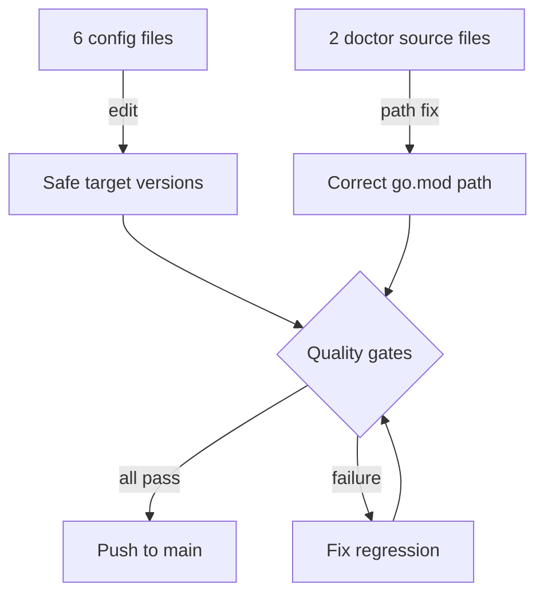

# Technical Documentation — Update Polyglot Toolchain Versions

## Architecture Overview

This plan performs config-file edits and two targeted source-file patches. No application
logic changes, no new abstractions, no architectural changes.



## Doctor Path Bug

### Root Cause

Both `rhino doctor` implementations were ported from `ose-public` where the Go CLI lives at
`apps/rhino-cli/`. In `ose-primer` the directory was renamed to `apps/rhino-cli-go/`, but the
path string inside the doctor source was not updated.

**Go implementation** (`apps/rhino-cli-go/internal/doctor/tools.go`, line 34):

```go
// Before (wrong)
goModPath := filepath.Join(repoRoot, "apps", "rhino-cli", "go.mod")

// After (correct)
goModPath := filepath.Join(repoRoot, "apps", "rhino-cli-go", "go.mod")
```

**Rust implementation** (`apps/rhino-cli-rust/src/internal/doctor/tools.rs`, line 69):

```rust
// Before (wrong)
let go_mod = repo_root.join("apps").join("rhino-cli").join("go.mod");

// After (correct)
let go_mod = repo_root.join("apps").join("rhino-cli-go").join("go.mod");
```

The `source` label string in both files also references `apps/rhino-cli/go.mod` and must be
updated to `apps/rhino-cli-go/go.mod` for accurate reporting in doctor output.

## Config File Changes

### Python — `.python-version`

**File**: `apps/crud-be-python-fastapi/.python-version`

```
# Before
3.13

# After
3.13.12
```

**Why 3.13.12 not 3.14.x**: Python 3.14.3 (latest 3.14.x at cutoff) carries CVE-2026-4519 in
the bundled libpython, fixed in 3.14.4 (2026-04-07, after cutoff). Python 3.13.12 has no known
high/critical CVEs and is a maintained LTS-ish series (security fixes until October 2029).

**Release date verification**:
`https://www.python.org/downloads/release/python-31312/`

**Note**: pyenv interprets a plain minor version (`3.13`) as "latest patch of 3.13". Declaring
`3.13.12` explicitly pins to that exact patch, matching doctor `compareGTE` semantics.

### .NET SDK — `global.json`

**File**: `apps/crud-be-fsharp-giraffe/global.json`

```json
// Before
{
  "sdk": {
    "version": "10.0.103",
    "rollForward": "latestMinor"
  }
}

// After
{
  "sdk": {
    "version": "10.0.201",
    "rollForward": "latestMinor"
  }
}
```

**Security context**: .NET March 2026 Patch Tuesday (2026-03-10) fixed:

- CVE-2026-26127 (CVSS 7.5, High) — .NET Denial of Service
- CVE-2026-26130 — ASP.NET Core resource exhaustion
- CVE-2026-26131 — Privilege escalation on Linux

These were fixed in runtime 10.0.4 (SDK 10.0.200/10.0.104). SDK 10.0.200 introduced a macOS
debugger regression; out-of-band SDK 10.0.201 (2026-03-12) fixed the regression. Use 10.0.201.

**Release date verification**:
`https://versionsof.net/core/10.0/` — table row for 2026-03-12.

### Go Minimum Version Directive — `go.mod`

**File**: `apps/rhino-cli-go/go.mod`

```
# Before
go 1.26

# After
go 1.26.1
```

**Security context**: Go 1.26.1 (2026-03-05) fixed five CVEs relative to 1.26.0:

- CVE-2026-27137 — `crypto/x509` incorrect full-email name constraint enforcement
- CVE-2026-27138 — `crypto/x509` panic with empty DNS name + excluded constraints
- CVE-2026-27142 — `html/template` URL XSS via meta refresh tag
- CVE-2026-25679 — `net/url` accepts invalid IPv6 literals
- CVE-2026-27139 — `os` FileInfo from ReadDir can reference files outside Root via symlink

**Go directive semantics**: In Go 1.21+, the `go` directive is a hard minimum. Setting `go 1.26.1`
requires at least Go 1.26.1. The doctor's `compareGTE` check enforces this requirement.

**Release date verification**:
`https://go.dev/doc/devel/release` — entry for `go1.26.1 (released 2026-03-05)`.

### Rust MSRV — `Cargo.toml`

**File**: `apps/crud-be-rust-axum/Cargo.toml`

```toml
# Before
rust-version = "1.80"

# After
rust-version = "1.94.1"
```

**Security context**: Rust 1.94.1 (2026-03-26) patched CVE-2026-33056 — a vulnerability in
the `tar` crate used by Cargo that allowed a malicious crate to modify filesystem permissions
during `cargo build`. Rust 1.94.0 (2026-03-05) was the minor that introduced language features
now available to use in this codebase; 1.94.1 is the patched version.

**MSRV semantics**: `rust-version` sets the Minimum Supported Rust Version. It does not pin
the installed rustc to exactly that version. The doctor uses `compareGTE` — any installed
Rust >= 1.94.1 passes. Raising the MSRV from 1.80 to 1.94.1 allows use of all Rust language
features added between those two releases.

**Release date verification**:
`https://blog.rust-lang.org/releases/` — entries for 1.94.0 (2026-03-05) and 1.94.1 (2026-03-26).

### Dart SDK and Flutter — `pubspec.yaml`

**File**: `apps/crud-fe-dart-flutterweb/pubspec.yaml`

```yaml
# Before
environment:
  sdk: ^3.11.1
  flutter: ">=3.41.0"

# After
environment:
  sdk: ^3.11.0
  flutter: ">=3.41.4"
```

**Dart constraint fix**: Dart 3.11.1 was never released. The version series goes
3.11.0 → 3.11.3 (with 3.11.3 released 2026-03-17, after the cutoff). The constraint
`^3.11.1` is technically unsatisfiable for any version released at or before the cutoff,
since 3.11.0 does not satisfy `^3.11.1`. Changing to `^3.11.0` satisfies the 3.11.0 release
(2026-02-11) and all future 3.11.x and later 3.x releases.

**Flutter floor tightening**: `>=3.41.0` is relaxed to the point that a developer could install
any 3.41.x and pass. Flutter 3.41.0 is the first release with the pub path-traversal fix; however
3.41.4 (~early March 2026) is a confirmed pre-cutoff hotfix. Setting `>=3.41.4` tightens
the floor to the latest confirmed pre-cutoff patch.

**Release date verification**:

- Dart 3.11.0: `https://dart.dev/changelog` — entry 2026-02-11
- Flutter 3.41.4: GitHub issue flet-dev/flet#6245 opened 2026-03-03 requests upgrade to 3.41.4,
  confirming availability before that date

## Doctor `source` Label Strings

Each doctor implementation includes a human-readable `source` string shown in doctor output.
These must match the corrected path:

**Go**: `source: "apps/rhino-cli-go/go.mod → go directive"`
(was: `source: "apps/rhino-cli/go.mod → go directive"`)

**Rust**: `"apps/rhino-cli-go/go.mod \u{2192} go directive"`
(was: `"apps/rhino-cli/go.mod \u{2192} go directive"`)

## Testing Strategy

This plan introduces no new test code. The testing strategy is:

1. **Regression gate**: run `npx nx affected -t typecheck`, `npx nx affected -t lint`, and
   `npx nx affected -t test:quick` after all edits. All must pass.

2. **Markdown gate**: `npm run lint:md` must exit 0 with zero errors.

3. **Binding gate**: `npm run validate:harness-bindings` must exit 0.

4. **Config gate**: `npm run validate:config` must exit 0.

Per the Test-Driven Development Convention, new test code is written before implementation for
feature changes. This plan is a maintenance-only config edit with no new feature code, so no
new tests are written.

## Rollback Strategy

Each config file change is independent. If a toolchain version update causes a regression:

1. Identify the specific file via `git bisect` or individual revert.
2. Pin that config to the previous value instead.
3. Re-run quality gates.
4. Document the skipped update in `plans/ideas.md`.

## File Impact Summary

| File                                               | Change                                                                    |
| -------------------------------------------------- | ------------------------------------------------------------------------- |
| `apps/crud-be-python-fastapi/.python-version`      | `3.13` → `3.13.12`                                                        |
| `apps/crud-be-fsharp-giraffe/global.json`          | `10.0.103` → `10.0.201`                                                   |
| `apps/rhino-cli-go/go.mod`                         | `go 1.26` → `go 1.26.1`                                                   |
| `apps/crud-be-rust-axum/Cargo.toml`                | `rust-version = "1.80"` → `rust-version = "1.94.1"`                       |
| `apps/crud-fe-dart-flutterweb/pubspec.yaml`        | `sdk: ^3.11.1` → `^3.11.0`; flutter `>=3.41.0` → `>=3.41.4`               |
| `apps/rhino-cli-go/internal/doctor/tools.go`       | Path fix: `apps/rhino-cli` → `apps/rhino-cli-go` (line 34 + source label) |
| `apps/rhino-cli-rust/src/internal/doctor/tools.rs` | Path fix: `apps/rhino-cli` → `apps/rhino-cli-go` (line 69 + source label) |
