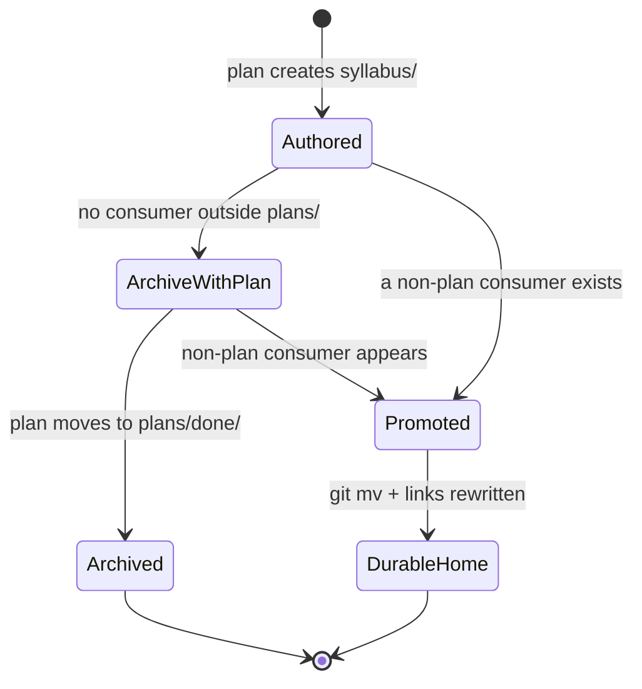

# Learning-Plan `syllabus/` Folder Convention

This convention defines how a learning-bearing plan documents the course and curriculum content it
authors or restructures under its own `syllabus/` folder. It is the learning-side analogue of the
[UI Mockups in Plan Docs](../formatting/diagrams.md#ui-mockups-in-plan-docs) convention: both give a
class of plan a documented, mechanically checkable shape for a kind of content that would otherwise
be authored ad hoc, drift silently, and leave no owner once the plan that produced it archives.

## Principles Implemented/Respected

This convention implements the following core principles:

- **[Documentation First](../../principles/content/documentation-first.md)**: `syllabus/README.md`,
  `syllabus/courses/README.md`, and `syllabus/paths/README.md` are REQUIRED deliverables for a new
  corpus, not an afterthought — documenting a learning corpus is a first-class delivery output,
  mirroring how the UI-design-funnel record is a required part of a UI-bearing plan's `prd.md`.
- **[Explicit Over Implicit](../../principles/software-engineering/explicit-over-implicit.md)**: the
  learning-bearing trigger is defined by delivery effect and illustrated with worked positive and
  negative examples, so whether a given plan is in scope is decidable without a judgment call. The
  `## Corpus Disposition` declaration and the `**Custodian**` line make ownership and lifecycle
  explicit in the plan's own files rather than left to institutional memory.
- **[Simplicity Over Complexity](../../principles/general/simplicity-over-complexity.md)**: the
  course template ships as a single copy-paste fenced block inside this convention, following the
  repo's established pattern (the two-pager template in `plans.md`, the UI funnel's copy-paste
  example in `diagrams.md`), rather than inventing a new `templates/` directory.
- **[Reproducibility First](../../principles/software-engineering/reproducibility.md)**: the section
  tiers below are derived from a stated, re-runnable measurement over the existing corpus, not
  designed from intuition — a later author with a larger corpus can re-derive the tiers using the
  same method and get a defensible answer, not inherit a frozen list.

## Purpose

Three learning-path plans in this repository each author a large, structured body of course and
curriculum content under their own `plans/<stage>/<plan-id>/syllabus/` folder — course files,
path manifests, and their indexes — with no governing convention describing the required shape,
who owns it, or when it moves. This convention closes that gap: it defines the **learning-bearing**
trigger that determines which plans it applies to, the required folder layout, the section tiers a
course file is measured against, a copy-paste course template, and the disposition and custody rules
that govern where a corpus lives and who may change it.

## Scope

### What This Convention Covers

- **The learning-bearing trigger** — the decidable test for whether a plan's delivery checklist
  authoring or restructuring course, tutorial, or curriculum content brings it into scope
- **Required folder layout** — `syllabus/README.md`, `syllabus/courses/`, `syllabus/paths/`, and
  their per-subfolder README requirements
- **Section tiering** — the measured REQUIRED / RECOMMENDED / OPTIONAL derivation for a course file's
  sections, and the copy-paste template built from it
- **Corpus Disposition** — the two-value declaration (`archive-with-plan`, `promote-to:<path>`) every
  learning-bearing plan that **owns** a corpus carries in its `tech-docs.md`
- **Custody** — single-custodian ownership, read-only consumers, the `custodied-by:<plan-id>` echo a
  **consumer** plan carries under its own `## Corpus Custody` heading, routed change requests, and the
  two archival hand-off branches
- **The grandfathered format cohort** — the pre-existing 17-file ordered-list divergence this
  convention does not retrofit

### What This Convention Does NOT Cover

- **The body content of any course or path manifest** — what a course teaches is a subject-matter
  decision made by the authoring plan, not a documentation-organization rule
- **A deterministic validator** — no `rhino-cli` subcommand enforces this convention today; a
  documented, runnable `grep` recipe stands in until one exists (tracked as a two-pager idea, not
  built here)
- **`docs/`, `apps/`, or `libs/` content** — this convention governs `plans/` artifacts only; shipped
  course content under `apps/ayokoding-www/content/` is out of scope

## Standards

### The Learning-Bearing Trigger

A plan is **learning-bearing** when its delivery checklist **authors or restructures course,
tutorial, or curriculum content** — the direct analogue of "adds or changes user-facing screens or
components under `apps/` or `libs/`" for a UI-bearing plan. Merely citing a course, linking to one, or
fixing a small defect in an existing body does not trigger it, exactly as a CSS-token bump does not
trigger the UI funnel. The test an author applies: does a delivery step **produce new or
restructured** course/path content, or does it only **read or lightly correct** what already exists?
If the former, the plan is learning-bearing; if the latter, it is not.

**Positive examples (learning-bearing):**

1. A plan's delivery checklist creates new `syllabus/courses/<course-id>.md` files with a
   concept/worked-example breakdown for courses that do not yet exist — this **authors** curriculum
   content, so the plan is learning-bearing and must carry the folder layout, template-derived shape,
   and disposition/custody declarations below.
2. A plan's delivery checklist splits one existing course into two, renumbers the affected
   prerequisite stages across every path manifest that references it, and rewrites the `courseOrder`
   entries accordingly — this **restructures** curriculum content, so the plan is learning-bearing
   even though it touches existing files rather than creating new ones.

**Negative examples (not learning-bearing):**

1. A plan's delivery checklist fixes a broken relative link or a typo inside an existing
   `syllabus/courses/*.md` file's prose, with no change to the course's concepts, structure, or
   scope — this neither authors nor restructures curriculum content, so the plan is not
   learning-bearing, exactly as a CSS-token bump is not UI-bearing.
2. A plan's delivery checklist references an existing corpus by relative link (for example, a
   course-authoring plan's `tech-docs.md` cites a `syllabus/paths/manifest-*.md` file as the source
   it builds against) without editing any file under that corpus — reading is not authoring, so this
   plan is a **consumer** (see Custody Rule below), not learning-bearing in its own right.

Only plans meeting this trigger carry the folder layout, template-derived shape, and the
`## Corpus Disposition` declaration defined below; every other plan is exempt from this convention
in the same way a non-UI-bearing plan is exempt from the UI-design-funnel record.

### Required Folder Layout

A learning-bearing plan's corpus lives under its own plan folder in the following shape:

```
plans/<stage>/<plan-id>/
└── syllabus/
    ├── README.md              # REQUIRED — corpus overview + the Custodian line
    ├── courses/
    │   ├── README.md          # REQUIRED for new corpora; grandfathered for existing corpora
    │   └── <course-id>.md     # one file per course (see the copy-paste template below)
    └── paths/
        ├── README.md          # REQUIRED for new corpora; grandfathered for existing corpora
        └── manifest-<path-id>.md
```

Both `syllabus/courses/` and `syllabus/paths/` are REQUIRED subfolders — every existing corpus
already uses that split. `syllabus/README.md` is REQUIRED without exception (all three existing
corpora carry one). The per-subfolder READMEs (`courses/README.md`, `paths/README.md`) are REQUIRED
for a **new** corpus created after this convention lands; the two existing corpora that predate it
and lack these files are **grandfathered** — see the Grandfathered Format Cohort section below for
why retrofitting them is out of scope. A corpus without a `courses/README.md` is on borrowed time
regardless: `rhino-cli md readme-index validate` flags an unindexed sibling file as an orphan the
moment any other file in the same directory changes, so adding the README is a low-cost task a new
corpus should not defer.

### Corpus Census and Section Tiering

The section tiers below are derived from measuring every existing course file in the three corpora
that predate this convention, not designed from intuition. Every number was measured by counting
files under each plan's `syllabus/courses/` directory, excluding `README.md` and `surgery.md` (a
scope-contract document, not a course).

**Corpus shapes:**

| Corpus                                                   | Course files | `courses/README.md` | Path manifests | `paths/README.md` |
| -------------------------------------------------------- | -----------: | ------------------- | -------------: | ----------------- |
| `ayokoding-learning-path-02-schema-and-prerequisite-dag` |          120 | present             |              4 | present           |
| `ayokoding-learning-path-06-skills-accounting`           |           24 | absent              |              2 | absent            |
| `ayokoding-learning-path-07-skills-erp`                  |           30 | absent              |              2 | absent            |
| **Total**                                                |      **174** | 1 of 3              |          **8** | 1 of 3            |

**Section frequency (the tiering evidence):**

| Section / header line      | 02 (of 120) | 06 (of 24) | 07 (of 30) | Total (of 174) |    % | Tier        |
| -------------------------- | ----------: | ---------: | ---------: | -------------: | ---: | ----------- |
| `**Course ID**` line       |         120 |         24 |         30 |            174 |  100 | REQUIRED    |
| `## Why this exists`       |         120 |         24 |         30 |            174 |  100 | REQUIRED    |
| `## Prerequisites`         |         120 |         24 |         30 |            174 |  100 | REQUIRED    |
| `## In which paths`        |         120 |         24 |         30 |            174 |  100 | REQUIRED    |
| `## Accuracy notes`        |         120 |         24 |         30 |            174 |  100 | REQUIRED    |
| `**Scope note**` line      |         119 |         24 |         30 |            173 | 99.4 | REQUIRED    |
| `## Concepts`              |         119 |         24 |         30 |            173 | 99.4 | REQUIRED    |
| `## Read more`             |         114 |         24 |         30 |            168 | 96.6 | RECOMMENDED |
| `## Worked examples`       |         112 |         24 |         30 |            166 | 95.4 | RECOMMENDED |
| `**Short summary**` line   |          95 |         24 |         30 |            149 | 85.6 | RECOMMENDED |
| `## Capstone spec`         |         115 |          0 |          0 |            115 | 66.1 | OPTIONAL    |
| `## Tensions & trade-offs` |          61 |          5 |          0 |             66 | 37.9 | OPTIONAL    |
| `## Lineage`               |          62 |          0 |          0 |             62 | 35.6 | OPTIONAL    |

**Tiering rule**: REQUIRED at ≥ 99% of all 174 files; RECOMMENDED at ≥ 80%; OPTIONAL below that
threshold. The rule is stated, not just the resulting tiers, so a future author with a larger corpus
can re-derive the tiers by re-running the same per-file measurement rather than inheriting this frozen
list. The two REQUIRED-tier misses in the current corpus are the same file,
`syllabus/courses/capstone-forge-ready.md`, which carries neither `**Scope note**` nor
`## Concepts` — a legitimate capstone-format variant, not a defect, which is why a capstone MAY omit
these two REQUIRED sections without violating this convention.

**Reproducing these numbers**: for each corpus, iterate the `*.md` files under `syllabus/courses/`,
skipping `README.md` and `surgery.md`, and test each file for a section with
`grep -q '<pattern>' "$file"`. A recursive `grep -rl` over the whole directory instead
**silently includes `README.md` and `surgery.md`**, producing a wrong count — the per-file loop is
the reliable method.

### Copy-Paste Course Template

Every course file follows the same three-tier shape as the measured sections above: a REQUIRED
skeleton every course carries, a RECOMMENDED skeleton nearly every course carries, and OPTIONAL
sections a course includes only when it genuinely has that content.

#### REQUIRED Sections

```markdown
# <Course Title> (<Format: By Example|Annotated-Concept|...>)

**Course ID**: `<course-id>` · **Format**: <By Example|Annotated-Concept|...>.

**Scope note**: <one to three sentences precisely bounding what this course covers and, just as
importantly, what it explicitly excludes — name the adjacent course(s) that own the excluded
material>.

## Why this exists · the big idea

- **The problem before the solution**: <why a reader needs this before anything downstream makes
  sense>.
- **Keep-this-if-you-forget-everything**: <the single sentence a reader should retain if nothing
  else survives>.

## Prerequisites

- **Prior courses**: <course-id, course-id, or "none">.
- **Assumed knowledge**: <baseline knowledge assumed without a prior course>.

## Accuracy notes

- <fact-by-fact provenance for every non-obvious claim in this file, e.g.
  `[Verified — stable, non-dynamic domain fact]`, `[Repo-grounded, <file>]`, or
  `[Web-cited: <source>; accessed YYYY-MM-DD]`>.

## Concepts

- **co-01 · <concept-slug>** — <one-line definition a reader can act on>.
- **co-02 · <concept-slug>** — <one-line definition a reader can act on>.

## In which paths

- `<path-id>` — Stage <N> · <one-line placement rationale>.
```

#### RECOMMENDED Sections

Place these immediately after the REQUIRED skeleton above, before `## In which paths`, following the
measured house order (`**Short summary**` line near the top, `## Worked examples` and
`## Read more` after `## Concepts`):

```markdown
**Short summary**: <one or two sentences, back-cover-style, distinct from the Scope note above>.

## Worked examples

### Beginner

- **ex-01 · <exercise-slug>** — <task> — verify <observable check>. (co-01, co-02)

### Intermediate

- **ex-02 · <exercise-slug>** — <task> — verify <observable check>. (co-01)

### Advanced

- **ex-03 · <exercise-slug>** — <task> — verify <observable check>. (co-01–co-02)

## Read more

- **<Title>** — <Author> (<Publisher>). <One-line note on why it's cited>.
```

#### OPTIONAL Sections

Include only when the course genuinely has this content — a course with neither a build-worthy
synthesis nor a real historical lineage should omit these rather than pad them:

```markdown
## Capstone spec

<a full runnable per-course capstone, when the course's applied synthesis is a build exercise>

## Tensions & trade-offs

- **<tension-name>** — <the two positions in genuine tension, and why neither dominates>.

## Lineage

- <where this course's content and structure were mined from, and what changed in the mining — for
  example a prior narrative in `legacy/<path>` or a predecessor plan's syllabus>.
```

### Corpus Disposition

Every learning-bearing plan that **owns** a corpus (its **custodian** — see the Custody Rule below)
declares, in its `tech-docs.md`, a `## Corpus Disposition` section with exactly one of the following
values. A plan that only **consumes** another plan's corpus never carries a `## Corpus Disposition`
section — it is not learning-bearing in its own right (see the Learning-Bearing Trigger's negative
example 2) and instead carries the `custodied-by:<plan-id>` echo under its own `## Corpus Custody`
heading, defined in the Custody Rule below.

| Value               | Meaning                                                                | Extra obligation                                                     |
| ------------------- | ---------------------------------------------------------------------- | -------------------------------------------------------------------- |
| `archive-with-plan` | **Default.** The corpus moves to `plans/done/` with the plan folder    | None                                                                 |
| `promote-to:<path>` | The corpus has a consumer outside `plans/` and moves to a durable home | A delivery step performing the move and rewriting every inbound link |



**The default is `archive-with-plan`.** A syllabus corpus is the specification a deliverable was
built from — the same role a hi-fi `.excalidraw.png` mockup plays for a UI screen — and, like that
mockup, it archives with the plan unless a concrete outside consumer exists. The durable product is
the shipped course body under `apps/ayokoding-www/content/`, not the syllabus that specified it.

**The promotion trigger is falsifiable, not a vibe.** A corpus MUST switch to `promote-to:` the
moment a **consumer outside `plans/`** reads it: a checker or agent, an Nx target, a build or
generation step, or shipped content front-matter that references a syllabus path. The test an author
applies is: **name the non-plan reader**. If none can be named, the disposition stays
`archive-with-plan`.

### Custody Rule

A learning-bearing plan that **owns** a corpus is its **custodian**; a plan that only reads another
plan's corpus is a **consumer**. Four rules govern the relationship:

1. **Exactly one custodian per corpus.** The custodian is named in the corpus's own
   `syllabus/README.md` as a `**Custodian**: <plan-id>` line, and echoed in every consumer plan's
   `tech-docs.md` under its own `## Corpus Custody` heading as `custodied-by:<plan-id>` — a distinct
   declaration from `## Corpus Disposition` above, which only the owning (custodian) plan carries. A
   consumer plan is not learning-bearing in its own right (see the Learning-Bearing Trigger's negative
   example 2) and so never carries a `## Corpus Disposition` section, but it still carries this
   `## Corpus Custody` echo regardless.
2. **Consumers are read-only.** A consumer plan links into the corpus by relative path and MUST NOT
   edit, copy, or fork any file under it. A consumer's delivery checklist containing a step that
   writes to another plan's `syllabus/` is a defect.
3. **Edits are change requests routed to the Custodian.** A needed change lands as a step in the
   **custodian's own** `delivery.md`, never as a direct edit from a consumer plan.
4. **Archival hand-off.** When a custodian is ready to archive while a live consumer still links into
   its corpus, the archival step MUST take one of two branches:

| Live consumer? | Corpus still being edited? | Branch                                                                                                                                                     |
| -------------- | -------------------------- | ---------------------------------------------------------------------------------------------------------------------------------------------------------- |
| No             | —                          | Move the folder to `plans/done/`; no link rewrite needed                                                                                                   |
| Yes            | No                         | **(a) Link rewrite (default)** — rewrite every inbound link to the corpus's new `plans/done/YYYY-MM-DD__<id>/syllabus/…` location                          |
| Yes            | Yes                        | **(b) Custody transfer** — `git mv` the `syllabus/` folder into a named successor plan, update that plan's `**Custodian**` line, and rewrite inbound links |

**Half of this rule is already mechanically enforced.**
`rhino-cli md links validate --exclude plans/done` runs at pre-push and in CI. The `--exclude
plans/done` flag removes archived files as a **scan source**, not as a link **target** — so a
still-live consumer plan is scanned, and its link into a corpus that moved without a rewrite fails
the push. This is the backstop that catches a missed hand-off; it does not replace naming a Custodian
or choosing the correct branch above.

### Grandfathered Format Cohort

The measured corpus shows a two-marker authoring-cohort split inside plan 02's 120 course files: a
majority cohort of 97 files renders its `co-NN`/`ex-NN` concept and exercise lists as bullets
(`- **co-01 …`), while a divergent cohort of exactly **17 files** renders the same lists as an ordered
list (`1. **co-01 …`) and, in every one of those 17 files, also omits the `**Short summary**` line.
That coincidence is what identifies the 17 as a separate authoring cohort rather than 17 independent
typos.

Bullets are canonical: the repo-wide markdownlint configuration pins unordered list style to `dash`
(the `MD004` setting), and both plan 06 and plan 07 use bullets uniformly (54 of 54 files). New course
files MUST use bullets. The existing 17-file ordered-list cohort inside plan 02 is **grandfathered** —
retrofitting it is explicitly out of scope for this convention, so it is named here as a known,
accepted divergence rather than silently tolerated or mistaken for a defect discovered later.

## Conformance Recipe

Until a deterministic `rhino-cli` validator exists (deferred, and filed as a two-pager idea brief
under `plans/ideas/`), an author or checker can detect a course file missing a REQUIRED section today
with the loop below. It
iterates the `*.md` files under a corpus's `syllabus/courses/`, skips `README.md` and `surgery.md`
(the scope-contract register, not a course), and tests each file with `grep -q '<pattern>' "$file"`.

The recipe deliberately avoids two `grep` traps specific to this repo's **ugrep**-backed `grep`:
it never uses `grep -L` (files-**without**-match, which exits 0 when it finds one non-matching file
and so cannot drive a pass/fail loop), and never uses space-separated `--glob VALUE` (which ugrep does
not parse). It uses an explicit per-file loop instead.

```bash
# Report every course file missing any REQUIRED section, for one corpus.
check_corpus () {
  local dir="$1"                       # e.g. plans/backlog/<plan>/syllabus/courses
  local any_miss=0
  for file in "$dir"/*.md; do
    base=$(basename "$file")
    [ "$base" = "README.md" ] && continue
    [ "$base" = "surgery.md" ] && continue
    miss=""
    grep -q '\*\*Course ID\*\*'   "$file" || miss="$miss Course-ID"
    grep -q '^## Why this exists' "$file" || miss="$miss Why-this-exists"
    grep -q '^## Prerequisites'   "$file" || miss="$miss Prerequisites"
    grep -q '^## In which paths'  "$file" || miss="$miss In-which-paths"
    grep -q '^## Accuracy notes'  "$file" || miss="$miss Accuracy-notes"
    grep -q '\*\*Scope note\*\*'  "$file" || miss="$miss Scope-note"
    grep -q '^## Concepts'        "$file" || miss="$miss Concepts"
    if [ -n "$miss" ]; then
      echo "MISS $base:$miss"
      any_miss=1
    fi
  done
  [ "$any_miss" -eq 0 ] && echo "(no misses)"
}
# Run against all three existing corpora, printing a header per corpus.
for plan in ayokoding-learning-path-02-schema-and-prerequisite-dag \
            ayokoding-learning-path-06-skills-accounting \
            ayokoding-learning-path-07-skills-erp; do
  echo "=== $plan ==="
  check_corpus "plans/backlog/$plan/syllabus/courses"
done
```

Run against the three existing corpora, the recipe reports exactly one file — a capstone, a
legitimate structural variant covered by the capstone carve-out — and no other miss:

```text
=== ayokoding-learning-path-02-schema-and-prerequisite-dag ===
MISS capstone-forge-ready.md: Scope-note Concepts
=== ayokoding-learning-path-06-skills-accounting ===
(no misses)
=== ayokoding-learning-path-07-skills-erp ===
(no misses)
```

Any other result means either the recipe or the census tiering drifted, and both must be re-derived
before the convention is trusted.

## Related Documentation

- [Plans Organization Convention](./plans.md) — the parent convention this one is cross-referenced
  from, in §Multi-File Structure
- [UI Mockups in Plan Docs](../formatting/diagrams.md#ui-mockups-in-plan-docs) — the governed
  precedent this convention mirrors for the learning side (both-tiers rule, design funnel, placement
  HARD RULE)
- [Worktree Path Convention](./worktree-path.md) — sibling structure convention this document's shape
  follows
- [Knowledge Capture Convention](../../development/quality/knowledge-capture.md) — the running-log
  triage pattern `learnings.md` follows, referenced by the plans that use this convention
- [Repository Governance Architecture](../../repository-governance-architecture.md) — six-layer
  governance hierarchy
