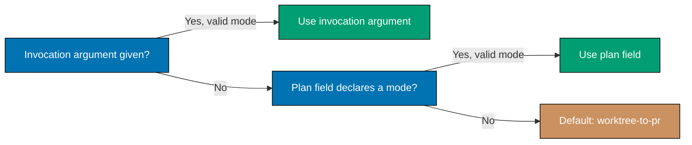
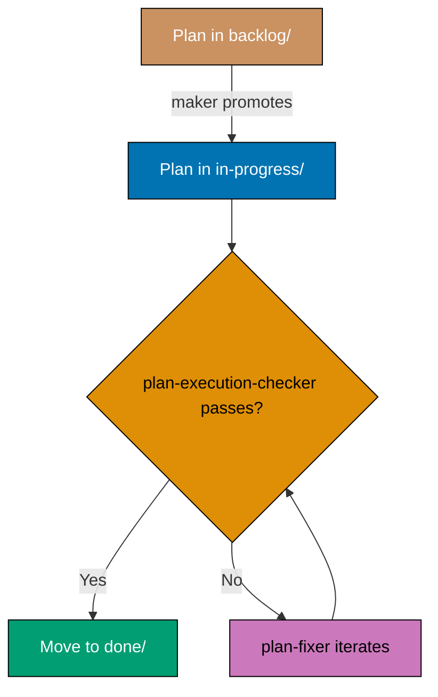

# Plans Organization Convention

<!--
  MAINTENANCE NOTE: Master reference for plans organization
  This convention is referenced by:
  1. plans/README.md (brief landing page with link to this convention)
  2. AGENTS.md (summary with link to this convention)
  3. .claude/agents/plan-maker.md (reference to this convention)
  When updating, ensure all references remain accurate.
-->

This document defines the standards for organizing project planning documents in the `plans/` folder. Plans are temporary, ephemeral documents used for project planning and tracking, distinct from permanent documentation in `docs/`.

## Principles Implemented/Respected

This convention implements the following core principles:

- **[Simplicity Over Complexity](../../principles/general/simplicity-over-complexity.md)**: Flat structure with three clear states (backlog, in-progress, done). No complex nested hierarchies or status tracking systems.

- **[Explicit Over Implicit](../../principles/software-engineering/explicit-over-implicit.md)**: The stage-aware naming convention makes lifecycle state explicit. `backlog/` and `in-progress/` use no date prefix; `done/` uses a completion-date prefix (added only at archival). File location (backlog/, in-progress/, done/) indicates status — no hidden metadata or databases required.

## Purpose

This convention establishes the organizational structure for project planning documents in the `plans/` directory. It defines how to organize ideas, backlog, in-progress work, and completed projects using stage-aware folder naming and standardized lifecycle stages.

## Scope

### What This Convention Covers

- **Plans directory structure** - ideas/, backlog/, in-progress/, done/ organization
- **Folder naming pattern** - stage-aware: no date prefix in `backlog/` or `in-progress/`; completion-date prefix in `done/` only
- **File organization** - What files belong in each folder
- **Lifecycle stages** - How plans move from ideas → backlog → in-progress → done
- **Project identifiers** - How to name projects consistently

### What This Convention Does NOT Cover

- **Plan content format** - How to write plans (covered by plan-checker agent)
- **Project management methodology** - This is file organization, not PM process
- **Task tracking** - Covered by the [plan-execution workflow](../../workflows/plan/plan-execution.md) (orchestrated directly by the calling context)
- **Deployment scheduling** - Covered in deployment conventions

## Overview

The `plans/` folder serves as the workspace for project planning activities:

- **Purpose**: Temporary project planning and tracking
- **Location**: Root-level `plans/` folder (not inside `docs/`)
- **Lifecycle**: Plans move between subfolders as work progresses
- **Format**: Structured markdown documents following specific naming and organization conventions

**Key Distinction**: Plans are temporary working documents that eventually move to `done/` and may be archived, while `docs/` contains permanent documentation that evolves over time.

**No secrets in plans**: Plan documents are committed to git — including `done/` history, which is permanent. Never put a secret value (credentials, SSH keys, tokens, API keys, sensitive usernames, or connection strings with real credentials) in any plan. Name the variable and state where the value lives, never the value itself. This is a hard iron rule — see [No Secrets in Committed Files Convention](../security/no-secrets-in-committed-files.md).

## ️ Folder Structure

The `plans/` folder is organized into four main components:

```
plans/
├── ideas/           # Two-pager idea briefs not yet formalized into full plans
├── backlog/         # Planned projects for future implementation
├── in-progress/     # Active plans currently being worked on
└── done/            # Completed and archived plans
```

### Subfolder Purposes

**ideas/** - Idea Briefs (Two-Pagers)

- Contains **two-pagers**: shortened, promotable idea briefs — richer than a one-line todo, but NOT full five-document plans
- Each idea is one `<slug>.md` file; the folder has a `README.md` index
- The first lifecycle stage: ripe two-pagers are promoted to `backlog/` as full plans (see [Ideas Folder (Two-Pagers)](#ideas-folder-two-pagers) below)

**backlog/** - Planning Queue

- Contains plans that are ready for implementation but not yet started
- Plans are fully structured with requirements, tech docs, and delivery sections
- Each subfolder has a `README.md` listing all plans in backlog

**in-progress/** - Active Work

- Contains plans currently being executed
- Plans being actively worked on by the team
- Limited to a small number of concurrent plans (prevents context switching)
- Each subfolder has a `README.md` listing all active plans

**done/** - Completed Work

- Contains completed and archived plans
- Plans are moved here when implementation is finished
- Serves as historical record of project evolution
- Each subfolder has a `README.md` listing all completed plans

## Ideas Folder (Two-Pagers)

**Location**: `plans/ideas/` (folder at the root of `plans/`)

**Purpose**: Capture pre-plan ideas as **two-pagers** — shortened, promotable idea briefs that are
richer than a one-line todo but deliberately **NOT** the full five-document plan. Each idea is its own
file; the folder carries a `README.md` index. `ideas/` is the first stage of the plan lifecycle:

```text
ideas/ (two-pagers) → backlog/ (full 5-doc plans) → in-progress/ → done/
```

### Why a Two-Pager (Not a One-Liner, Not a Full Plan)

A two-pager sits between a throwaway one-line todo and a full backlog plan: short enough to write in
one sitting and triage at a glance, yet structured enough that a reader can decide whether to promote
it. The format is a synthesis of the common denominator across established short-proposal formats —
Amazon's PR/FAQ, Basecamp's Shape Up "pitch", Architecture Decision Records (ADR), Google's "mini
design doc", and the Rust RFC — all of which name the problem, sketch a solution at a level that
invites debate rather than forecloses it, state what is explicitly out of scope, name the open
questions, and define what success looks like, inside a one-to-two-page ceiling (ADR: _"the whole
document should be one or two pages long"_; Google's mini design doc: _"1-3 pages"_). The full
five-document plan is the deliberately-longer sibling the two-pager is promoted into.

### File Layout

- **`plans/ideas/README.md`** — index of current two-pagers (one bulleted link + one-line hook each),
  a short statement of this convention, and the promotion criteria. Mirrors the shape of
  `backlog/README.md`.
- **`plans/ideas/<slug>.md`** — one two-pager per idea. Kebab-case slug, **no date prefix** (like
  `backlog/` and `in-progress/`; only `done/` carries a date prefix).

### Integrate Before You Add (No Duplicate Two-Pagers)

Before creating a new two-pager, **scan `plans/ideas/` first** (start with its `README.md` index) for
an existing brief that already covers the same problem or area — and **fold the new thought into that
brief** rather than adding a near-duplicate file. Two two-pagers about the same underlying problem
should be one. Consolidate related briefs when they converge on the same idea; split a brief only when
it is genuinely two separable ideas.

This applies equally when the [Knowledge Capture phase](#the-knowledge-capture-phase-final-phase-before-archival)
routes a learning here: check for an existing home before opening a new file. The goal is a folder of
distinct, non-overlapping ideas — not a pile that repeats itself.

### Two-Pager Template

Each `plans/ideas/<slug>.md` has an H1 title plus ~8 short sections, targeting ≤ ~2 printed pages:

1. **`# <Idea title>` + one-line summary** — one sentence a stranger understands, telling a reader
   whether reading on is worth it (the "abstract test"). When the idea originated from a plan, add a
   provenance note: `> Surfaced YYYY-MM-DD during <plan-slug> execution.` or, for a standalone idea,
   `> Idea, added YYYY-MM-DD.`
2. **Problem / context** — a single specific example of why the status quo doesn't work, plus what
   prompted it — not an abstract pain point. **Ground it in concrete data points** where they exist:
   counts, sizes, measurements (e.g. "59 missing step implementations", "AGENTS.md at 29,152 B against a
   30,000 B limit", "4 files drifted"). A data-pointed problem is promotable; a vague one is not.
3. **Why now** — the urgency, dependency, or opportunity window that makes this timely.
4. **Prior art / precedents** — a short survey of who has already tackled this and how: two to five
   named precedents (a tool, pattern, standard, or prior plan), each with a link. _Nothing new under
   the sun_ — most substantial ideas have precedent, and naming it kills reinvention and sharpens
   _Why now_. Keep it **lightweight at capture**: author-supplied links and a clause each, not a
   research report — the deep [`web-researcher`](../../development/agents/ai-agents.md) prior-art
   study is deferred to promotion (see [Promoting a Two-Pager](#promoting-a-two-pager-to-a-full-plan)).
   Zero prior art on a substantial idea is a smell: you probably haven't looked.
5. **Proposed direction (sketch)** — the core elements at a level a reader _immediately_ grasps; cap
   to roughly three elements. **Explicitly NOT** wireframes, file paths, API signatures, or Gherkin —
   that detail is the backlog plan's job (Shape Up: _"we don't want to over-specify the design with
   wireframes or high-fidelity mocks"_).
6. **Rough scope & non-goals** — in-scope bullets, plus an explicit **Out of scope (for now)** list.
   Non-goals name things a reader would _reasonably expect_ in scope and deliberately exclude them
   ("ACID compliance", not "the system shouldn't crash").
7. **Risks & open questions** — rabbit holes worth flagging now, plus named unknowns that block
   promotion. Zero open questions is a smell: the idea is either over-specified or under-thought.
8. **What success looks like + promotion signal** — the condition that would make the idea worth
   having pursued (observable fact / cited+dated number / explicitly-labeled judgment call — **never a
   fabricated KPI**), and what "ready to become a `backlog/` plan" means for _this_ idea.

### Two-Page Discipline

- **One paragraph per section, full sentences** — not bullet sprawl; length is enforced by _omission_,
  never by font size or margins.
- **The solution stays "immediately understandable", never wireframe- or file-level** — naming
  specific files, functions, or exact layouts means you've drifted into full-plan territory.
- **No BRD/PRD/tech-docs/delivery split, no Gherkin, no delivery checklist, no phase gates** — those
  belong to the five-document backlog plan.
- **Prior art stays lightweight at capture** — the _Prior art_ section is author-supplied links and a
  clause each, never a research report; a thin idea keeps it short but never omits it. The deep
  `web-researcher` prior-art study runs at promotion, where the full plan can afford it — capturing an
  idea must stay cheap.
- **Ground the problem in data points** — cite the concrete count, size, or measurement that
  evidences it. If no baseline exists, say so plainly (_"no baseline measured"_) rather than inventing
  one — an honestly-unquantified problem is fine; a fabricated number is not.
- **No fabricated metrics** — state success as an observable fact, a cited number with source + access
  date, or an explicitly-labeled judgment call (_"Judgment call: we expect X; no baseline measured"_).
  This inherits the [BRD success-metric rule](#content-placement-rules-brdmd-vs-prdmd).
- **The summary compresses the whole document**, it does not restate the problem paragraph.
- **No secrets** — the folder is committed and world-readable; the [No Secrets in Committed Files Convention](../security/no-secrets-in-committed-files.md) hard rule applies in full.

### Difference from backlog/

- **`ideas/` two-pager**: a promotable idea brief — problem, sketch, scope, open questions — with no
  BRD/PRD/tech-docs/delivery split and no delivery checklist.
- **`backlog/`**: a full plan folder with structured requirements, tech-docs, and delivery files,
  ready to execute.

### Promoting a Two-Pager to a Full Plan

Promotion is a **completeness gate, not a perfection gate**: an idea is ripe to promote when every
section holds a real answer — _including honest open questions_ — and the remaining open questions are
ones that genuinely need the full plan's deeper design/research to answer. "Not promoted yet" is a
distinct, legitimate state from "rejected" (timing and fit are separate axes from brief quality).

When a two-pager is ripe:

1. Create a new plan folder in `backlog/` with `[project-identifier]/` format (no date prefix) —
   default to the five-document multi-file layout (see [Structure Decision](#structure-decision)).
2. **Run the deep prior-art study** — commission a [`web-researcher`](../../development/agents/ai-agents.md)
   survey of precedents, standards, and existing solutions for the idea, and fold the findings into
   the plan's `brd.md` / `prd.md` as design input. The two-pager's _Prior art_ section was a
   lightweight starting point; at promotion the full plan can afford the real research.
3. Carry the two-pager's problem, scope, and open questions forward into the plan's `brd.md` / `prd.md`.
4. **Delete** the two-pager and remove its line from `plans/ideas/README.md` (the idea now lives as a
   plan).

The [plan-idea-promotion-planning workflow](../../workflows/plan/plan-idea-promotion-planning.md)
orchestrates these four steps end to end — ripeness gate, the deep prior-art study, the
`plan-planning` hand-off, and the two-pager retirement.

### Ideas as a Home for Execution Learnings

The [Knowledge Capture phase](#the-knowledge-capture-phase-final-phase-before-archival) routes some
plan-execution learnings here: a **future-work idea** that is richer than a one-liner but not yet
plan-ready becomes a two-pager in `plans/ideas/`, rather than being filed straight as a backlog plan
or discarded. The [Knowledge Capture Convention](../../development/quality/knowledge-capture.md)'s
routing matrix names `plans/ideas/` as one of its candidate durable homes.

## Plan Folder Naming

Naming differs by lifecycle stage. Each stage has its own rule.

### backlog/ — NO date prefix

```
[project-identifier]/
```

Backlog plans carry no date prefix. A date is added only when the plan is archived to `done/`.

### in-progress/ — NO date prefix

```
[project-identifier]/
```

Active plans carry no date prefix at all. The date is added only when the plan is archived to
`done/`. Moving a plan from `backlog/` to `in-progress/` is a pure move — neither stage carries a date prefix, so no rename is needed.

### done/ — completion date prefix

```
YYYY-MM-DD__[project-identifier]/
```

The date is the day the plan was completed (last git-committed), NOT the creation date. When
archiving from `in-progress/`, add the completion date prefix.

### Naming Rules (all stages)

- **Date Format** (`done/` only): ISO 8601 (`YYYY-MM-DD`)
- **Separator** (`done/` only): Double underscore `__` separates the completion date from the identifier
- **Identifier**: Kebab-case (lowercase with hyphens)
- **No Spaces**: Use hyphens instead of spaces
- **No Special Characters**: Only alphanumeric and hyphens in identifier

### Examples

**Good (backlog/)**:

- `backlog/init-monorepo/`
- `backlog/auth-system/`
- `backlog/payment-integration/`

**Good (in-progress/)**:

- `in-progress/mobile-app-redesign/`
- `in-progress/auth-system/`
- `in-progress/payment-integration/`

**Good (done/)**:

- `done/2025-11-24__init-monorepo/` (completion date)
- `done/2026-01-15__mobile-app-redesign/` (completion date)

**Bad**:

- `backlog/2026-01-15__auth-system/` (date prefix in backlog — WRONG)
- `in-progress/2026-01-15__mobile-app-redesign/` (date prefix in in-progress — WRONG)
- `2025-11-24_init-monorepo/` (single underscore)
- `2025-11-24__Init Monorepo/` (capital letters, spaces)
- `2025-11-24__init_monorepo/` (underscores in identifier)

## Plan Contents

> **No secrets (HARD RULE)**: Plan documents are committed to git. NEVER place system secrets
> — SSH keys, passwords, sensitive usernames, API keys, tokens, or connection strings with real
> credentials — in any plan file. Reference secrets by variable name and location only (e.g.
> "set `DEPLOY_TOKEN` in `.env`"); real values belong in uncommitted files. See the
> [No Secrets in Committed Files Convention](../security/no-secrets-in-committed-files.md).

Plans can use either **single-file** or **multi-file** structure depending on size and complexity.

### Structure Decision

**Multi-File Structure** (DEFAULT — five documents):

Every new plan MUST use the five-document multi-file layout unless ALL of the exception criteria listed under Single-File Structure are met. When in doubt, use five documents.

- Five separate files: `README.md`, `brd.md`, `prd.md`, `tech-docs.md`, `delivery.md`
- Each file owns one concern (see Content-Placement Rules below), so diffs stay narrow per PR and cross-reviewers can find the section relevant to their concern without skimming an omnibus file

**Single-File Structure** (exception — only when ALL criteria below are met):

A plan MAY collapse to a single `README.md` only when **all** of the following hold simultaneously:

1. Combined business rationale + product scope + tech-docs + delivery fits within 1000 lines total
2. The condensed BRD and condensed PRD sections both fit comfortably in the README without crowding out the technical sections
3. The plan touches at most one subrepo or one narrow concern (single-phase, no new agents/workflows/conventions introduced)
4. The author does not foresee the plan growing mid-execution

If any criterion is unmet, use the five-document layout. If the plan grows past 1000 lines or any criterion is violated mid-execution, promote to the multi-file layout before continuing execution.

**Decision Rule**: The five-document multi-file layout is the required default. Single-file is a bounded exception that requires all four criteria above to be satisfied, not merely a choice based on line-count alone.

### Single-File Structure

```
2025-12-01__feature-name/
└── README.md                # All-in-one plan document
```

**README.md sections** (mandatory, in order):

1. **Context** — project description, background, non-technical framing
2. **Scope** — in-scope + out-of-scope; affected subrepos / apps named explicitly
3. **Business rationale (condensed BRD)** — why this matters, business goals, affected roles, success metrics (gut-based reasoning OK; judgment calls labeled; fabricated KPIs forbidden; internet citations inline with excerpt + URL + access date)
4. **Product requirements (condensed PRD)** — user stories (`As a … I want … So that …`), Gherkin acceptance criteria, product scope
5. **Technical approach** — architecture, design decisions, implementation approach
6. **Worktree** — declared worktree path (`worktrees/<plan-identifier>/`) and provisioning command (see [Worktree Specification](#worktree-specification))
7. **Delivery checklist** — phased `- [ ]` items with one concrete action per checkbox; opens with the `[AI]`/`[HUMAN]` executor legend; every phase ends with a `### Phase N Gate` and a Pause Safety note (see Executor Tagging and Phases as Natural Pauses With Clear Gates above)
8. **Quality gates** — local gates + CI gates that must pass
9. **Verification** — how to confirm the plan is done

If the author cannot comfortably fit both the condensed BRD and condensed PRD sections into the README without crowding out the technical sections, promote the plan to the five-document multi-file layout before execution begins.

### Multi-File Structure

```
2025-12-01__feature-name/
├── README.md                # Plan overview and navigation
├── brd.md                   # Business Requirements Document
├── prd.md                   # Product Requirements Document
├── tech-docs.md             # Technical documentation and architecture
├── delivery.md              # Step-by-step delivery checklist
├── learnings.md             # (transient) running log of generalizable learnings, triaged before archival
└── evidence/                # (optional) committed testing evidence — screenshots, curl responses
    ├── phase-1-homepage-en-1280px.png
    └── phase-2-api-health.txt
```

**File purposes**:

- **README.md**: High-level overview and navigation — Context, Scope (with affected subrepos / apps named explicitly), Approach Summary, and links to the other four files. First file a reader opens; first file checkers parse for scope.
- **brd.md** — **Business Requirements Document**: business goal and rationale ("why are we doing this"), business impact, affected roles, business-level success metrics, business-scope Non-Goals, business risks and mitigations. Content-placement container, not a sign-off artifact — code review is the only approval gate in this repo.
- **prd.md** — **Product Requirements Document**: product overview, personas, user stories (`As a … I want … So that …`), acceptance criteria in Gherkin, product scope (in-scope + out-of-scope features), product-level risks. **For UI-bearing plans** (those that add or change user-facing screens or components under `apps/` or `libs/`), `prd.md` additionally contains the complete **UI-design-funnel record**: the inline low-fidelity ASCII wireframes (Diverge stage, ≥ 2 named alternatives, at least mobile + desktop where they differ), the high-fidelity mockup embeds via `` image links referencing the plan's `assets/` folder (Narrow stage finalists), the named selection (Select stage), and the rationale table (Justify stage). **For learning-bearing plans** (those whose delivery checklist authors or restructures course, tutorial, or curriculum content), `tech-docs.md` additionally requires a `## Corpus Disposition` declaration and the plan's `syllabus/` folder record, per the [Learning-Plan `syllabus/` Folder Convention](./learning-plan-syllabus.md). See [UI Mockups in Plan Docs — Placement](../formatting/diagrams.md#placement--the-ui-lives-in-prdmd-hard-rule) for the full placement rule.
- **tech-docs.md**: architecture, design decisions with rationale, file-impact analysis, mechanics, dependencies, risks, rollback. No step-by-step checklist.
- **delivery.md**: sequential, ticked checklist of executable steps (`- [ ]`), organized by phase if needed. Plan-execution workflow reads this file to drive execution; `plan-execution-checker` reads it to verify completion. Opens with the `[AI]`/`[HUMAN]` executor legend; each phase ends with a `### Phase N Gate` (must-pass verification) followed by a Pause Safety note. For substantive plans, the final phase before archival is the **Knowledge Capture** phase (see below).
- **`learnings.md`** (transient): a running log of generalizable learnings accrued while executing `delivery.md` — appended to the moment an executor notices something worth keeping, not reconstructed from memory afterward. It is committed and moves with the plan folder through the lifecycle, but it is **never the system of record** — it is drained by the Knowledge Capture phase before archival and MAY be deleted from `plans/done/` at any later date. See the [Knowledge Capture Convention](../../development/quality/knowledge-capture.md) for the full running-log format, the open-ended triage matrix, and the two mandatory safety gates.
- **`evidence/`** (optional): committed folder for testing evidence produced during plan execution — screenshots (one per breakpoint per locale), saved curl responses, Lighthouse reports, and other file-based artifacts referenced from `delivery.md` implementation notes. Created when the plan's first manual verification step runs. Moves with the plan folder on archival to `done/`. Binary files (PNG/JPG) are committed alongside the text files. See [Evidence Capture Convention](../../development/quality/evidence-capture.md).

### The Knowledge Capture Phase (Final Phase Before Archival)

Every substantive plan's `delivery.md` MUST end with a **Knowledge Capture** phase, immediately
before the Plan Archival phase. This phase triages every entry in `learnings.md` through the
[Knowledge Capture Convention](../../development/quality/knowledge-capture.md)'s open-ended,
principle-based routing matrix: each surviving learning is routed to exactly one durable home (a
convention, a doc, an agent, a skill, code, or a post-mortem) — small non-code routings land inline
in the current plan's own commits, large non-code routings and ALL code routings become a
`plans/backlog/` follow-up plan, and non-generalizable entries are discarded with a one-line reason.
Both safety gates (secret/sensitivity and repo-relevance) run on every surviving entry before it is
routed.

Archival is **BLOCKED** until every `learnings.md` entry reaches a terminal state — routed inline,
filed as backlog, or discarded — or the plan carries the explicit
`No generalizable learnings — <reason>` escape. `learnings.md` is transient: nothing durable may
depend on it surviving past archival. Pure-docs and trivial plans are exempt from elaborate capture,
mirroring the specs/Gherkin exemption. See the
[Knowledge Capture Convention](../../development/quality/knowledge-capture.md) for the complete
rubric, both safety gates, and the anti-theater guardrails.

### Content-Placement Rules (brd.md vs prd.md)

Authoritative split between `brd.md` and `prd.md`. These rules are normative for `plan-maker` / `plan-checker` / `plan-fixer` — the agents share one definition to avoid drift.

> **Solo-maintainer framing**: BRD and PRD are **content-placement containers**, not sign-off artifacts. This repo has one maintainer collaborating with AI agents; code review (the PR) is the only approval gate. The convention MUST NOT introduce sponsor sign-off, stakeholder approval ceremonies, or role-based gates.

**Goes in `brd.md` (business perspective)**:

- Business goal and rationale ("why are we doing this")
- Business impact (pain points, expected benefits)
- Affected roles (which hats the maintainer wears; which agents consume the file) — **not** sign-off mapping
- Business-level success metrics. BRD does not require every claim to be data-driven — gut-based reasoning is acceptable **when the logic supports the claim**. What is NOT acceptable: fabricated numeric targets (percentages, durations, counts) presented as already-measured facts when no baseline exists. Options when writing a success metric:
  1. **Observable fact** (preferred): cite a grep/git/agent-round-trip check that verifies on demand (e.g., "zero plans using the deprecated layout after migration").
  2. **Cited measurement**: reference an existing dashboard, prior measurement, or external data source. When you cite data pulled from the internet, include the data itself in the plan (specific number, quote, excerpt) alongside the URL and the access date. URL-only citations are not enough — links rot.
  3. **Qualitative reasoning**: state the structural claim plainly without a number.
  4. **Judgment call / gut target**: allowed, but MUST be explicitly labeled (e.g., "_Judgment call:_ we expect review time to drop; no baseline measured").
- Business-scope Non-Goals
- Business risks and mitigations

**Goes in `prd.md` (product perspective)**:

- Product overview (what is being built)
- Personas (hats the maintainer wears; agents that consume the file) — **not** external stakeholder roles
- User stories (`As a … I want … So that …`)
- Acceptance criteria in Gherkin
- Product scope (in-scope features, out-of-scope features)
- Product-level risks (UX, feature interaction)

**Ambiguous cases**: When a concern is genuinely cross-cutting (e.g., a success criterion is both a business-level fact and a product acceptance criterion), place the **factual claim or judgment** in `brd.md` and the **testable scenario** in `prd.md`, cross-linking between them. Do not duplicate the full content. If the BRD side is a judgment call rather than a measured fact, label it as such — do not fabricate a number and pretend it was measured.

### Granular Checklist Items in delivery.md

Every checkbox in `delivery.md` must represent exactly one concrete, independently verifiable action. Multi-step work hidden behind a single checkbox defeats the purpose of a checklist: it makes progress invisible and creates ambiguity about what "done" means.

**Rule**: One checkbox = one concrete action. If completing the item requires multiple distinct steps, split it into multiple checkboxes.

**Bad** (too coarse — hides multiple steps):

```markdown
- [ ] Implement coverage merging with all formats and tests
```

**Good** (granular — each item is independently completable):

```markdown
- [ ] Create `internal/testcoverage/merge.go` with format-agnostic merge logic
- [ ] Implement `CoverageMap` type for normalized per-line data
- [ ] Add parsers to return `CoverageMap` from each format
- [ ] Write unit tests for merge logic (same format, cross-format, overlapping)
```

**Test for granularity**: Each checkbox must pass this test — can you verify it is done without completing anything else on the list? If the answer is no, the item is too coarse.

### Execution-Grade Clarity (HARD RULE)

Plans are executed by execution-grade (sonnet-tier) agents, not planning-grade agents. Authoring-grade clarity is not sufficient — every checkbox MUST be unambiguous at execution time without consulting additional context.

**Each checkbox MUST contain all of the following that apply:**

- **Explicit file path(s)**: Name the exact file path(s) when known (e.g., `apps/crud-be-ts-effect/src/middleware/auth.ts`). When the path cannot be determined at authoring time (e.g., a new file whose location is implementation-dependent), provide the maximum-possible-detail target: parent directory + naming pattern + sibling reference (e.g., "new file under `apps/crud-be-ts-effect/src/` following the pattern of sibling `auth.ts`").
- **Explicit shell command(s)**: State the verbatim invocation when a command is involved (e.g., `npx nx run crud-be-ts-effect:test:quick`), not a vague instruction like "run the lint".
- **Concrete acceptance criterion**: State the observable change that proves done (e.g., "all assertions in `trpc.test.ts` pass" or "`nx run crud-be-ts-effect:typecheck` exits 0"). No bare "implement X", "set up Y", or "configure Z" without a concrete verifiable outcome.
- **One scenario per behavior cycle + inline Gherkin**: Every behavior-implementing
  RED→GREEN→REFACTOR cycle targets **exactly one** Gherkin scenario. Its RED step carries a
  single-scenario `**Gherkin (binds) →** "<title>"` tag line followed immediately by that
  scenario's full `Given/When/Then` as a fenced ` ```gherkin ` block copied verbatim from the
  companion `.feature`; never bundle multiple scenarios into one cycle (long checklists are
  expected). Pure-core (`**Gherkin (underpins) →**`) data/calc tests and the aggregate
  feature-consuming / `playwright-bdd` binders are the only steps that keep a multi-scenario
  title list. `plan-checker` flags a multi-scenario behavior RED, or absent/non-verbatim inline
  Gherkin, as a **HIGH** finding. See
  [Gherkin-Tagged Delivery Steps](../../development/workflow/test-driven-development.md#gherkin-tagged-delivery-steps).

**HARD RULE**: `plan-checker` flags violations of this rule as HIGH severity. `plan-fixer` rewrites offending items with maximum detail.

**Bad** (missing path, missing command, missing criterion):

```markdown
- [ ] Add caching
```

**Good** (explicit path, explicit command, explicit criterion):

```markdown
- [ ] Edit `apps/crud-be-ts-effect/src/middleware/auth.ts`: wrap the public router with
      `unstable_cache(..., { revalidate: 300 })`. Verify by running
      `npx nx run crud-be-ts-effect:test:quick` — all tests pass.
```

**Acceptance Criteria**: All user stories in `prd.md` (or the condensed PRD section of a single-file plan's `README.md`) must include testable acceptance criteria using Gherkin format. See [Acceptance Criteria Convention](../../development/infra/acceptance-criteria.md) for complete details, including the HARD rule that every `Scenario` uses exactly one primary `Given`, one `When`, and one `Then` (extras chained with `And`/`But`). See [HARD Rule — Step-Keyword Cardinality](../../development/infra/acceptance-criteria.md#hard-rule--step-keyword-cardinality).

### Executor Tagging — [AI] vs [HUMAN] (HARD RULE)

Every delivery checklist item MUST make clear **who can execute it**. Some work cannot be done by an AI agent at all — physical actions (unplug a power cable, swap a drive, press a hardware button), out-of-band approvals (approve a production deploy, accept a contract), or actions requiring real credentials or authority the agent must not hold. Marking executor capability up front lets the executor hand off cleanly to the human at the right moment instead of fabricating a completion, and tells the human exactly what they must do personally.

**Tags**:

- **`[AI]`** — an AI agent can fully perform the step (edit files, run commands, call tools). This is the **default**: an unmarked checkbox is treated as `[AI]`.
- **`[HUMAN]`** — only a human can perform the step. Reserve for physical-world actions, out-of-band approvals or sign-offs, actions requiring real secrets or privileged credentials the agent must not access, and decisions requiring real-world authority (legal, financial, safety).
- **`[AI+HUMAN]`** (optional) — AI prepares or drafts; a human reviews, approves, or performs the irreversible final action.

**Bias to `[AI]` (HARD RULE)**: prefer `[AI]` as much as possible and use `[HUMAN]` as little as possible. Tag a step `[HUMAN]` ONLY when it is genuinely inevitable — physically impossible for an agent, unsafe, or requiring real-world authority or credentials an agent must not hold — OR when the plan author or user has explicitly asked for `[HUMAN]` on that step. Before tagging `[HUMAN]`, first try to engineer a sanctioned `[AI]` path (for example, a scripted action through an approved guard). When both an `[AI]` and a `[HUMAN]` path would accomplish the step, choose `[AI]`.

**Git-mechanical steps are `[AI]` — worktree and push are never `[HUMAN]` by default (HARD RULE)**: three recurring lifecycle steps are routinely mis-tagged `[HUMAN]` even though an agent performs them directly with plain git commands. Tag each `[AI]`:

- **Create / provision the worktree** — `git worktree add worktrees/<id> -b <id>` is an ordinary git command the executor runs; the [plan-execution workflow](../../workflows/plan/plan-execution.md) Step 0 gate even auto-provisions it. Tag `[AI]`, never `[HUMAN]`.
- **Commit and push** — the push target follows the plan's Delivery Mode (see [Delivery Mode](#delivery-mode) below), but the push itself is always `[AI]`. Under the repo-wide default `worktree-to-pr`, write the step as `- [ ] [AI] Commit and push to origin <pr-branch>`; under the direct-push modes (`worktree-to-origin-main`, `main-to-origin-main`), write `- [ ] [AI] Commit and push to origin main`. See the [Git Push Default Convention](../../development/workflow/git-push-default.md). There is **no** `[HUMAN]` "review the diff and approve push" gate in either case — pushing to a PR branch is not a merge, and the PR's own review cycle plus the hardened merge preconditions are what gate integration. Drop any approve-push gate unless the user or plan explicitly asked for an out-of-band sign-off on that change.
- **Remove the worktree after archival** — `git worktree remove worktrees/<id>` is mechanical; the executor self-confirms via the safety preconditions (nothing uncommitted or unpushed) and prompts inline before deleting. Tag `[AI]`, never `[HUMAN]`.

Any of these three steps becomes `[HUMAN]` or `[AI+HUMAN]` ONLY when the user or plan explicitly requested an out-of-band approval or sign-off for that specific change. Absent that explicit request, all three are `[AI]`.

**The PR merge is a fourth, separate step — and it is `[AI]` by default too.** Do not conflate it with the push above. Under `*-to-pr` modes the merge is tagged `[AI]` and happens once the hardened merge preconditions hold; a `[HUMAN]` merge gate applies only where a plan's own step says so explicitly. That opt-in is legitimate and MUST NOT be "corrected" to `[AI]` — the preconditions are identical either way and only the actor differs. See [Delivery Mode](#delivery-mode) and the [PR Merge Protocol](../../development/workflow/pr-merge-protocol.md).

**Placement**: the tag goes at the START of the checkbox text, immediately after `- [ ]`:

```markdown
- [ ] [AI] Edit `apps/crud-be-ts-effect/src/middleware/auth.ts`: … — acceptance: …
- [ ] [HUMAN] Unplug the power cable to the test rig and confirm the LED is off — acceptance: operator confirms power removed
```

**Legend (required)**: every `delivery.md` (or a single-file plan's Delivery Checklist section) MUST open with a short legend defining the tags it uses and stating that unmarked steps are `[AI]`:

```markdown
> **Legend** — `[AI]`: an agent performs the step (the default; unmarked steps are `[AI]`).
> `[HUMAN]`: only a human can do it (physical action, out-of-band approval, real-secret or
> privileged-credential handling). `[AI+HUMAN]`: agent prepares, human approves or finishes.
```

**Default bias**: prefer `[AI]` for anything an agent can mechanically do; reserve `[HUMAN]` for what is genuinely impossible or unsafe for AI. When a sanctioned channel lets an agent do something that looks human-only (for example, copying a real secret via an `[AI]`-authored script through the [`guard-env-file-access`](../security/env-file-access.md) sanctioned path), it stays `[AI]` — document the channel inline.

**Execution semantics**: when the [plan-execution workflow](../../workflows/plan/plan-execution.md) reaches a `[HUMAN]` item, it STOPS, surfaces the item to the user with the instruction and the acceptance criterion, and waits for the human to confirm completion before continuing. A `[HUMAN]` step is a legitimate, expected stop — it overrides the "never stop between phases" execution default.

**Enforcement**: `plan-checker` flags as **HIGH** any delivery checkbox describing an action no agent can perform (physical or out-of-band) that is tagged `[AI]` or left unmarked, and flags a missing top-of-file legend as **MEDIUM**. `plan-fixer` adds the legend and corrects mis-tags.

### Phases as Natural Pauses With Clear Gates (HARD RULE)

Every phase in a delivery checklist MUST be designed as a **natural pause point** that ends with a **clear gate**. A reader — human or AI — must be able to stop after any phase and find the repository in a coherent, non-broken state.

**Natural pause point**: at every phase boundary the working tree is internally consistent — code compiles, tests pass, nothing is half-applied, no build is knowingly broken. No phase ends mid-refactor or carries a known-red state into the next phase.

**Clear gate**: every phase ends with a `### Phase N Gate` subsection — a must-pass verification checklist whose items state the exact commands and the observable acceptance criterion. Phase N+1 MUST NOT begin while any check in phase N's gate is failing. Gate items carry executor tags like any other checkbox (usually `[AI]` verification commands; a gate MAY be a `[HUMAN]` approval, which makes the boundary a hand-off point — see [Executor Tagging](#executor-tagging--ai-vs-human-hard-rule) above).

**Pause Safety note**: immediately after each `### Phase N Gate`, add a short **Pause Safety** blockquote stating (a) the safe-to-stop state reached after the phase and (b) the single command to resume or re-verify. This makes the natural-pause property explicit and auditable.

**Template**:

```markdown
## Phase N: <name>

- [ ] [AI] <work item> — acceptance: <observable outcome>
- [ ] [AI] <work item> — acceptance: <observable outcome>

### Phase N Gate

> All checks below must pass before starting Phase N+1. If any check fails, fix it in Phase N
> before proceeding.

- [ ] [AI] `<verification command>` — <acceptance>
- [ ] [AI] `<verification command>` — <acceptance>

> **Pause Safety**: <what coherent state exists after this phase; what has and has not changed>.
> Safe to stop. To resume: `<single command to re-verify>`.
```

Order phases so each builds on a green predecessor. Phase 0 (Environment Setup and Baseline) already follows this shape — its gate is the recorded clean baseline, and that gate is the whole of it: Phase 0 opens no PR, per [Phase 0 Opens No PR](#phase-0-opens-no-pr--the-earliest-pr-is-phase-1-hard-rule). A gate marks the end of a **phase**; it does not by itself mark a PR. Only the phases named as delivery boundaries carry integration steps, per [PRs Open at Delivery Boundaries](#prs-open-at-delivery-boundaries-not-every-phase-hard-rule).

**Enforcement**: `plan-checker` flags any phase lacking a `### Phase N Gate` as **HIGH**, and flags a gate lacking concrete verification commands or criteria, or a missing Pause Safety note, as **MEDIUM**. `plan-execution-checker` verifies each phase gate was satisfied before the next phase's work began (via git history). `plan-fixer` adds missing gates and Pause Safety notes.

### Delivery Checklists Express a DAG (HARD RULE)

`delivery.md` expresses its phases and steps as a **dependency DAG**, not merely as a top-to-bottom
list. Nodes are phases and checklist items; edges are `blocks` / `blockedBy`. Independent nodes may
run in parallel; dependent nodes serialize.

Every non-trivial plan carries a **`## Parallelization Model`** section, placed before the first
phase, stating:

- **Which nodes are concurrent and which are serial**, and why — a serial spine exists because each
  phase builds the source of truth the next one needs, not because the list happens to be ordered.
- **The plan's chosen N** (see the [Agent Workflow Orchestration Convention](../../development/agents/agent-workflow-orchestration.md)
  for the N+1 model), and any reason it differs from the default.
- **Cleanup as the terminal node**, depending on every delivery node — so the cleanup gate can never
  remove a worktree, branch, or artifact that an in-flight node still needs.

The distinction that makes this worth writing down: **sequence is not dependency**. A checklist is
necessarily written in some order, but only some of that order is load-bearing. Stating the DAG
separates the two, so an executor knows which items may fan out and which must wait — rather than
inferring it from list position and serializing work that never needed to be serial, or parallelizing
work that did.

Two nodes are independent only when neither reads what the other writes. A shared output file, a
shared branch, or an ordering constraint makes them dependent however separable they look.

**Enforcement**: `plan-checker` flags a non-trivial plan lacking a `## Parallelization Model` section
as **MEDIUM**, and flags a declared-parallel node set with a genuine write conflict as **HIGH**.

**Each independent DAG node that produces changes lands as its own delivery unit and PR** — one
worktree → one branch → one PR → one delivery unit, opened and merged when that unit's delivery
boundary is reached rather than held for a batch merge at plan end. Partial work reaches `main`
merged-but-dark behind a feature flag; dependent nodes that cannot be separated stay a single
delivery unit. Exactly how a plan's phases map onto delivery units and PRs — including which phase
inside a unit is the boundary that actually opens one — is stated in
[PRs Open at Delivery Boundaries, Not Every Phase](#prs-open-at-delivery-boundaries-not-every-phase-hard-rule)
below. The remaining planning-granularity rules — the strict 1-PR↔1-worktree mapping, the
feature-flag default with its unflagged escape and named removal step, and how the `worktree-to-pr`
default binds as a design obligation at authoring time — are stated in the
[plan-planning workflow §Planning Granularity](../../workflows/plan/plan-planning.md#planning-granularity).

### Phase 0 Opens No PR — the Earliest PR Is Phase 1 (HARD RULE)

**Phase 0 never opens a pull request. The earliest phase that may open one is Phase 1.**

Phase 0 is [Environment Setup and Baseline](#phases-as-natural-pauses-with-clear-gates-hard-rule): it installs dependencies, converges the polyglot toolchain, records a baseline test run, and resolves preexisting failures. It changes nothing a reviewer can review — no source, no docs, no governance, no specs. Under **every** Delivery Mode, including the default `worktree-to-pr`, Phase 0 therefore:

- opens **no** PR — `gh pr create` never appears in a Phase 0 step or gate;
- pushes **no** branch to `origin`;
- runs **no** PR-Review Maker→Fixer Cycle;
- merges **nothing**; and
- has **no** CI run of its own to monitor.

Its gate is the recorded clean baseline, and nothing more.

This is not an exception to [Delivery Checklists Express a DAG](#delivery-checklists-express-a-dag-hard-rule) — it follows from it. That rule binds each independent DAG node **that produces changes**. Phase 0 produces none, so it is not a delivery node at all; it is the precondition every delivery node depends on.

**Baseline artifacts ride Phase 1's PR.** When Phase 0 writes evidence files — an `evidence/phase-0-snapshot.txt` baseline record, a slug register, a recorded path constant — those files land in the **first** PR the plan opens, which is the Phase 1 PR. A baseline artifact never justifies a PR of its own.

**Why this is a hard rule**: a PR whose diff is empty, or holds only a baseline text file, still consumes a full review cycle — the discipline-specialist fan-out, the synthesis coordinator, a fixer pass, and three CI-gated cycles — to review nothing. It also converts a local, resumable, zero-risk setup step into an integration event carrying a branch, a merge, and a cleanup obligation. The cost is entirely overhead, and the review necessarily finds nothing, because there is nothing there. Worse, it trains executors to treat "phase complete" and "PR merged" as synonyms, which is exactly the conflation the [Delivery Mode](#delivery-mode) table exists to prevent.

**A plan whose Phase 0 genuinely produces reviewable changes has a mis-scoped Phase 0**, not an exemption. Move that work into Phase 1 (or a later phase) and leave Phase 0 as setup and baseline only. Splitting the work is always available; opening a Phase 0 PR is not.

**Enforcement**: `plan-maker` never emits a PR-creation, review-cycle, or merge step inside Phase 0. `plan-checker` flags any such step as **HIGH** regardless of the plan's declared Delivery Mode — the mode authorizes PR steps for delivery phases, never for Phase 0. `plan-fixer` removes the offending step and folds any Phase 0 evidence artifact into the Phase 1 PR. `plan-execution-checker` flags a PR that was actually opened for Phase 0 as **HIGH**. `repo-setup-manager`, the agent that executes Phase 0, carries no push and no PR step in its sequence.

### PRs Open at Delivery Boundaries, Not Every Phase (HARD RULE)

**A PR opens only at a delivery boundary — never at every phase.** A **delivery boundary** is a
phase after which the accumulated work is an independently shippable increment. A **delivery unit**
is the contiguous run of phases ending at a delivery boundary — the unit, not the individual phase,
is what maps to a PR.

The mapping from [Delivery Checklists Express a DAG](#delivery-checklists-express-a-dag-hard-rule)
above sharpens: **one worktree → one branch → one PR → one delivery unit**, not one worktree → one
branch → one PR → one phase.

1. **A PR opens only at a delivery boundary.** Phases inside a delivery unit that are not its
   boundary commit to the unit's branch and must still pass their own `### Phase N Gate`, but they
   open no PR, run no PR-Review Maker→Fixer Cycle, and merge nothing. Pushing the branch to `origin`
   for durability is permitted and opens nothing.
2. **Every plan declares its delivery boundaries explicitly** — see the required declaration format
   below.
3. **The last change-producing phase is always a delivery boundary.** Otherwise the plan's final
   work never merges.
4. **Phase 0 is never a delivery boundary** — it produces nothing shippable. This is consistent with
   [Phase 0 Opens No PR](#phase-0-opens-no-pr--the-earliest-pr-is-phase-1-hard-rule) above, which
   remains the sole authority on Phase 0 itself.
5. **Independent parallel DAG nodes still deliver separately.** Grouping phases into one delivery
   unit is permitted only along a dependency chain. Merging two independent nodes into one PR to
   reduce PR count is forbidden — it re-serialises work the DAG declared independent. This clause
   protects the parallelization rationale behind the `worktree-to-pr` default.
6. **A shippable increment may not be deferred merely to batch it.** If the work standing at phase N
   already satisfies the boundary test below, phase N is a boundary — a plan does not get to carry
   it forward to make a bigger PR.
7. **An opened PR is never held.** It is opened and merged when its boundary is reached; PRs never
   queue for a plan-end merge train. Grouping dependent phases into one delivery unit is not
   batching — holding independent, already-open PRs is exactly what this prohibition targets. Nor
   does this bar a **GitHub merge queue**, which serialises already-approved merges for CI
   correctness and holds nothing back: the prohibition is on a plan deferring its own merges, not on
   the platform ordering them.

This rule governs **PRs**, so it binds the `*-to-pr` delivery modes only. Under
`worktree-to-origin-main` or `main-to-origin-main` a plan opens no PR at all, and a **per-phase
commit-and-push checkpoint cadence there is correct and unaffected** — commits are not PRs, and
nothing in this section asks a direct-push plan to batch them.

**The boundary test** — a phase is a delivery boundary when all four hold:

- **(a) Coherent** — the accumulated increment is a complete unit of meaning (a capability, a
  migration step, a governance rule), not half a refactor.
- **(b) Green standalone** — every quality gate passes on the increment alone.
- **(c) Defensible on `main`** — if the plan stopped forever right here, `main` is in a state the
  team would accept: working, or complete-and-inert behind a feature flag.
- **(d) Reviewable whole** — a reviewer can judge it without reading phases that do not exist yet.

A phase that fails any of these is an **intermediate phase**, not a boundary. Typical intermediate
phases: scaffolding a schema nothing reads yet, extracting a helper the next phase consumes, writing
a fixture the next phase asserts on.

**Why this is a hard rule**: a PR per phase spends a full discipline-specialist fan-out, a synthesis
pass, a fixer pass, and up to three CI-gated cycles reviewing scaffolding that the very next phase
rewrites — and the review cannot judge the work's intent, because the intent only becomes visible two
phases later. Grouping to the natural boundary makes each review see one complete thought.

The counterweight is rule 6 above: the same instinct, over-applied, produces one end-of-plan mega-PR
that no reviewer can hold in their head and that diverges from `main` for the plan's whole lifetime.
Delivery boundaries are the calibration point between those two failure modes.

**Required declaration format**: every plan carries a `### Delivery Boundaries` subsection inside its
`## Parallelization Model` section, mapping every phase to its delivery unit:

```markdown
### Delivery Boundaries

| Phase(s) | Delivery unit          | Worktree / branch      | PR opens         |
| -------- | ---------------------- | ---------------------- | ---------------- |
| 0        | — (setup and baseline) | —                      | no               |
| 1-3      | Schema and loader      | `worktrees/foo-schema` | yes — at Phase 3 |
| 4-5      | Navigation UI          | `worktrees/foo-nav`    | yes — at Phase 5 |
```

Every change-producing phase must appear in exactly one row. A phase absent from the table is a
defect: its work has no declared route to `main`.

**Enforcement**: `plan-maker` emits the `### Delivery Boundaries` table and places PR/push/review/
merge steps only in boundary phases. `plan-checker` flags as **HIGH** a PR-creation, review-cycle, or
merge step inside a non-boundary phase; a change-producing phase absent from the table; or a final
change-producing phase that is not a boundary. It flags as **MEDIUM** a missing
`### Delivery Boundaries` table on a non-trivial plan, and a plan declaring a single end-of-plan
boundary while its `## Parallelization Model` declares independent parallel nodes. `plan-fixer` adds
the table and relocates misplaced PR steps to the boundary phase. `plan-execution-checker` flags a PR
actually opened for a non-boundary phase, and a delivery unit whose PR never merged.

### Applicability (Execution Markers + Phase Gates)

Both HARD RULES above — Executor Tagging and Phases as Natural Pauses With Clear Gates — apply to **net-new plans at authoring time**: a plan created after this convention landed MUST comply from creation, and `plan-checker` flags missing markers or gates as HIGH on those plans.

**In-progress plans authored before this convention are grandfathered and retrofitted lazily**: a plan already under `plans/in-progress/` when the convention landed is not retroactively invalid. Each phase gains its `[AI]`/`[HUMAN]` markers and its `### Phase N Gate` + **Pause Safety** note the next time that phase is touched during execution (the executor adds them as it works the phase). Do NOT bulk-fabricate gate checks for unstarted phases of a pre-existing plan — fabricated, ungroundable acceptance checks violate the anti-hallucination rule. `plan-checker` does not raise HIGH findings against grandfathered in-progress plans solely for missing markers/gates; it flags them only on the phases being newly added or edited. New plans get no such grace.

### Worktree Specification

Every plan MUST declare the worktree path in its content so the executor can verify the execution environment before reading the delivery checklist.

**Where to declare**:

- **Multi-file plans**: Add a top-level `## Worktree` section in `delivery.md`, placed before any phase heading.
- **Single-file plans**: Add a `## Worktree` section in `README.md`, placed before the `## Delivery Checklist` section.

**Worktree path format**: `worktrees/<plan-identifier>/` where `<plan-identifier>` is the slug portion of the folder name (strip the `YYYY-MM-DD__` prefix when present).

- `backlog/auth-rewrite/` → worktree path `worktrees/auth-rewrite/` (no prefix to strip)
- `in-progress/auth-rewrite/` → worktree path `worktrees/auth-rewrite/` (no prefix to strip)
- `done/2026-03-01__add-user-search/` → worktree path `worktrees/add-user-search/` (strip the completion-date prefix)

**Provisioning command** (optional manual pre-provisioning, run from repo root):

```bash
claude --worktree <plan-identifier>
```

Manual pre-provisioning is OPTIONAL: the [plan-execution workflow Step 0 gate](../../workflows/plan/plan-execution.md#0-enter-the-designated-worktree-sequential-hard-gate) enters the declared worktree by default — navigating to it when it already exists, and auto-provisioning it from the latest `origin/main` when it does not.

**Executor lifecycle** (enforced by the plan-execution workflow):

1. **Enter or provision**: execution always happens inside the declared worktree. The executor navigates to it if it exists, or provisions it from the latest `origin/main` (`git fetch origin && git worktree add -b <plan-identifier> worktrees/<plan-identifier> origin/main`) if it does not.
2. **Freshness sync**: before any implementation, the worktree is synced with the latest `origin/main` (ff-merge, or rebase when the worktree carries local commits). Dirty state or rebase conflicts stop execution for an explicit user decision.
3. **Prompted cleanup**: when the plan completes (`pass`), is archived, and all work is pushed to `origin main`, the executor verifies nothing is uncommitted or unpushed and then PROMPTS the user before deleting the worktree and its local branch. Worktrees are never deleted without explicit confirmation, and never deleted on `partial`/`fail`.

**This requirement applies to ALL plans regardless of size** — pure-docs, single-file, and trivial plans included. No exceptions.

See [Worktree Path Convention](./worktree-path.md) for the full routing and directory structure specification.

**Example `## Worktree` block** (delivery.md or README.md):

````markdown
## Worktree

Worktree path: `worktrees/auth-rewrite/`

Optional manual pre-provisioning (run from repo root):

\```bash
claude --worktree auth-rewrite
\```

The plan-execution Step 0 gate enters this worktree by default: it auto-provisions from the latest `origin/main` when missing, syncs with `origin/main` before implementing, and prompts before deleting the worktree after the plan is archived and pushed.
````

### Delivery Mode

Every plan resolves to exactly one **delivery mode** before execution begins. The delivery mode
determines where implementation work happens and how it reaches `origin/main`. This is a sibling
concern to [Worktree Specification](#worktree-specification) above: a worktree is a **work
location**, while delivery mode additionally fixes the **integration target** and **merge
authority**.

**The four modes**:

| Mode                           | Work location                  | Integration target             | Merge authority                                       |
| ------------------------------ | ------------------------------ | ------------------------------ | ----------------------------------------------------- |
| `worktree-to-pr` **(default)** | `worktrees/<plan-identifier>/` | Draft PR opened against `main` | `[AI]` — merges once the preconditions hold           |
| `worktree-to-origin-main`      | `worktrees/<plan-identifier>/` | Direct push to `origin main`   | `[AI]` — pushes directly, per Trunk Based Development |
| `main-to-origin-main`          | Primary checkout (no worktree) | Direct push to `origin main`   | `[AI]` — pushes directly, per Trunk Based Development |
| `main-to-pr`                   | Primary checkout (no worktree) | PR opened against `main`       | `[AI]` — merges once the preconditions hold           |

A bare repository (`core.bare=true`) has no primary checkout, so `main-to-origin-main` and
`main-to-pr` are unavailable there — a bare repo has nothing to check code out into directly, and
every mutation flows through a linked worktree instead. See the
[Bare-Repo Base-Worktree Landing Method](../../development/workflow/bare-repo-landing-method.md) for
the worktree-based procedure that lands changes there. Choosing one of these two modes for a
bare-repo target is an authoring-time correctness error that the three-tier precedence resolver
below does not itself catch — the resolver (and the invalid-value rule following it) validates only
that a value is one of the four mode strings, not repo-topology compatibility, so this is a check
the human or agent declaring the mode must make, not one the algorithm enforces on its own.

`worktree-to-pr` is the **default** when no mode is otherwise specified: it isolates work in a
disposable worktree and routes it through review before it touches `main`, so it is the safest
choice absent a reason to pick another mode. The `*-to-pr` modes additionally run the
PR-Review Maker→Fixer Cycle (`repo-governance/workflows/pr/pr-review-quality-gate.md`) before
the PR is considered done. Selecting a `*-to-pr` mode authorizes PR steps at the plan's
**delivery boundaries** only — never at every phase, per
[PRs Open at Delivery Boundaries](#prs-open-at-delivery-boundaries-not-every-phase-hard-rule), and
never at Phase 0 under any mode, per
[Phase 0 Opens No PR](#phase-0-opens-no-pr--the-earliest-pr-is-phase-1-hard-rule).

**[AI] merges by default.** A `[HUMAN]` merge gate applies only where a plan's own step says so explicitly.
The **preconditions are unchanged — only the actor is.** A PR still merges only when all five
[hardened merge preconditions](../../workflows/pr/pr-review-quality-gate.md#hardened-merge-preconditions)
hold — cited there rather than restated here, so a future strengthening of any clause (for example,
a change to how the review-cycle count binds, which is today a **hard ceiling, not a floor**) cannot
silently drift out of sync between the two documents. Inverting the default does not weaken any
gate; it removes a queueing step that added latency without adding a check, since a human merging a
PR that has already satisfied all five is performing a click, not a judgment.

Where a plan **does** want human judgment at the merge point — an irreversible migration, a
production cutover, a change whose blast radius the gates cannot express — it says so explicitly in
the step itself, and that `[HUMAN]` gate then governs. Being explicit is the point: a merge gate that
exists because someone chose it is meaningful, while one that exists because it was the default is
indistinguishable from inertia.

**Three-tier precedence** — the active mode resolves deterministically:

```text
resolve_delivery_mode(invocation_arg, plan_field):
    if invocation_arg is a valid mode:      # tier 1: given at invocation time
        return invocation_arg
    if plan_field is a valid mode:          # tier 2: declared in the plan's own docs
        return plan_field
    return "worktree-to-pr"                 # tier 3: default
```



An invalid non-empty value at either tier (a string that is not one of the four modes) is a
`plan-checker` finding — it is never silently coerced to the default.

**Declaring the mode in a plan**: state it explicitly alongside the `## Worktree` /
`## Worktree Specification` declaration, e.g. `## Delivery Mode: worktree-to-pr`. An unmarked plan
resolves to the tier-3 default per the algorithm above.

See the [plan-execution workflow](../../workflows/plan/plan-execution.md) for how each mode changes
Step 0 (worktree entry), the per-phase push target, and Step 8 (finalization and merge hand-off).

### Important Note on File Naming

Files inside plan folders use descriptive kebab-case names or short industry-standard acronyms (e.g., `brd.md`, `prd.md`, `tech-docs.md`, `delivery.md`). The folder structure provides sufficient context, so the filename only needs to describe its purpose.

## Key Differences from Documentation

Plans differ from `docs/` in several important ways:

| Aspect           | Plans (`plans/`)                      | Documentation (`docs/`)              |
| ---------------- | ------------------------------------- | ------------------------------------ |
| **Location**     | Root-level `plans/` folder            | Root-level `docs/` folder            |
| **Purpose**      | Temporary project planning            | Permanent documentation              |
| **File Naming**  | Kebab-case by purpose                 | Kebab-case describing content        |
| **Lifecycle**    | Move between in-progress/backlog/done | Evolve and update in place           |
| **Audience**     | Project team, stakeholders            | All users, contributors, maintainers |
| **Longevity**    | Temporary (archived in done/)         | Permanent (evolves over time)        |
| **Organization** | By project and status                 | By Diátaxis category                 |

## Working with Plans

### Creating Plans

1. **Start with an idea**: Capture the idea as a two-pager in `plans/ideas/<slug>.md` (see [Ideas Folder (Two-Pagers)](#ideas-folder-two-pagers))
2. **Formalize when ready**: Promote the two-pager to a full plan folder in `backlog/` when it is ripe
3. **Follow naming convention**: Use `[project-identifier]/` format (no date prefix in `backlog/`)
4. **Choose structure**: Default to the five-document multi-file layout (`README.md`, `brd.md`, `prd.md`, `tech-docs.md`, `delivery.md`). Collapse to single-file only when all four exception criteria in the Structure Decision section are met simultaneously.
5. **Resolve design decisions via structured grilling**: Before writing plan content, resolve all
   open design decisions using the
   [Grilling-With-Options Convention](../../development/workflow/grilling-with-options.md) — structured
   multiple-choice questions with 2-4 concrete options, explicit trade-offs, and exactly one Recommended
   option. Never ask open-ended "what approach?" questions without offering structured options.
6. **Create content**: Write overview, requirements, tech docs, and delivery sections
7. **Update index**: Add plan to `backlog/README.md`

### Starting Work

1. **Provision worktree** (optional — the plan-execution Step 0 gate auto-provisions from the latest `origin/main` when missing): Run `claude --worktree <plan-identifier>` from the repo root — this creates `worktrees/<plan-identifier>/` in the repo root (not `.claude/worktrees/`). See [Worktree Path Convention](./worktree-path.md).
2. **Initialize toolchain**: In the root worktree, run `npm install && npm run doctor -- --fix`. See [Worktree Toolchain Initialization](../../development/workflow/worktree-setup.md).
3. **Move folder**: Move plan folder from `backlog/[identifier]/` to `in-progress/[identifier]/` — a pure move; neither stage carries a date prefix.
4. **Update index**: Update both `backlog/README.md` and `in-progress/README.md`
5. **Git commit**: Commit the move with appropriate message
6. **Begin execution**: Start implementing according to delivery checklist

### Completing Work

1. **Verify completion**: Ensure all deliverables and acceptance criteria met. For user-facing plans, the archival criterion (rule 10 of the [User-Facing Delivery Hardening Convention](../../development/quality/user-facing-delivery-hardening.md)) requires a production visual sign-off per breakpoint/locale before the plan may be moved to `done/`.
2. **Add completion date prefix**: Rename folder from `in-progress/[identifier]/` to `done/YYYY-MM-DD__[identifier]/` using today's date (the completion date, not the original creation date)
3. **Move folder**: Move renamed folder to `done/`
4. **Update index**: Update both `in-progress/README.md` and `done/README.md`. Tick every delivery checkbox before archiving — the Atomic Sync Ritual (rule 13 of the [User-Facing Delivery Hardening Convention](../../development/quality/user-facing-delivery-hardening.md)) requires checkbox lockstep throughout execution, not batch-ticking at archival time.
5. **Git commit**: Commit the move with completion message
6. **Archive**: Plan is now archived for historical reference. If a defect is found post-archival, reopen the plan by moving it back to `in-progress/` per rule 14 of the [User-Facing Delivery Hardening Convention](../../development/quality/user-facing-delivery-hardening.md) rather than creating a silent patch.

### Infra-Apply Gate (HARD RULE)

A plan that contains infrastructure-apply steps — `terraform apply`, a live Ansible converge against
real hosts, or any equivalent state-changing infra operation — MUST remain in `plans/in-progress/`
until those steps are genuinely executed and verified from the primary checkout. Zero validation
findings is not sufficient for completion when an infra-apply step is still pending or merely
deferred; the plan status stays `partial`. See the
[Step 0 policy note](../../workflows/plan/plan-execution.md#0-enter-the-designated-worktree-sequential-hard-gate)
(secrets and infrastructure state live only in the primary checkout, never the worktree) and the
[Step 8 Infra-Execution Gate](../../workflows/plan/plan-execution.md#8-finalization-and-archival-sequential)
for the complete policy.

### Plan Index Files

Each subfolder (`backlog/`, `in-progress/`, `done/`) has a `README.md` that:

- Lists all plans in that category
- Provides brief description of each plan
- Links to each plan folder
- Updated whenever plans are added, moved, or removed

## Diagrams in Plans

Files in `plans/` folder MUST use **Mermaid diagrams** as the primary format (same as all markdown files in the repository).

**Opening principle — diagram-rich plans**: Plans should visualize structure, flow, and decisions liberally rather than describing them in prose. The bias is additive: when a concept involves more than two interacting parts, an ordering, a lifecycle, or a branch, draw it. A redundant diagram costs less than a missed architectural ambiguity.

**Diagram Standards**:

- **Primary Format**: Mermaid diagrams for all flowcharts, architecture diagrams, sequences
- **ASCII Art**: Optional, only for simple directory trees or rare edge cases
- **Orientation**: Default to left-to-right (`flowchart LR` / `graph LR`) per the [Diagram and Schema Convention](../formatting/diagrams.md); use top-down only when semantically required
- **Colors**: Use color-blind friendly palette from [Color Accessibility Convention](../formatting/color-accessibility.md)

**Why Mermaid**:

- Renders properly in GitHub and most markdown viewers
- Version-controllable (text-based)
- Easy to update and maintain
- Supports multiple diagram types (flowchart, sequence, class, ER, etc.)

### Diagram Coverage Contract

This is the named enforcement contract that governs diagram expectations across plan files. All three plan agents — **plan-maker**, **plan-checker**, and **plan-fixer** — operate against these rules.

#### Per-Document Diagram Opportunity Guide

Each plan file has predictable diagram opportunities. Authors and validators use this guide to determine where diagrams are warranted.

| Plan File      | Diagram types typically warranted                                                                                                                                                                                                                                     |
| -------------- | --------------------------------------------------------------------------------------------------------------------------------------------------------------------------------------------------------------------------------------------------------------------- |
| `README.md`    | Architecture and component-interaction flowcharts (`flowchart LR`) when the plan touches multiple services/agents/apps; ER diagrams (`erDiagram`) for data-model changes                                                                                              |
| `tech-docs.md` | Architecture and component-interaction flowcharts (`flowchart LR`); sequence diagrams (`sequenceDiagram`) for cross-system or cross-agent order-of-operations; state diagrams (`stateDiagram-v2`) for entity lifecycles; ER diagrams (`erDiagram`) for schema changes |
| `delivery.md`  | Phase/dependency flowcharts (`flowchart LR` or `flowchart TD`) showing phase ordering and gate flow when phases have non-linear dependencies or parallel tracks                                                                                                       |
| `prd.md`       | User-flow and decision-branch flowcharts (`flowchart LR`) for non-trivial UX flows with more than one branch or outcome                                                                                                                                               |
| `brd.md`       | Stakeholder or role-interaction diagrams when multiple roles interact in non-obvious ways; generally diagram-light unless the business process has branches                                                                                                           |

#### When a Plan MUST Include a Diagram

A plan MUST include at least one Mermaid diagram when the plan covers any of the following concerns and a reader would otherwise have to reconstruct the picture mentally from prose:

- **Component interactions** — which services, agents, apps, or libraries call which, and through what contract (flowchart or C4-style diagram)
- **Sequence or flow between agents or systems** — order-of-operations across processes, including async hand-offs and timeouts (sequenceDiagram)
- **State transitions** — lifecycle of an entity (plan folder, request, deployment, entitlement) with named states and triggered transitions (stateDiagram-v2)
- **Decision branches** — non-trivial conditional logic with more than two outcomes or nested decisions (flowchart with labelled edges)

#### Agent Responsibilities Under This Contract

- **plan-maker** MUST proactively add diagrams wherever the per-document opportunity guide applies — not wait to be asked. Consult the guide for each file as it is authored; if the content fits a listed opportunity, include the diagram.
- **plan-checker** MUST flag a MISSING diagram as a **MEDIUM** finding when a plan file's prose clearly describes component interactions, cross-system/agent sequences, entity state transitions, or multi-outcome/nested decision branches but contains NO corresponding Mermaid diagram. This is separate from (and in addition to) the existing ASCII-should-be-Mermaid check.
- **plan-fixer** adds the missing diagram (HIGH confidence, auto-apply) when the plan prose unambiguously describes a flow, sequence, state, or decision that can be drawn directly from the text; when relationships are ambiguous or not fully grounded in the plan text, flags for plan-maker rather than fabricating — never invents relationships not present in the plan.

### When a Plan MAY Skip Diagrams

Text-only is acceptable only when the plan is genuinely linear and trivially small:

- Single-file README-only plans touching one file or one config value
- Renames, copy edits, documentation fixes
- Dependency bumps with no behavioural change

This escape hatch keeps the Diagram Coverage Contract proportionate — do not apply it to plans with substantive architectural, product, or delivery complexity.

### Accessibility and Palette Requirements

All plan diagrams MUST follow repository diagram standards: use the color-blind friendly palette, mobile-friendly orientation, and correct Mermaid comment syntax. Key invariants:

- Never use red, green, or yellow fills in diagram nodes — these are invisible or ambiguous for the most common color-blindness types.
- Always use black borders (`stroke:#000000`) and white text (`color:#FFFFFF`) on dark fills.
- Use only the eight verified accessible hex codes: `#0173B2` (blue), `#DE8F05` (orange), `#029E73` (teal), `#CC78BC` (purple), `#CA9161` (brown), `#808080` (gray), `#000000` (black), `#FFFFFF` (white).

This convention does **not** redefine those rules in full — consult the authoritative sources:

- **Palette and WCAG AA rules** — [Color Accessibility Convention](../formatting/color-accessibility.md) — authoritative source for the verified palette, hex codes, contrast ratios, and color-blindness coverage
- **Diagram syntax and orientation** — [Diagram and Schema Convention](../formatting/diagrams.md) for full Mermaid syntax, ASCII fallback rules, LR orientation default, and width constraints
- **Palette and accessibility Skill** — [`docs-creating-accessible-diagrams`](../../../.claude/skills/docs-creating-accessible-diagrams/SKILL.md) for the verified WCAG-compliant hex codes, dos and don'ts, and agent-usable reference

### Example: Plan-Appropriate Flowchart

A plan introducing a multi-step approval flow benefits from a decision-branch diagram:

````markdown

````

The same scope described only in prose ("plans move from backlog to in-progress to done, with a check-fix loop if validation fails") forces every reader to rebuild the branching mentally; the diagram makes the loop explicit.

For complete diagram standards, see [Diagram and Schema Convention](../formatting/diagrams.md).

## Relative Link Paths in Plan Files

Plan files sit three directory levels deep from the repository root: `plans/` → `in-progress/` (or `backlog/` or `done/`) → `[identifier]/` (backlog and in-progress) or `YYYY-MM-DD__identifier/` (done). Any markdown file inside a plan folder must use `../../../` to reach root-level directories such as `repo-governance/`, `docs/`, `apps/`, or `libs/`.

### Correct Path Depth

| Target from a plan file                          | Correct prefix |
| ------------------------------------------------ | -------------- |
| `repo-governance/conventions/structure/plans.md` | `../../../`    |
| `docs/how-to/organize-work.md`                   | `../../../`    |
| `apps/crud-be-ts-effect/README.md`               | `../../../`    |
| Sibling file in the same plan folder             | `./`           |

**Two-pagers are one level shallower.** A two-pager lives directly at `plans/ideas/<slug>.md`
(two levels deep, not three like a `plans/<stage>/<slug>/` plan file), so it reaches
`repo-governance/...` with `../../` — not `../../../`. Sibling two-pagers and the folder README
resolve with `./`.

### Example

A plan at `plans/in-progress/my-feature/README.md` links to the AI Agents Convention:

```markdown
<!-- PASS: Three levels up to reach repo root, then down into repo-governance/ -->

[AI Agents Convention](../../../repo-governance/development/agents/ai-agents.md)
```

```markdown
<!-- FAIL: Only two levels up — resolves to plans/repo-governance/ (does not exist) -->

[AI Agents Convention](../../repo-governance/development/agents/ai-agents.md)
```

### Why Three Levels

The plan subfolder adds a third level of nesting that `docs/` files at two levels deep (e.g., `repo-governance/conventions/structure/plans.md`) do not have. Forgetting this extra level produces a path that points into the `plans/` directory tree instead of the repository root.

Use the verification tip from the [Linking Convention](../formatting/linking.md#verification-tip): start at the plan file's location, count each `../` as one directory up, and confirm you reach the repo root before descending into the target directory.

## Related Documentation

**Decision Guides**:

- [How to Organize Your Work](../../../docs/how-to/organize-work.md) - Decision guide for choosing between plans/ and docs/

**Related Conventions**:

- [Acceptance Criteria Convention](../../development/infra/acceptance-criteria.md) - Writing testable acceptance criteria using Gherkin format
- [Diátaxis Framework](./diataxis-framework.md) - Organization of `docs/` directory
- [File Naming Convention](./file-naming.md) - Naming files within `docs/` (not applicable to plans/)
- [Diagram and Schema Convention](../formatting/diagrams.md) - Standards for Mermaid diagrams
- [Color Accessibility Convention](../formatting/color-accessibility.md) - Verified accessible palette, WCAG AA requirements, and color-blindness coverage for all diagram fills
- [Worktree Path Convention](./worktree-path.md) - Worktree routing to `worktrees/<name>/` (referenced by the Worktree Specification rule above)
- [Plan Anti-Hallucination Convention](../../development/quality/plan-anti-hallucination.md) - Pre-write verification recipes, repo-grounding rule, refuse-on-uncertainty, anti-pattern catalog (AP-1 through AP-10), specialized-executor annotation; consumed by the Execution-Grade Clarity rule above and by the four plan agents
- [No Secrets in Committed Files Convention](../security/no-secrets-in-committed-files.md) - Hard iron rule prohibiting secret values in any committed file, including plans and their permanent `done/` history
- [Grilling-With-Options Convention](../../development/workflow/grilling-with-options.md) - Every grill question during plan creation (pre-write, post-write) MUST present 2-4 concrete options with trade-off descriptions; open-ended questions without options are FORBIDDEN; consumed by plan-maker Steps 1 and 8
- [User-Facing Delivery Hardening Convention](../../development/quality/user-facing-delivery-hardening.md) - Rule 10 (archival criterion = production visual sign-off per breakpoint/locale), rule 13 (Atomic Sync Ritual / checkbox lockstep throughout execution), and rule 14 (reopen path for post-archival defects) apply directly to the Completing Work lifecycle above
- [Evidence Capture Convention](../../development/quality/evidence-capture.md) - Standards for the plan `evidence/` subfolder: screenshot naming (phase/locale/breakpoint), curl/API response records, locale coverage requirements, and what `plan-execution-checker` validates

**Development Guides**:

- [AI Agents Convention](../../development/agents/ai-agents.md) - Standards for AI agents (including `plan-maker`, `plan-checker`, `plan-fixer`, `plan-execution-checker`)

## Best Practices

### Keep Plans Focused

- One plan per project or major feature
- Break large initiatives into multiple plans
- Each plan should have clear, achievable scope

### Update Plans as You Go

- Plans are living documents during execution
- Update technical docs when making design decisions
- Check off deliverables as completed
- Add notes about challenges or learnings

### Use the Ideas Folder Liberally

- Before adding a new two-pager, scan `plans/ideas/` for an existing brief on the same problem and fold it in — don't repeat yourself (see [Integrate Before You Add](#integrate-before-you-add-no-duplicate-two-pagers))
- Capture an idea as a two-pager as soon as it is worth more than a passing thought — one file per _distinct_ idea
- Keep it a brief, not a plan: fill each section with a real answer, including honest open questions
- Review two-pagers periodically and promote ripe ones to full `backlog/` plans
- Delete two-pagers that are no longer relevant (they carry no history worth keeping — that is what `done/` is for)

### Maintain Indices

- Always update subfolder README.md when moving plans
- Keep descriptions current and accurate
- Remove completed plans from in-progress index promptly

### Never Put Secrets in Plans

Plans are committed to git, so the [No Secrets in Committed Files](../security/no-secrets-in-committed-files.md) hard iron
rule applies in full. Never paste system secrets (SSH/private keys, passwords, API tokens, privileged
usernames, certificates, connection strings, and similar) into any plan document. When a plan must
reference a secret, name the environment variable (e.g. `DATABASE_URL`) or use a placeholder
(`<API_TOKEN>`); the real value lives in an uncommitted `.env*` file (except `.env.example`) or
another gitignored file.

### Archive Completed Plans

- Don't delete completed plans - move them to `done/`
- Completed plans serve as historical record
- Review past plans to learn from successes and challenges
- Use completed plans as templates for similar future work

## Examples

### Example: Small Plan (Single-File)

```
2025-12-05__add-user-search/
└── README.md                # ~400 lines total
```

**README.md structure**:

```markdown
# Add User Search Feature

## Context

Brief description and background...

## Scope

In-scope features, out-of-scope items, affected apps...

## Business Rationale (condensed BRD)

Why this matters, affected roles, success metrics (observable facts preferred; judgment calls labeled)...

## Product Requirements (condensed PRD)

User stories (As a … I want … So that …), Gherkin acceptance criteria, product scope...

## Technical Approach

API design, database changes, implementation notes...

## Delivery Checklist

Phased `- [ ]` items, one action per checkbox...

## Quality Gates

`nx affected -t typecheck lint test:quick specs:coverage`, markdown lint, manual verification...

## Verification

How to confirm done...
```

### Example: Large Plan (Multi-File)

```
2025-12-05__migrate-to-microservices/
├── README.md                # ~100 lines (overview + navigation)
├── brd.md                   # ~150 lines (business goal, impact, affected roles, success metrics)
├── prd.md                   # ~250 lines (personas, user stories, Gherkin acceptance criteria, product scope)
├── tech-docs.md             # ~800 lines (architecture + API specs + file impact analysis)
└── delivery.md              # ~200 lines (phased rollout plan)
```

### Example: Two-Pager Idea Brief

A single `plans/ideas/<slug>.md`, e.g. `plans/ideas/api-rate-limiting.md`:

```markdown
# API rate limiting

One-line summary: cap per-client request rates so a single caller cannot degrade the API for everyone.

> Surfaced 2026-03-14 during load-testing-hardening execution.

## Problem / context

During load testing one misconfigured client sent ~40 req/s and drove p99 latency for all other
callers above 2s. Nothing in the stack bounds a single client's request rate today.

## Why now

We are about to expose the API to third-party integrators, so an abusive or buggy caller stops being
hypothetical.

## Proposed direction (sketch)

- A token-bucket limiter keyed by API key, enforced at the edge.
- Return `429` with a `Retry-After` header when the bucket is empty.
- Per-key limits configurable; a sane default applies when unset.

## Rough scope & non-goals

In scope: per-key request-rate limiting and the `429` response.
Out of scope (for now): per-endpoint quotas, billing/usage metering, distributed limiter state.

## Risks & open questions

- Where does limiter state live so it survives multiple API instances? (open)
- What default rate is generous enough not to break normal integrators? (open — needs a baseline)

## What success looks like + promotion signal

Success: one abusive key can no longer raise other callers' p99. Ready to promote once the state-store
question is answered well enough to design against — the rest is full-plan work.
```
