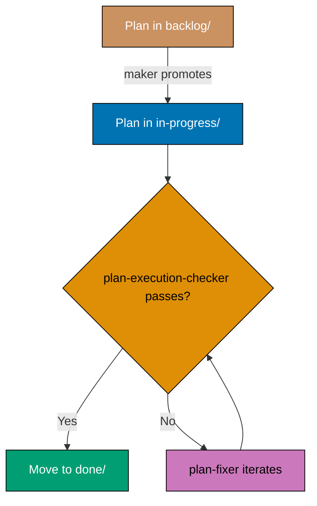

# Plans Organization Convention

<!--
  MAINTENANCE NOTE: Master reference for plans organization
  This convention is referenced by:
  1. plans/README.md (brief landing page with link to this convention)
  2. AGENTS.md (summary with link to this convention)
  3. .claude/agents/plan-maker.md (reference to this convention)
  When updating, ensure all references remain accurate.
-->

This document defines the standards for organizing project planning documents in the `plans/` folder. Plans are temporary, ephemeral documents used for project planning and tracking, distinct from permanent documentation in `docs/`.

## Principles Implemented/Respected

This convention implements the following core principles:

- **[Simplicity Over Complexity](../../principles/general/simplicity-over-complexity.md)**: Flat structure with three clear states (backlog, in-progress, done). No complex nested hierarchies or status tracking systems.

- **[Explicit Over Implicit](../../principles/software-engineering/explicit-over-implicit.md)**: The stage-aware naming convention makes chronological order and lifecycle state explicit. `backlog/` uses a creation-date prefix; `in-progress/` uses no date (the plan is live, not yet stamped); `done/` uses a completion-date prefix. File location (backlog/, in-progress/, done/) indicates status — no hidden metadata or databases required.

## Purpose

This convention establishes the organizational structure for project planning documents in the `plans/` directory. It defines how to organize ideas, backlog, in-progress work, and completed projects using date-based folder naming and standardized lifecycle stages.

## Scope

### What This Convention Covers

- **Plans directory structure** - ideas.md, backlog/, in-progress/, done/ organization
- **Folder naming pattern** - stage-aware: date prefix in `backlog/` (creation date) and `done/` (completion date); no date prefix in `in-progress/`
- **File organization** - What files belong in each folder
- **Lifecycle stages** - How plans move from ideas → backlog → in-progress → done
- **Project identifiers** - How to name projects consistently

### What This Convention Does NOT Cover

- **Plan content format** - How to write plans (covered by plan-checker agent)
- **Project management methodology** - This is file organization, not PM process
- **Task tracking** - Covered by the [plan-execution workflow](../../workflows/plan/plan-execution.md) (orchestrated directly by the calling context)
- **Deployment scheduling** - Covered in deployment conventions

## Overview

The `plans/` folder serves as the workspace for project planning activities:

- **Purpose**: Temporary project planning and tracking
- **Location**: Root-level `plans/` folder (not inside `docs/`)
- **Lifecycle**: Plans move between subfolders as work progresses
- **Format**: Structured markdown documents following specific naming and organization conventions

**Key Distinction**: Plans are temporary working documents that eventually move to `done/` and may be archived, while `docs/` contains permanent documentation that evolves over time.

**No secrets in plans**: Plan documents are committed to git — including `done/` history, which is permanent. Never put a secret value (credentials, SSH keys, tokens, API keys, sensitive usernames, or connection strings with real credentials) in any plan. Name the variable and state where the value lives, never the value itself. This is a hard iron rule — see [No Secrets in Committed Files Convention](../security/no-secrets-in-committed-files.md).

## ️ Folder Structure

The `plans/` folder is organized into four main components:

```
plans/
├── ideas.md         # Quick 1-3 liner ideas not yet formalized into plans
├── backlog/         # Planned projects for future implementation
├── in-progress/     # Active plans currently being worked on
└── done/            # Completed and archived plans
```

### Subfolder Purposes

**backlog/** - Planning Queue

- Contains plans that are ready for implementation but not yet started
- Plans are fully structured with requirements, tech docs, and delivery sections
- Each subfolder has a `README.md` listing all plans in backlog

**in-progress/** - Active Work

- Contains plans currently being executed
- Plans being actively worked on by the team
- Limited to a small number of concurrent plans (prevents context switching)
- Each subfolder has a `README.md` listing all active plans

**done/** - Completed Work

- Contains completed and archived plans
- Plans are moved here when implementation is finished
- Serves as historical record of project evolution
- Each subfolder has a `README.md` listing all completed plans

## Ideas File

**Location**: `plans/ideas.md` (root level of plans/ folder)

**Purpose**: Capture quick ideas and todos that haven't been formalized into full plan documents yet.

### Characteristics

- **Lightweight**: Simple markdown file with bullet points or numbered lists
- **Quick Capture**: Each idea should be 1-3 lines maximum
- **No Structure**: No formal plan structure required
- **Brainstorming**: Ideas that need more thought before becoming formal plans

### Format

```markdown
# Ideas

Quick ideas and todos that haven't been formalized into plans yet.

- Add OAuth2 authentication system with Google and GitHub providers
- Implement real-time notification system using WebSockets
- Create admin dashboard for user management and analytics
- Optimize database queries for better performance
```

### Difference from backlog/

- **ideas.md**: 1-3 liner quick captures without detailed structure
- **backlog/**: Full plan folders with structured requirements, tech-docs, and delivery files

### Promoting an Idea to a Plan

When an idea is ready for formal planning:

1. Create a new plan folder in `backlog/` with `YYYY-MM-DD__[project-identifier]/` format
2. Create the standard plan files (README.md or multi-file structure)
3. Remove or check off the idea from `ideas.md`
4. The idea now has a structured plan with requirements, technical docs, and delivery timeline

## Plan Folder Naming

Naming differs by lifecycle stage. Each stage has its own rule.

### backlog/ — creation date prefix

```
YYYY-MM-DD__[project-identifier]/
```

The date is the day the plan folder was created.

### in-progress/ — NO date prefix

```
[project-identifier]/
```

Active plans carry no date prefix at all. The date is added only when the plan is archived to
`done/`. When moving a plan from `backlog/` to `in-progress/`, strip the date prefix.

### done/ — completion date prefix

```
YYYY-MM-DD__[project-identifier]/
```

The date is the day the plan was completed (last git-committed), NOT the creation date. When
archiving from `in-progress/`, add the completion date prefix.

### Naming Rules (all stages)

- **Date Format**: ISO 8601 (`YYYY-MM-DD`)
- **Separator**: Double underscore `__` separates date from identifier
- **Identifier**: Kebab-case (lowercase with hyphens)
- **No Spaces**: Use hyphens instead of spaces
- **No Special Characters**: Only alphanumeric and hyphens in identifier

### Examples

**Good (backlog/)**:

- `backlog/2025-11-24__init-monorepo/`
- `backlog/2025-12-01__auth-system/`
- `backlog/2025-12-05__payment-integration/`

**Good (in-progress/)**:

- `in-progress/mobile-app-redesign/`
- `in-progress/auth-system/`
- `in-progress/payment-integration/`

**Good (done/)**:

- `done/2025-11-24__init-monorepo/` (completion date)
- `done/2026-01-15__mobile-app-redesign/` (completion date)

**Bad**:

- `in-progress/2026-01-15__mobile-app-redesign/` (date prefix in in-progress — WRONG)
- `2025-11-24_init-monorepo/` (single underscore)
- `2025-11-24__Init Monorepo/` (capital letters, spaces)
- `2025-11-24__init_monorepo/` (underscores in identifier)

## Plan Contents

> **No secrets (HARD RULE)**: Plan documents are committed to git. NEVER place system secrets
> — SSH keys, passwords, sensitive usernames, API keys, tokens, or connection strings with real
> credentials — in any plan file. Reference secrets by variable name and location only (e.g.
> "set `DEPLOY_TOKEN` in `.env`"); real values belong in uncommitted files. See the
> [No Secrets in Committed Files Convention](../security/no-secrets-in-committed-files.md).

Plans can use either **single-file** or **multi-file** structure depending on size and complexity.

### Structure Decision

**Multi-File Structure** (DEFAULT — five documents):

Every new plan MUST use the five-document multi-file layout unless ALL of the exception criteria listed under Single-File Structure are met. When in doubt, use five documents.

- Five separate files: `README.md`, `brd.md`, `prd.md`, `tech-docs.md`, `delivery.md`
- Each file owns one concern (see Content-Placement Rules below), so diffs stay narrow per PR and cross-reviewers can find the section relevant to their concern without skimming an omnibus file

**Single-File Structure** (exception — only when ALL criteria below are met):

A plan MAY collapse to a single `README.md` only when **all** of the following hold simultaneously:

1. Combined business rationale + product scope + tech-docs + delivery fits within 1000 lines total
2. The condensed BRD and condensed PRD sections both fit comfortably in the README without crowding out the technical sections
3. The plan touches at most one subrepo or one narrow concern (single-phase, no new agents/workflows/conventions introduced)
4. The author does not foresee the plan growing mid-execution

If any criterion is unmet, use the five-document layout. If the plan grows past 1000 lines or any criterion is violated mid-execution, promote to the multi-file layout before continuing execution.

**Decision Rule**: The five-document multi-file layout is the required default. Single-file is a bounded exception that requires all four criteria above to be satisfied, not merely a choice based on line-count alone.

### Single-File Structure

```
2025-12-01__feature-name/
└── README.md                # All-in-one plan document
```

**README.md sections** (mandatory, in order):

1. **Context** — project description, background, non-technical framing
2. **Scope** — in-scope + out-of-scope; affected subrepos / apps named explicitly
3. **Business rationale (condensed BRD)** — why this matters, business goals, affected roles, success metrics (gut-based reasoning OK; judgment calls labeled; fabricated KPIs forbidden; internet citations inline with excerpt + URL + access date)
4. **Product requirements (condensed PRD)** — user stories (`As a … I want … So that …`), Gherkin acceptance criteria, product scope
5. **Technical approach** — architecture, design decisions, implementation approach
6. **Worktree** — declared worktree path (`worktrees/<plan-identifier>/`) and provisioning command (see [Worktree Specification](#worktree-specification))
7. **Delivery checklist** — phased `- [ ]` items with one concrete action per checkbox; opens with the `[AI]`/`[HUMAN]` executor legend; every phase ends with a `### Phase N Gate` and a Pause Safety note (see Executor Tagging and Phases as Natural Pauses With Clear Gates above)
8. **Quality gates** — local gates + CI gates that must pass
9. **Verification** — how to confirm the plan is done

If the author cannot comfortably fit both the condensed BRD and condensed PRD sections into the README without crowding out the technical sections, promote the plan to the five-document multi-file layout before execution begins.

### Multi-File Structure

```
2025-12-01__feature-name/
├── README.md                # Plan overview and navigation
├── brd.md                   # Business Requirements Document
├── prd.md                   # Product Requirements Document
├── tech-docs.md             # Technical documentation and architecture
└── delivery.md              # Step-by-step delivery checklist
```

**File purposes**:

- **README.md**: High-level overview and navigation — Context, Scope (with affected subrepos / apps named explicitly), Approach Summary, and links to the other four files. First file a reader opens; first file checkers parse for scope.
- **brd.md** — **Business Requirements Document**: business goal and rationale ("why are we doing this"), business impact, affected roles, business-level success metrics, business-scope Non-Goals, business risks and mitigations. Content-placement container, not a sign-off artifact — code review is the only approval gate in this repo.
- **prd.md** — **Product Requirements Document**: product overview, personas, user stories (`As a … I want … So that …`), acceptance criteria in Gherkin, product scope (in-scope + out-of-scope features), product-level risks.
- **tech-docs.md**: architecture, design decisions with rationale, file-impact analysis, mechanics, dependencies, risks, rollback. No step-by-step checklist.
- **delivery.md**: sequential, ticked checklist of executable steps (`- [ ]`), organized by phase if needed. Plan-execution workflow reads this file to drive execution; `plan-execution-checker` reads it to verify completion. Opens with the `[AI]`/`[HUMAN]` executor legend; each phase ends with a `### Phase N Gate` (must-pass verification) followed by a Pause Safety note.

### Content-Placement Rules (brd.md vs prd.md)

Authoritative split between `brd.md` and `prd.md`. These rules are normative for `plan-maker` / `plan-checker` / `plan-fixer` — the agents share one definition to avoid drift.

> **Solo-maintainer framing**: BRD and PRD are **content-placement containers**, not sign-off artifacts. This repo has one maintainer collaborating with AI agents; code review (the PR) is the only approval gate. The convention MUST NOT introduce sponsor sign-off, stakeholder approval ceremonies, or role-based gates.

**Goes in `brd.md` (business perspective)**:

- Business goal and rationale ("why are we doing this")
- Business impact (pain points, expected benefits)
- Affected roles (which hats the maintainer wears; which agents consume the file) — **not** sign-off mapping
- Business-level success metrics. BRD does not require every claim to be data-driven — gut-based reasoning is acceptable **when the logic supports the claim**. What is NOT acceptable: fabricated numeric targets (percentages, durations, counts) presented as already-measured facts when no baseline exists. Options when writing a success metric:
  1. **Observable fact** (preferred): cite a grep/git/agent-round-trip check that verifies on demand (e.g., "zero plans using the deprecated layout after migration").
  2. **Cited measurement**: reference an existing dashboard, prior measurement, or external data source. When you cite data pulled from the internet, include the data itself in the plan (specific number, quote, excerpt) alongside the URL and the access date. URL-only citations are not enough — links rot.
  3. **Qualitative reasoning**: state the structural claim plainly without a number.
  4. **Judgment call / gut target**: allowed, but MUST be explicitly labeled (e.g., "_Judgment call:_ we expect review time to drop; no baseline measured").
- Business-scope Non-Goals
- Business risks and mitigations

**Goes in `prd.md` (product perspective)**:

- Product overview (what is being built)
- Personas (hats the maintainer wears; agents that consume the file) — **not** external stakeholder roles
- User stories (`As a … I want … So that …`)
- Acceptance criteria in Gherkin
- Product scope (in-scope features, out-of-scope features)
- Product-level risks (UX, feature interaction)

**Ambiguous cases**: When a concern is genuinely cross-cutting (e.g., a success criterion is both a business-level fact and a product acceptance criterion), place the **factual claim or judgment** in `brd.md` and the **testable scenario** in `prd.md`, cross-linking between them. Do not duplicate the full content. If the BRD side is a judgment call rather than a measured fact, label it as such — do not fabricate a number and pretend it was measured.

### Granular Checklist Items in delivery.md

Every checkbox in `delivery.md` must represent exactly one concrete, independently verifiable action. Multi-step work hidden behind a single checkbox defeats the purpose of a checklist: it makes progress invisible and creates ambiguity about what "done" means.

**Rule**: One checkbox = one concrete action. If completing the item requires multiple distinct steps, split it into multiple checkboxes.

**Bad** (too coarse — hides multiple steps):

```markdown
- [ ] Implement coverage merging with all formats and tests
```

**Good** (granular — each item is independently completable):

```markdown
- [ ] Create `internal/testcoverage/merge.go` with format-agnostic merge logic
- [ ] Implement `CoverageMap` type for normalized per-line data
- [ ] Add parsers to return `CoverageMap` from each format
- [ ] Write unit tests for merge logic (same format, cross-format, overlapping)
```

**Test for granularity**: Each checkbox must pass this test — can you verify it is done without completing anything else on the list? If the answer is no, the item is too coarse.

### Execution-Grade Clarity (HARD RULE)

Plans are executed by execution-grade (sonnet-tier) agents, not planning-grade agents. Authoring-grade clarity is not sufficient — every checkbox MUST be unambiguous at execution time without consulting additional context.

**Each checkbox MUST contain all of the following that apply:**

- **Explicit file path(s)**: Name the exact file path(s) when known (e.g., `apps/crud-be-ts-effect/src/middleware/auth.ts`). When the path cannot be determined at authoring time (e.g., a new file whose location is implementation-dependent), provide the maximum-possible-detail target: parent directory + naming pattern + sibling reference (e.g., "new file under `apps/crud-be-ts-effect/src/` following the pattern of sibling `auth.ts`").
- **Explicit shell command(s)**: State the verbatim invocation when a command is involved (e.g., `npx nx run crud-be-ts-effect:test:quick`), not a vague instruction like "run the lint".
- **Concrete acceptance criterion**: State the observable change that proves done (e.g., "all assertions in `trpc.test.ts` pass" or "`nx run crud-be-ts-effect:typecheck` exits 0"). No bare "implement X", "set up Y", or "configure Z" without a concrete verifiable outcome.

**HARD RULE**: `plan-checker` flags violations of this rule as HIGH severity. `plan-fixer` rewrites offending items with maximum detail.

**Bad** (missing path, missing command, missing criterion):

```markdown
- [ ] Add caching
```

**Good** (explicit path, explicit command, explicit criterion):

```markdown
- [ ] Edit `apps/crud-be-ts-effect/src/middleware/auth.ts`: wrap the public router with
      `unstable_cache(..., { revalidate: 300 })`. Verify by running
      `npx nx run crud-be-ts-effect:test:quick` — all tests pass.
```

**Acceptance Criteria**: All user stories in `prd.md` (or the condensed PRD section of a single-file plan's `README.md`) must include testable acceptance criteria using Gherkin format. See [Acceptance Criteria Convention](../../development/infra/acceptance-criteria.md) for complete details, including the HARD rule that every `Scenario` uses exactly one primary `Given`, one `When`, and one `Then` (extras chained with `And`/`But`). See [HARD Rule — Step-Keyword Cardinality](../../development/infra/acceptance-criteria.md#hard-rule--step-keyword-cardinality).

### Executor Tagging — [AI] vs [HUMAN] (HARD RULE)

Every delivery checklist item MUST make clear **who can execute it**. Some work cannot be done by an AI agent at all — physical actions (unplug a power cable, swap a drive, press a hardware button), out-of-band approvals (approve a production deploy, accept a contract), or actions requiring real credentials or authority the agent must not hold. Marking executor capability up front lets the executor hand off cleanly to the human at the right moment instead of fabricating a completion, and tells the human exactly what they must do personally.

**Tags**:

- **`[AI]`** — an AI agent can fully perform the step (edit files, run commands, call tools). This is the **default**: an unmarked checkbox is treated as `[AI]`.
- **`[HUMAN]`** — only a human can perform the step. Reserve for physical-world actions, out-of-band approvals or sign-offs, actions requiring real secrets or privileged credentials the agent must not access, and decisions requiring real-world authority (legal, financial, safety).
- **`[AI+HUMAN]`** (optional) — AI prepares or drafts; a human reviews, approves, or performs the irreversible final action.

**Bias to `[AI]` (HARD RULE)**: prefer `[AI]` as much as possible and use `[HUMAN]` as little as possible. Tag a step `[HUMAN]` ONLY when it is genuinely inevitable — physically impossible for an agent, unsafe, or requiring real-world authority or credentials an agent must not hold — OR when the plan author or user has explicitly asked for `[HUMAN]` on that step. Before tagging `[HUMAN]`, first try to engineer a sanctioned `[AI]` path (for example, a scripted action through an approved guard). When both an `[AI]` and a `[HUMAN]` path would accomplish the step, choose `[AI]`.

**Placement**: the tag goes at the START of the checkbox text, immediately after `- [ ]`:

```markdown
- [ ] [AI] Edit `apps/crud-be-ts-effect/src/middleware/auth.ts`: … — acceptance: …
- [ ] [HUMAN] Unplug the power cable to the test rig and confirm the LED is off — acceptance: operator confirms power removed
```

**Legend (required)**: every `delivery.md` (or a single-file plan's Delivery Checklist section) MUST open with a short legend defining the tags it uses and stating that unmarked steps are `[AI]`:

```markdown
> **Legend** — `[AI]`: an agent performs the step (the default; unmarked steps are `[AI]`).
> `[HUMAN]`: only a human can do it (physical action, out-of-band approval, real-secret or
> privileged-credential handling). `[AI+HUMAN]`: agent prepares, human approves or finishes.
```

**Default bias**: prefer `[AI]` for anything an agent can mechanically do; reserve `[HUMAN]` for what is genuinely impossible or unsafe for AI. When a sanctioned channel lets an agent do something that looks human-only (for example, copying a real secret via an `[AI]`-authored script through the [`guard-env-file-access`](../security/env-file-access.md) sanctioned path), it stays `[AI]` — document the channel inline.

**Execution semantics**: when the [plan-execution workflow](../../workflows/plan/plan-execution.md) reaches a `[HUMAN]` item, it STOPS, surfaces the item to the user with the instruction and the acceptance criterion, and waits for the human to confirm completion before continuing. A `[HUMAN]` step is a legitimate, expected stop — it overrides the "never stop between phases" execution default.

**Enforcement**: `plan-checker` flags as **HIGH** any delivery checkbox describing an action no agent can perform (physical or out-of-band) that is tagged `[AI]` or left unmarked, and flags a missing top-of-file legend as **MEDIUM**. `plan-fixer` adds the legend and corrects mis-tags.

### Phases as Natural Pauses With Clear Gates (HARD RULE)

Every phase in a delivery checklist MUST be designed as a **natural pause point** that ends with a **clear gate**. A reader — human or AI — must be able to stop after any phase and find the repository in a coherent, non-broken state.

**Natural pause point**: at every phase boundary the working tree is internally consistent — code compiles, tests pass, nothing is half-applied, no build is knowingly broken. No phase ends mid-refactor or carries a known-red state into the next phase.

**Clear gate**: every phase ends with a `### Phase N Gate` subsection — a must-pass verification checklist whose items state the exact commands and the observable acceptance criterion. Phase N+1 MUST NOT begin while any check in phase N's gate is failing. Gate items carry executor tags like any other checkbox (usually `[AI]` verification commands; a gate MAY be a `[HUMAN]` approval, which makes the boundary a hand-off point — see [Executor Tagging](#executor-tagging--ai-vs-human-hard-rule) above).

**Pause Safety note**: immediately after each `### Phase N Gate`, add a short **Pause Safety** blockquote stating (a) the safe-to-stop state reached after the phase and (b) the single command to resume or re-verify. This makes the natural-pause property explicit and auditable.

**Template**:

```markdown
## Phase N: <name>

- [ ] [AI] <work item> — acceptance: <observable outcome>
- [ ] [AI] <work item> — acceptance: <observable outcome>

### Phase N Gate

> All checks below must pass before starting Phase N+1. If any check fails, fix it in Phase N
> before proceeding.

- [ ] [AI] `<verification command>` — <acceptance>
- [ ] [AI] `<verification command>` — <acceptance>

> **Pause Safety**: <what coherent state exists after this phase; what has and has not changed>.
> Safe to stop. To resume: `<single command to re-verify>`.
```

Order phases so each builds on a green predecessor. Phase 0 (Environment Setup and Baseline) already follows this shape — its gate is the recorded clean baseline.

**Enforcement**: `plan-checker` flags any phase lacking a `### Phase N Gate` as **HIGH**, and flags a gate lacking concrete verification commands or criteria, or a missing Pause Safety note, as **MEDIUM**. `plan-execution-checker` verifies each phase gate was satisfied before the next phase's work began (via git history). `plan-fixer` adds missing gates and Pause Safety notes.

### Applicability (Execution Markers + Phase Gates)

Both HARD RULES above — Executor Tagging and Phases as Natural Pauses With Clear Gates — apply to **net-new plans at authoring time**: a plan created after this convention landed MUST comply from creation, and `plan-checker` flags missing markers or gates as HIGH on those plans.

**In-progress plans authored before this convention are grandfathered and retrofitted lazily**: a plan already under `plans/in-progress/` when the convention landed is not retroactively invalid. Each phase gains its `[AI]`/`[HUMAN]` markers and its `### Phase N Gate` + **Pause Safety** note the next time that phase is touched during execution (the executor adds them as it works the phase). Do NOT bulk-fabricate gate checks for unstarted phases of a pre-existing plan — fabricated, ungroundable acceptance checks violate the anti-hallucination rule. `plan-checker` does not raise HIGH findings against grandfathered in-progress plans solely for missing markers/gates; it flags them only on the phases being newly added or edited. New plans get no such grace.

### Worktree Specification

Every plan MUST declare the worktree path in its content so the executor can verify the execution environment before reading the delivery checklist.

**Where to declare**:

- **Multi-file plans**: Add a top-level `## Worktree` section in `delivery.md`, placed before any phase heading.
- **Single-file plans**: Add a `## Worktree` section in `README.md`, placed before the `## Delivery Checklist` section.

**Worktree path format**: `worktrees/<plan-identifier>/` where `<plan-identifier>` is the slug portion of the folder name (strip the `YYYY-MM-DD__` prefix when present).

- `backlog/2026-05-15__auth-rewrite/` → worktree path `worktrees/auth-rewrite/`
- `in-progress/auth-rewrite/` → worktree path `worktrees/auth-rewrite/` (no prefix to strip)
- `backlog/2026-03-01__add-user-search/` → worktree path `worktrees/add-user-search/`

**Provisioning command** (optional manual pre-provisioning, run from repo root):

```bash
claude --worktree <plan-identifier>
```

Manual pre-provisioning is OPTIONAL: the [plan-execution workflow Step 0 gate](../../workflows/plan/plan-execution.md#0-enter-the-designated-worktree-sequential-hard-gate) enters the declared worktree by default — navigating to it when it already exists, and auto-provisioning it from the latest `origin/main` when it does not.

**Executor lifecycle** (enforced by the plan-execution workflow):

1. **Enter or provision**: execution always happens inside the declared worktree. The executor navigates to it if it exists, or provisions it from the latest `origin/main` (`git fetch origin && git worktree add -b <plan-identifier> worktrees/<plan-identifier> origin/main`) if it does not.
2. **Freshness sync**: before any implementation, the worktree is synced with the latest `origin/main` (ff-merge, or rebase when the worktree carries local commits). Dirty state or rebase conflicts stop execution for an explicit user decision.
3. **Prompted cleanup**: when the plan completes (`pass`), is archived, and all work is pushed to `origin main`, the executor verifies nothing is uncommitted or unpushed and then PROMPTS the user before deleting the worktree and its local branch. Worktrees are never deleted without explicit confirmation, and never deleted on `partial`/`fail`.

**This requirement applies to ALL plans regardless of size** — pure-docs, single-file, and trivial plans included. No exceptions.

See [Worktree Path Convention](./worktree-path.md) for the full routing and directory structure specification.

**Example `## Worktree` block** (delivery.md or README.md):

````markdown
## Worktree

Worktree path: `worktrees/auth-rewrite/`

Optional manual pre-provisioning (run from repo root):

\```bash
claude --worktree auth-rewrite
\```

The plan-execution Step 0 gate enters this worktree by default: it auto-provisions from the latest `origin/main` when missing, syncs with `origin/main` before implementing, and prompts before deleting the worktree after the plan is archived and pushed.
````

### Important Note on File Naming

Files inside plan folders use descriptive kebab-case names or short industry-standard acronyms (e.g., `brd.md`, `prd.md`, `tech-docs.md`, `delivery.md`). The folder structure provides sufficient context, so the filename only needs to describe its purpose.

## Key Differences from Documentation

Plans differ from `docs/` in several important ways:

| Aspect           | Plans (`plans/`)                      | Documentation (`docs/`)              |
| ---------------- | ------------------------------------- | ------------------------------------ |
| **Location**     | Root-level `plans/` folder            | Root-level `docs/` folder            |
| **Purpose**      | Temporary project planning            | Permanent documentation              |
| **File Naming**  | Kebab-case by purpose                 | Kebab-case describing content        |
| **Lifecycle**    | Move between in-progress/backlog/done | Evolve and update in place           |
| **Audience**     | Project team, stakeholders            | All users, contributors, maintainers |
| **Longevity**    | Temporary (archived in done/)         | Permanent (evolves over time)        |
| **Organization** | By project and status                 | By Diátaxis category                 |

## Working with Plans

### Creating Plans

1. **Start with an idea**: Capture quick idea in `ideas.md` (1-3 lines)
2. **Formalize when ready**: Create plan folder in `backlog/` when idea is mature
3. **Follow naming convention**: Use `YYYY-MM-DD__[project-identifier]/` format with the creation date
4. **Choose structure**: Default to the five-document multi-file layout (`README.md`, `brd.md`, `prd.md`, `tech-docs.md`, `delivery.md`). Collapse to single-file only when all four exception criteria in the Structure Decision section are met simultaneously.
5. **Resolve design decisions via structured grilling**: Before writing plan content, resolve all
   open design decisions using the
   [Grilling-With-Options Convention](../../development/workflow/grilling-with-options.md) — structured
   multiple-choice questions with 2-4 concrete options, explicit trade-offs, and exactly one Recommended
   option. Never ask open-ended "what approach?" questions without offering structured options.
6. **Create content**: Write overview, requirements, tech docs, and delivery sections
7. **Update index**: Add plan to `backlog/README.md`

### Starting Work

1. **Provision worktree** (optional — the plan-execution Step 0 gate auto-provisions from the latest `origin/main` when missing): Run `claude --worktree <plan-identifier>` from the repo root — this creates `worktrees/<plan-identifier>/` in the repo root (not `.claude/worktrees/`). See [Worktree Path Convention](./worktree-path.md).
2. **Initialize toolchain**: In the root worktree, run `npm install && npm run doctor -- --fix`. See [Worktree Toolchain Initialization](../../development/workflow/worktree-setup.md).
3. **Move and rename folder**: Move plan folder from `backlog/YYYY-MM-DD__[identifier]/` to `in-progress/[identifier]/` — strip the date prefix when moving to `in-progress/`.
4. **Update index**: Update both `backlog/README.md` and `in-progress/README.md`
5. **Git commit**: Commit the move with appropriate message
6. **Begin execution**: Start implementing according to delivery checklist

### Completing Work

1. **Verify completion**: Ensure all deliverables and acceptance criteria met
2. **Add completion date prefix**: Rename folder from `in-progress/[identifier]/` to `done/YYYY-MM-DD__[identifier]/` using today's date (the completion date, not the original creation date)
3. **Move folder**: Move renamed folder to `done/`
4. **Update index**: Update both `in-progress/README.md` and `done/README.md`
5. **Git commit**: Commit the move with completion message
6. **Archive**: Plan is now archived for historical reference

### Plan Index Files

Each subfolder (`backlog/`, `in-progress/`, `done/`) has a `README.md` that:

- Lists all plans in that category
- Provides brief description of each plan
- Links to each plan folder
- Updated whenever plans are added, moved, or removed

## Diagrams in Plans

Files in `plans/` folder MUST use **Mermaid diagrams** as the primary format (same as all markdown files in the repository).

**Opening principle — diagram-rich plans**: Plans should visualize structure, flow, and decisions liberally rather than describing them in prose. The bias is additive: when a concept involves more than two interacting parts, an ordering, a lifecycle, or a branch, draw it. A redundant diagram costs less than a missed architectural ambiguity.

**Diagram Standards**:

- **Primary Format**: Mermaid diagrams for all flowcharts, architecture diagrams, sequences
- **ASCII Art**: Optional, only for simple directory trees or rare edge cases
- **Orientation**: Default to left-to-right (`flowchart LR` / `graph LR`) per the [Diagram and Schema Convention](../formatting/diagrams.md); use top-down only when semantically required
- **Colors**: Use color-blind friendly palette from [Color Accessibility Convention](../formatting/color-accessibility.md)

**Why Mermaid**:

- Renders properly in GitHub and most markdown viewers
- Version-controllable (text-based)
- Easy to update and maintain
- Supports multiple diagram types (flowchart, sequence, class, ER, etc.)

### Diagram Coverage Contract

This is the named enforcement contract that governs diagram expectations across plan files. All three plan agents — **plan-maker**, **plan-checker**, and **plan-fixer** — operate against these rules.

#### Per-Document Diagram Opportunity Guide

Each plan file has predictable diagram opportunities. Authors and validators use this guide to determine where diagrams are warranted.

| Plan File      | Diagram types typically warranted                                                                                                                                                                                                                                     |
| -------------- | --------------------------------------------------------------------------------------------------------------------------------------------------------------------------------------------------------------------------------------------------------------------- |
| `README.md`    | Architecture and component-interaction flowcharts (`flowchart LR`) when the plan touches multiple services/agents/apps; ER diagrams (`erDiagram`) for data-model changes                                                                                              |
| `tech-docs.md` | Architecture and component-interaction flowcharts (`flowchart LR`); sequence diagrams (`sequenceDiagram`) for cross-system or cross-agent order-of-operations; state diagrams (`stateDiagram-v2`) for entity lifecycles; ER diagrams (`erDiagram`) for schema changes |
| `delivery.md`  | Phase/dependency flowcharts (`flowchart LR` or `flowchart TD`) showing phase ordering and gate flow when phases have non-linear dependencies or parallel tracks                                                                                                       |
| `prd.md`       | User-flow and decision-branch flowcharts (`flowchart LR`) for non-trivial UX flows with more than one branch or outcome                                                                                                                                               |
| `brd.md`       | Stakeholder or role-interaction diagrams when multiple roles interact in non-obvious ways; generally diagram-light unless the business process has branches                                                                                                           |

#### When a Plan MUST Include a Diagram

A plan MUST include at least one Mermaid diagram when the plan covers any of the following concerns and a reader would otherwise have to reconstruct the picture mentally from prose:

- **Component interactions** — which services, agents, apps, or libraries call which, and through what contract (flowchart or C4-style diagram)
- **Sequence or flow between agents or systems** — order-of-operations across processes, including async hand-offs and timeouts (sequenceDiagram)
- **State transitions** — lifecycle of an entity (plan folder, request, deployment, entitlement) with named states and triggered transitions (stateDiagram-v2)
- **Decision branches** — non-trivial conditional logic with more than two outcomes or nested decisions (flowchart with labelled edges)

#### Agent Responsibilities Under This Contract

- **plan-maker** MUST proactively add diagrams wherever the per-document opportunity guide applies — not wait to be asked. Consult the guide for each file as it is authored; if the content fits a listed opportunity, include the diagram.
- **plan-checker** MUST flag a MISSING diagram as a **MEDIUM** finding when a plan file's prose clearly describes component interactions, cross-system/agent sequences, entity state transitions, or multi-outcome/nested decision branches but contains NO corresponding Mermaid diagram. This is separate from (and in addition to) the existing ASCII-should-be-Mermaid check.
- **plan-fixer** adds the missing diagram (HIGH confidence, auto-apply) when the plan prose unambiguously describes a flow, sequence, state, or decision that can be drawn directly from the text; when relationships are ambiguous or not fully grounded in the plan text, flags for plan-maker rather than fabricating — never invents relationships not present in the plan.

### When a Plan MAY Skip Diagrams

Text-only is acceptable only when the plan is genuinely linear and trivially small:

- Single-file README-only plans touching one file or one config value
- Renames, copy edits, documentation fixes
- Dependency bumps with no behavioural change

This escape hatch keeps the Diagram Coverage Contract proportionate — do not apply it to plans with substantive architectural, product, or delivery complexity.

### Accessibility and Palette Requirements

All plan diagrams MUST follow repository diagram standards: use the color-blind friendly palette, mobile-friendly orientation, and correct Mermaid comment syntax. Key invariants:

- Never use red, green, or yellow fills in diagram nodes — these are invisible or ambiguous for the most common color-blindness types.
- Always use black borders (`stroke:#000000`) and white text (`color:#FFFFFF`) on dark fills.
- Use only the eight verified accessible hex codes: `#0173B2` (blue), `#DE8F05` (orange), `#029E73` (teal), `#CC78BC` (purple), `#CA9161` (brown), `#808080` (gray), `#000000` (black), `#FFFFFF` (white).

This convention does **not** redefine those rules in full — consult the authoritative sources:

- **Palette and WCAG AA rules** — [Color Accessibility Convention](../formatting/color-accessibility.md) — authoritative source for the verified palette, hex codes, contrast ratios, and color-blindness coverage
- **Diagram syntax and orientation** — [Diagram and Schema Convention](../formatting/diagrams.md) for full Mermaid syntax, ASCII fallback rules, LR orientation default, and width constraints
- **Palette and accessibility Skill** — [`docs-creating-accessible-diagrams`](../../../.claude/skills/docs-creating-accessible-diagrams/SKILL.md) for the verified WCAG-compliant hex codes, dos and don'ts, and agent-usable reference

### Example: Plan-Appropriate Flowchart

A plan introducing a multi-step approval flow benefits from a decision-branch diagram:

````markdown

````

The same scope described only in prose ("plans move from backlog to in-progress to done, with a check-fix loop if validation fails") forces every reader to rebuild the branching mentally; the diagram makes the loop explicit.

For complete diagram standards, see [Diagram and Schema Convention](../formatting/diagrams.md).

## Relative Link Paths in Plan Files

Plan files sit three directory levels deep from the repository root: `plans/` → `in-progress/` (or `backlog/` or `done/`) → `[identifier]/` (in-progress) or `YYYY-MM-DD__identifier/` (backlog and done). Any markdown file inside a plan folder must use `../../../` to reach root-level directories such as `repo-governance/`, `docs/`, `apps/`, or `libs/`.

### Correct Path Depth

| Target from a plan file                          | Correct prefix |
| ------------------------------------------------ | -------------- |
| `repo-governance/conventions/structure/plans.md` | `../../../`    |
| `docs/how-to/organize-work.md`                   | `../../../`    |
| `apps/crud-be-ts-effect/README.md`               | `../../../`    |
| Sibling file in the same plan folder             | `./`           |

### Example

A plan at `plans/in-progress/my-feature/README.md` links to the AI Agents Convention:

```markdown
<!-- PASS: Three levels up to reach repo root, then down into repo-governance/ -->

[AI Agents Convention](../../../repo-governance/development/agents/ai-agents.md)
```

```markdown
<!-- FAIL: Only two levels up — resolves to plans/repo-governance/ (does not exist) -->

[AI Agents Convention](../../repo-governance/development/agents/ai-agents.md)
```

### Why Three Levels

The plan subfolder adds a third level of nesting that `docs/` files at two levels deep (e.g., `repo-governance/conventions/structure/plans.md`) do not have. Forgetting this extra level produces a path that points into the `plans/` directory tree instead of the repository root.

Use the verification tip from the [Linking Convention](../formatting/linking.md#verification-tip): start at the plan file's location, count each `../` as one directory up, and confirm you reach the repo root before descending into the target directory.

## Related Documentation

**Decision Guides**:

- [How to Organize Your Work](../../../docs/how-to/organize-work.md) - Decision guide for choosing between plans/ and docs/

**Related Conventions**:

- [Acceptance Criteria Convention](../../development/infra/acceptance-criteria.md) - Writing testable acceptance criteria using Gherkin format
- [Diátaxis Framework](./diataxis-framework.md) - Organization of `docs/` directory
- [File Naming Convention](./file-naming.md) - Naming files within `docs/` (not applicable to plans/)
- [Diagram and Schema Convention](../formatting/diagrams.md) - Standards for Mermaid diagrams
- [Color Accessibility Convention](../formatting/color-accessibility.md) - Verified accessible palette, WCAG AA requirements, and color-blindness coverage for all diagram fills
- [Worktree Path Convention](./worktree-path.md) - Worktree routing to `worktrees/<name>/` (referenced by the Worktree Specification rule above)
- [Plan Anti-Hallucination Convention](../../development/quality/plan-anti-hallucination.md) - Pre-write verification recipes, repo-grounding rule, refuse-on-uncertainty, anti-pattern catalog (AP-1 through AP-10), specialized-executor annotation; consumed by the Execution-Grade Clarity rule above and by the four plan agents
- [No Secrets in Committed Files Convention](../security/no-secrets-in-committed-files.md) - Hard iron rule prohibiting secret values in any committed file, including plans and their permanent `done/` history
- [Grilling-With-Options Convention](../../development/workflow/grilling-with-options.md) - Every grill question during plan creation (pre-write, post-write) MUST present 2-4 concrete options with trade-off descriptions; open-ended questions without options are FORBIDDEN; consumed by plan-maker Steps 1 and 8

**Development Guides**:

- [AI Agents Convention](../../development/agents/ai-agents.md) - Standards for AI agents (including `plan-maker`, `plan-checker`, `plan-fixer`, `plan-execution-checker`)

## Best Practices

### Keep Plans Focused

- One plan per project or major feature
- Break large initiatives into multiple plans
- Each plan should have clear, achievable scope

### Update Plans as You Go

- Plans are living documents during execution
- Update technical docs when making design decisions
- Check off deliverables as completed
- Add notes about challenges or learnings

### Use Ideas File Liberally

- Capture ideas quickly without overthinking
- Don't worry about perfect wording
- Review ideas periodically and promote mature ones to plans
- Archive or delete ideas that are no longer relevant

### Maintain Indices

- Always update subfolder README.md when moving plans
- Keep descriptions current and accurate
- Remove completed plans from in-progress index promptly

### Never Put Secrets in Plans

Plans are committed to git, so the [No Secrets in Committed Files](../security/no-secrets-in-committed-files.md) hard iron
rule applies in full. Never paste system secrets (SSH/private keys, passwords, API tokens, privileged
usernames, certificates, connection strings, and similar) into any plan document. When a plan must
reference a secret, name the environment variable (e.g. `DATABASE_URL`) or use a placeholder
(`<API_TOKEN>`); the real value lives in an uncommitted `.env*` file (except `.env.example`) or
another gitignored file.

### Archive Completed Plans

- Don't delete completed plans - move them to `done/`
- Completed plans serve as historical record
- Review past plans to learn from successes and challenges
- Use completed plans as templates for similar future work

## Examples

### Example: Small Plan (Single-File)

```
2025-12-05__add-user-search/
└── README.md                # ~400 lines total
```

**README.md structure**:

```markdown
# Add User Search Feature

## Context

Brief description and background...

## Scope

In-scope features, out-of-scope items, affected apps...

## Business Rationale (condensed BRD)

Why this matters, affected roles, success metrics (observable facts preferred; judgment calls labeled)...

## Product Requirements (condensed PRD)

User stories (As a … I want … So that …), Gherkin acceptance criteria, product scope...

## Technical Approach

API design, database changes, implementation notes...

## Delivery Checklist

Phased `- [ ]` items, one action per checkbox...

## Quality Gates

`nx affected -t typecheck lint test:quick specs:coverage`, markdown lint, manual verification...

## Verification

How to confirm done...
```

### Example: Large Plan (Multi-File)

```
2025-12-05__migrate-to-microservices/
├── README.md                # ~100 lines (overview + navigation)
├── brd.md                   # ~150 lines (business goal, impact, affected roles, success metrics)
├── prd.md                   # ~250 lines (personas, user stories, Gherkin acceptance criteria, product scope)
├── tech-docs.md             # ~800 lines (architecture + API specs + file impact analysis)
└── delivery.md              # ~200 lines (phased rollout plan)
```

### Example: Ideas File

```markdown
# Ideas

Quick ideas and todos that haven't been formalized into plans yet.

## Authentication & Security

- Add OAuth2 support for Google and GitHub
- Implement API rate limiting
- Add 2FA support for admin accounts

## Performance

- Optimize database queries with proper indexing
- Add Redis caching layer
- Implement CDN for static assets

## User Experience

- Add dark mode toggle
- Implement keyboard shortcuts
- Add progressive web app support
```
