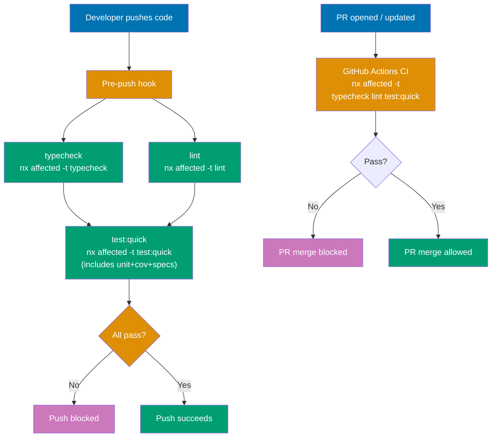
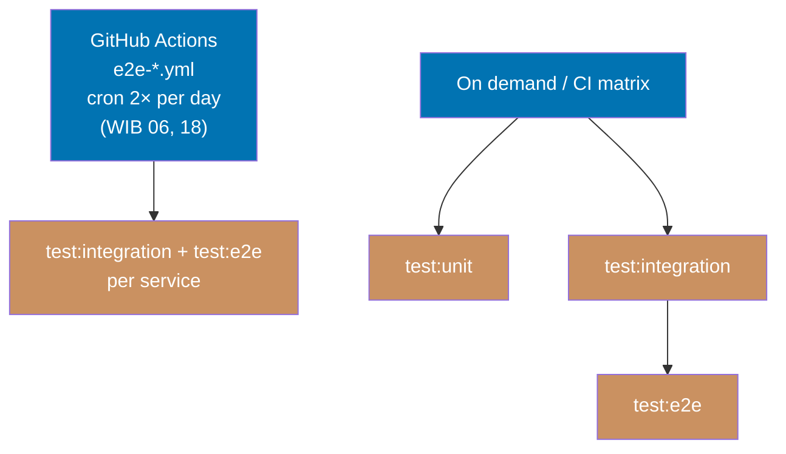

# Nx Target Standards

Defines the standard Nx targets that apps and libs expose, what each target must do, and naming conventions that keep all projects consistent across the workspace.

## Execution Model

### Quality Gates (pre-push enforcement)

`typecheck`, `lint`, and `test:quick` run at three identical checkpoints: locally before push, in
the PR gate, and at main merge. `test:quick` is a sequential 5-step composition
(typecheck → lint → test:unit → test:coverage → test:specs) so the specs gate is already
folded in — there is no separate `specs:behavior:coverage` step at pre-push or PR.



### Scheduled and On-Demand Testing

Deeper tests run outside the pre-push/PR cycle — on a schedule or triggered explicitly.

Scheduled CRON workflows run 5 parallel tracks: lint, typecheck, test:quick (with coverage), specs:behavior:coverage, and integration→e2e (sequential chain).



## Principles Implemented/Respected

- **[Explicit Over Implicit](../../principles/software-engineering/explicit-over-implicit.md)**: Every project declares its capabilities through explicit targets. No implicit build or test mechanisms — if a project supports unit tests, it declares `test:unit`; if it has integration tests, it declares `test:integration`; if it has a dev server, it declares `dev`. The composition of `test:quick` is explicit in each project's `project.json`.

- **[Automation Over Manual](../../principles/software-engineering/automation-over-manual.md)**: Targets integrate with Nx affected computation, caching, the pre-push hook, and the PR merge gate. Consistent naming allows workspace-level automation (`nx affected -t test:quick`) to work across all project types without special cases.

- **[Simplicity Over Complexity](../../principles/general/simplicity-over-complexity.md)**: The mandatory-six targets (`test:unit`, `test:integration`, `test:e2e`, `test:quick`, `lint`, `typecheck`) use echo placeholders rather than omitting targets, so `nx affected -t <target>` covers every project uniformly with no special-casing. A Rust CLI does not need `dev` or `start`. The `test:specs` aggregate collects all `specs:*` validators into one target so the pre-push hook invokes the full specs gate through `test:quick` without separate gate steps.

## Conventions Implemented/Respected

- **[File Naming Convention](../../conventions/structure/file-naming.md)**: `project.json` follows Nx workspace conventions; target names follow the kebab-case + colon-variant pattern defined here.

- **[Reproducible Environments Convention](../workflow/reproducible-environments.md)**: Projects with local dependencies expose an `install` target so dependency state is always explicit and reproducible.

- **[Three-Level Testing Standard](../quality/three-level-testing-standard.md)**: The `test:unit`, `test:integration`, and `test:e2e` targets defined here map to the mandatory three-level testing architecture. Each target's isolation boundaries, caching rules, and CI schedule derive from that standard.

## Target Naming Standards

Use these canonical names. Aliases (`serve`, `start:dev`, `unit-test`) are anti-patterns.

| Target                    | Purpose                                                                                                                                                                                                                                                                                                      | When Required                      |
| ------------------------- | ------------------------------------------------------------------------------------------------------------------------------------------------------------------------------------------------------------------------------------------------------------------------------------------------------------ | ---------------------------------- |
| `build`                   | Produce deployable or runnable artifacts                                                                                                                                                                                                                                                                     | Compiled and bundled projects      |
| `typecheck`               | Verify type correctness without producing artifacts                                                                                                                                                                                                                                                          | Statically typed languages         |
| `lint`                    | Static analysis, code style checks, and static a11y checks (oxlint jsx-a11y for TS UI projects)                                                                                                                                                                                                              | All projects                       |
| `test:quick`              | Sequential 5-step quality gate (`typecheck` → `lint` → `test:unit` → `test:coverage` → `test:specs`); runs with `parallel: false`; enforced at pre-push, PR, and main merge                                                                                                                                  | All projects                       |
| `specs:behavior:coverage` | Validate Gherkin feature/scenario coverage at the behavior level; every scenario exercised at the correct test level (renamed from `specs:coverage`)                                                                                                                                                         | All apps and E2E runners           |
| `specs:domain:coverage`   | Validate domain-area coverage gated by the explicit `specs.domain-areas` allowlist in `repo-config.yml` (not folder-presence)                                                                                                                                                                                | All apps                           |
| `test:specs`              | Aggregate of every `specs:*` validator for the project (`specs:structure-validation`, `specs:behavior:coverage`, `specs:domain:coverage` where in the `specs.domain-areas` allowlist; `echo` elsewhere); present on all projects; runs inside `test:quick` — replaces the separate specs-structural gate job | All projects (echo where no specs) |
| `test:unit`               | Isolated unit tests with mocked dependencies; must consume Gherkin specs; `echo` placeholder where no real unit tests exist                                                                                                                                                                                  | All projects (echo where N/A)      |
| `test:coverage`           | Native coverage gate (≥ 90% line coverage) per project via native test runner; `echo` where `test:unit` is `echo`                                                                                                                                                                                            | All projects (echo where N/A)      |
| `test:integration`        | Demo-be: real PostgreSQL via docker-compose, direct code calls (no HTTP); others: in-process mocking (MSW, Godog); `echo` placeholder where no real integration tests exist                                                                                                                                  | All projects (echo where N/A)      |
| `test:e2e`                | Real Playwright tests driving the running app over HTTP/UI — **only** on `*-e2e` projects; `echo` on all non-e2e projects; runs on scheduled CRON only (never pre-push/PR)                                                                                                                                   | All projects (echo on non-e2e)     |
| `test:e2e:ui`             | Run E2E tests with interactive Playwright UI                                                                                                                                                                                                                                                                 | E2E test projects                  |
| `test:e2e:report`         | Open the last E2E HTML report                                                                                                                                                                                                                                                                                | E2E test projects                  |
| `dev`                     | Start local development server with hot-reload                                                                                                                                                                                                                                                               | Apps with dev servers              |
| `start`                   | Start server in production mode                                                                                                                                                                                                                                                                              | Apps with production server mode   |
| `run`                     | Execute the application directly                                                                                                                                                                                                                                                                             | CLI applications                   |
| `codegen`                 | Generate code from OpenAPI contract spec into `generated-contracts/`                                                                                                                                                                                                                                         | Demo apps with contract types      |
| `docs`                    | Generate browsable API documentation from contract spec                                                                                                                                                                                                                                                      | Contract spec projects             |
| `install`                 | Install project-local dependencies                                                                                                                                                                                                                                                                           | E2E suites, Rust CLIs              |
| `clean`                   | Remove build artifacts and caches                                                                                                                                                                                                                                                                            | Projects with large build outputs  |

### Naming Rules

- Use `dev` for the development server — never `serve`, never `start:dev`
- Use `start` for the production server — never `serve`
- Use `test:quick` for the sequential 5-step quality gate (typecheck → lint → test:unit → test:coverage → test:specs); `test:unit` for isolated unit tests with mocked dependencies (Rust CLI apps consume Gherkin specs at this level; `echo` where N/A); `test:integration` for tests with real infrastructure (demo-be: PostgreSQL via docker-compose) or in-process mocking (MSW, Godog) — `echo` where N/A; `test:e2e` for Playwright E2E tests on `*-e2e` projects (CRON-only; `echo` on non-e2e projects); `test:coverage` for the native per-project coverage gate (≥ 90% line; `echo` where `test:unit` is `echo`); `test:specs` for the aggregate of all `specs:*` validators (runs inside `test:quick`); `specs:behavior:coverage` for Gherkin behavior-level coverage validation; `specs:domain:coverage` for domain-area coverage gated by `repo-config.yml`
- Separate target variants with a colon (`build:web`, `test:e2e:ui`), not a hyphen or underscore
- All target names use lowercase with hyphens for multi-word names (`run-pre-commit`)

### `{domain}:{work}` Naming for Governance and Validation Targets

Governance, validation, lint, and format targets use the `{domain}:{work}` scheme rather than the
`validate:*` prefix. The domain names the scope or subject of the check; the work names the
operation. This distinguishes governance targets from language-level lifecycle targets
(`test:quick`, `build`, etc.) and makes the Nx target list self-describing.

**Canonical governance and validation targets** (defined on `rhino-cli`):

| Target                                 | What it validates                                                                          |
| -------------------------------------- | ------------------------------------------------------------------------------------------ |
| `specs:behavior:coverage`              | Gherkin feature/scenario coverage at the behavior level (renamed from `specs:coverage`)    |
| `specs:domain:coverage`                | Domain-area coverage gated by the `specs.domain-areas` allowlist in `repo-config.yml`      |
| `specs:structure-validation`           | Adoption + tree shape + counts validated together (merged from three removed leaf targets) |
| `specs:gherkin-cardinality-validation` | Each Gherkin keyword used within cardinality bounds                                        |
| `links:validation`                     | Internal links in all non-excluded `.md` files                                             |
| `mermaid:validation`                   | Mermaid diagram width, label, and syntax rules (flowchart + state)                         |
| `headings:hierarchy-validation`        | Heading nesting in prose allowlist paths                                                   |
| `env:validation`                       | `.env.example` surfaces match the `env-contract:` section in `repo-config.yml`             |
| `naming:harness-validation`            | Agent definition file names match the naming convention                                    |
| `naming:workflows-validation`          | Workflow file names match the naming convention                                            |
| `governance:vendor-audit-validation`   | `repo-governance/` docs contain no vendor-specific content                                 |
| `cross-vendor:parity-validation`       | Cross-vendor behavioral parity (Phase 0 deterministic invariants)                          |
| `instruction-size:validation`          | Byte budget on auto-loaded instruction files (`AGENTS.md`, `CLAUDE.md`, harness surfaces)  |
| `harness:bindings-validation`          | `.claude/` ↔ `.opencode/` ↔ `.amazonq/` binding parity                                     |
| `compat:min-version`                   | Minimum Supported Rust Version compatibility                                               |

**Rule**: governance/validation target keys are `{domain}:{work}` where both parts are lowercase
kebab-case. The domain must be a recognizable noun (the scope); the work must be a verb phrase
ending in `-validation` (for pure checks) or a bare verb (`check`). Do not invent `validate:*`
prefixes — use the canonical list above or follow the `{domain}:{work}` pattern.

See [nx-target-naming.md](./nx-target-naming.md) for the full derivation rule and examples.

### Formatting and File-Type Linting (lint-staged, not Nx targets)

Formatting and several file-type lint checks are **not** Nx targets. They run as
[lint-staged](https://github.com/lint-staged/lint-staged) entries in `.husky/pre-commit`, keyed by
glob pattern. The membership rule: a check belongs in lint-staged if and only if it is (a)
file-type based (selected by a path glob) and (b) per-file isolated — its result does not depend on
any other file's content.

**Formatting** — direct CLI, one entry per shipped file type (no per-project `format` or
`format:check` Nx target):

| Glob                                              | Formatter                                                       |
| ------------------------------------------------- | --------------------------------------------------------------- |
| `*.{md,json,yml,yaml,css,scss,js,jsx,ts,tsx,...}` | `prettier --write`                                              |
| `*.rs`                                            | `rustfmt`                                                       |
| `*.fs`                                            | `fantomas`                                                      |
| `*.go`                                            | `gofmt -w`                                                      |
| `*.py`                                            | `ruff format`                                                   |
| `*.dart`                                          | `dart format`                                                   |
| `*.clj`                                           | `cljfmt fix` (native binary)                                    |
| `*.cs`                                            | `dotnet csharpier format`                                       |
| `*.{ex,exs}`                                      | `scripts/format-elixir.sh` (CWD-aware wrapper for `mix format`) |

The per-project `format` and `format:check` Nx targets are **not standard lifecycle targets** and
**must not be added**. Only Elixir uses a wrapper script because `mix format` requires the project
root to resolve `.formatter.exs`; every other formatter accepts bare file-path arguments.

**Tool linting** — also lint-staged file-type entries, **not** Nx targets:

| Glob                             | Tool                                   |
| -------------------------------- | -------------------------------------- |
| `*.sh`                           | `shellcheck --severity=warning`        |
| `Dockerfile`, `*.Dockerfile`     | `hadolint --failure-threshold warning` |
| `.github/workflows/*.{yml,yaml}` | `actionlint`                           |

These are **not** Nx targets. Targets such as `shell:lint`, `dockerfiles:lint`, and `actions:lint`
**must not exist** as Nx targets — they are lint-staged entries that run over the changed file set
at pre-commit.

## Tag Convention

Tags are the standard mechanism for attaching structured metadata to projects in `project.json`. Nx uses tags for boundary enforcement (`@nx/enforce-module-boundaries`), graph filtering (`nx graph --focus`), and `nx affected` scoping. Consistent tags across the workspace allow tooling to query by project kind, framework, language, or product domain without parsing project names.

### Four-Dimension Scheme

Every project declares tags along four dimensions. Each dimension uses a fixed prefix and a controlled vocabulary.

| Dimension | Prefix      | Allowed Values                                                             | Required                       | Purpose                                                       |
| --------- | ----------- | -------------------------------------------------------------------------- | ------------------------------ | ------------------------------------------------------------- |
| Type      | `type:`     | `app`, `lib`, `e2e`                                                        | Always                         | Distinguishes deployable apps, reusable libs, and test suites |
| Platform  | `platform:` | `cli`, `nextjs`, `axum`, `playwright`                                      | Apps and e2e projects          | Framework or runtime environment                              |
| Language  | `lang:`     | `ts`, `rust`, `dotnet`                                                     | Projects with application code | Primary language of source code                               |
| Domain    | `domain:`   | `ayokoding`, `crane`, `ose`, `organiclever`, `wahidyankf`, `tooling`, `ui` | Always                         | Business or product domain                                    |

### Special Rules

**Rust libs omit `platform:`**: A Rust library has no framework or runtime boundary — only a primary language. Declare `type:lib` and `lang:rust`; omit `platform:`.

**Use `domain:tooling` for general-purpose utilities**: Projects that are not tied to a specific product domain (e.g., `rhino-cli`) use `domain:tooling`. Use a product domain tag only when the project belongs exclusively to that product.

### Current Project Tags

| Project                    | Tags                                                                     |
| -------------------------- | ------------------------------------------------------------------------ |
| `ayokoding-www`            | `["type:app", "platform:nextjs", "lang:ts", "domain:ayokoding"]`         |
| `ayokoding-cli`            | `["type:app", "platform:cli", "lang:rust", "domain:ayokoding"]`          |
| `rhino-cli`                | `["type:app", "platform:cli", "lang:rust", "domain:tooling"]`            |
| `organiclever-app-web`     | `["type:app", "platform:nextjs", "lang:ts", "domain:organiclever"]`      |
| `organiclever-be`          | `["type:app", "platform:giraffe", "lang:dotnet", "domain:organiclever"]` |
| `organiclever-app-web-e2e` | `["type:e2e", "platform:playwright", "lang:ts", "domain:organiclever"]`  |
| `organiclever-be-e2e`      | `["type:e2e", "platform:playwright", "lang:ts", "domain:organiclever"]`  |
| `ose-cli`                  | `["type:app", "platform:cli", "lang:rust", "domain:ose"]`                |
| `ose-www`                  | `["type:app", "platform:nextjs", "lang:ts", "domain:ose"]`               |
| `wahidyankf-www`           | `["type:app", "platform:nextjs", "lang:ts", "domain:wahidyankf"]`        |
| `wahidyankf-www-fe-e2e`    | `["type:e2e", "platform:playwright", "lang:ts", "domain:wahidyankf"]`    |
| `rust-commons`             | `["type:lib", "lang:rust"]`                                              |

### Example: Complete Tag Declaration

An F#/Giraffe backend app declares all four dimensions:

```json
{
  "name": "organiclever-be",
  "tags": ["type:app", "platform:giraffe", "lang:dotnet", "domain:organiclever"]
}
```

A Rust lib has no platform boundary and no domain, so it omits both:

```json
{
  "name": "rust-commons",
  "tags": ["type:lib", "lang:rust"]
}
```

### Anti-Patterns

- **Omitting required dimensions**: Every project must declare `type:` and `domain:`. Omitting them breaks graph queries and boundary rules that rely on these dimensions.
- **Inventing non-standard values**: Adding values outside the controlled vocabulary (e.g., `platform:express`, `lang:javascript`, `domain:internal`) fragments the tag space. Add new values only by updating this convention.
- **Using a non-prefixed format**: Tags must use the `dimension:value` prefix format (e.g., `type:app`). Bare tags such as `app` or `golang` are not queryable by dimension.
- **Adding a `stack:` dimension**: The four-dimension scheme captures type, platform, language, and domain. A separate `stack:` field duplicates `platform:` and `lang:` without adding information. Use the defined dimensions instead.
- **Tagging apps with `domain:tooling` when they belong to a product**: `domain:tooling` is for general-purpose dev utilities with no product affiliation. An app that serves a specific product must carry that product's domain tag.

## Mandatory Targets by Project Type

### Summary Matrix

Per the mandatory-six rule, every project declares all six targets (`test:unit`, `test:integration`,
`test:e2e`, `test:quick`, `lint`, `typecheck`). In this matrix, **"echo"** means the target is
declared as a no-op echo placeholder — it is present but does no real work. `specs:behavior:coverage`
is compulsory for all apps and E2E runners.

| Project Type | `test:unit` | `test:integration` | `test:e2e` | `test:quick` | `specs:behavior:coverage` | `lint` | `build` | `typecheck`  |
| ------------ | ----------- | ------------------ | ---------- | ------------ | ------------------------- | ------ | ------- | ------------ |
| API Backend  | Yes         | Yes (PG)           | echo (†)   | Yes          | Yes                       | Yes    | Yes     | Yes (all 11) |
| Web UI App   | Yes         | Yes (MSW)          | echo (†)   | Yes          | Yes                       | Yes    | Yes     | If typed     |
| Demo-fe FE   | Yes         | echo               | echo (†)   | Yes          | Yes                       | Yes    | Yes     | If typed     |
| Fullstack    | Yes         | Yes                | echo (†)   | Yes          | Yes                       | Yes    | Yes     | If typed     |
| CLI App      | Yes         | Yes                | echo       | Yes          | Yes                       | Yes    | Yes     | If typed     |
| Library      | Yes         | Optional / echo    | echo       | Yes          | Yes                       | Yes    | —       | If typed     |
| E2E Runner   | echo        | echo               | Yes        | Yes          | Yes                       | Yes    | —       | If typed     |

† E2E tests live in dedicated `*-e2e` runner projects; non-e2e projects declare `test:e2e: echo "no e2e tests"`.

**Product backend `typecheck` examples** (all statically typed backends use `typecheck` with `dependsOn: ["codegen"]` where codegen applies):

| Backend           | `typecheck` command                                                   |
| ----------------- | --------------------------------------------------------------------- |
| `organiclever-be` | `dotnet build apps/organiclever-be/organiclever-be.fsproj -c Release` |

> For polyglot backend `typecheck` patterns (Go, F#, Java, Kotlin, Python, Rust, Elixir, TypeScript, C#, Clojure), see the [ose-primer](https://github.com/wahidyankf/ose-primer) repository.

**CI schedules**: Per-service "Test" workflows run 2× daily (WIB 06, 18) combining `test:integration` and `test:e2e` for each service. `typecheck`, `lint`, and `test:quick` run on every push to main and every PR (all three gates are identical — see All-Four-Gates Rule below).

### All Projects

#### Mandatory-Six Targets

Every direct child of `apps/` or `libs/` registered with Nx (i.e. has a `project.json`) **must declare
all six targets below**, even when the body is a no-op `echo` placeholder. This ensures
`nx affected -t <target>` covers every project uniformly with no special-casing.

| Target             | Requirement                                                                                                                                                                                      |
| ------------------ | ------------------------------------------------------------------------------------------------------------------------------------------------------------------------------------------------ |
| `test:unit`        | Isolated unit tests with mocked dependencies; must consume Gherkin specs. `echo "no unit tests"` where no real unit tests exist                                                                  |
| `test:integration` | Service-level or in-process integration tests; real PostgreSQL (BE) or MSW/PGlite (FE). `echo "no integration tests"` where no real integration tests exist                                      |
| `test:e2e`         | Playwright E2E tests over HTTP/UI — real only on `*-e2e` projects; CRON-only (never pre-push/PR). `echo "no e2e tests"` on all non-e2e projects                                                  |
| `test:quick`       | Sequential 5-step gate — see canonical composition below; enforced at pre-push, PR merge gate, and main merge gate                                                                               |
| `lint`             | Static analysis and code-style checks; exit non-zero on violations; UI projects add `oxlint --jsx-a11y-plugin`. `echo` is not acceptable here — every project must have a real linter            |
| `typecheck`        | Type-correctness check without emitting artifacts (`tsc --noEmit`, `dotnet build`, `cargo check`). `echo "no typecheck"` for dynamically typed projects where compilation already enforces types |

**Echo-placeholder rule**: Declaring `test:unit: echo "no unit tests"` (or `test:integration`, `test:e2e`)
as a mandatory placeholder is **required** for projects where the real implementation does not apply — it
is **not** an anti-pattern. Omitting the target entirely is the anti-pattern. Echo placeholders enable
`nx affected -t test:unit` (and similar) to run workspace-wide without special-casing.

#### Required-Where-Applicable Targets

Not part of the mandatory-six; declared only when the condition applies:

| Target                    | Condition                                                                                                                                                                                   |
| ------------------------- | ------------------------------------------------------------------------------------------------------------------------------------------------------------------------------------------- |
| `build`                   | Compiled and bundled projects only (Rust, .NET, Next.js); not required for interpreted-language projects without a compile step                                                             |
| `test:coverage`           | Wherever `test:unit` is real: native coverage gate (≥ 90% line) via `vitest --coverage`, `cargo llvm-cov`, or `dotnet test` coverage gate. `echo "no coverage"` where `test:unit` is `echo` |
| `specs:behavior:coverage` | All apps and E2E runners; validates Gherkin feature/scenario coverage at the behavior level                                                                                                 |
| `specs:domain:coverage`   | Projects listed in the `specs.domain-areas` allowlist in `repo-config.yml` (not folder-presence); `echo` elsewhere                                                                          |
| `test:specs`              | All projects (echo where no specs); aggregate of `specs:structure-validation`, `specs:behavior:coverage`, and `specs:domain:coverage` — runs inside `test:quick`                            |

#### Canonical `test:quick` Composition

`test:quick` is a **sequential** `nx:run-commands` with `"parallel": false` running in this **exact order**:

1. `nx run <project>:typecheck`
2. `nx run <project>:lint`
3. `nx run <project>:test:unit` (plain/fast smoke)
4. `nx run <project>:test:coverage` (same suite under coverage, ≥ 90% line)
5. `nx run <project>:test:specs` (all `specs:*` validators)

It reuses each sibling target's definition and Nx cache. Order is guaranteed by `parallel: false`.
It stops at the first failing step. Because `test:quick` composes `test:unit` + `test:coverage` +
`test:specs`, **all three must be present on every project** (echo where N/A).

Canonical example for a Rust CLI project (`rhino-cli`):

```json
{
  "test:quick": {
    "executor": "nx:run-commands",
    "cache": true,
    "inputs": [
      "{projectRoot}/src/**/*.rs",
      "{projectRoot}/tests/**/*.rs",
      "{projectRoot}/Cargo.toml",
      "{projectRoot}/Cargo.lock",
      "{workspaceRoot}/specs/apps/rhino/**/*.feature"
    ],
    "options": {
      "commands": [
        "nx run rhino-cli:typecheck",
        "nx run rhino-cli:lint",
        "nx run rhino-cli:test:unit",
        "nx run rhino-cli:test:coverage",
        "nx run rhino-cli:test:specs"
      ],
      "parallel": false
    }
  }
}
```

> For polyglot `test:quick` composition patterns (Go, Java, Kotlin, Python, Elixir, TypeScript, C#,
> Clojure, Dart/Flutter, F#), see the [ose-primer](https://github.com/wahidyankf/ose-primer) repository.

#### All-Four-Gates Rule

**Gate rule**: `(pre-commit ∪ pre-push) == PR gate == main gate`.

| Gate       | What runs                                                                               | When                               |
| ---------- | --------------------------------------------------------------------------------------- | ---------------------------------- |
| Pre-commit | Formatting only (lint-staged: prettier, rustfmt, fantomas, gofmt, …)                    | Every commit                       |
| Pre-push   | `typecheck`, `lint`, `test:quick` (includes `test:unit`, `test:coverage`, `test:specs`) | Every push                         |
| PR gate    | Identical to pre-push                                                                   | Every PR open / update             |
| Main gate  | Identical to pre-push                                                                   | Every merge to main                |
| CRON-only  | `test:integration`, `test:e2e`                                                          | Scheduled CI (2× daily, WIB 06/18) |

`test:integration` and `test:e2e` are **CRON-only** — they run in scheduled CI workflows (2× daily at
WIB 06:00 and 18:00), never in the pre-push hook or PR gate. This keeps the pre-push gate fast while
ensuring continuous coverage.

### Statically Typed Projects

TypeScript and other statically typed projects:

| Target      | Requirement                                                                |
| ----------- | -------------------------------------------------------------------------- |
| `typecheck` | Run the type checker without emitting artifacts (`tsc --noEmit`, `mypy .`) |

**Statically typed backends declare `typecheck`** with `dependsOn: ["codegen"]` where contract codegen applies. The `ose-be` example: `dotnet build apps/ose-be/ose-be.fsproj -c Release`.

**Not required for dynamically typed languages** (plain JavaScript, Ruby) or languages where
compilation already enforces types and `build` covers it — except when an additional static
analysis pass is warranted.

> For polyglot `typecheck` patterns in Go, Java, Kotlin, Python, Rust, Elixir, TypeScript, C#, F#, and Clojure backends, see the [ose-primer](https://github.com/wahidyankf/ose-primer) repository.

### Compiled and Bundled Projects

Projects that produce artifacts from a compilation or bundling step (Rust, .NET, Next.js):

| Target  | Requirement                                                          |
| ------- | -------------------------------------------------------------------- |
| `build` | Produce production-ready artifacts; declare `outputs` for Nx caching |

**Not required for interpreted languages** (plain Node.js scripts) where the source is the deployable artifact.

### Apps with Development Servers

Next.js and Axum apps:

| Target | Requirement                                       |
| ------ | ------------------------------------------------- |
| `dev`  | Start local server with live-reload or watch mode |

### Apps with Production Server Mode

Next.js and Axum apps:

| Target  | Requirement                |
| ------- | -------------------------- |
| `start` | Serve the production build |

### Projects with Unit Tests

Rust, .NET, TypeScript apps:

| Target      | Requirement                                                          |
| ----------- | -------------------------------------------------------------------- |
| `test:unit` | Run only isolated unit tests; must not require any external services |

### Projects with Integration Tests

Two integration test patterns exist depending on project type:

| Pattern             | Projects                                              | Requirement                                                                                                                                                | Cacheable |
| ------------------- | ----------------------------------------------------- | ---------------------------------------------------------------------------------------------------------------------------------------------------------- | --------- |
| Docker + PostgreSQL | API backends (`organiclever-be`)                      | Real PostgreSQL via `docker-compose.integration.yml`; calls application code directly (no HTTP layer); runs all shared Gherkin scenarios; fresh DB per run | No        |
| In-process mocking  | `organiclever-app-web` (MSW), Rust CLIs (cucumber-rs) | In-process mocking only (MSW / cucumber-rs / mock fixtures); no real database or external services; fully deterministic                                    | Yes       |

**API backends** expose `test:integration` which runs `docker compose -f docker-compose.integration.yml up --abort-on-container-exit --build`. This starts a fresh PostgreSQL container, runs migrations, and executes all shared Gherkin scenarios by calling application service/repository functions directly — no HTTP layer. Each backend has a `docker-compose.integration.yml` (postgres + test runner services) and a `Dockerfile.integration` (language runtime + test execution). Coverage is NOT measured at the integration level — coverage comes from `test:unit` only.

> For polyglot `test:integration` Docker infrastructure patterns across 11 backend languages, see the [ose-primer](https://github.com/wahidyankf/ose-primer) repository.

**Rust CLIs** (`ayokoding-cli`, `ose-cli`, `rhino-cli`) consume Gherkin specs at both test levels. Each command has two test files:

- `{domain}_{action}_test.rs` (unit, inline `#[cfg(test)]` or separate file) — cucumber-rs unit step definitions; runs in `test:quick` via `cargo test`; mocks all I/O via injected function types; coverage measured here
- `tests/{domain}_{action}_integration_test.rs` — cucumber-rs integration step definitions; drives the command via process invocation against controlled `/tmp` filesystem fixtures; runs in `test:integration`

Both levels consume the same feature file `@tag`. See
[BDD Spec-to-Test Mapping Convention](./bdd-spec-test-mapping.md) for the mandatory 1:1 mapping
between commands and feature file `@tags`.

**Rust libs** (`rust-commons`) expose `test:unit` using the standard `cargo test` harness with
`cargo-llvm-cov` for coverage. Because libs have no CLI commands, unit tests call the public API
directly. Feature files live in `specs/libs/{lib-name}/`.

### CLI Applications

Rust CLIs and similar tools:

| Target    | Requirement                                         |
| --------- | --------------------------------------------------- |
| `run`     | Execute the application (`cargo run` or equivalent) |
| `install` | Sync dependencies (`cargo build` or equivalent)     |

### E2E Test Projects

Playwright suites (`*-e2e`):

| Target            | Requirement                  |
| ----------------- | ---------------------------- |
| `install`         | Install npm dependencies     |
| `test:e2e`        | Run all tests headlessly     |
| `test:e2e:ui`     | Run tests with Playwright UI |
| `test:e2e:report` | Open the HTML test report    |

**Execution strategy**: `test:e2e` is **not** part of the pre-push hook. It runs on scheduled GitHub Actions cron jobs (2x daily at WIB 06:00 and 18:00) in per-service "Test" workflows that combine `test:integration` + `test:e2e` for each service. This keeps pre-push fast while ensuring continuous integration and E2E coverage.

**BDD suites**: When the E2E project uses playwright-bdd, `test:e2e` runs
`npx bddgen && npx playwright test`. The `bddgen` step regenerates `.features-gen/`
spec files from the Gherkin feature files before Playwright executes them.
See `apps/organiclever-be-e2e/project.json` for a canonical product-app example.

**API backend `test:integration` with docker-compose**: API backends expose `test:integration`
which runs `docker compose -f docker-compose.integration.yml down -v && docker compose -f docker-compose.integration.yml up --abort-on-container-exit --build`.
Each backend's `docker-compose.integration.yml` defines a `postgres` service (postgres:17-alpine with healthcheck)
and a `test-runner` service that depends on PostgreSQL being healthy. The test runner runs migrations,
optionally loads seed data, then executes all shared Gherkin scenarios
by calling application service/repository functions directly — no HTTP layer. The specs volume is
mounted read-only at `../../specs:/specs:ro`. After tests complete, `docker-compose` tears down all
containers and volumes.

### Specs:Behavior:Coverage Projects

`specs:behavior:coverage` is compulsory for ALL apps and E2E runners (renamed from `specs:coverage`).
It validates Gherkin feature/scenario coverage at the behavior level — every scenario must be
exercised at the correct test level. It is enforced by the pre-push hook alongside `typecheck`,
`lint`, and `test:quick`, as well as in all scheduled Test CI workflows.

**Command flags used across project types**:

| Flag                         | Purpose                                                                                                                                                                                                                                                                                    |
| ---------------------------- | ------------------------------------------------------------------------------------------------------------------------------------------------------------------------------------------------------------------------------------------------------------------------------------------ |
| `--shared-steps`             | Validates steps across ALL source files rather than requiring 1:1 file-to-feature matching; used by all projects                                                                                                                                                                           |
| `--exclude-dir test-support` | Excludes E2E-only `test-support` API spec files from non-E2E projects; used by demo-be backends and demo-fe frontends                                                                                                                                                                      |
| `--exclude-source-dir <dir>` | Excludes a directory name from the **app-tree source walk only** (never the `.feature`-file walk); for a directory name legitimate in both trees but that must not be scanned as source, e.g. ayokoding-www's Next.js `content/` directory colliding with a Gherkin `content/` spec folder |

**Project coverage status**:

| Project group                                                   | Status   | Notes                                                                                                                   |
| --------------------------------------------------------------- | -------- | ----------------------------------------------------------------------------------------------------------------------- |
| Rust CLI apps (`rhino-cli`, `ayokoding-cli`, `ose-cli`)         | Enforced | `--shared-steps` only; no `--exclude-dir` needed (no test-support specs)                                                |
| API backends (`organiclever-be`)                                | Enforced | `--shared-steps --exclude-dir test-support`                                                                             |
| E2E runners (`organiclever-be-e2e`, `organiclever-app-web-e2e`) | Enforced | `--shared-steps` only; test-support steps are implemented here                                                          |
| Content platforms (`ose-www`)                                   | Enforced | `--shared-steps`                                                                                                        |
| Content platforms (`ayokoding-www`)                             | Enforced | `--shared-steps --exclude-source-dir content` (excludes the Next.js `content/` directory from the app-tree source walk) |
| Web UI apps (`organiclever-app-web`)                            | Enforced | `--shared-steps`                                                                                                        |
| Libraries (`rust-commons`)                                      | Enforced | `--shared-steps`                                                                                                        |
| Projects with genuine step gaps                                 | Deferred | `specs:behavior:coverage` target exists but validation deferred until step implementation is complete                   |

All apps and E2E runners are required to have a `specs:behavior:coverage` target. Projects with
genuine step gaps have the target deferred temporarily until step implementations are complete.

**Nx inputs for `specs:behavior:coverage`**: The target must declare the project's feature files and
source files as inputs so the cache invalidates when specs or step definitions change:

```json
"specs:behavior:coverage": {
  "executor": "nx:run-commands",
  "cache": true,
  "inputs": [
    "{workspaceRoot}/specs/apps/organiclever-be/**/*.feature",
    "{projectRoot}/src/**/*.rs"
  ],
  "options": {
    "command": "rhino-cli specs behavior-coverage validate specs/apps/organiclever-be --shared-steps --exclude-dir test-support apps/organiclever-be/src"
  }
}
```

The exact source directory arguments vary by language. The feature files argument always points to
`{workspaceRoot}/specs/.../**/*.feature` for the project's spec directory.

### Accessibility Testing

Accessibility testing is compulsory for all UI-related projects. It operates at two levels:

**Static a11y linting** (enforced via the `lint` target at all three gates: pre-push hook, PR
quality gate, and scheduled Test CI workflows):

| Project                                                                               | Static a11y tool           |
| ------------------------------------------------------------------------------------- | -------------------------- |
| `organiclever-app-web`, `organiclever-www`, `ayokoding-www`, `ose-www`, `libs/web-ui` | `oxlint --jsx-a11y-plugin` |

Static a11y linting catches common accessibility violations at compile time: missing alt text,
missing ARIA labels, invalid ARIA attributes, missing form labels, and incorrect role usage.

**Runtime accessibility E2E tests** (enforced via `test:e2e` in scheduled CI workflows):

All UI projects must have runtime accessibility E2E tests using `@axe-core/playwright` (axe-core)
covering WCAG AA compliance. These tests verify:

- Color contrast ratios (WCAG AA: 4.5:1 for normal text, 3:1 for large text)
- Keyboard navigation (all interactive elements reachable via Tab/Shift+Tab)
- ARIA labels and roles on interactive elements
- Focus management (focus moves logically, focus traps work correctly)
- Heading hierarchy (no skipped levels, single H1)

**Gherkin accessibility specs**: UI projects must have an `accessibility.feature` file under a
domain subdirectory in `specs/apps/<domain>/fe/gherkin/` (e.g., `accessibility/accessibility.feature`
or `layout/accessibility.feature`). UI component library specs in
`specs/libs/web-ui/gherkin/<component>/` must include "Has no accessibility violations" scenarios for
each component.

## Workspace-Level Defaults

`nx.json` `targetDefaults` provide inherited behaviour for standard targets. Individual `project.json` files override these when the project differs.

```json
{
  "targetDefaults": {
    "build": {
      "dependsOn": ["^build"],
      "outputs": ["{projectRoot}/dist"],
      "cache": true
    },
    "typecheck": {
      "cache": true
    },
    "lint": {
      "cache": true
    },
    "test:quick": {
      "cache": true
    },
    "test:unit": {
      "cache": true
    },
    "test:coverage": {
      "cache": true
    },
    "specs:behavior:coverage": {
      "cache": true
    },
    "specs:domain:coverage": {
      "cache": true
    },
    "test:specs": {
      "cache": true
    },
    "test:integration": {
      "cache": false
    },
    "test:e2e": {
      "cache": false
    }
  }
}
```

### Caching Rules

| Target                    | Cached | Notes                                                                                                                                                                                                                                      |
| ------------------------- | ------ | ------------------------------------------------------------------------------------------------------------------------------------------------------------------------------------------------------------------------------------------ |
| `build`                   | Yes    | Declare `outputs` in `project.json` for cache restoration                                                                                                                                                                                  |
| `typecheck`               | Yes    | Pure analysis; safe to cache against source changes                                                                                                                                                                                        |
| `lint`                    | Yes    | Pure static analysis; safe to cache                                                                                                                                                                                                        |
| `test:quick`              | Yes    | Cache hit skips redundant pre-push runs                                                                                                                                                                                                    |
| `test:unit`               | Yes    | Deterministic; safe to cache against source changes                                                                                                                                                                                        |
| `test:coverage`           | Yes    | Deterministic native coverage gate; safe to cache against source changes                                                                                                                                                                   |
| `specs:behavior:coverage` | Yes    | Pure behavior-level Gherkin coverage analysis; deterministic against source and spec changes                                                                                                                                               |
| `specs:domain:coverage`   | Yes    | Pure domain-area coverage analysis; deterministic against source, spec, and `repo-config.yml` allowlist changes                                                                                                                            |
| `test:specs`              | Yes    | Pure specs validation; deterministic against source, spec, and `repo-config.yml` changes; caches the aggregate of all `specs:*` validators                                                                                                 |
| `test:integration`        | No     | Demo-be backends use real PostgreSQL via docker-compose (non-deterministic external state). Default `cache: false` in `nx.json`. Projects using in-process mocking only (MSW, Godog) may override to `cache: true` in their `project.json` |
| `dev`                     | No     | Long-running process                                                                                                                                                                                                                       |
| `start`                   | No     | Long-running process                                                                                                                                                                                                                       |
| `run`                     | No     | Side-effectful execution                                                                                                                                                                                                                   |
| `test:e2e`                | No     | Requires live app state; run via scheduled cron, not pre-push                                                                                                                                                                              |
| `test:e2e:ui`             | No     | Interactive process                                                                                                                                                                                                                        |
| `test:e2e:report`         | No     | Reads filesystem state at invocation time                                                                                                                                                                                                  |
| `install`                 | No     | Must always run to ensure dep state                                                                                                                                                                                                        |
| `clean`                   | No     | Destructive operation                                                                                                                                                                                                                      |

## Build Output Conventions

Declare the output directory in `project.json` `outputs` to enable Nx cache restoration.

| Project Type | Output Directory        |
| ------------ | ----------------------- |
| Rust CLI     | `{projectRoot}/dist/`   |
| Next.js      | `{projectRoot}/.next/`  |
| Spring Boot  | `{projectRoot}/target/` |

Example override for a Next.js app with custom output:

```json
{
  "targets": {
    "build": {
      "executor": "nx:run-commands",
      "outputs": ["{projectRoot}/.next"],
      "options": { "command": "next build" }
    }
  }
}
```

## Cache and Inputs Convention

Declaring explicit `inputs` in `project.json` ensures Nx invalidates the cache when any relevant
file changes. Without explicit inputs, Nx uses a broad default (all project files) and misses
cross-project dependencies like shared Gherkin specs or generated contracts.

### Canonical Inputs per Language

API backends with contract codegen must include Gherkin specs and generated contracts in `test:unit`
and `test:quick` inputs. The Gherkin specs path always points to
`{workspaceRoot}/specs/apps/<app-name>/**/*.feature`. The generated-contracts path varies by
language:

| Language | Source files                                               | Generated contracts                      | Gherkin specs                                        |
| -------- | ---------------------------------------------------------- | ---------------------------------------- | ---------------------------------------------------- |
| Rust     | `{projectRoot}/src/**/*.rs`, `{projectRoot}/tests/**/*.rs` | `{projectRoot}/generated-contracts/**/*` | `{workspaceRoot}/specs/apps/<app-name>/**/*.feature` |

> For canonical inputs patterns across Go, Java, Kotlin, TypeScript, Python, Elixir, C#, F#, Clojure, and Dart, see the [ose-primer](https://github.com/wahidyankf/ose-primer) repository.

**Rust CLI app** (`rhino-cli`) also consumes Gherkin specs in `test:unit`. Its `test:unit` and `test:quick` inputs must include the CLI's own spec files:

| CLI App     | Gherkin specs input                             |
| ----------- | ----------------------------------------------- |
| `rhino-cli` | `{workspaceRoot}/specs/apps/rhino/**/*.feature` |

Example for `rhino-cli` `test:unit` inputs:

```json
"inputs": [
  "{projectRoot}/src/**/*.rs",
  "{projectRoot}/tests/**/*.rs",
  "{projectRoot}/Cargo.toml",
  "{projectRoot}/Cargo.lock",
  "{workspaceRoot}/specs/apps/rhino/**/*.feature"
]
```

**Rust CLI apps** (`ayokoding-cli`, `ose-cli`) also consume Gherkin specs in `test:unit`. Their `test:unit` and `test:quick` inputs must include the CLI's own spec files:

| CLI App         | Gherkin specs input                                 |
| --------------- | --------------------------------------------------- |
| `ayokoding-cli` | `{workspaceRoot}/specs/apps/ayokoding/**/*.feature` |
| `ose-cli`       | `{workspaceRoot}/specs/apps/ose/**/*.feature`       |

Example for `ayokoding-cli` `test:unit` inputs:

```json
"inputs": [
  "{projectRoot}/cmd/**/*.go",
  "{projectRoot}/internal/**/*.go",
  "{projectRoot}/go.mod",
  "{projectRoot}/go.sum",
  "{workspaceRoot}/specs/apps/ayokoding/**/*.feature"
]
```

**Why specs and contracts in inputs**: If a Gherkin feature file changes or the OpenAPI contract
spec changes (triggering `codegen`), `test:unit` and `test:quick` must re-run even if application
source files are unchanged. Without these paths in `inputs`, Nx incorrectly serves cached results.

**Note on specs:behavior:coverage enforcement**: `specs:behavior:coverage` is compulsory for all
apps and E2E runners (renamed from `specs:coverage`). `rhino-cli specs behavior-coverage validate`
runs as the `specs:behavior:coverage` Nx target, enforced by the pre-push hook alongside
`typecheck`, `lint`, and `test:quick`, and in all scheduled Test CI workflows. Projects with
genuine step gaps have the target deferred temporarily until step implementations are complete. See
the "Specs:Behavior:Coverage Projects" section for flags and project-by-project status.

### Cross-Repo rhino-cli Byte-Identity Standard

`apps/rhino-cli` is the one project held to a stricter, cross-repo standard beyond the per-project
`inputs`/caching rules above. Four rules govern it, in force across `ose-public`, `ose-primer`, and
`ose-infra`:

1. `apps/rhino-cli`'s `src/`, `Cargo.toml`, `Cargo.lock`, `project.json`, and `LICENSE` MUST be
   byte-identical across `ose-public`/`ose-primer`/`ose-infra` with zero carve-outs (carrying the
   union command superset).
2. Every Nx-registered project in every repo (per `nx show projects` — this includes the
   `*-contracts` projects rooted under `specs/apps/*/containers/contracts/`, which a directory-only
   `apps`/`libs` scan cannot see) MUST declare `namedInputs.specs`.
3. rhino-cli's own behaviour MUST be cucumber-covered in all three repos.
4. All three `repo-config.yml` files MUST carry an identical key set (the schema-parity gate,
   enforced by `rhino-cli repo-config validate`).

See [SDLC Gate Standard §rhino-cli Byte-Identity Boundary](../../../docs/reference/sdlc-gate-standard.md#rhino-cli-byte-identity-boundary)
for the divergence-policy boundary this standard establishes, and
[tech-docs.md §4 "rhino-cli Source-Identity Standard"](../../../plans/done/2026-07-03__unify-rhino-cli-sdlc-parity/tech-docs.md#4-rhino-cli-source-identity-standard)
for the full synthesis approach.

## Codegen Dependency Chain

Apps with OpenAPI contract specs share a `codegen` target that generates types and
encoders/decoders from the spec (e.g., `specs/apps/organiclever/containers/contracts/`) into
`generated-contracts/`.

The dependency chain is:

```
codegen → typecheck
codegen → build
```

Both `typecheck` and `build` declare `dependsOn: ["codegen"]` in their `project.json`. This
ensures generated contract types are always present before type-checking or building begins.

**`test:unit` and `test:quick` do NOT directly depend on `codegen`** — they depend on source
files being correct, which is already enforced by `typecheck` and `build`. Some build systems (Rust) require generated code at compile time and therefore keep
`dependsOn: ["codegen"]` in `test:unit` / `test:quick`.

**Rationale**: Making `codegen` a dependency of `typecheck` and `build` (rather than of test
targets) keeps the dependency graph minimal and avoids running codegen redundantly during test
runs when artifacts already exist from a prior `build` or `typecheck` execution.

## Anti-Patterns

### Echo Placeholders vs. Omitted Targets

`test:unit: echo "no unit tests"`, `test:integration: echo "no integration tests"`, and
`test:e2e: echo "no e2e tests"` declared as mandatory placeholder targets are **required** — they are
**not anti-patterns**. The anti-pattern is _omitting_ the mandatory-six targets entirely. Echo
placeholders enable `nx affected -t test:unit` (and similar) to run workspace-wide without
special-casing any project.

The `build` no-op rule still stands: do not add a no-op `build` to interpreted-language projects that
have no compile step. Only the three test targets (`test:unit`, `test:integration`, `test:e2e`) and
`typecheck` use echo placeholders as the required pattern when the real implementation does not apply.

### Target Anti-Patterns

- **Non-standard target names**: `serve` instead of `dev`/`start`, `unit-test` instead of `test:unit`, `integration-test` instead of `test:integration`, `check` instead of `lint` or `typecheck`, bare `test` or `test:full` instead of a specific `test:*` variant
- **Omitting mandatory-six targets**: Every project must declare all six mandatory targets (`test:unit`, `test:integration`, `test:e2e`, `test:quick`, `lint`, `typecheck`); omitting any one silently breaks `nx affected -t <target>` workspace-wide — use echo placeholders instead
- **Missing `test:quick`**: Omitting the pre-push gate target silently excludes the project from `nx affected -t test:quick` — this breaks the workspace-wide hook
- **Missing `lint`**: Projects without `lint` cannot participate in workspace-wide lint runs or the pre-push hook lint gate
- **Heavy `test:quick`**: Including slow integration tests or E2E in `test:quick` defeats its purpose — `test:quick` composes `typecheck` → `lint` → `test:unit` → `test:coverage` → `test:specs`, all of which must stay fast; `test:integration` and `test:e2e` are CRON-only
- **Mixing concerns in `test:unit`**: `test:unit` must not spin up databases, external APIs, or network services — those belong in `test:integration`
- **Using a real database in unit tests**: Unit tests must use mocked repositories or in-memory implementations — never a real database. Real databases belong in integration tests (API backends via docker-compose) or E2E tests
- **Using HTTP dispatch in integration tests**: Integration tests for API backends must call service/repository functions directly — not through HTTP dispatch mechanisms. HTTP contract verification belongs in E2E tests. See [Three-Level Testing Standard](../quality/three-level-testing-standard.md) for the full level boundaries
- **Enabling cache on `test:integration` with Docker**: Integration tests that use real PostgreSQL via docker-compose must have `cache: false` — stale results when database state matters. Only in-process-mocking integration tests (MSW, Godog) may enable caching
- **`build` on interpreted-language projects**: Adding a no-op `build` to plain Node.js scripts just to appear consistent — if there is no compile step, there is no `build` target
- **`typecheck` on compile-enforced languages without additional analysis**: Rust enforces types through `build`; a separate `typecheck` that only re-runs the compiler may be redundant for simple projects
- **Undeclared outputs**: Omitting `outputs` on `build` disables caching and forces full rebuilds on every run
- **Apps-only targets on libs**: Libs do not expose `dev` or `start`; those are app-specific concepts
- **Creating a `test:full` wrapper**: Adding a `test:full` that just chains other targets adds indirection without value — `test:integration` and `test:e2e` run directly in scheduled CI matrix steps, not through a wrapper

## Principles Traceability

| Decision                                                                                                                                                                                            | Principle                                                                                 |
| --------------------------------------------------------------------------------------------------------------------------------------------------------------------------------------------------- | ----------------------------------------------------------------------------------------- |
| Consistent target names across all projects                                                                                                                                                         | [Explicit Over Implicit](../../principles/software-engineering/explicit-over-implicit.md) |
| `typecheck`, `lint`, `test:quick` (which includes `test:unit`, `test:coverage`, `test:specs`) enforced identically at pre-push, PR gate, and main gate; `test:integration` and `test:e2e` CRON-only | [Automation Over Manual](../../principles/software-engineering/automation-over-manual.md) |
| Mandatory-six echo-placeholder rule ensures every project participates in workspace-wide `nx affected -t <target>` with no special-casing                                                           | [Explicit Over Implicit](../../principles/software-engineering/explicit-over-implicit.md) |
| Minimum required targets per project type; echo placeholders preferred over target omission                                                                                                         | [Simplicity Over Complexity](../../principles/general/simplicity-over-complexity.md)      |
| `outputs` required for cacheable targets                                                                                                                                                            | [Explicit Over Implicit](../../principles/software-engineering/explicit-over-implicit.md) |
| Four-dimension tag scheme with controlled vocabulary declared in every `project.json`                                                                                                               | [Explicit Over Implicit](../../principles/software-engineering/explicit-over-implicit.md) |
