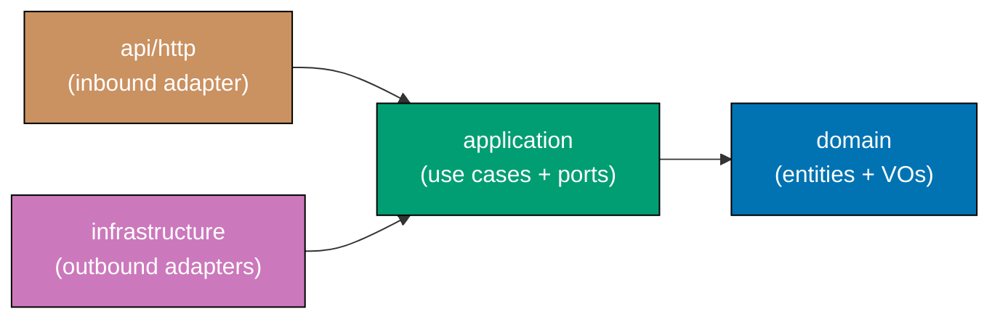

# Hexagonal Architecture

Hexagonal Architecture (also called Ports and Adapters) is the canonical structural pattern
for all non-E2E applications in ose-primer. This document defines shared principles and
terminology. Language-specific conventions are in the four specialization documents listed
under [References](#references).

## Overview

Hexagonal Architecture separates an application into three concentric zones:

- **Domain** — pure business concepts with no framework or infrastructure dependencies.
  Entities, value objects, and domain rules live here.
- **Application** — use-case orchestration through port interfaces. The application layer
  drives the domain but never depends on infrastructure.
- **Adapters** — technology-specific implementations of ports. Inbound adapters (e.g. HTTP
  handlers) drive the application. Outbound adapters (e.g. database repositories) are driven
  by the application.

This separation makes each zone independently testable and swappable. Domain logic can be
tested without a web server; infrastructure can be replaced without touching business rules.

## Dependency Rule

Dependencies flow **inward only**. The domain has zero dependencies on outer layers. The
application depends only on the domain. Adapters depend on the application through port
interfaces, but adapters never depend on each other.

**Dependency flow:**

Arrows point in the direction of dependency, not data flow. `api/http` and `infrastructure`
both depend on `application`; `application` depends on `domain`; `domain` depends on nothing.

## Terminology

| Term                 | Definition                                                                                                                                       |
| -------------------- | ------------------------------------------------------------------------------------------------------------------------------------------------ |
| **Domain**           | Innermost zone. Pure business concepts — entities, value objects, domain events, domain services. No imports from outer zones.                   |
| **Application**      | Middle zone. Use cases, port interfaces, orchestration logic. Imports domain; defines ports as interfaces.                                       |
| **Port**             | An interface defined by the application layer that an adapter must implement. Ports keep the application decoupled from technology choices.      |
| **Adapter**          | An implementation of a port using a specific technology. Adapters live in the outermost zone.                                                    |
| **Inbound adapter**  | An adapter that drives the application. Examples: HTTP handler, CLI command parser, message consumer. In ose-primer: `api/http/` or `commands/`. |
| **Outbound adapter** | An adapter driven by the application. Examples: database repository, external API client, file system writer. In ose-primer: `infrastructure/`.  |

## References

- [Hexagonal Architecture — CLI Apps](./hexagonal-architecture-cli.md)
- [Hexagonal Architecture — Web/FE Apps](./hexagonal-architecture-web.md)
- [Hexagonal Architecture — Backend Apps](./hexagonal-architecture-be.md)
- [OpenAPI Contract-First Development](./openapi-contract-first.md)

## Principles Implemented/Respected

- **[Simplicity Over Complexity](../../principles/general/simplicity-over-complexity.md)** —
  Three concentric zones with a single dependency rule keep the structure understandable and
  learnable without project-specific tribal knowledge.
- **[Explicit Over Implicit](../../principles/software-engineering/explicit-over-implicit.md)** —
  Port interfaces and the inward-only dependency rule are stated explicitly; no hidden coupling
  between layers is permitted.
- **[Immutability Over Mutability](../../principles/software-engineering/immutability.md)** —
  The domain zone is kept pure and free from infrastructure side effects, encouraging immutable
  value objects and predictable domain logic.
- **[Pure Functions Over Side Effects](../../principles/software-engineering/pure-functions.md)** —
  Domain and application layers are designed to be side-effect-free, pushing I/O and external
  calls to adapter implementations.

## Conventions Implemented/Respected

- **[File Naming Convention](../../conventions/structure/file-naming.md)** — Layer directory
  names follow kebab-case (or language-canonical casing) as documented in the specialization
  files.
- **[OpenAPI Contract-First Development](./openapi-contract-first.md)** — Backend adapters
  consume a spec-first API contract; generated types live in the adapter zone, not the domain.
