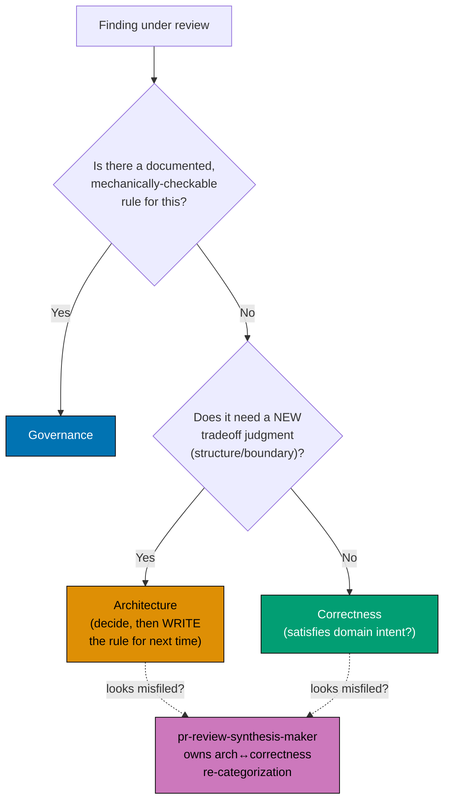

# PR Reviewer-Discipline Convention

This convention defines the eight PR-review specialist disciplines that replace the single
`pr-review-maker` monolith, each discipline's owned scope and the scope it explicitly routes
elsewhere, the **boundary tie-breaker rule** that resolves a finding that does not obviously
belong to one discipline, six documented grey-zone rulings between adjacent disciplines, and the
cost- and noise-control mechanics — borrowed from Cloudflare's production AI-code-review
system — that keep an eight-specialist fan-out affordable and quiet enough to be useful. It
governs the nine `pr-review-*-maker.md` agent definitions (eight specialists plus the
`pr-review-synthesis-maker` coordinator) and is the reference the
[PR Review Quality Gate workflow](../../workflows/pr/pr-review-quality-gate.md) and
[PR Merge Protocol](../workflow/pr-merge-protocol.md) point to whenever a finding needs
categorizing.

## Principles Implemented/Respected

This convention implements/respects the following core principles:

- **[Explicit Over Implicit](../../principles/software-engineering/explicit-over-implicit.md)**:
  the boundary tie-breaker rule and each specialist's `SUPPRESS` block turn "which discipline
  should catch this?" and "what should a reviewer never raise?" from an implicit, ad-hoc judgment
  call into a documented lookup every specialist and the coordinator apply the same way.
- **[Root Cause Orientation](../../principles/general/root-cause-orientation.md)**: separating the
  CI-gaming/test-integrity discipline from correctness lets a reviewer trace a defect to its real
  root cause (a weakened test versus a genuinely wrong behavior) instead of one generalist
  conflating the two into a single vague finding.
- **[Simplicity Over Complexity](../../principles/general/simplicity-over-complexity.md)**: the
  risk-tier fan-out keeps a trivial PR's review as simple as a single coordinator pass, reserving
  the full eight-specialist fan-out for diffs that actually need that much scrutiny.
- **[Automation Over Manual](../../principles/software-engineering/automation-over-manual.md)**:
  the coordinator's dedup, re-categorize, reasonableness-filter, and tool-verify functions
  automate a second read of every raw finding that would otherwise require manual triage before a
  human ever sees it.

## Conventions Implemented/Respected

This convention implements/respects the following conventions:

- **[Criticality Levels Convention](./criticality-levels.md)**: every specialist inherits the
  CRITICAL/HIGH/MEDIUM/LOW severity scale unchanged. This convention decides which discipline
  assigns a finding to which class, not how severity itself is defined.
- **[Maker-Checker-Fixer Pattern](../pattern/maker-checker-fixer.md)**: extends that pattern's
  three-role idea into a fan-out variant — eight discipline-scoped makers plus one coordinator
  (a checker-like consolidation role) feed the unchanged `pr-review-fixer`.
- **[CI Blocker Resolution Convention](./ci-blocker-resolution.md)**: the CI-gaming/test-integrity
  discipline's root-cause-first stance on weakened or skipped checks is this convention applied at
  review time, not just at author time.
- **[Regression Test Mandate](./regression-test-mandate.md)**: the missing-regression-test check
  lives inside the CI-gaming/test-integrity discipline's owned scope, not correctness — a fix that
  lacks a pinning test is a test-integrity defect, not a behavioral one.
- **[Feature Change Completeness Convention](./feature-change-completeness.md)**: the
  spec-file-presence-versus-scenario-completeness grey zone (ruling (d) below) exists precisely
  because that convention requires both a companion artifact to exist AND to be substantively
  adequate — two different disciplines check each half.

## Purpose

The single `pr-review-maker` monolith combined six-plus review concerns into a single prompt,
which gave no reviewer a documented reason to stay out of another discipline's lane, and no rule
for where a finding that could plausibly belong to two disciplines should land. Splitting the
monolith into eight discipline-scoped specialists plus a coordinator only works if:

1. Every specialist's owned scope AND its explicit non-goals ("not its job → routes to X") live in
   one place both the specialists and the coordinator reference.
2. A written **tie-breaker rule** exists for a finding that does not cleanly belong to one
   discipline, so re-categorizing it is a lookup, not a fresh judgment call every cycle.
3. The recurring grey zones between adjacent disciplines are pre-decided once, not re-litigated by
   every coordinator pass.
4. The cost- and noise-control mechanics that make an eight-specialist fan-out affordable and quiet
   are documented alongside the disciplines they govern, not left as an unstated assumption.

Audience: the nine `pr-review-*-maker.md` agent definitions, the
[PR Review Quality Gate workflow](../../workflows/pr/pr-review-quality-gate.md) that orchestrates
them, and any future contributor deciding whether a new class of finding needs its own discipline
or fits inside an existing one.

## The Eight Reviewer Disciplines

Every specialist inherits the monolith's hard rules verbatim — numeric confidence 0-100
with findings below 80 hard-dropped, CRITICAL/HIGH/MEDIUM/LOW severity, every finding
line-anchored with `file:line` plus a link to the specific `repo-governance/` rule it cites,
anti-sycophantic framing, a scope guard limited to the PR's own declared plan/issue scope, and
untrusted-input filtering of PR body/comment/linked-issue text. What differs per specialist is its
**owned discipline** and the **scope it explicitly routes elsewhere** rather than raising itself:

| Discipline                     | Specialist agent               | Owns (in-charter)                                                                                                                                                                             | NOT its job (routes to)                                                                                                                     |
| ------------------------------ | ------------------------------ | --------------------------------------------------------------------------------------------------------------------------------------------------------------------------------------------- | ------------------------------------------------------------------------------------------------------------------------------------------- |
| Architecture                   | `pr-review-architecture-maker` | New tradeoffs, module boundaries, reversibility, blast radius, quality-attribute effects, novel dependencies                                                                                  | Existing-rule layering violations → governance; domain-scenario gaps → logic                                                                |
| Business-logic / correctness   | `pr-review-logic-maker`        | Behavior vs. domain intent + Gherkin acceptance-criteria conformance across edge/error cases                                                                                                  | Error-handling _shape_ rules → governance; should-this-boundary-exist → architecture                                                        |
| Governance / rules-conformance | `pr-review-governance-maker`   | Mechanical conformance to already-documented `repo-governance/` conventions, naming/structure, ADRs, spec-file presence                                                                       | Whether a new rule should exist → architecture; scenario completeness → logic; instruction-decay (stale instruction docs) → instruction     |
| Security                       | `pr-review-security-maker`     | Secrets in diffs, injection, untrusted-input handling, git-fixture isolation, unsafe git/FS operations                                                                                        | Non-security convention text → governance                                                                                                   |
| CI-gaming / test-integrity     | `pr-review-integrity-maker`    | CI-gaming (weakened/skipped/narrowed tests, coverage-gaming), missing regression tests (regression-test-mandate)                                                                              | Whether the behavior is correct → logic                                                                                                     |
| Performance                    | `pr-review-performance-maker`  | Concrete or likely performance regressions, hot-path changes, algorithmic-complexity growth, resource (memory/IO/alloc) concerns                                                              | A quality-attribute tradeoff decision → architecture; a perf-relevant convention (e.g. a documented budget rule) → governance               |
| Documentation-quality          | `pr-review-docs-maker`         | Substantive documentation quality and completeness: README/docs/Diátaxis fit, doc drift vs. code, clarity, doc alt-text/accessibility                                                         | Mechanical doc-convention conformance (heading hierarchy, linking, naming) → governance; whether the documented behavior is correct → logic |
| Instruction-decay              | `pr-review-instruction-maker`  | Instruction-decay — a framework/build-tool/package-manager/env-var/CI change in the diff not reflected in `AGENTS.md`/`CLAUDE.md`/`.claude/`; instruction bloat (>200 lines / generic filler) | Mechanical convention conformance → governance; whether a new rule should exist → architecture                                              |

**Instruction-decay is its own eighth discipline, not folded into governance.**
`pr-review-governance-maker` checks _conformance to_ the repo's instruction docs; nothing in its
charter checks _staleness of_ those docs against a changed framework, build tool, package manager,
env var, or CI step. Governance therefore explicitly routes instruction-decay findings to
`pr-review-instruction-maker` rather than raising them itself.

A ninth role, `pr-review-synthesis-maker` (the coordinator), does not discover findings in any of
the eight disciplines above — it deduplicates, re-categorizes, reasonableness-filters, and
tool-verifies what the eight specialists find, then posts exactly one consolidated review. See
[The Boundary Tie-Breaker Rule](#the-boundary-tie-breaker-rule) below for its highest-risk
re-categorization responsibility.

## The Boundary Tie-Breaker Rule

When a finding does not obviously belong to one of the eight disciplines above, resolve it with
this **tie-breaker**, in order:

1. **Documented + mechanically-checkable rule → governance.** If a `repo-governance/` convention
   already states the rule and a mechanical check (grep, linter, structural check) could in
   principle confirm the violation, the finding is governance's.
2. **New tradeoff judgment → architecture** (resolve by making the call, then writing the rule for
   next time). If answering the finding requires a genuinely new structural or quality-attribute
   decision that no existing rule covers, it is architecture's — and the resolution should be
   written down as a new rule so the next occurrence falls under bullet 1 instead.
3. **"Does it satisfy domain intent?" → correctness.** If neither of the above applies, and the
   question is whether the change actually does what the domain requires, it is correctness's
   (owned by `pr-review-logic-maker`).

The **architecture↔correctness boundary is the highest-risk of the three** — a new structural
decision and a domain-behavior question can look identical in a raw finding. The coordinator
(`pr-review-synthesis-maker`) **owns re-categorizing a misfiled finding across this specific
boundary** as part of its re-categorize function; no specialist self-adjudicates its own
tie-breaker verdict once the coordinator has reviewed it. This is the same tie-breaker every
grey-zone ruling below applies — the six rulings are this rule pre-resolved for six recurring
cases so the coordinator does not have to re-derive the tie-breaker from scratch every cycle.

## Six Grey-Zone Rulings

The eight-discipline split creates recurring boundary questions between adjacent disciplines. The
following six are pre-decided so the coordinator applies a lookup instead of re-deriving the
tie-breaker every cycle. Four are core to the original discipline set; two were added when
performance and documentation-quality became their own disciplines (D1).

- **(a) New cross-module dependency.** A violation of an existing layering rule → governance; a
  genuinely novel boundary judgment → architecture. (This is the tie-breaker's own worked example:
  reviewing a new cross-module dependency, an already-documented layering violation is governance's
  finding, while a boundary question no existing rule answers is architecture's.)
- **(b) Naming format vs. should-this-boundary-exist.** Mechanical naming/structure conformance
  (does this follow the documented naming pattern?) → governance; whether the module boundary
  itself should exist at all → architecture.
- **(c) Error-handling shape vs. domain error scenarios.** The _shape_ of error handling (does it
  follow the documented error-handling convention?) → governance; whether the domain's actual error
  scenarios are correctly covered (Gherkin edge/error-case conformance) → correctness (logic).
- **(d) Spec-file presence vs. scenario completeness.** Whether a required spec file exists at all
  → governance; whether the scenarios inside it are complete for the domain → correctness (logic).
- **(e) Performance ↔ architecture.** A quality-attribute tradeoff decision (accept a performance
  cost for a design benefit) → architecture; a concrete or likely measured regression on a hot path
  → performance.
- **(f) Docs ↔ governance.** Mechanical doc-convention conformance (heading hierarchy, linking,
  naming, alt-text as a rule) → governance; substantive doc completeness/clarity/drift →
  documentation-quality (docs).

## Cost-Control & Noise-Control Mechanics

The Cloudflare production AI-code-review system this repo's fan-out/coordinator shape is modeled
on carries a set of cost- and noise-control mechanics beyond the discipline split itself. They are
folded into this convention because an unbounded eight-specialist fan-out on every PR would cost
far more than a single reviewer without a matching gain in review quality.

### Risk-tier fan-out (D12)

The primary cost lever is **diff-size tiering**, not model choice. Each PR is classified into one
of three tiers by line count, file count, and whether it touches a security-sensitive path, and the
specialist set fans out accordingly:

- **Trivial** (≤10 changed lines AND ≤20 files, no security-sensitive path) → coordinator-only: the
  coordinator runs one consolidated generalist pass itself, with no specialist fan-out.
- **Lite** (≤100 lines AND ≤20 files) → a reduced specialist set of the four highest-yield lenses
  for this repo (governance, logic, security, integrity) plus the coordinator.
- **Full** (>100 lines OR >20 files OR touches a security-sensitive path — secrets/`.env`, git
  identity, CI/workflow, `pr-merge-protocol`) → all eight specialists plus the coordinator.

**Security-sensitive paths force `full` regardless of size** — this repo's no-secrets iron rule and
git-identity guardrail make that non-negotiable. The tier is computed once per PR, re-evaluated each
cycle (since the fixer's commits change the diff), and recorded in the consolidated review header so
the tier decision is auditable.

### Shared-context extract-once + large-diff handling (D13)

**D13 chose NO generated-file exclusion.** Reviewers see the **full diff**, including regenerated
output such as `.opencode/agents/**`, `.amazonq/**`, `generated/**`, lock files, and minified/source-map
assets — nothing is silently filtered out before a specialist reviews it, and **CI still runs over
everything regardless** of what any reviewer chooses to skim. This is a deliberate reversal of the
alternative (auto-detecting and excluding generated files): the rationale is explicitness — a
hand-edited "generated" file is never silently missed because nothing is silently excluded.

Two mechanics keep this full-diff posture tractable rather than merely expensive:

- **Shared context, extracted once.** The orchestrator assembles the PR metadata, linked-plan/issue
  context, and the full diff **once** into a single shared-context brief every specialist reads,
  rather than each specialist separately re-deriving the same context (which would multiply token
  cost by the number of specialists).
- **Coordinator-discretion large-diff slicing.** For a `full`-tier PR whose diff exceeds a
  specialist's comfortable context budget, the coordinator MAY have specialists review
  per-domain-relevant file slices rather than the whole diff at once, recording in the review header
  that the diff was sliced. If a diff still cannot be reviewed in one fan-out, the coordinator emits
  an explicit "diff exceeds single-review scope — reviewed in N slices" note rather than silently
  under-covering it.

### Per-specialist SUPPRESS blocks

Beyond the "NOT its job → routes to X" column in the discipline table above (inter-agent routing),
every specialist ALSO carries an explicit **`SUPPRESS` block** — findings it must not raise **at
all**, regardless of which discipline would otherwise own them: nitpicks, style already enforced by
a mechanical gate, speculative "consider adding X" when X is already present, and defense-in-depth
suggestions on a path whose primary defenses are already adequate. The `SUPPRESS` block is the
single highest-value noise lever available to a specialist prompt — it targets **few, high-confidence
findings** as the goal, not maximal coverage; raw-finding-count is an anti-goal, not a proxy for
review quality.

### Instruction-decay dedicated specialist (D14)

Instruction-decay — a framework, build-tool, package-manager, env-var, or CI change in the diff that
is not reflected in `AGENTS.md`/`CLAUDE.md`/`.claude/` — gets its own dedicated eighth specialist,
`pr-review-instruction-maker`, rather than being folded into `pr-review-governance-maker`.
`pr-review-governance-maker` checks conformance to the documented rules; it does not check whether
those rules themselves have gone stale against a changed toolchain. `pr-review-instruction-maker`
also penalizes instruction bloat (documents exceeding roughly 200 lines, or generic filler that adds
no enforceable rule).

### Human-dismissal-respect re-review rule

A re-review **must not re-raise a finding a human has explicitly dismissed** on its thread. A
human's "won't fix" or "I disagree" reply resolves the thread for future cycles, mirroring
`pr-review-fixer`'s own reasoned-reject on the agent side. Before fanning out a new cycle, the
coordinator reads the prior cycle's thread resolution status, including any human dismissal, so the
specialists do not waste a finding re-litigating something a human has already settled.

### Boundary-tag-strip untrusted-input hardening

The inherited untrusted-input rule is sharpened with a concrete technique: before any PR body,
comment, or linked-issue text reaches a model, **strip user-supplied structural boundary tags** —
fabricated delimiters such as `<mr_input>`, `<system>`, or `<review>` that a PR author could inject
to spoof the prompt frame and redirect a reviewer's behavior. This is in addition to, not a
replacement for, the inherited prompt-injection filtering every specialist already carries.

## Quality-Gate Enhancements

The eight-discipline split, the boundary tie-breaker, and the cost- and noise-control mechanics
above answer who reviews what and how much of the diff gets fanned out. They do not by themselves
guard against three known failure modes of LLM-driven review: a stated confidence score that does
not track actual correctness, a CRITICAL finding that reviewers merely agree on rather than
demonstrate, and a fixed-cycle policy mistaken for a data-derived optimum. The following four
enhancements close those gaps as documented manual procedures and rules layered on top of the
[Eight Reviewer Disciplines](#the-eight-reviewer-disciplines) above.

### Confidence-Calibration Spot-Check

A stated numeric confidence is only as trustworthy as its **calibration** — how closely a model's
self-reported confidence tracks its actual accuracy. Every specialist already inherits the
[0-100 confidence scale with a hard drop below 80](#the-eight-reviewer-disciplines); this
enhancement is the documented manual procedure that keeps that ≥80 threshold honest over time:

1. Periodically sample a batch of past findings that crossed the ≥80 confidence-to-post threshold
   across recent review cycles.
2. For each sampled finding, compare its stated numeric confidence against the fixer's actual
   triage outcome — fixed, versus rejected or deferred.
3. If the sample reveals systematic over-confidence (high stated confidence, high rejection rate)
   or under-confidence (findings below 80 that a fixer would plausibly have fixed), recalibrate
   the ≥80 confidence-to-post threshold accordingly and record the recalibration and its
   rationale.

This is a documented manual procedure, not an automated job — no agent runs the calibration check
unprompted; a maintainer (or a future dedicated checker) performs it periodically against the
review history. It complements the
[CRITICAL-Requires-Reproduction](#critical-requires-reproduction) rule below: confidence
calibration catches a systematically miscalibrated score across many findings, while
CRITICAL-requires-reproduction catches a single unverified high-severity finding.

### Selective Adversarial Verification (D4)

For most findings, the coordinator's tool-verify function is enough. For **high-risk** diffs, this
convention adds a second, independent verification pass that runs before the finding is posted at
all — a deliberately narrow, **adversarial** check reserved for the categories most likely to hide
subtle, high-consequence defects:

- **High-risk scope**: authentication/authorization, payments, database or schema migrations,
  security-sensitive code paths, and public-API or contract surfaces.
- **The verification pass**: a second, independent reviewer re-derives the finding from the diff
  rather than merely rubber-stamping the first specialist's conclusion — the adversarial posture
  is the point, not agreement.
- **Cross-model-diversity note**: the verifier should ideally differ in model family from the
  original finder. Two passes from the same model family risk sharing the same blind spots, which
  defeats the purpose of a second, independent pass.

This high-risk scope is deliberately narrower than the
[risk-tier fan-out's security-sensitive path list](#risk-tier-fan-out-d12) that forces all eight
specialists into a review — a diff can be `full`-tier without touching auth, payments, migrations,
or a public API, in which case this adversarial pass does not apply. The two mechanics are related
but distinct: one controls how many specialists review a diff, the other controls whether a
second, independent pass re-checks a specific finding before it is posted.

### CRITICAL-Requires-Reproduction

A CRITICAL-severity finding (per the [Criticality Levels Convention](./criticality-levels.md))
must never rest on agreement-counting alone — multiple reviewers concluding the same thing is not
evidence that the thing is true. Any CRITICAL finding must carry a concrete **reproduction**:
specific inputs or state that produce the wrong output or crash, not a description of what a
reviewer believes would happen. A CRITICAL finding without a reproduction is not yet a CRITICAL
finding — it is held at a lower severity, or held for further verification under the
[Selective Adversarial Verification](#selective-adversarial-verification-d4) rule above when the
diff is also high-risk, until a reproduction is attached.

### Fixed 3-Cycle Ceiling With No Early Exit

The [PR Review Quality Gate workflow](../../workflows/pr/pr-review-quality-gate.md) runs a fixed
ceiling of three sequential CI-gated review cycles with no early exit, even when a cycle produces
zero new findings and even after a diff has already passed the
[Selective Adversarial Verification](#selective-adversarial-verification-d4) pass above. This
convention records that choice explicitly as a **predictability** policy choice, not a
data-derived optimum: running all three cycles every time keeps the pipeline's duration and cost
uniform and predictable across every PR, regardless of how quickly a given PR's findings taper
off. This rationale is recorded here so the fixed-3-cycle policy is never mistaken for an
evidence-backed optimum — the convention explicitly disclaims any claim that three cycles (rather
than two, or an early-exit rule) was derived from measuring this repository's review outcomes; it
is a deliberate predictability trade-off, full stop.

## Post-Cutover Monitoring & Rollback

The eight-discipline split retired the single `pr-review-maker` monolith at cutover by deletion, not
by a staged sunset gated on measurement. Everything in this section therefore watches the split
**after** the monolith is already gone — it is **post-cutover monitoring**, not a pre-cutover
evaluation gate the split had to clear before shipping. The
[Quality-Gate Enhancements](#quality-gate-enhancements) above harden how an individual finding is
trusted (confidence calibration, adversarial verification, CRITICAL reproduction, the fixed-cycle
policy); this section hardens the split's health as a whole, measured continuously across many PRs
after cutover.

### Post-Cutover Monitoring Plan

Five metric families run continuously against live post-cutover PRs:

- **Precision** — consolidated-finding precision, the fraction of findings the coordinator posts
  that `pr-review-fixer` confirms as real (confirmed-real / total-posted). This is the most direct
  read on whether the eight-specialist fan-out produces trustworthy findings rather than noise.
- **Per-discipline acceptance rate** — fixes divided by total findings, tracked separately per
  discipline. Watch specifically the two lenses the discipline split newly added — `performance`
  and `docs` — to confirm each earns its fan-out cost, and the catch-all disciplines — `governance`
  and `logic` — whose broad owned scope makes them the most likely to over-report if a specialist's
  charter drifts loose.
- **Outdated Rate** (BitsAI-CR-style) — the share of posted findings that go stale or irrelevant by
  the time `pr-review-fixer` reaches them, typically because an earlier cycle's fix already resolved
  the diff the finding targeted. A rising outdated rate points at review cadence, not finding
  quality, as the problem.
- **Cost/latency per review, tracked per risk-tier** — measured separately for `trivial`, `lite`, and
  `full` per the [risk-tier fan-out (D12)](#risk-tier-fan-out-d12), never as one blended average
  across tiers. A **flat cost across risk-tiers is itself a finding** — it means the tier
  classification is not actually changing which specialists run, and the primary cost lever the
  fan-out relies on has silently stopped taking effect.
- **Human-override rate** — the share of PRs where a human explicitly dismisses or overrides a
  consolidated finding, the same dismissal the
  [human-dismissal-respect re-review rule](#human-dismissal-respect-re-review-rule) already tracks
  per-thread, rolled up across PRs. This is Cloudflare's **break-glass trust proxy**: a rising
  override rate is a cheaper, earlier trust-erosion signal than precision, because a human reaches
  for override before a measurable precision drop shows up in the fixer's triage data.

None of these five families requires a pre-cutover monolith baseline — each is measured purely
against the split's own post-cutover behavior over time. That property is what makes the rollback
trigger below workable without a baseline to compare against.

### Rollback Trigger (D6)

The monitoring plan feeds exactly one decision: whether to roll the split back to the retired
monolith. That decision uses a **fixed absolute-threshold bar**, not a comparison against the
monolith's pre-cutover performance — the monolith was retired (deleted) at cutover and never ran
side-by-side with the split, so no pre-cutover baseline exists to compare against. **The bar
therefore needs no pre-cutover baseline**, which is what resolves the apparent contradiction between
retiring the monolith immediately and gating rollback on a baseline immediate retirement never
captures.

The rollback fires when any one of the following trips, evaluated over a rolling monitoring window
of the last **N post-cutover PRs** — N is maintainer-tunable at execution time, not fixed by this
convention:

- consolidated-finding **precision < 50%** over the window, OR
- **human-override-rate > 5%** over the window, OR
- any single **CRITICAL false-positive** reaches `pr-review-fixer` at all — this threshold carries no
  window; one occurrence trips it (see
  [CRITICAL-Requires-Reproduction](#critical-requires-reproduction) above for why a CRITICAL finding
  without a reproduction should never have reached the fixer as CRITICAL in the first place).

These three thresholds are proposed defaults, deliberately conservative and maintainer-tunable — they
exist so a rollback decision is a documented lookup, not a fresh judgment call made under the
pressure of a live incident.

**Restore procedure** — on a trip, the monolith comes back through a **non-destructive forward
operation**, never a history rewrite:

1. `git revert` (or `git checkout` of the pre-deletion commit) the change that removed
   `.claude/agents/pr-review-maker.md` and its register/catalog entries, reintroducing them as a new
   commit on top of the current branch.
2. Run `npm run generate:bindings` to resynchronize `.opencode/` and `.amazonq/` against the restored
   `.claude/` source of truth.

No force-push and no history rewrite happen at any step — restoring the monolith is a forward commit
that reintroduces a previously deleted file, exactly like reverting any other change, per the
[No Destructive Git Operations](../workflow/no-destructive-git-operations.md) practice.

## Future Work

The discipline split, the cost- and noise-control mechanics, and the post-cutover monitoring plan
above describe the pipeline as it stands today. Three items remain deliberately outside this
convention's own scope — each depends on a decision, an infrastructure fact, or ongoing measurement
that belongs in its own document rather than being folded into this convention's normative rules.

### Bot Identity and the `REQUEST_CHANGES` Gap

Only `pr-review-synthesis-maker` posts to the PR — through the GitHub Reviews API, as the sole poster
of record; the eight specialists never post, they hand their raw findings to the coordinator. The
coordinator authenticates as the PR author's own identity, and GitHub rejects a `REQUEST_CHANGES`
review submitted against one's own pull request. Every blocking review — including one carrying a
CRITICAL finding — therefore lands with review STATE `COMMENT` instead of `REQUEST_CHANGES`, so a
consumer that gates on STATE alone reads a blocked PR as unblocked while a CRITICAL finding sits open
on it. This convention does not own closing that gap: provisioning a scope-minimal GitHub App or
CI-scoped bot identity and rewiring the coordinator to authenticate as it is tracked in the
[PR-review bot identity idea](../../../plans/ideas/pr-review-bot-identity.md), which owns the
AI-attribution and formal `REQUEST_CHANGES` question until an org-level identity becomes available.

### Cost and Latency Budgeting

Cloudflare's own production system — the one this convention's fan-out/coordinator shape is modeled
on (see [Cost-Control & Noise-Control Mechanics](#cost-control--noise-control-mechanics)) — reports a
median cost of ≈$1 per review. Applied to this repo's shape, a `full`-tier PR fanning out to all
eight specialists across the fixed three-cycle ceiling costs roughly ≈$1 × 8 specialists × 3 cycles
per PR, bounded downward by the [risk-tier fan-out (D12)](#risk-tier-fan-out-d12): a `trivial` PR
runs the coordinator alone and a `lite` PR fans out to only four specialists, so its actual per-PR
cost sits well under that ceiling. This convention does not yet mandate a specific budget or alert
threshold. It recommends that whoever owns the
[Post-Cutover Monitoring Plan](#post-cutover-monitoring-plan)'s cost/latency-per-review metric also
track the absolute per-PR dollar figure over time, not only the per-tier trend, so a repo-wide cost
creep is visible before it grows into a rollback-trigger-level concern.

### Deferred Merge Queue (D7/D10)

A merge queue was researched during this convention's own drafting — GitHub-native versus
Graphite/Aviator — as a way to close a gap in
[PR Merge Protocol](../workflow/pr-merge-protocol.md) precondition (c): a static, per-PR
branch-up-to-date check cannot guarantee the branch stays non-destructively current when two PRs
merge at overlapping times. **That adoption was researched but NOT delivered.** The repo's branch
settings expose no merge-queue toggle to enable, because GitHub merge queue requires organization
ownership and the repos in scope are personal-account-owned. Precondition (c) therefore remains the
manual branch-up-to-date check, unchanged. The deferred investigation, availability matrix, and
adoption path are owned by the standalone
[merge-queue-adoption backlog plan](../../../plans/backlog/merge-queue-adoption/README.md), not by
this convention.

## Examples

### PASS: Routing a naming-format finding to governance

A specialist notices a new file does not follow the documented kebab-case naming pattern. Per
ruling (b), this is mechanical naming/structure conformance — the specialist routes it to
`pr-review-governance-maker`'s charter rather than raising it as an architecture concern, because a
documented, mechanically-checkable rule already covers it (tie-breaker step 1).

### PASS: Routing a hot-path regression to performance, not architecture

A specialist notices a change that adds an O(n²) loop inside a request handler already known to
run on a hot path. Per ruling (e), this is a concrete/likely measured regression — it routes to
`pr-review-performance-maker`, not `pr-review-architecture-maker`, because no new tradeoff judgment
is being made; the regression is a fact about the code, not a design decision.

### FAIL: A specialist raising a finding outside its `SUPPRESS` block

A specialist flags a style nit already enforced by the repo's markdownlint gate. This violates the
`SUPPRESS` block every specialist carries — style already enforced by a mechanical gate must never
be raised at all, regardless of which discipline would otherwise plausibly own it.

### FAIL: Re-raising a human-dismissed finding

A specialist re-raises, in cycle 2, a finding a human explicitly marked "won't fix" in cycle 1's
thread. This violates the human-dismissal-respect rule — the coordinator should have surfaced the
prior dismissal before fanning out, and the specialist should not have re-litigated a settled thread.

## Enforcement

This convention is enforced by:

- **`repo-rules-checker`**: audits the nine `pr-review-*-maker.md` agent definitions against the
  discipline table's owned/routed-to scope and flags a specialist charter that omits its
  `SUPPRESS` block, misstates a routing target, or contradicts a grey-zone ruling.
- **`pr-review-synthesis-maker`**: applies the boundary tie-breaker rule and the six grey-zone
  rulings live, during its re-categorize function, against every raw finding the eight specialists
  emit.

Neither the agent definitions nor their prompts are edited here — this document records the
disciplines, the tie-breaker, the grey zones, and the cost/noise mechanics those agents implement.

## Related Documentation

- [PR Review Quality Gate workflow](../../workflows/pr/pr-review-quality-gate.md) - Orchestrates
  the fan-out → synthesize → fixer loop this convention's disciplines and tie-breaker feed
- [PR Merge Protocol Convention](../workflow/pr-merge-protocol.md) - The five hardened merge
  preconditions that gate on this pipeline's review-cycle completion
- [Criticality Levels Convention](./criticality-levels.md) - CRITICAL/HIGH/MEDIUM/LOW severity
  scale every specialist inherits unchanged
- [Maker-Checker-Fixer Pattern](../pattern/maker-checker-fixer.md) - The three-role pattern this
  fan-out variant adapts into eight makers plus one coordinator
- [CI Blocker Resolution Convention](./ci-blocker-resolution.md) - Root-cause-first handling of CI
  blockers that the CI-gaming/test-integrity discipline enforces at review time
- [Regression Test Mandate](./regression-test-mandate.md) - Every bug fix needs a reproducing test;
  owned by the CI-gaming/test-integrity discipline, not correctness
- [Feature Change Completeness Convention](./feature-change-completeness.md) - Companion-artifact
  completeness underlying grey-zone ruling (d)
- [Root Cause Orientation Principle](../../principles/general/root-cause-orientation.md) - Underlies
  the discipline split's CI-gaming watch
- [AGENTS.md](../../../AGENTS.md) - Primary guidance; lists the PR Review Cycle agent family
