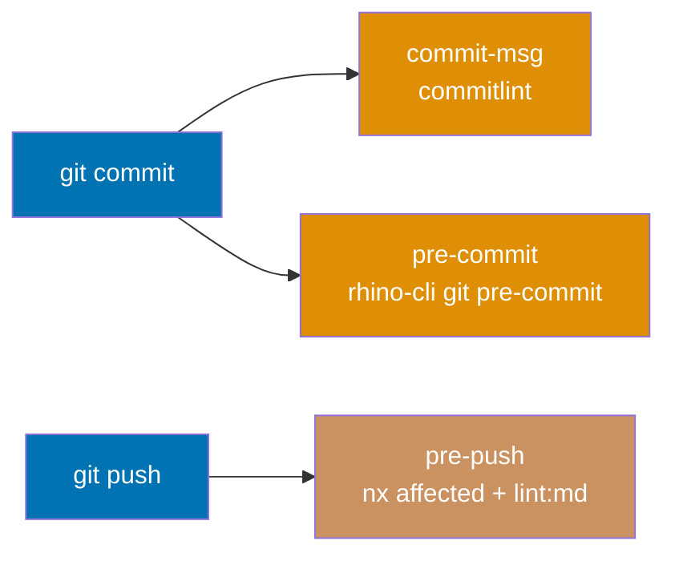

# Git Hook Lifecycle

Three Husky hooks run automatically on every developer machine. This document is the canonical
reference for hook order, steps, failure modes, and how the local hooks relate to CI.

## Principles Implemented/Respected

- **[Automation Over Manual](../../principles/software-engineering/automation-over-manual.md)**:
  Quality checks run automatically at every git event — no manual invocation required.

- **[Explicit Over Implicit](../../principles/software-engineering/explicit-over-implicit.md)**:
  Each hook step, its failure mode, and its CI equivalent are declared here explicitly.

- **[Simplicity Over Complexity](../../principles/general/simplicity-over-complexity.md)**:
  Hook logic is implemented in `rhino-cli` subcommands to keep the raw `.husky/` scripts thin
  and testable. The hook files themselves are one or two commands each.

## Hook Overview



`commit-msg` and `pre-commit` run on every `git commit`. `pre-push` runs on every `git push`.

## Hook 1 — commit-msg

**File**: `.husky/commit-msg`

**Command**: `commitlint --edit "$1"`

**Purpose**: Enforce the [Conventional Commits](https://www.conventionalcommits.org/) format
before the commit is created. If the message does not match, the commit is aborted.

**Required format**: `<type>(<scope>): <description>`

Valid types: `feat`, `fix`, `docs`, `style`, `refactor`, `perf`, `test`, `chore`, `ci`,
`revert`. Scope is optional. Description uses imperative mood and does not end with a period.

**Failure mode**: Commit aborted. Fix the message and retry.

## Hook 2 — pre-commit

**File**: `.husky/pre-commit`

**Command**: `npx nx run rhino-cli:env:validation && rhino-cli git pre-commit`

**Purpose**: Validate configs and staged files before the commit is created. Delegates to
`rhino-cli git pre-commit`, which executes these steps in order:

| Step | Action                                                                              | Failure Mode                |
| ---- | ----------------------------------------------------------------------------------- | --------------------------- |
| 1    | Validate `.claude/` and `.opencode/` configs (YAML, tools, model, skills, parity)   | Blocks commit               |
| 2    | Validate `docker-compose` files in staged changes                                   | Blocks commit               |
| 3    | Run `nx affected run-pre-commit` (lightweight per-project hooks)                    | Warn only                   |
| 4    | Stage content files (auto-generated link data)                                      | N/A (staging step)          |
| 5    | Run lint-staged (format staged files by language: Prettier, rustfmt, dotnet format) | Blocks commit               |
| 6    | Sync `package-lock.json` files                                                      | Blocks commit if sync fails |
| 7    | Validate docs file naming convention in staged files                                | Blocks commit               |
| 8    | Validate markdown links in staged files (`links:validation`)                        | Blocks commit               |
| 9    | Lint all markdown files (`markdownlint-cli2`)                                       | Blocks commit               |

Additionally, the pre-commit hook runs shell scripts, Dockerfiles, and workflow files in
staged changes through `shellcheck`, `hadolint`, and `actionlint` at the warning threshold.
See [Cross-Language Lint Strictness](../quality/cross-language-lint-strictness.md).

**Failure mode**: Commit aborted. The hook prints which step failed. Fix the issue and retry.

**Graceful degradation**: If `rhino-cli` is not installed (fresh checkout before
`npm run doctor -- --fix`), the hook skips with a hint and does not block the commit.

## Hook 3 — pre-push

**File**: `.husky/pre-push`

**Purpose**: Run the full quality gate for affected projects before the push lands on remote.
The pre-push hook is the last local line of defence before CI runs.

**Step sequence**:

```bash
# 1. Baseline gate — affected projects only
npx nx affected -t typecheck lint test:quick specs:coverage --parallel=<cores-1>

# 2. Markdown linting — whole-repo
npm run lint:md

# 3. Conditional naming validators — only when relevant paths changed
# Fires when .claude/agents/** or .opencode/agents/** changed:
npx nx run rhino-cli:naming:harness-validation
# Fires when repo-governance/workflows/** changed:
npx nx run rhino-cli:naming:workflows-validation
```

**Why affected-first**: `nx affected` computes which projects changed since the merge base
(`origin/main`) and runs only those. `--parallel=cores-1` reserves one core for system
responsiveness. All four targets (`typecheck`, `lint`, `test:quick`, `specs:coverage`) are
cacheable — a no-op re-push pays near-zero cost.

**Cache warm-up tip**: If the pre-push hook times out (cold cache on first push), warm the
cache first, then push again:

```bash
npx nx affected -t typecheck lint test:quick specs:coverage
git push
```

**Failure mode**: Push aborted. Fix the failing targets, then push again.

## Relationship to CI

The pre-push hook and the CI quality gate are intentionally redundant for affected-project
checks. CI is the hard, authoritative gate; the hook gives fast local feedback.

| Check                           | pre-push hook | CI (`pr-quality-gate.yml`)              |
| ------------------------------- | ------------- | --------------------------------------- |
| `typecheck` (affected)          | Yes           | Yes                                     |
| `lint` (affected)               | Yes           | Yes                                     |
| `test:quick` (affected)         | Yes           | Yes                                     |
| `specs:coverage` (affected)     | Yes           | Yes                                     |
| `npm run lint:md`               | Yes           | Yes (`markdown` job)                    |
| `naming:harness-validation`     | Conditional   | Always                                  |
| `naming:workflows-validation`   | Conditional   | Always                                  |
| `mermaid:validation`            | pre-commit    | `validate-markdown.yml`                 |
| `links:validation`              | pre-commit    | `validate-markdown.yml`                 |
| `headings:hierarchy-validation` | pre-commit    | `validate-markdown.yml`                 |
| `shellcheck` / `hadolint`       | pre-commit    | Always (`shellcheck` / `hadolint` jobs) |
| `actionlint`                    | pre-commit    | Always (`actionlint` job)               |

## Bypass Policy

Bypassing hooks (`--no-verify`) is **prohibited** unless a CI blocker investigation explicitly
requires it. If a hook fails, investigate and fix the root cause — do not skip.

**See also**: [CI/CD Conventions](../infra/ci-conventions.md) — full hook step tables and the
relationship between hooks and CI; [Cross-Language Lint Strictness](../quality/cross-language-lint-strictness.md).
