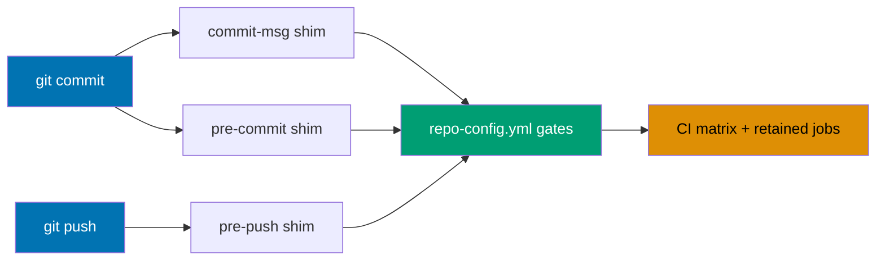

# Git Hook Lifecycle

The three Husky files are deliberately thin shims. The checked-in gate registry in
[`repo-config.yml`](../../../repo-config.yml) is the normative source for their command inventory,
scope, order, and CI relationship. Do not copy a command list into a hook or this document.

## Discover the current gate set

Use the registry projection for the repository and surface being inspected:

```sh
cargo run --release --quiet --manifest-path apps/rhino-cli/Cargo.toml -- gate list --surface=commit-msg --format=text
cargo run --release --quiet --manifest-path apps/rhino-cli/Cargo.toml -- gate list --surface=pre-commit --format=text
cargo run --release --quiet --manifest-path apps/rhino-cli/Cargo.toml -- gate list --surface=pre-push --format=text
cargo run --release --quiet --manifest-path apps/rhino-cli/Cargo.toml -- gate list --surface=ci --format=text
cargo run --release --quiet --manifest-path apps/rhino-cli/Cargo.toml -- gate validate
```

`gate validate` is the conformance check: it rejects a declared hook surface whose executable shim
does not delegate to the registry, a stale generated `lint-staged` block, or invalid CI wiring.

## Hook shims

| Git event      | Shim                | Delegation                              |
| -------------- | ------------------- | --------------------------------------- |
| Commit message | `.husky/commit-msg` | `gate run --surface=commit-msg -- "$1"` |
| Before commit  | `.husky/pre-commit` | `gate run --surface=pre-commit`         |
| Before push    | `.husky/pre-push`   | `gate run --surface=pre-push`           |

The dispatcher runs each declared gate in registry order and stops at the first failure. A hook failure
aborts its Git operation; fix the reported gate and retry.


```mermaid
%% Color palette: Blue #0173B2, Orange #DE8F05, Teal #029E73
flowchart LR
    Commit["git commit"] --> Message["commit-msg shim"]
    Commit --> PreCommit["pre-commit shim"]
    Push["git push"] --> PrePush["pre-push shim"]
    Message --> Registry["repo-config.yml gates"]
    PreCommit --> Registry
    PrePush --> Registry
    Registry --> CI["CI matrix + retained jobs"]

    style Commit fill:#0173B2,color:#FFFFFF
    style Push fill:#0173B2,color:#FFFFFF
    style Registry fill:#009E73,color:#FFFFFF
    style CI fill:#DE8F05,color:#000000
```

## Pre-commit generation boundary

The pre-commit dispatcher has one declaration-positioned `lint-staged` batch for eligible
file-scoped formatters and checks. `gate emit --surface=pre-commit` regenerates its
`package.json` block from the registry. Direct mutations such as platform-binding generation and
lockfile synchronization remain declared registry entries and run in their declared order after the
batch.

Do not hand-edit the generated block. Regenerate it, then use `gate validate`.

## CI relationship

The composition rule is `(pre-commit ∪ pre-push) == PR gate`: the same declared check set reaches
CI, with scope appropriate to the surface. CI derives matrix-wired entries from
`gate list --surface=ci --format=json`. Jobs needing language-specific setup remain declared as
`wiring: hand-wired`; validation requires each to invoke its declared command.

Formatting mutations run locally and the PR formatter can commit fixes. Every formatter also has one
CI-only `format-verify-*` check linked by `verifies`, so pushed code is independently verified.

## Bypass policy

`--no-verify` is prohibited except during an active CI-blocker investigation. A bypass does not
remove the CI gate, and it must never be used to avoid fixing a registry, generated-artifact, or hook
conformance failure.

See [SDLC Gate Standard](../../../docs/reference/sdlc-gate-standard.md) for the governing rule and
[CI blocker resolution](../quality/ci-blocker-resolution.md) for investigation procedure.
