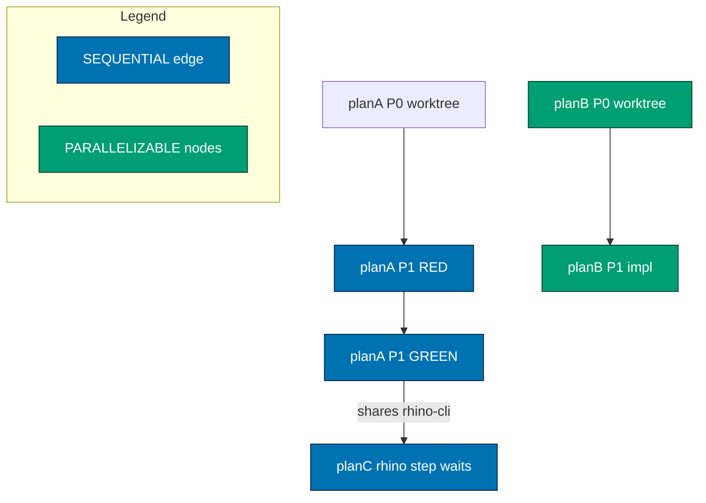

# Multi-Plans Execution Workflow

**Purpose**: Execute several project plans in one coordinated run. This workflow is a **scheduling
layer on top of** [`plan-execution.md`](./plan-execution.md): it does not re-implement per-plan
delivery logic. It (1) resolves the caller's scope — an explicit plan list or a set-selector
(`all-in-progress` / `all-backlog` / `all`, optionally minus an `except` list) — to a frozen plan
set, (2) builds a dependency DAG that decides
what must be sequenced and what is safe to parallelize, (3) materializes one very-granular Task list
covering **every** delivery-checklist item across all plans, and (4) runs a bounded ready-queue
scheduler that pulls independent delivery-step nodes and drives each plan through its full
per-plan lifecycle (worktree → per-phase gates → post-push CI → validation → delivery-mode
PR-review cycle → merge/handoff → archival), exactly as `plan-execution.md` does for one plan, and
(5) after all plans finish, runs one **cross-plan learnings solidification** pass so the recurring and
portfolio-level signal the plans produced _together_ reaches a durable home instead of being stranded
in each archived plan folder.

**When to use**:

- You have two or more ready plans (each already passed [`plan-quality-gate`](./plan-quality-gate.md))
  and want them driven together instead of one-at-a-time.
- The plans are partly independent, so parallelizing their delivery steps saves wall-clock.
- You want a single live observability surface showing all plans' progress at once, with clear
  marking of which work is running in parallel.

**When NOT to use**:

- A single plan → use [`plan-execution.md`](./plan-execution.md) directly.
- Plans that have not passed `plan-quality-gate` → gate them first; this workflow refuses to execute
  an unvetted plan (see Phase A).

> **Pre-Execution Requirement**: Before scheduling, invoke the `grill-me` skill
> (`.claude/skills/grill-me/SKILL.md`) to stress-test any unresolved cross-plan ordering assumptions
> (e.g., "does B really depend on A's shipped behavior, or only on a file they happen to share?").
> Every question presents 2–4 concrete options per the
> [Grilling-With-Options Convention](../../development/workflow/grilling-with-options.md).

## Execution Mode

**Direct Orchestration** — the calling context (top-level assistant session) is the orchestrator, as
in `plan-execution.md`. It owns the dependency DAG, the union Task list, and the ready-queue
scheduler. For each ready node it delegates the actual delivery work to the appropriate specialized
agent via the Agent tool, using the **identical Agent Selection rules** defined in
[`plan-execution.md` §Agent Selection](./plan-execution.md#agent-selection) (suggested-executor
annotation → project/app → file extension → content type → framework → direct execution).

The orchestrator invokes `plan-execution-checker` as a delegated agent for each plan's independent
validation, and runs the PR-review cycle (eight specialists → `pr-review-synthesis-maker` →
`pr-review-fixer`) for each `*-to-pr` plan — again,
unchanged from the single-plan workflow. The only thing this workflow adds is the **scheduling of
those per-plan steps across plans**.

## Relationship to plan-execution.md (no duplication)

Everything about how a _single_ plan executes — the [Task-Checklist Synchronization
model](./plan-execution.md#task-checklist-synchronization), the [Atomic Sync
Ritual](./plan-execution.md#atomic-sync-ritual), [Resume Reconciliation (disk is
truth)](./plan-execution.md#resume-reconciliation-disk-is-truth), the [Iron
Rules](./plan-execution.md#iron-rules-non-negotiable), Steps 0–8, per-phase quality gates,
post-push CI verification, manual behavioral assertions, and archival — is **inherited verbatim**
from `plan-execution.md` and applied per plan. This document specifies only the multi-plan additions:
the DAG (Phase A), the union granular Task list (Phase B), the ready-queue scheduler (Phase C), and
failure isolation (Phase D). Where the two ever appear to conflict, `plan-execution.md`'s per-plan
rules win for that plan's internal work; this document governs only cross-plan scheduling.

## Concurrency Model

- **`parallelism` (default 3)** is the maximum number of delivery-step **nodes** in flight at once
  across all plans — the "N parallel Tasks". The caller overrides it (e.g., "…with parallelism 2" or
  "…serially" = 1).
- The **effective** concurrency is `min(parallelism, max-concurrency, harness agent cap)`. Per the
  [Agent Workflow Orchestration Convention](../../development/agents/agent-workflow-orchestration.md),
  concurrency follows the **N+1 model** — `1 main thread + N background agents = N+1 total`, default
  **N=3** (4 total). The orchestrator MUST NOT self-promote above the declared N or the harness cap.
  N is adjustable per-plan and along the way: raise it only when independent work, machine capacity,
  and budget headroom all allow, and lower it under budget, runner, or disk pressure.
- **Background-slot preference**: fill background slots up to N and keep the main thread vacant and
  responsive — orchestrator, not worker. Never split dependent work merely to fill a slot.
- **Ordering is DAG-first**: independent nodes fan out up to N, dependent nodes serialize, and
  cleanup is the terminal node. The DAG's independent-node width is the fan-out — N only caps it.
  Sequence is not dependency.
- Parallelism is a **ceiling, not a target** — the scheduler runs fewer nodes when the ready set is
  smaller or when resource conflicts force serialization.
- **Status cadence**: while nodes are in flight, update the user every **3-5 minutes — not faster**,
  anchored to meaningful state changes (a node completing, a gate flipping, a plan quarantining)
  rather than to a timer alone.
- **Delivery is 1-PR↔1-worktree↔1-delivery-unit**: each independent node gets its own worktree,
  branch, and PR, opened and merged as that unit's **delivery boundary** completes — not at every
  phase, and not batched at the end of the run.

## Steps

### Phase A — Load Plans and Build the Dependency DAG (Sequential, Hard Gate)

**A1. Resolve the caller's scope to a concrete, frozen plan set.** The `plans` input is either an
explicit list or a set-selector; both resolve here into one enumerated set that is then **frozen for
the whole run** (never re-expanded later — a plan added to `plans/backlog/` mid-run is not pulled in).

- **Explicit list** — for each named plan, resolve its folder (in `plans/in-progress/` or, if named
  there, `plans/backlog/`). Fail fast with a clear error if a named plan does not exist.
- **Set-selector** — enumerate the named bucket's folders: `all-in-progress` → every folder directly
  under `plans/in-progress/`; `all-backlog` → every folder directly under `plans/backlog/`; `all` →
  both. Skip non-plan entries (`README.md`, the `ideas/` folder, `.gitkeep`).
- **Exclusion (`except …`)** — subtract every named plan from the resolved set. Each excluded name
  MUST match a plan actually in the set; a no-op exclusion (name not in scope) is a caller error —
  report it rather than silently ignoring, so a typo'd exclusion never fails open into executing a
  plan the caller meant to hold back.
- **Echo the frozen set.** Before scheduling, print the fully-enumerated resolved plan list (and, for
  a selector, the bucket + exclusions that produced it) so the caller can confirm scope. An empty
  resolved set (e.g., `all-in-progress` with nothing in-progress) terminates `fail` with a clear
  message — there is nothing to execute.

**A2. Refuse unvetted plans.** For each plan, confirm it passed `plan-quality-gate` (a clean strict
double-zero — check for the plan's audit trail or re-run the gate). A plan that has not been vetted
is **not scheduled**; report it and continue with the rest. This prevents executing a half-baked
plan concurrently with good ones.

**A3. Parse each plan's delivery checklist into nodes.** Read every plan's `delivery.md`
top-to-bottom (disk is truth). Each `- [ ]` checkbox — **including every nested sub-bullet** —
becomes one **node**. A node carries: `plan-id`, `phase`, the checkbox prose, its `[AI]`/`[HUMAN]`
tag, and a computed **resource-set** (A5).

**A4. Add intra-plan edges (ordering within a plan).** Within a single plan, nodes are ordered by:
(a) the worktree-enter / setup step first; (b) TDD ordering — a phase's `RED` → `GREEN` → `REFACTOR`
sub-steps are strictly sequential; (c) phase gates — a phase's gate node depends on all nodes in that
phase, and the next phase depends on the gate; (d) the archival node last. The default is
**sequential within a plan** unless the plan's own text explicitly marks two phases/steps as
independent. This preserves every per-plan Iron Rule (TDD, one-`in_progress`-per-plan, atomic sync).

**A5. Compute each node's resource-set (conservative).** From the checkbox's named file paths and
the plan's `tech-docs.md` File-Impact Analysis, derive the set of resources the node touches: file
paths / globs, Nx project names, the target repo(s), and a **byte-identity flag** if any path falls
under the `apps/rhino-cli/**` [byte-identity boundary](../../../docs/reference/sdlc-gate-standard.md#rhino-cli-byte-identity-boundary).
When a node's footprint is ambiguous, treat it as touching its whole plan's declared file-impact
set — **safety-first: uncertain nodes are treated as conflicting, never as disjoint.**

**A6. Add inter-plan edges (Hybrid ordering).**

1. **Explicit `Depends-on:` wins.** If a plan's `README.md` declares `Depends-on: [<plan-id>, …]`,
   that whole plan is serialized after every named dependency (all of the dependency's nodes precede
   any of this plan's nodes). Explicit declarations are authoritative and never overridden by
   inference.
2. **Inference fills the gaps.** For any pair of plans with no explicit relationship, infer edges
   from **resource overlap**: two nodes whose resource-sets intersect (same file/glob, same Nx
   project, or both carry the byte-identity flag on `apps/rhino-cli/**`) **conflict** and must not run
   concurrently — the scheduler serializes them (the later-scheduled one waits). Nodes with disjoint
   resource-sets are **parallelizable**. Two plans that both touch `apps/rhino-cli/**` are always
   serialized at least at their overlapping nodes, because byte-identical propagation across
   `ose-public`/`ose-primer`/`ose-infra` cannot tolerate two concurrent divergent edits.
3. **Cycle check.** If explicit `Depends-on` declarations form a cycle, stop and report — a cyclic
   plan graph is a planning error, not something to schedule around.

**A7. Emit the DAG / parallelizability report** to
`generated-reports/multi-plans-execution__<uuid>__<timestamp>__dag.md`: the node list per plan, the
intra- and inter-plan edges, each node's resource-set, and — explicitly — which nodes are marked
**PARALLELIZABLE** vs **SEQUENTIAL** and why. If `mode: plan-only`, STOP here and hand the report to
the caller for review.



> **Pause Safety**: safe to stop after Phase A. Nothing has been executed; only the schedule exists.

### Phase B — Materialize the Very-Granular Union Task List (Sequential)

**B1. One checkbox = one harness task, across ALL plans.** For every node in the DAG, `TaskCreate`
exactly one task. The union Task list is the **primary observability surface** for the whole run,
following the [Harness Task List as Primary Observability
Surface](./plan-execution.md#harness-task-list-as-primary-observability-surface) rules. Coarse tasks,
bulk creation, and silent batch-completion are forbidden exactly as in the single-plan workflow.

**B2. Tag every task** so the reader can see the schedule in the list itself:

- `subject` short-forms the checkbox prose (drop articles, verb + object, ≤80 chars) **prefixed with
  the plan id** — e.g., `planB · P2 GREEN implement scan`.
- Record on the task (in its description/metadata): `phase`, the resource-set, and a
  **PARALLELIZABLE** or **SEQUENTIAL** marker from A7.
- Wire `addBlockedBy` from the DAG edges (intra-plan ordering + inter-plan `Depends-on` + inferred
  resource conflicts). A task is claimable only when its `blockedBy` set is empty.

**B3. Multi-file Atomic Sync Ritual.** The [Atomic Sync
Ritual](./plan-execution.md#atomic-sync-ritual) applies **per plan against that plan's own
`delivery.md`**: tick the checkbox in the correct plan's file, persist the implementation-notes block
there, then `TaskUpdate completed`. Never edit the wrong plan's `delivery.md`. Resolve each plan's
`delivery.md` against **its worktree**, not the primary checkout (per [Resume Reconciliation
rule 6](./plan-execution.md#resume-reconciliation-disk-is-truth)).

**B4. Resume reconciliation across N plans (disk is truth).** On (re)start, read every named plan's
`delivery.md` first, rebuild the union Task list from disk state, and delete any stale in-memory
tasks that disagree with disk. Never trust in-memory state over disk.

**B5. At most one `in_progress` task PER PLAN.** The single-plan "at most one `in_progress`" invariant
becomes **per-plan**: each plan advances one checkbox at a time, but up to `parallelism` _different_
plans/nodes may be `in_progress` simultaneously. The scheduler (Phase C) enforces the global ceiling.

### Phase C — Ready-Queue Scheduler (Continuous, Bounded Parallel)

The scheduler is the core loop. It repeatedly fills up to the effective-concurrency ceiling with
non-conflicting ready nodes and drives each through its per-plan lifecycle.

**C1. Compute the ready set.** A node is **ready** when: (a) all its DAG predecessors are `completed`;
(b) it is `[AI]` (a `[HUMAN]`/`[AI+HUMAN]` node is surfaced to the user and parks that plan's chain
until the human confirms — other plans keep running); and (c) its resource-set does **not** intersect
any currently in-flight node's resource-set (the resource-conflict guard).

**C2. Fill up to the ceiling.** Pull ready nodes into execution until `min(parallelism,
max-concurrency, harness cap)` are in flight. Prefer nodes on the **critical path** (longest
remaining chain) first, so the overall run finishes sooner; break ties by plan id for determinism.

**C3. Worktree isolation makes step-level parallelism safe.** Each `*-to-pr` plan runs in **its own
worktree** (`worktrees/<plan-id>/`), so two plans editing different files never collide on disk. The
resource-conflict guard exists for **logical/merge-time** conflicts (two plans mutating the same
tracked file, or both touching the byte-identity boundary), not for physical disk safety. Provision
each plan's worktree once, on that plan's first scheduled node, following [`plan-execution.md`
Step 0](./plan-execution.md#0-enter-the-designated-worktree-sequential-hard-gate) (including
`npm install` + `npm run doctor -- --fix`).

**C4. Execute a node = one step of that plan's `plan-execution.md` lifecycle.** Delegate the node to
its selected agent, then run the Atomic Sync Ritual (B3). When a node completes a **phase boundary**,
run that plan's [per-phase quality gate](./plan-execution.md#2b-per-phase-quality-gate-sequential-after-each-phase),
[post-push CI verification](./plan-execution.md#2c-post-push-ci-verification-sequential-after-each-push),
and [manual behavioral assertions](./plan-execution.md#2d-manual-behavioral-assertions-sequential-after-each-phase)
exactly as the single-plan workflow prescribes — these are that plan's own gates, unaffected by other
plans in flight.

**C5. Loop.** After any node completes (or a plan reaches a `[HUMAN]` gate, or a node fails), recompute
the ready set (C1) and refill (C2). Continue until every plan has reached a terminal state.

**C6. Streaming.** After each node and at every phase boundary, emit a one-line user-visible status:
which plans are in flight, nodes ticked / total per plan, and any preexisting fixes — so the parallel
schedule is legible in real time.

### Phase D — Per-Plan Full Lifecycle, Failure Isolation, Cross-Plan Knowledge Capture, and Finalization

**D1. Full lifecycle per plan.** Each plan proceeds through the complete `plan-execution.md` arc:
execute all `[AI]` items → validation via `plan-execution-checker` → iterate to zero findings → for a
`*-to-pr` plan, the [PR-Review Maker→Fixer Cycle](../pr/pr-review-quality-gate.md) (default 3 cycles)
→ merge or `[HUMAN]` handoff per the plan's Delivery Mode → archival to `plans/done/`. Multi-plan
scheduling changes _when_ these steps run relative to other plans, never _whether_ they run.

**D2. Byte-identity plans propagate as a unit.** A plan whose changes fall under the `apps/rhino-cli`
byte-identity boundary lands byte-identically across `ose-public`/`ose-primer`/`ose-infra`. Two such
plans are always serialized (A6.2) so their propagations never race.

**D3. Failure isolation (quarantine).** If a node fails and cannot be fixed (per Iron Rule 3, fix ALL
issues including preexisting first — only a genuine hard blocker counts as failure): mark that plan
**quarantined**, stop scheduling any of its remaining nodes AND any plan that `Depends-on` it, and
record the reason. **Independent plans keep running** — one plan's blocker never halts the disjoint
work. Never bypass a failing gate to keep a plan moving.

**D4. Per-plan Knowledge Capture is inherited (not skipped).** Each plan still runs its own
[Knowledge Capture pre-archival gate](./plan-execution.md#8-finalization-and-archival-sequential)
before that plan archives — every entry in its `learnings.md` reaches a terminal state (routed
inline, filed as a `plans/backlog/` follow-up, or discarded with a one-line reason), both safety
gates applied. Multi-plan scheduling never lets a plan archive with an open, undecided `learnings.md`.

**D5. Cross-plan learnings solidification (mandatory before the run reports `pass`).** After every
plan has completed its own Knowledge Capture (D4), run one **consolidation pass over all plans
executed in this run** so recurring and cross-cutting learnings reach a durable home instead of being
stranded in individual archived plan folders:

1. **Gather.** Read every executed plan's final `learnings.md` (including quarantined plans — a
   quarantine reason is itself a learning) plus the DAG report (A7) and this workflow's own scheduling
   observations (mis-inferred dependency edges, resource conflicts that surprised the schedule,
   parallelism that had to be dialed back).
2. **Cluster into cross-cutting themes.** Identify learnings that appear in **two or more** plans, or
   that concern the multi-plan run itself (scheduling, byte-identity serialization, worktree
   contention, shared-toolchain effects). A theme seen once in a single plan stays that plan's own
   business — it was already routed in D4; do not double-file it.
3. **Route each theme to a durable home**, applying the [Knowledge Capture
   Convention](../../development/quality/knowledge-capture.md) rubric and **both safety gates** (the
   secret/sensitivity gate and the repo-relevance gate) to every surviving item: a recurring
   engineering insight → the relevant `repo-governance/` convention or development doc; a scheduling
   or workflow insight → this workflow or `plan-execution.md`; a follow-up worth its own work → a new
   `plans/backlog/` entry; anything that fails a gate or the litmus test → discarded with a one-line
   reason. **Zero cross-cutting themes may be left in an open, undecided state.**
4. **Record the consolidation** in the summary report (D6) — each theme, the plans it spanned, and its
   terminal routing decision — so the solidification is auditable, not implicit.

This is the multi-plan analogue of the per-plan Knowledge Capture gate: D4 ensures no single plan
loses its learnings; D5 ensures the **portfolio-level** signal (what these plans taught _together_)
is not lost when each plan's folder is archived in isolation.

**D6. Finalization.** When all plans have reached a terminal state AND cross-plan learnings
solidification (D5) is complete, emit the summary report to
`generated-reports/multi-plans-execution__<uuid>__<timestamp>__summary.md`: per-plan terminal status
(done / handed-off / quarantined / partial), the parallelism actually achieved, quarantines with
reasons, all preexisting fixes made, and the **consolidated cross-plan learnings** with their routing
decisions (D5.4). Report `partial` if any plan was quarantined or hit `max-iterations`; `pass` only
when every plan reached its clean terminal state **and** cross-plan learnings were solidified.

## Iron Rules (Non-Negotiable)

All ten [`plan-execution.md` Iron Rules](./plan-execution.md#iron-rules-non-negotiable) apply per
plan, unchanged. The multi-plan additions:

1. **Resolve scope once, then freeze it.** The caller states scope explicitly — an explicit plan list
   OR a set-selector (`all-in-progress` / `all-backlog` / `all`) optionally minus an `except` list.
   Resolve it to a concrete enumerated set at Phase A1, echo that set for confirmation, and **never
   re-expand it mid-run**. A selector is a one-time convenience for naming a bucket, not a standing
   subscription; plans created after resolution are out of scope. An `except` name that matches
   nothing in the set is a reported error, never a silent no-op.
2. **Gate before schedule.** Never execute a plan that has not passed `plan-quality-gate` (Phase A2).
3. **Resource-conflict guard is mandatory.** Two in-flight nodes MUST NOT share a resource. When in
   doubt about a node's footprint, treat it as conflicting (serialize) — never guess disjoint.
4. **Per-plan `delivery.md` is sacred.** The Atomic Sync Ritual runs against the _correct_ plan's
   `delivery.md` in its _worktree_. Cross-plan checkbox edits are forbidden.
5. **One `in_progress` per plan; global ceiling ≤ effective concurrency.** Never self-promote above
   the harness agent cap.
6. **Failure isolates, never cascades to independent plans.** Quarantine the failing plan (and its
   dependents); keep disjoint plans running; never bypass a gate.
7. **Explicit `Depends-on` is authoritative.** Inference only fills gaps; it never overrides or
   relaxes a declared dependency.
8. **Cross-plan learnings are solidified before `pass`.** Per-plan Knowledge Capture (D4) is
   inherited unchanged, AND the run additionally runs the cross-plan consolidation (D5) over every
   executed plan's `learnings.md` before reporting `pass`. No cross-cutting theme may archive
   stranded in a single plan's folder; every theme reaches a durable home or is discarded with a
   reason, both safety gates applied.

## Termination Criteria

- **`pass`**: every named plan reached its clean terminal state (archived to `plans/done/` — the
  default path, since `[AI]` merges once the hardened preconditions hold; or a green fully-reviewed
  PR handed off, which applies only to a plan whose own step explicitly opts into a `[HUMAN]` merge
  gate) **and**
  cross-plan learnings were solidified (Phase D5 — every cross-cutting theme routed to a durable home).
- **`partial`**: one or more plans were quarantined or hit their `max-iterations` while others
  completed.
- **`fail`**: the schedule could not be built (cyclic `Depends-on`, a named plan missing, or all
  plans unvetted).

## Example Usage

### Execute three plans with default parallelism (3)

```text
User: "Run multi-plans-execution for e2e-coverage-rule-feature-skip-fixme-gap
       rhino-cli-git-root-test-fixture-race rust-cargo-target-dir-sharing"
```

The orchestrator loads the three plans, builds the DAG, materializes the union granular Task list, and
schedules ≤3 nodes at a time through each plan's full lifecycle.

In the real 2026-07-18 run of exactly these three plans, the DAG came out **more serial than a
file-level reading suggests** — a worked illustration of why A5/A6 are re-derived per run rather than
assumed:

- All three edit **different** files, so they are disjoint on disk. But all three touch
  `apps/rhino-cli/**`, so all three carry the **byte-identity flag** and serialize at their merge +
  3-repo propagation nodes (A6.2 / Iron Rule 3) — disjoint-on-disk does **not** imply
  parallelizable-to-merge.
- `rust-cargo-target-dir-sharing` had pivoted from a `scripts/*.sh` helper into `rhino-cli doctor`,
  moving it **inside** the byte-identity boundary. A stale pre-pivot reading would have scheduled it
  as disjoint. **Re-read each plan's current scope; do not trust a prior run's classification.**
- A **safety-first ordering edge** was added by inference, not declaration: `rhino-cli-git-root-test-fixture-race`
  fixes the very bug where parallel `nx affected` rhino-cli test runs corrupt the real repo, so running
  the other two plans' test suites in parallel _before_ that fix landed could re-trigger the corruption.
  It was therefore scheduled first and fully. **A plan that repairs the execution environment itself is
  a prerequisite of every plan that runs in that environment**, even with zero file overlap.

### Select a whole bucket with a set-selector

```text
User: "Run multi-plans-execution for all-in-progress"
User: "…for all plans in in-progress and backlog"          # → all
```

The orchestrator enumerates the bucket's folders at Phase A1, echoes the resolved plan set for
confirmation, then schedules exactly as for an explicit list. The set is frozen at resolution.

### Set-selector minus an exclusion list

```text
User: "Run multi-plans-execution for everything in in-progress and backlog except planC planD"
User: "…for all-in-progress except flaky-migration"
```

`all` (or `all-in-progress` / `all-backlog`) resolves the bucket, then subtracts the named plans.
Each excluded name must be in the resolved set or the run reports a scope error (a mistyped exclusion
never fails open into running a plan the caller meant to hold back).

### Override the parallelism

```text
User: "…with parallelism 2"     # ceiling of 2 nodes in flight
User: "…serially"               # parallelism 1 — dependency order only, no parallelism
```

### Review the schedule first

```text
User: "…in plan-only mode"      # emit the DAG report and stop for review
```

### Explicit dependency in a plan

```text
# In planB/README.md:
Depends-on: [rhino-cli-source-drift-reconciliation]
# → planB's every node is scheduled only after that plan reaches its terminal state.
```

## Safety Features

- **Plan-only dry run** (`mode: plan-only`) surfaces the schedule before any execution.
- **Conservative resource inference** — ambiguous footprints serialize, never parallelize.
- **Worktree isolation** — parallel plans never collide on disk.
- **Byte-identity serialization** — rhino-cli-touching plans never propagate concurrently.
- **Quarantine, not cascade** — a blocker confines to its plan + dependents.
- **Harness-cap respect** — effective concurrency never exceeds the platform agent limit.
- **Disk-is-truth resume** — re-entry rebuilds the union Task list from every plan's `delivery.md`.
- **Cross-plan learnings solidification** — a mandatory consolidation pass routes portfolio-level
  learnings to durable homes before `pass`, so recurring signal survives per-plan archival.

## Related Workflows

- [`plan-execution.md`](./plan-execution.md) — the per-plan lifecycle this workflow schedules; the
  single-plan case.
- [`plan-quality-gate.md`](./plan-quality-gate.md) — the pre-execution gate every named plan must
  pass before it is eligible (Phase A2).
- [PR-Review Maker→Fixer Cycle](../pr/pr-review-quality-gate.md) — the per-plan pre-merge gate run for
  each `*-to-pr` plan (D1).
- [`plan-multi-repo-parity-planning-and-execution.md`](./plan-multi-repo-parity-planning-and-execution.md)
  — the distinct concern of propagating one change byte-identically across the three sibling repos
  (a plan whose scope this scheduler treats as a single serialized unit).

## Principles Implemented/Respected

- PASS: **Explicit Over Implicit** — plans are named explicitly; ordering is an explicit DAG;
  parallel vs sequential is marked on every task.
- PASS: **Deliberate Problem-Solving** — the schedule is computed and reviewable (`plan-only`) before
  execution; uncertain footprints serialize.
- PASS: **Simplicity Over Complexity** — reuses `plan-execution.md` wholesale; adds only the
  scheduling layer.
- PASS: **Root Cause Orientation** — inherits "fix ALL issues including preexisting" per plan.
- PASS: **No Time Estimates** — schedules by dependency and resource, not by duration.

## Conventions Implemented/Respected

- **[Plans Organization Convention](../../conventions/structure/plans.md)** — respects Delivery Modes,
  executor tagging, worktree specification, and archival for every plan.
- **[Workflow Naming Convention](../../conventions/structure/workflow-naming.md)** — plain-name
  workflow file.
- **[Grilling-With-Options Convention](../../development/workflow/grilling-with-options.md)** —
  pre-execution grill on unresolved cross-plan ordering.
- **[Knowledge Capture Convention](../../development/quality/knowledge-capture.md)** — the triage
  rubric and both safety gates applied per plan (D4) and again in the cross-plan consolidation (D5).
- **[Agent Workflow Orchestration](../../development/agents/agent-workflow-orchestration.md)** and
  **[Subagent Orchestration Convention](../../development/agents/subagent-orchestration.md)** —
  concurrency never self-promoted above the harness cap.
- **[Linking Convention](../../conventions/formatting/linking.md)** and **[Content Quality
  Principles](../../conventions/writing/quality.md)** — GitHub-compatible `.md` links, single H1,
  proper heading nesting.

## Notes

- **Fully inherits per-plan behavior** — this document is intentionally thin; its only job is
  cross-plan scheduling. When in doubt about a per-plan step, defer to `plan-execution.md`.
- **Observable** — the union Task list plus the DAG and summary reports make the parallel schedule
  legible before, during, and after the run.
- **Bounded** — `parallelism` and the harness cap bound concurrency; `max-iterations` (per plan)
  bounds each plan's execute-check loop.
