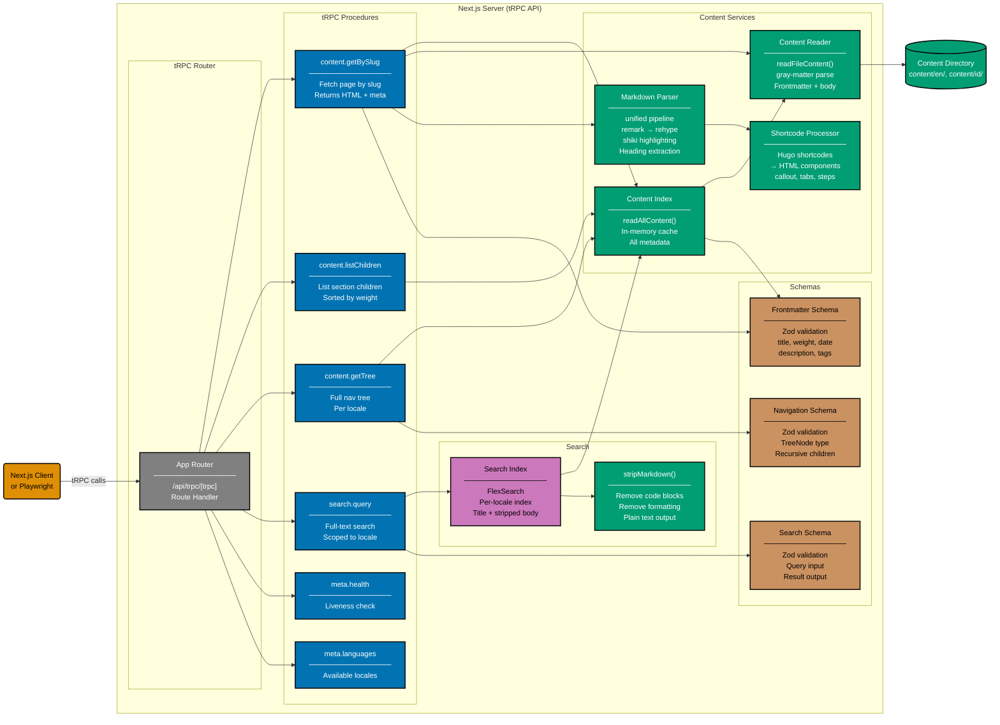

# Component Diagram: tRPC API (Backend)

Level 3 of the C4 model. Shows the logical components inside the Next.js server-side runtime:
tRPC router, procedures, content services, search index, and markdown pipeline.

All tRPC procedures are public (no authentication). The content pipeline reads markdown files,
parses frontmatter, renders HTML with syntax highlighting, and builds a FlexSearch index.

## Gherkin Coverage by Component

Each component above is exercised by Gherkin features from
[`specs/apps/ayokoding-web/be/gherkin/`](../be/):

| Component                            | Gherkin Domain | Feature                |
| ------------------------------------ | -------------- | ---------------------- |
| content.getBySlug + Content Reader   | content-api    | content-api.feature    |
| content.listChildren + Content Index | content-api    | content-api.feature    |
| content.getTree + Navigation Schema  | navigation-api | navigation-api.feature |
| search.query + Search Index          | search-api     | search-api.feature     |
| meta.health + meta.languages         | health         | health-check.feature   |
| Content Reader (locale filtering)    | i18n           | i18n-api.feature       |

## Testing

| Level       | What                                 | Coverage |
| ----------- | ------------------------------------ | -------- |
| `test:unit` | Service + procedure calls via Vitest | >= 80%   |
| `test:e2e`  | Full tRPC HTTP via Playwright        | N/A      |

## Related

- **Container diagram**: [container.md](./container.md)
- **Frontend component diagram**: [component-fe.md](./component-fe.md)
- **Backend gherkin specs**: [be/gherkin/](../be/)
- **Parent**: [ayokoding-web specs](../README.md)
