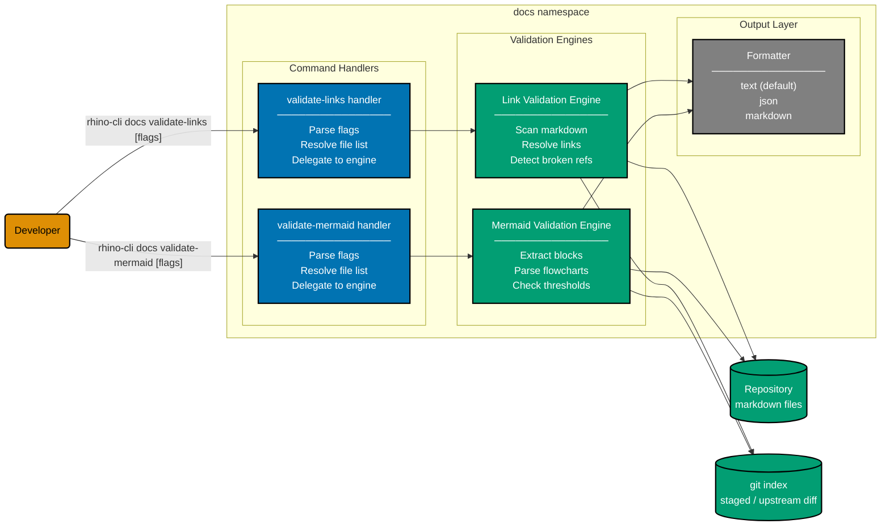

# Component Diagram: rhino-cli `docs` Command Handler

Level 3 of the C4 model for the rhino-cli demo application. Shows the internal structure of the
`docs` command namespace — the command handlers, validation engines, and output layer — across
both CLI implementations (`apps/rhino-cli-rust/` and `apps/rhino-cli-go/`).



## `docs validate-links`

Scans markdown files for broken internal links. External URLs, absolute paths, and placeholder
links are skipped automatically. By default the command scans `docs/`, `repo-governance/`,
`.claude/`, `plans/`, and root `*.md` files. Auto-generated skill files under `.opencode/skill/`
are always excluded.

### Flags

| Flag            | Type                | Default | Description                                                                                                                                                                     |
| --------------- | ------------------- | ------- | ------------------------------------------------------------------------------------------------------------------------------------------------------------------------------- |
| `--staged-only` | bool                | `false` | Only validate files currently staged in git. Useful in pre-commit hooks.                                                                                                        |
| `--exclude`     | string (repeatable) | —       | **Incoming.** Exclude a path prefix from validation. Can be supplied multiple times. Values are appended to the internal skip list after the built-in `.opencode/skill/` entry. |

### Global flags (inherited)

| Flag         | Short | Type   | Default | Description                                |
| ------------ | ----- | ------ | ------- | ------------------------------------------ |
| `--output`   | `-o`  | string | `text`  | Output format: `text`, `json`, `markdown`. |
| `--verbose`  | `-v`  | bool   | `false` | Verbose output with timestamps.            |
| `--quiet`    | `-q`  | bool   | `false` | Quiet mode — errors only.                  |
| `--no-color` | —     | bool   | `false` | Disable colored output.                    |
| `--say`      | —     | string | `""`    | Echo a message to stdout (utility flag).   |
| `--help`     | `-h`  | bool   | `false` | Print help.                                |

### Examples

```bash
# Validate all markdown files
rhino-cli docs validate-links

# Validate only staged files (pre-commit hook)
rhino-cli docs validate-links --staged-only

# Output as JSON
rhino-cli docs validate-links -o json

# Output as markdown report
rhino-cli docs validate-links -o markdown

# Exclude a directory tree from validation (incoming)
rhino-cli docs validate-links --exclude plans/done

# Combine exclusions
rhino-cli docs validate-links --exclude plans/done --exclude apps-labs
```

### Implementation references

| Implementation | Flag struct                                                    | Handler                | Source                                         |
| -------------- | -------------------------------------------------------------- | ---------------------- | ---------------------------------------------- |
| Rust (clap)    | `ValidateLinksArgs`                                            | `run_validate_links`   | `apps/rhino-cli-rust/src/commands/docs.rs`     |
| Go (cobra)     | `validateDocsLinksStagedOnly` var + `--exclude` StringArrayVar | `runValidateDocsLinks` | `apps/rhino-cli-go/cmd/docs_validate_links.go` |

---

## `docs validate-mermaid`

Scans markdown files and validates Mermaid flowchart diagrams for structural issues. Three rules
are enforced on `flowchart` and `graph` blocks:

1. Node label length must not exceed `--max-label-len`.
2. Maximum parallel nodes at one rank must not exceed `--max-width`. When both span exceeds
   `--max-width` AND depth exceeds `--max-depth`, a warning is emitted instead of an error.
3. Each Mermaid code block must contain exactly one diagram.

Non-flowchart Mermaid types (`sequenceDiagram`, `classDiagram`, `gantt`, etc.) are silently
ignored. The command is read-only — it never modifies any file.

### Flags

| Flag                   | Type | Default         | Description                                                                                                                                                                            |
| ---------------------- | ---- | --------------- | -------------------------------------------------------------------------------------------------------------------------------------------------------------------------------------- |
| `--staged-only`        | bool | `false`         | Only validate files currently staged in git (pre-commit use).                                                                                                                          |
| `--changed-only`       | bool | `false`         | Only validate files changed since upstream (`@{u}..HEAD`). Falls back to default directory scan when no upstream exists or the diff is empty. Pre-push use.                            |
| `--max-label-len`      | int  | `30`            | Maximum characters in a node label. Default approximates Mermaid `wrappingWidth:200px` at 16 px font.                                                                                  |
| `--max-width`          | int  | `4`             | Maximum nodes at the same rank.                                                                                                                                                        |
| `--max-depth`          | int  | `0` (unlimited) | Depth threshold for the both-exceeded warning. `0` is treated as unlimited (`MaxInt`). When span > `--max-width` AND depth > `--max-depth`, a warning is emitted rather than an error. |
| `--max-subgraph-nodes` | int  | `6`             | Maximum direct child nodes per subgraph. Exceeding this limit emits a `subgraph_density` warning.                                                                                      |

In addition, the command accepts zero or more positional `PATH` arguments (files or directories).
When paths are given, only those paths are scanned; `--staged-only` and `--changed-only` take
precedence over positional paths.

### Global flags (inherited)

| Flag         | Short | Type   | Default | Description                                |
| ------------ | ----- | ------ | ------- | ------------------------------------------ |
| `--output`   | `-o`  | string | `text`  | Output format: `text`, `json`, `markdown`. |
| `--verbose`  | `-v`  | bool   | `false` | Verbose output with timestamps.            |
| `--quiet`    | `-q`  | bool   | `false` | Quiet mode — errors only.                  |
| `--no-color` | —     | bool   | `false` | Disable colored output.                    |
| `--say`      | —     | string | `""`    | Echo a message to stdout (utility flag).   |
| `--help`     | `-h`  | bool   | `false` | Print help.                                |

### Examples

```bash
# Validate all markdown files in default directories
rhino-cli docs validate-mermaid

# Validate specific files or directories
rhino-cli docs validate-mermaid docs/ repo-governance/

# Only validate staged files (pre-commit)
rhino-cli docs validate-mermaid --staged-only

# Only validate files changed since upstream (pre-push)
rhino-cli docs validate-mermaid --changed-only

# Output as JSON
rhino-cli docs validate-mermaid -o json

# Set custom thresholds
rhino-cli docs validate-mermaid --max-label-len 20 --max-width 4
```

### Implementation references

| Implementation | Flag struct             | Handler                | Source                                           |
| -------------- | ----------------------- | ---------------------- | ------------------------------------------------ |
| Rust (clap)    | `ValidateMermaidArgs`   | `run_validate_mermaid` | `apps/rhino-cli-rust/src/commands/docs.rs`       |
| Go (cobra)     | `validateMermaid*` vars | `runValidateMermaid`   | `apps/rhino-cli-go/cmd/docs_validate_mermaid.go` |

---

## Default scan scope

Both commands share the same default directory scan logic when no targeting flags or positional
paths are supplied:

| Directory          | Included                              |
| ------------------ | ------------------------------------- |
| `docs/`            | Yes                                   |
| `repo-governance/` | Yes                                   |
| `.claude/`         | Yes                                   |
| `plans/`           | Yes                                   |
| Root `*.md` files  | Yes                                   |
| `.opencode/skill/` | No — always excluded (auto-generated) |
| `node_modules/`    | No — skipped during walk              |
| `.next/`           | No — skipped during walk              |
| `.git/`            | No — skipped during walk              |

---

## Gherkin Coverage

Behavior scenarios for both commands live in
[`specs/apps/rhino/behavior/cli/gherkin/docs/`](../../behavior/cli/gherkin/docs/README.md):

| Feature file                    | Command                 | Scenarios |
| ------------------------------- | ----------------------- | --------- |
| `docs-validate-links.feature`   | `docs validate-links`   | 9         |
| `docs-validate-mermaid.feature` | `docs validate-mermaid` | 22        |

---

## Related

- **Parent**: [cli component](./README.md)
- **Behavior specs**: [behavior/cli/gherkin/docs/](../../behavior/cli/gherkin/docs/README.md)
- **Rust implementation**: `apps/rhino-cli-rust/src/commands/docs.rs`
- **Go implementation**: `apps/rhino-cli-go/cmd/docs_validate_links.go`, `apps/rhino-cli-go/cmd/docs_validate_mermaid.go`
