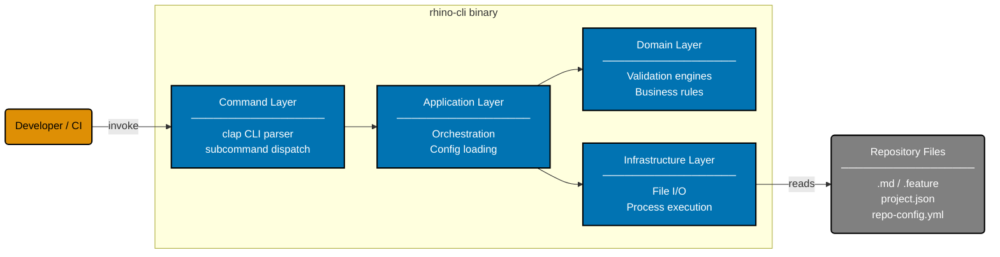

# Container Diagram: rhino-cli

Level 2 of the C4 model. Shows the internal containers of the rhino-cli system.

## Related

- **Product overview**: [product.md](../product/product.md)
- **System context**: [context.md](../system-context/context.md)
- **CLI component diagram**: [component-cli.md](../components/cli/component-cli.md)
- **Parent**: [rhino specs](../README.md)
