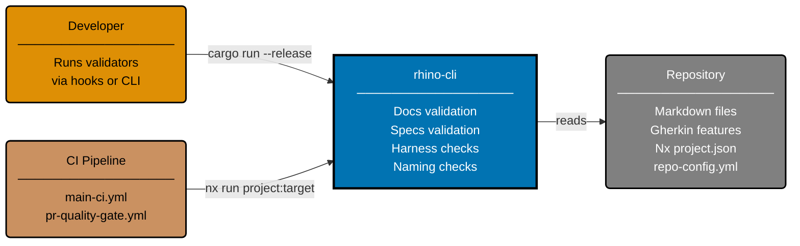

# Context Diagram: rhino-cli

Level 1 of the C4 model. Shows rhino-cli as a single CLI system with its external actors and
adjacent systems.

## Related

- **Product overview**: [product.md](../product/product.md)
- **Container diagram**: [container.md](../containers/container.md)
- **CLI component diagram**: [component-cli.md](../components/cli/component-cli.md)
- **Parent**: [rhino specs](../README.md)
